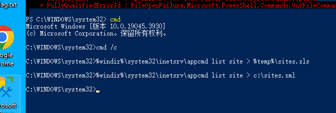
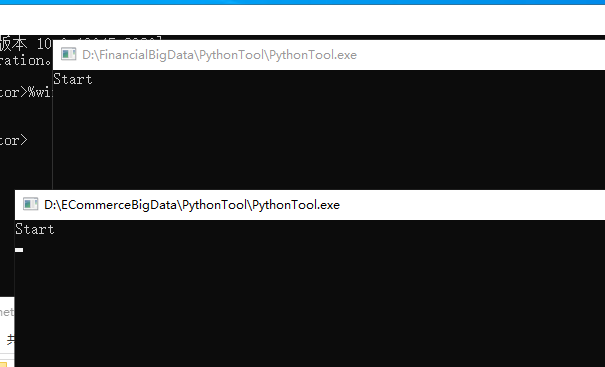

# IIS批量导出站点

在较大型网站系统中，为实现负载平衡，我们可能会使用多个WEB服务器，也就会需要给多个IIS配置同样的站点和应用程序池。那么我们需要一个一个的重新建吗？当然不用,我们只需要一些简单的命令就可以在IIS7(Windows Server 2008)或IIS7.5(Windows Server 2008 R2)上来导出导入这些配置了。

当我们在IIS7或IIS7.5上创建站点时，IIS会为我们自动创建一个对应该站点的唯一的应用程序池。所以我们要导入网站信息，就必须先导入应用程序池信息。

在这有两点需要特别说明：

+ 在进行以下所有命令进行操作里，都需要在CMD窗口执行命令，而不能在Powershell窗口中。
+ %windir%实际上是Windows系统默认设置的一个环境变量，表示Windows系统的安装目录，如果你的系统安装在C盘，那么它就可能等于C:\Windows(如果系统安裝在D盘，则可能是D:\Windows，以此类推入。

#### 一、应用程序池
1、批量导出

 %windir%\system32\inetsrv\appcmd list apppool /config /xml > c:\服务器.xml    

导出的文件是一个xml，内容类似下面这样：


2、批量导入

 %windir%\system32\inetsrv\appcmd add apppool /in < c:\apppools.xml   

如果是操作完之后，发现少了一个两个的，需要单独导出其中一个应用程序池的话，可以用以下命令：

3、单个导出

 %windir%\system32\inetsrv\appcmd list apppool "应用程序池名称" /config /xml > c:\myapppool.xml  

4、单个导入

 %windir%\system32\inetsrv\appcmd add apppool /in < c:\myapppool.xml  

#### 二、站点
遇到权限不足得时候，用管理员权限打开powershell

```powershell
cmd  /c
%windir%\system32\inetsrv\appcmd list site > c:\sites.xml
```



1、批量导出

 %windir%\system32\inetsrv\appcmd list site /config /xml > c:\sites.xml  

导出的文件是一个xml，内容类似下面这样：


2、批量导入

%windir%\system32\inetsrv\appcmd add site /in < c:\sites.xml  

如果是操作完之后，发现少了一个两个的，需要单独导出其中一个站点的话，可以用以下命令：

3、单个导出

%windir%\system32\inetsrv\appcmd list site “站点名称” /config /xml > c:\mywebsite.xml  

4、单个导入

%windir%\system32\inetsrv\appcmd add site /in < c:\mywebsite.xml  

5.列出所有站点的名称

<font style="color:rgb(79, 79, 79);background-color:rgb(238, 240, 244);">%windir%\system32\inetsrv\AppCmd.exe list site</font>

#### 三、最简单有效（最没技术含量）的方法
上面说的通过cmd命令来导入导出应用程序池和站点配置，其实是在装B。基本上来说在负载平衡方案中使用的多台WEB服务器，站点配置完全一样，包括站点的物理路径都一样。也就是说目标IIS7服务器的网站目录与源IIS7服务器网站目录完全一致，那么在我们配置好一台Web服务器后，其实只需要将以下文件

%windir%/System32/inetsrv/config/applicationHost.config   

文件内容类似下面这样：


拷贝到目标IIS7服务器的以下路径：

%windir%/System32/inetsrv/config/  

这一个文件拷过去之后，目标Web服务器立马会自动生成所有站点以前站点对应的应用程序池。在拷贝之后依然可以对这个拷贝过来的文件进行批量修改操作。比如：批量添加和修改所绑定域名。

**总结：**IIS7服务器之间迁移是非常简单的，由于IIS7将所有配置都存在xml文件中，不再使用二进制的metabase来存储配置，这对于迁移一个有成百上千网站的Web服务器无疑提供了更多的手段和方法。





> 更新: 2024-01-31 11:07:11  
> 原文: <https://www.yuque.com/lixinsi/bmtt6t/ul25rw>