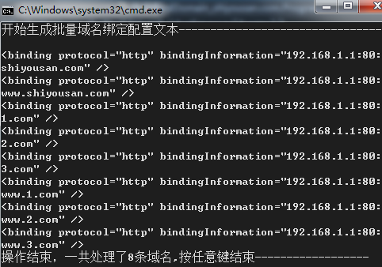
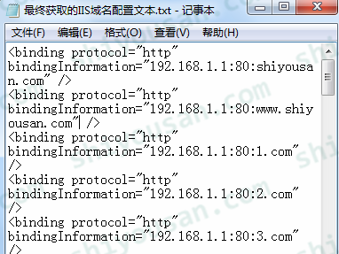

# IIS部署批量绑定域名

<font style="color:rgb(51, 51, 51);">由于业务需要，IIS要绑定几千个域名，如果通过界面手动绑定域名肯定是行不通的，于是写了个小工具来解决IIS批量绑定域名的问题。其实思路很简单，就是直接操作IIS的配置文件。</font>

```powershell
IIS配置文件一般都是在C:\Windows\System32\inetsrv\config\applicationHost.config
```

<font style="color:rgb(255, 255, 255);background-color:rgb(51, 122, 183);"></font>

<font style="color:rgb(51, 51, 51);">大概的思路是这样的，我们先了解IIS域名绑定的语法规则，再通过编写C#程序批量操作获取正确的配置字符串，最后只要将结果复制到服务器上的配置文件即可，这样就实现了批量域名绑定。</font>

<font style="color:rgb(51, 51, 51);">先说下环境，服务器系统是windows server 2012 R2，IIS版本为8.5，使用C#编写控制台应用程序，最终将结果输出到txt文本中。</font>

<font style="color:rgb(51, 51, 51);">IIS域名绑定的配置语法如下：</font>

<font style="color:rgb(98, 200, 243);"><</font>**<font style="color:rgb(98, 200, 243);">binding</font>**<font style="color:rgb(98, 200, 243);"> </font><font style="color:rgb(98, 200, 243);">protocol</font><font style="color:rgb(98, 200, 243);">=</font><font style="color:rgb(162, 252, 162);">\</font><font style="color:rgb(98, 200, 243);">"</font><font style="color:rgb(98, 200, 243);">http</font><font style="color:rgb(98, 200, 243);">\" </font><font style="color:rgb(98, 200, 243);">bindingInformation</font><font style="color:rgb(98, 200, 243);">=</font><font style="color:rgb(162, 252, 162);">\</font><font style="color:rgb(98, 200, 243);">"{</font><font style="color:rgb(98, 200, 243);">IP</font><font style="color:rgb(98, 200, 243);">地址}</font><font style="color:rgb(98, 200, 243);">:</font><font style="color:rgb(98, 200, 243);">{端口}</font><font style="color:rgb(98, 200, 243);">:</font><font style="color:rgb(98, 200, 243);">{域名}\" /></font>

<font style="color:rgb(51, 51, 51);">可以</font>[点此下载范例（范例是使用VS2013开发）](https://pan.baidu.com/s/1qXODIfM)

<font style="color:rgb(51, 51, 51);">这里直接上代码：</font>

```csharp
static void Main(string[] args)
{
    //演示中的文本都放在当前项目路径"bin\Debug\data"目录下
    string directory = Path.Combine(AppDomain.CurrentDomain.BaseDirectory, "data/");            
    string pathRead = Path.Combine(directory, "需要批量绑定的域名文本.txt");
    string pathWrite = Path.Combine(directory, "最终获取的IIS域名配置文本.txt");

    //IIS配置文件绑定域名的格式:<binding protocol=\"http\" bindingInformation=\"{IP地址}:{端口}:{域名}\" />
    //注意：IP地址和端口号要根据自己服务器配置来更改
    string bindFormat = "<binding protocol=\"http\" bindingInformation=\"192.168.1.1:80:{0}\" />";

    //读取并生成
    Console.WriteLine("开始生成批量域名绑定配置文本--------------------------------");
    List<string> resultList = new List<string>();
    using (StreamReader sr = new StreamReader(pathRead, Encoding.UTF8))
    {
        string temp = string.Empty;
        while (sr.Peek() >= 0)
        {
            temp = sr.ReadLine();
            if (string.IsNullOrWhiteSpace(temp))
            {
                continue;
            }
            temp = string.Format(bindFormat, temp);
            resultList.Add(temp);
            Console.WriteLine(temp);
        }
    }

    //将结果写入到txt文本中
    using (FileStream fs = new FileStream(pathWrite, FileMode.Create, FileAccess.Write))
    using (StreamWriter sw = new StreamWriter(fs))
    {
        foreach (string domain in resultList.Distinct().ToList())
        {
            sw.WriteLine(domain);
        }
    }
    Console.WriteLine("操作结束，一共处理了{0}条域名,按任意键结束------------------", resultList.Count());
    Console.ReadKey();
}
```

<font style="color:rgb(51, 51, 51);">结果演示：</font>



<font style="color:rgb(51, 51, 51);">范例只取8条域名做测试，实际遇到的都是成百上千条域名要批量绑定</font>

<font style="color:rgb(51, 51, 51);">最终结果输出到txt文本中，我们可以很容易将内容复制出来：</font>



<font style="color:rgb(51, 51, 51);background-color:rgb(252, 248, 227);">注意：批量绑定域名的操作一定不能有重复的设置，否则可能造成IIS或当前网站崩溃！！！代码中虽然有过滤重复的域名，但是不排除与配置文件原本的域名有冲突，所以一定要仔细检查下。</font>

<font style="color:rgb(51, 51, 51);background-color:rgb(252, 248, 227);">如果对IIS配置文件不熟悉的话，建议操作前一定要先进行备份，或者在其他测试服务器上先测试！安全第一！</font>


> 更新: 2024-01-10 10:03:24  
> 原文: <https://www.yuque.com/lixinsi/bmtt6t/ric82x>