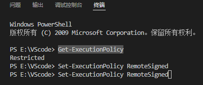

# VScode的中.net core 注意事项

博客：[https://blog.miniasp.com/](https://blog.miniasp.com/)

[https://gist.github.com/doggy8088](https://gist.github.com/doggy8088)

新建终端要powershell开启

Get-ExecutionPolicy

Set-ExecutionPolicy RemoteSigned

> 更新: 2022-04-23 12:18:28  
> 原文: <https://www.yuque.com/lixinsi/bmtt6t/dqbk7n>