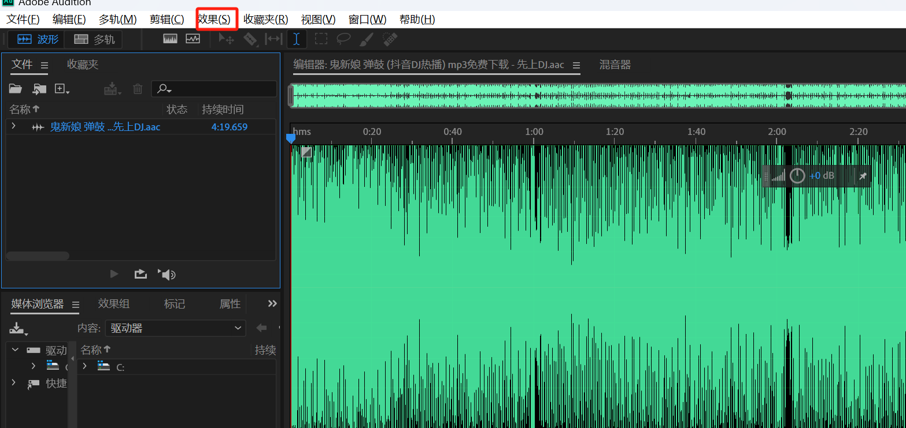
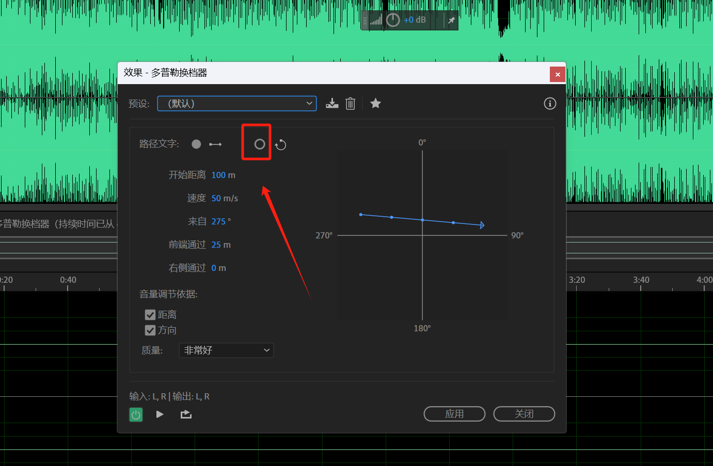
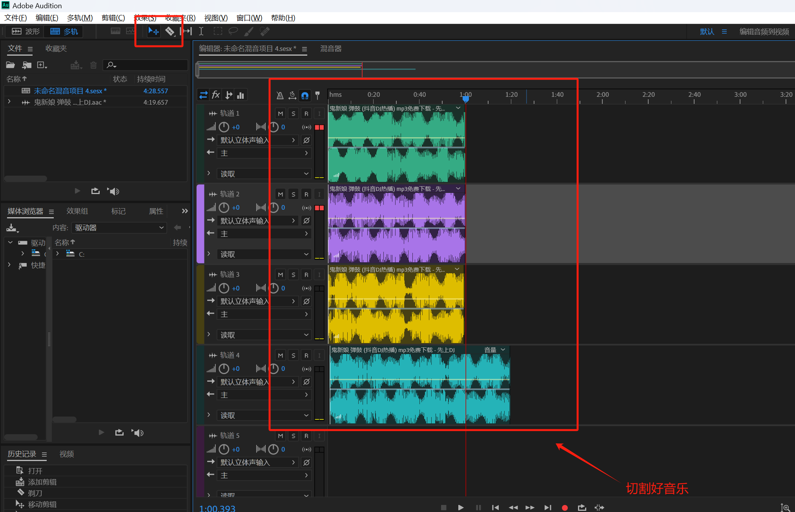
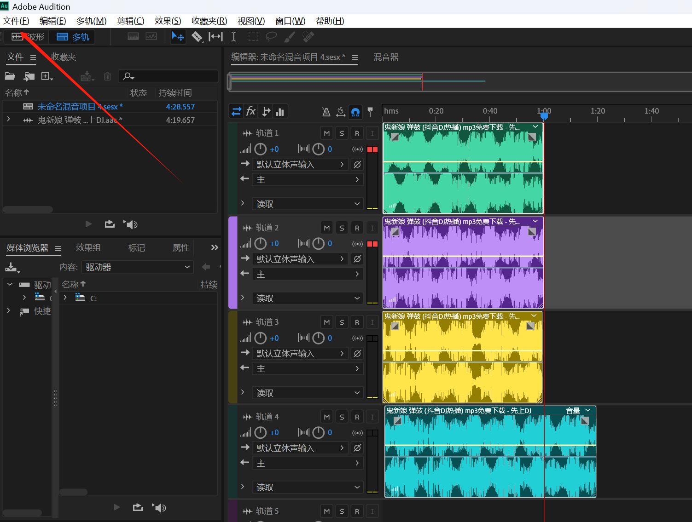
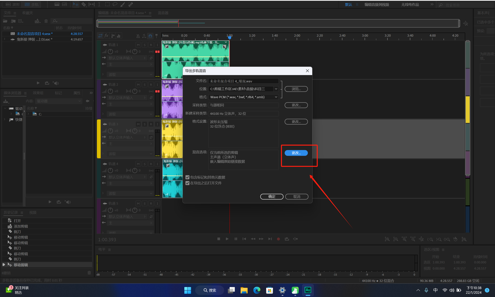
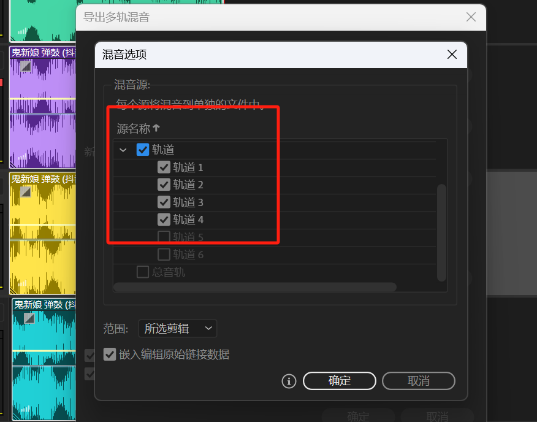

# AU实操手册

### 1.3D环绕音质设置
打开需要调整的音乐

1. 导入音频
2. 效果
+ 
+ 特殊效果-多普乐换挡器
+ 22

### 2.切割1分钟音频
新建多轨文件，切割好音乐。

### 
ctrl+A选择所有文件--导出--多轨混音--所选剪辑

> 更新: 2024-01-22 22:39:53  
> 原文: <https://www.yuque.com/lixinsi/og2n2u/qrbe4eu18wz5f79s>