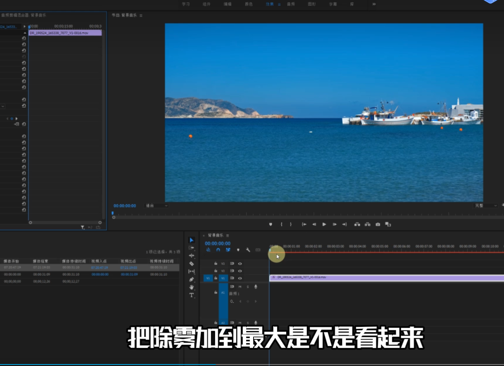
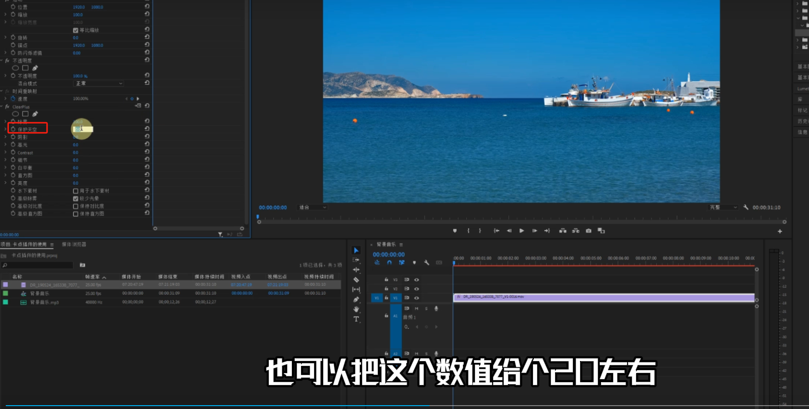
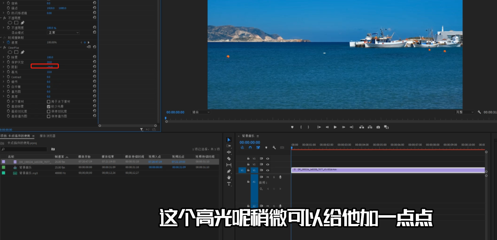
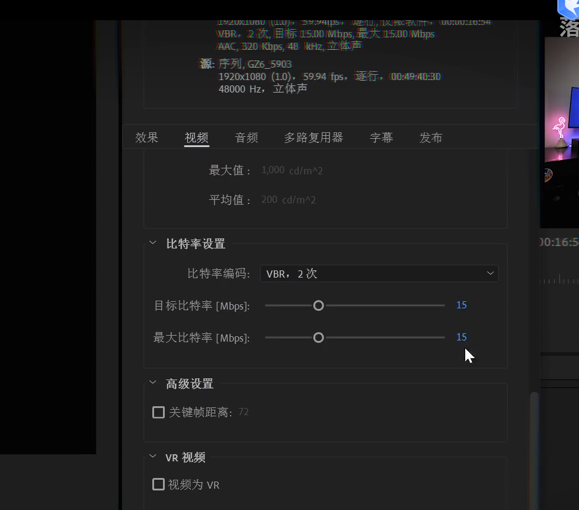
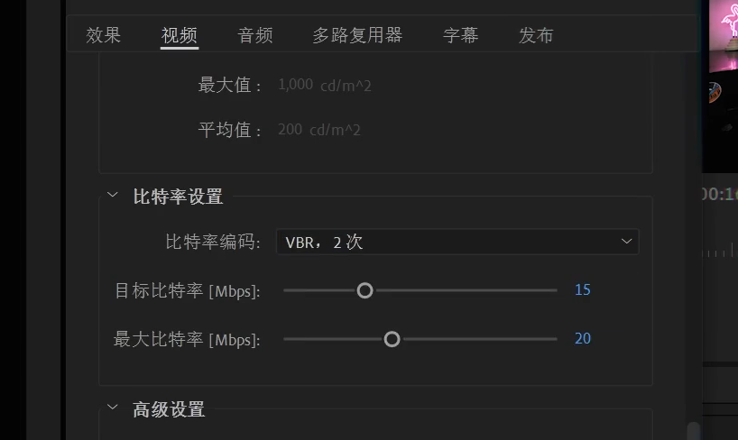
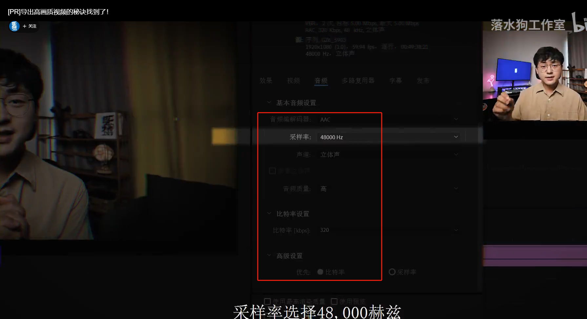
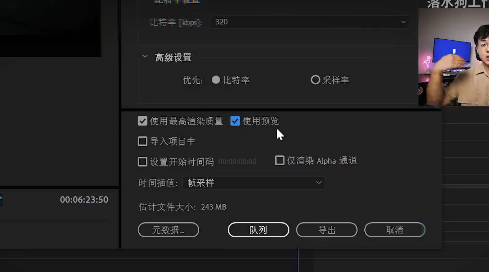
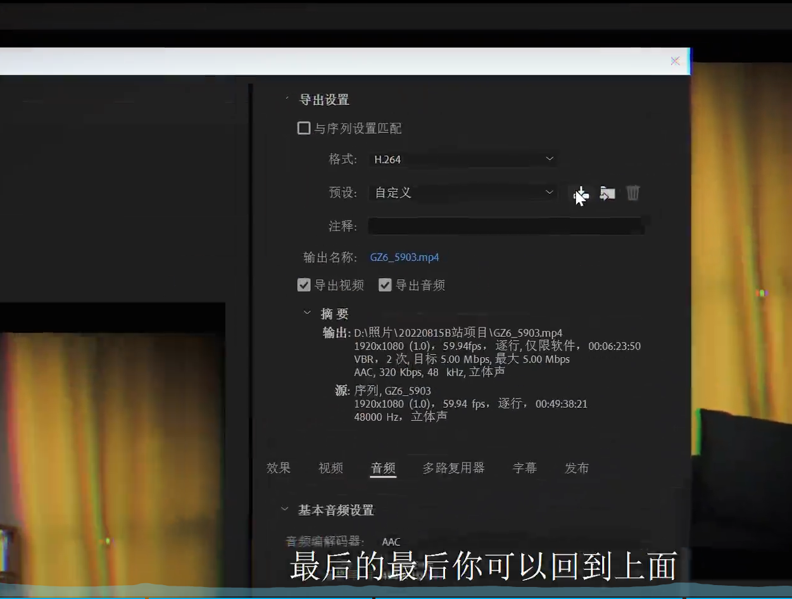
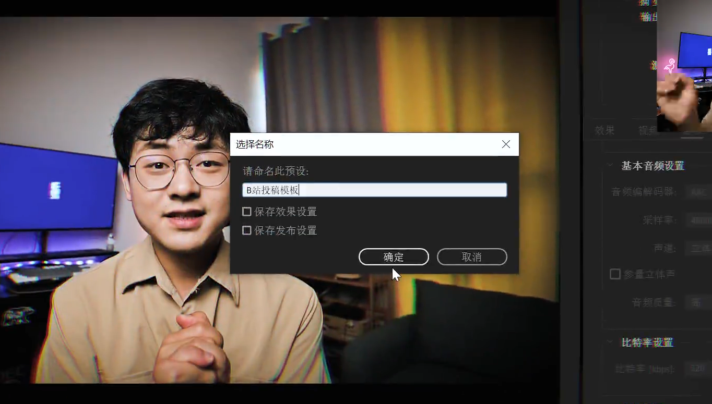
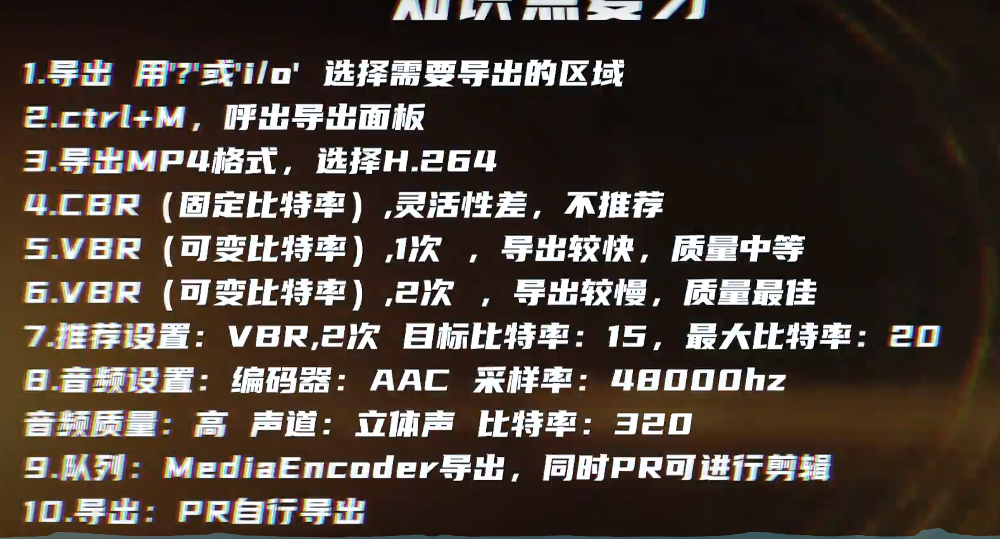

# PR使用

### 1.clearplus插件使用
把除雾加到最大

保护天空+20

阴影-25

高光+10

### 2.pr导出高质量视频

选择格式h.264格式

导出的比特率编码

CBR是固定的比特率编码

VBR是动态的比特率编码 

VBR 2次

音频设置

编码率选择aac ，采样率48000Hz,声道立体声，音频质量高，比特率320

保存预设

> 更新: 2024-01-31 09:53:22  
> 原文: <https://www.yuque.com/lixinsi/og2n2u/qlxib6mzd6w4f29t>