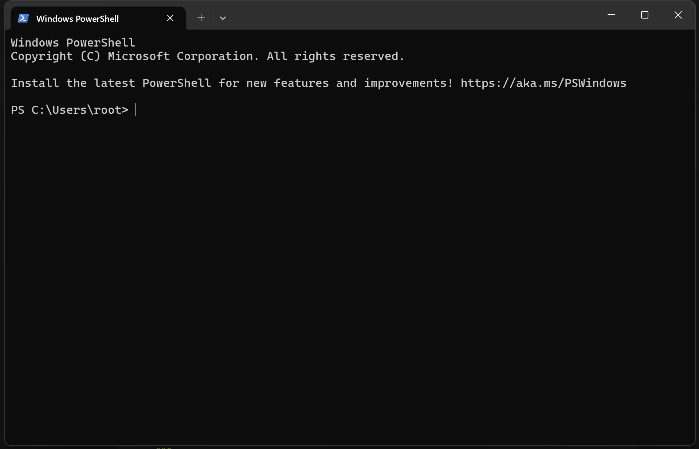
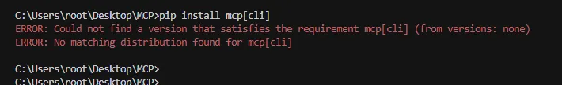
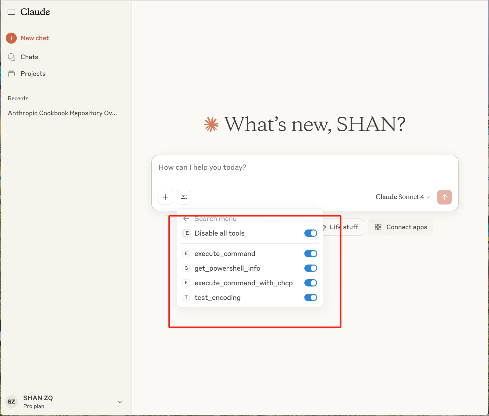
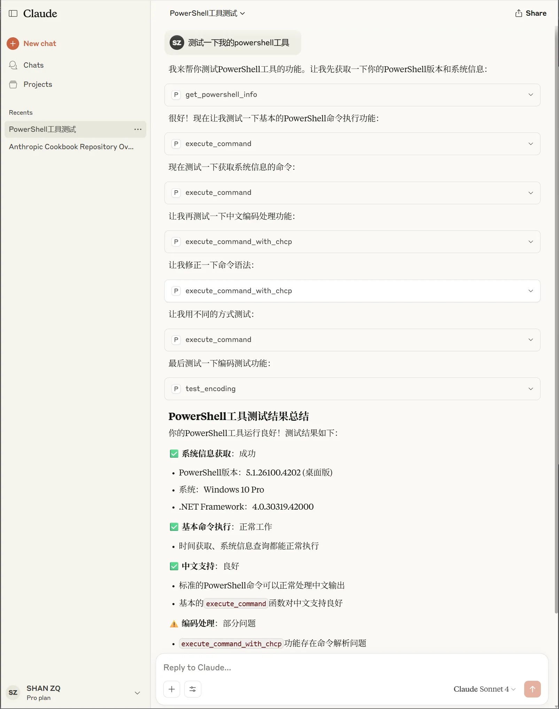
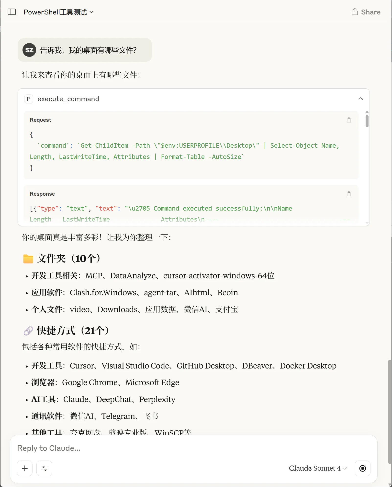
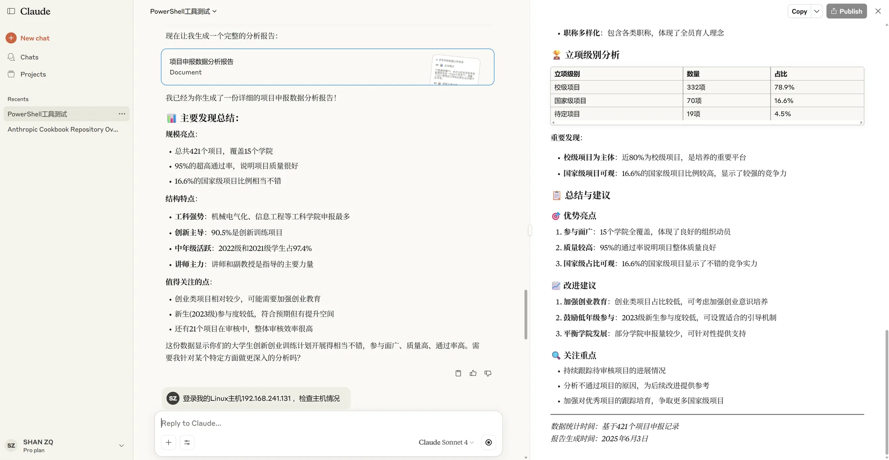

# Powershell MCP-AI超级终端


# 这个小黑框，我相信懂不懂计算机的多少都见过。不懂计算机的觉得这次东西像黑客的工具一样神秘。懂计算机的对powershell也会有敬畏之心，因为他太万能了！



```matlab
以下是PowerShell在办公场景中的实用应用列表：
📁 文件管理自动化

批量重命名文件 - 统一命名规范，如"合同_2025_001.pdf"
文件分类整理 - 按日期、类型自动分文件夹
查找重复文件 - 清理重复的文档和图片
文件夹结构创建 - 快速创建项目文件夹模板
大文件查找 - 找出占用空间大的文件进行清理

📊 数据处理和报表

Excel数据批量处理 - 合并多个Excel文件
CSV文件转换 - 格式转换和数据清洗
文件统计报告 - 生成文件数量、大小统计
日志分析 - 提取关键信息生成报告
数据备份验证 - 检查备份文件完整性

📧 办公自动化

邮件附件批量下载 - 从Outlook提取附件
文档格式批量转换 - Word转PDF、图片格式转换
打印任务管理 - 批量打印文档
快捷方式批量创建 - 为常用文件夹创建桌面快捷方式
软件安装检查 - 检查办公软件版本和更新

🔍 信息收集和监控

网络连接监控 - 检查办公网络状态
系统性能监控 - 监控电脑运行状态
磁盘空间警报 - 空间不足时自动提醒
文件变更监控 - 监控重要文件夹的变化
设备状态检查 - 打印机、网络设备状态

📅 时间和任务管理

定时提醒 - 会议、截止日期提醒
工作日志生成 - 自动记录每日文件操作
任务计划执行 - 定时备份、清理等操作
考勤辅助 - 记录开关机时间
项目进度跟踪 - 文件修改时间统计

🛠️ 系统维护

临时文件清理 - 定期清理系统垃圾
软件卸载 - 批量卸载不需要的程序
注册表清理 - 清理无效注册表项
启动项管理 - 优化开机启动速度
系统信息收集 - 生成电脑配置报告

📋 文档和内容处理

文档内容搜索 - 在多个文档中搜索关键词
图片批处理 - 压缩、调整尺寸、水印添加
文本提取 - 从PDF、图片中提取文字
模板应用 - 批量应用文档模板
版本控制 - 文档版本管理和比较

🔐 安全和合规

文件权限管理 - 批量设置文件访问权限
敏感信息检查 - 扫描文档中的敏感数据
密码生成 - 生成安全密码
文件加密备份 - 重要文件的安全备份
访问日志分析 - 分析文件访问记录

📈 效率提升工具

快速启动菜单 - 创建常用程序启动脚本
工作环境配置 - 一键配置工作桌面布局
批量操作模板 - 保存常用操作为脚本
数据验证 - 批量验证数据格式和完整性
报告自动生成 - 定期生成各类统计报告

这些场景都能显著提高办公效率，减少重复性工作，让文员可以专注于更有价值的任务。你对哪个场景最感兴趣？我可以详细展示具体的实现方法。
```

```matlab
通过PowerShell工具，你可以做很多有趣和实用的事情！以下是一些有趣的应用场景：
系统管理和监控

实时监控CPU、内存、磁盘使用情况
查看和管理正在运行的进程和服务
监控网络连接状态和流量
检查系统启动时间和运行状态
管理Windows防火墙规则

文件和数据处理

批量重命名文件和文件夹
查找重复文件并清理磁盘空间
批量处理图片、文档等文件属性
创建文件备份和同步脚本
分析文件夹大小和文件分布统计

网络和安全

扫描本地网络中的设备
检查开放端口和网络服务
监控网络延迟和连接质量
获取WiFi密码和网络配置
检查系统安全更新状态

自动化任务

定时清理临时文件和缓存
自动化软件安装和配置
批量创建用户账户和权限设置
自动备份重要文件到指定位置
定时发送系统状态报告

趣味功能

创建ASCII艺术和文字画
生成随机密码和UUID
播放系统声音或文字转语音
控制系统音量和电源设置
创建桌面壁纸幻灯片

开发辅助

批量处理代码文件格式化
检查端口占用和服务状态
管理环境变量和路径设置
快速搭建本地测试环境
监控文件变化并触发操作

数据分析

分析日志文件和错误报告
统计文件类型和大小分布
监控系统性能趋势
生成各种格式的报告
处理CSV和JSON数据

这些都可以通过PowerShell实现，既实用又有趣！你对哪个方面比较感兴趣？我可以帮你实际演示一些功能。
```

# 3分钟完成搭建！详细教程：

## 1.下载下面的py文件，这是我自己写的。未来会给大家分享如何搭建自己的MCP工具。

[powershell.py](attachment:64e0aedc-eacc-43b1-8eea-0b18b9a66da9:powershell.py)

下载上面的py文件保存到本地

下面是源码，爱学习的同学可以看看源码：

```python
import subprocess
import json
import sys
import os
from mcp.server.fastmcp import FastMCP

mcp = FastMCP("PowerShell Toolkit")

@mcp.tool()
def powershell_command(command: str, timeout: int = 30, encoding: str = 'utf-8'):
    """
    Execute PowerShell command and return the result.
    
    Args:
        command (str): PowerShell command to execute
        timeout (int): Command timeout in seconds (default: 30)
        encoding (str): Output encoding (default: utf-8)
        
    Returns:
        dict: Contains success status, output, and error information
    """
    try:
        # 检测系统和PowerShell版本
        powershell_executable = _get_powershell_executable()
        
        # 构建PowerShell命令，设置输出编码
        if sys.platform == "win32":
            # Windows系统，解决中文编码问题
            powershell_cmd = [
                powershell_executable,
                '-NoProfile',
                '-OutputFormat', 'Text',
                '-Command',
                f'[Console]::OutputEncoding = [System.Text.Encoding]::UTF8; {command}'
            ]
        else:
            # 非Windows系统
            powershell_cmd = [
                powershell_executable,
                '-NoProfile',
                '-Command',
                command
            ]
        
        # 设置环境变量以支持UTF-8
        env = os.environ.copy()
        if sys.platform == "win32":
            env['PYTHONIOENCODING'] = 'utf-8'
        
        # 执行命令
        result = subprocess.run(
            powershell_cmd,
            capture_output=True,
            text=True,
            timeout=timeout,
            encoding=encoding,
            errors='replace',  # 处理编码错误
            env=env
        )
        
        # 构建返回结果
        response = {
            "success": result.returncode == 0,
            "return_code": result.returncode,
            "stdout": result.stdout.strip() if result.stdout else "",
            "stderr": result.stderr.strip() if result.stderr else "",
            "command": command,
            "powershell_version": powershell_executable
        }
        
        # 格式化输出
        if response["success"]:
            if response["stdout"]:
                return f"✅ Command executed successfully:\n\n{response['stdout']}"
            else:
                return "✅ Command executed successfully (no output)"
        else:
            error_msg = response["stderr"] if response["stderr"] else "Unknown error"
            return f"❌ Command failed (Exit Code: {response['return_code']}):\n\n{error_msg}"
            
    except subprocess.TimeoutExpired:
        return f"⏰ Command timed out after {timeout} seconds"
    except FileNotFoundError:
        return f"❌ PowerShell not found. Please ensure PowerShell is installed and in PATH.\nTried: {powershell_executable}"
    except Exception as e:
        return f"❌ Unexpected error: {str(e)}"

def _get_powershell_executable():
    """
    检测可用的PowerShell可执行文件
    """
    if sys.platform == "win32":
        # Windows系统，优先使用PowerShell 7，然后是Windows PowerShell
        candidates = [
            'pwsh',  # PowerShell 7+
            'powershell'  # Windows PowerShell 5.x
        ]
    else:
        # Linux/macOS系统
        candidates = [
            'pwsh',  # PowerShell Core
            'powershell'
        ]
    
    for candidate in candidates:
        try:
            subprocess.run([candidate, '-Version'], 
                         capture_output=True, 
                         timeout=5)
            return candidate
        except (FileNotFoundError, subprocess.TimeoutExpired):
            continue
    
    # 如果都找不到，返回默认值
    return 'powershell' if sys.platform == "win32" else 'pwsh'

@mcp.tool()
def get_powershell_info():
    """
    获取PowerShell版本和系统信息
    
    Returns:
        dict: PowerShell和系统信息
    """
    try:
        powershell_executable = _get_powershell_executable()
        
        # 获取PowerShell版本信息
        version_cmd = [
            powershell_executable,
            '-NoProfile',
            '-Command',
            '$PSVersionTable | ConvertTo-Json'
        ]
        
        result = subprocess.run(
            version_cmd,
            capture_output=True,
            text=True,
            timeout=10,
            encoding='utf-8',
            errors='replace'
        )
        
        if result.returncode == 0:
            try:
                version_info = json.loads(result.stdout)
                return f"✅ PowerShell Information:\n\n{json.dumps(version_info, indent=2, ensure_ascii=False)}"
            except json.JSONDecodeError:
                return f"✅ PowerShell Version (raw):\n\n{result.stdout}"
        else:
            return f"❌ Failed to get PowerShell version: {result.stderr}"
            
    except Exception as e:
        return f"❌ Error getting PowerShell info: {str(e)}"

if __name__ == "__main__":
    mcp.run()
```

## 2.准备环境：

首先，安装好python（开头的环境变量勾选好）

安装好python后，打开cmd输入：

`PIP install mcp[cli]`

安装MCP这个SDK，

配置好后，此时需要新开一个CMD，输入`MCP`验证是否生效。


### **注意：现在新版本直接输入**`PIP install mcp[cli]`**即可！无需配置环境变量了。**

### 至此，代码环境搭建完成。

`如果提示下面错误需要卸载python，重新安装python，去网上搜一下如何把python卸载干净！`



## 3.配置Claude json文件，（或cursor）

注意路径是你自己存放py脚本的路径。

```python
{
  "mcpServers": {
    "powershell": {
      "command": "python",
      "args": [
        "C:\\Users\\root\\Desktop\\MCP\\powershell.py"（这里写你自己的路径）
      ]
    }
  }
}
```

对于小白用户可能有困难，如果遇到问题，欢迎进大本营，跟大家一起交流学习


## 打开Claude，工具生效，就是这么丝滑！这么简单






## 恭喜你，真正的控制了你的PC。 powershell可以对你的电脑做你任何想做的事情！开动你的脑筋，做点有意思的事情。

比如：让他检查文件



根据文件做个小报告，等等。



# 开动你的脑筋。使劲用他吧。


> 更新: 2025-08-17 08:48:52  
> 原文: <https://www.yuque.com/lixinsi/hw0k6o/rm2gufphydfdv46f>