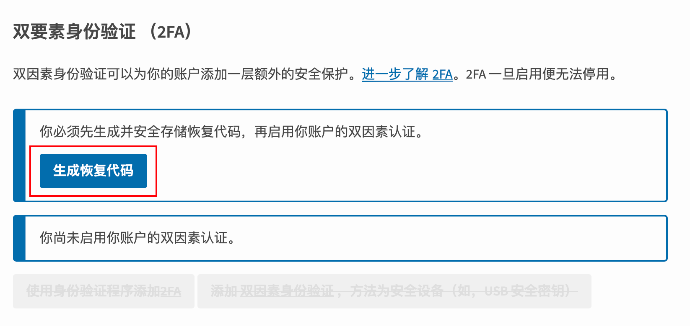
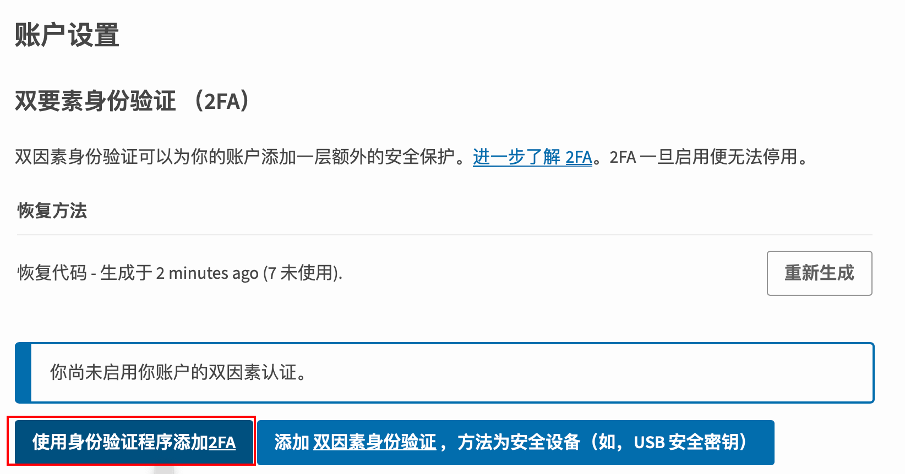
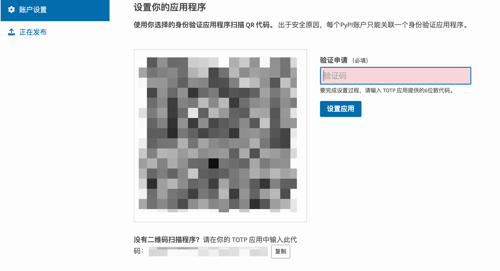
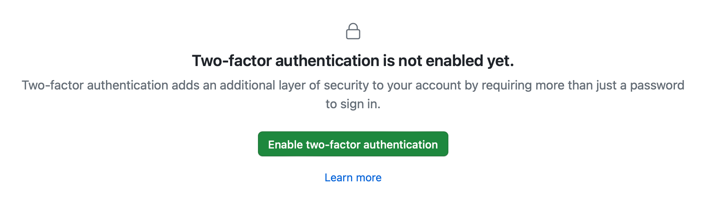
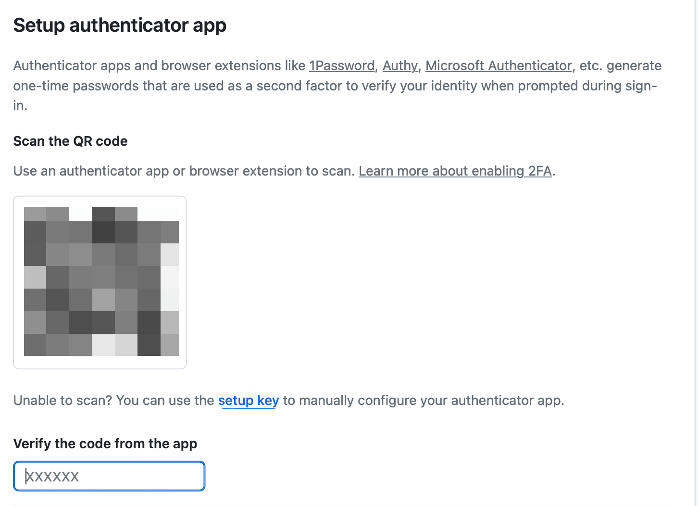
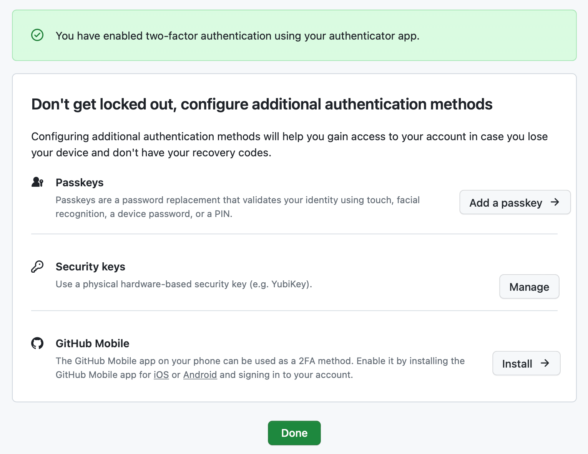

# PyPI 与GitHub 的双因素认证| 2FA 配置指南 - 学习乐园

登录 GitHub 一直提示设置双重验证。除此之外，开发 Python 包常用的平台—— PyPI ，也宣布从今年开始强制启用双因素认证（2FA）。这一变化虽然在提高安全性方面起到了积极作用，但也给日常工作带来了麻烦。本篇将介绍如何管理和配置 PyPI 和 GitHub 的 2FA，并使用 Python 脚本简化验证过程。

参考链接：

* [Python: 代码打成pip包并发布到 PyPi](https://blog.csdn.net/u011380951/article/details/134504315)
* [什么是双因素验证 2FA，如何用 Python 实现？](https://blog.csdn.net/somenzz/article/details/125688482)

## PyPI 双重验证

我们先讲讲配置方法，然后再介绍 2FA 的原理。

### 配置恢复代码

在 PyPI 上，首先要做的是设置恢复代码。这些代码在你无法使用常规 2FA 方法时至关重要。

1. 打开 [Account settings](https://pypi.org/manage/account/) 页面。
2. 在 2FA 设置区域，生成并下载恢复代码。

重要事情说三遍：

请妥善保存这些代码，它们是你在遇到问题时重置 2FA 的关键！\ 请妥善保存这些代码，它们是你在遇到问题时重置 2FA 的关键！\ 请妥善保存这些代码，它们是你在遇到问题时重置 2FA 的关键！

### 添加 2FA

接下来，将添加 2FA 到你的 PyPI 账户。

1. 点击使用身份验证程序添加 2FA。

2. 你会看到一个弹出的二维码和应用代码。

3. 安装 Python 包 <code>pyotp</code> 来生成 2FA 验证码。

| `plain 1 `  | `plain pip install pyotp `  |
| --- | --- |

4. 复制应用代码，并使用以下 Python 脚本获取验证码。

| `plain 1 2 3 4 5 `  | `plain import pyotp  key = '粘贴 2FA 代码' totp = pyotp.TOTP(key) print(totp.now()) `  |
| --- | --- |

5. 将脚本保存为 <code>get2fa.py</code>，在需要用时运行脚本。

| `plain 1 2 3 4 5 6 `  | `plain #!/usr/bin/env python3 import pyotp  key = '粘贴 2FA 代码' totp = pyotp.TOTP(key) print(totp.now()) `  |
| --- | --- |

6. 此外，对于 Mac/Ubuntu 用户，有一个更简洁的方案，使用 <code>mintotp</code>。

| `plain 1 2 `  | `plain pip install mintotp mintotp <<< "粘贴 2FA 代码" `  |
| --- | --- |

创建一个别名：

| `plain 1 `  | `plain alias py2fa="mintotp <<< '粘贴 2FA 代码'" `  |
| --- | --- |

这样每次在终端运行 <code>py2fa</code> 就能获取 2FA 验证码。

## GitHub 2FA

从去年（2023）3 月开始，GitHub 将逐步要求所有用户在提交代码时启用 2FA。下面是如何在 GitHub 上设置 2FA 的步骤。

1. 在 [密码和安全性](https://github.com/settings/security) 页面开启 2FA。

2. 你将看到一个提供 2FA 的二维码。

3. 使用二维码识别器获取其中的链接，其中 <code>secret=</code> 后的内容为 2FA 密钥
4. 后续步骤与 PyPI 类似，可以用同样的脚本或 <code>mintotp</code> 获取验证码。

此外，GitHub 还支持一些选项，比如 passkey 可以将当前设备的指纹功能作为验证因素：

## 2FA 的原理介绍

最后，简单聊聊双因素认证（2FA）的工作原理。

### 什么是双因素认证（2FA）

双因素认证（2FA）是一种安全机制，它要求用户在登录过程中提供两种不同类型的认证信息。通常包括：

1. **知识因素（Something You Know）**：比如密码、PIN 码或安全问题的答案。
2. **拥有因素（Something You Have）**：通常是手机应用生成的一次性代码，或者是硬件令牌，比如银行的 U 盾。

通过结合这两种因素，即使其中一个因素（如密码）被泄露，账户仍然安全，因为非法用户缺少第二个必要的认证信息。

### 一次性密码（OTP）

在 2FA 中，经常使用的“拥有因素”是一次性密码（One-Time Password）。OTP 的生成可以基于时间（TOTP）或事件（HOTP）。

* **时间基准的一次性密码（TOTP）**：依据当前时间和一个秘钥生成 OTP。由于时间在不断变化，生成的 OTP 也会在一定时间间隔后失效，通常是30秒。
* **事件基准的一次性密码（HOTP）**：基于一个计数器和一个秘钥生成 OTP。每次使用后，计数器增加，生成新的 OTP。

这些一次性密码通常通过哈希算法（如 HMAC）生成的。HMAC（Hash-based Message Authentication Code）结合了一个加密密钥（我们前边复制的代码）和一个加密哈希函数（如SHA-1），以产生功能强大的认证标记。

### 2FA 密钥

由于 TOTP 和 HOTP 标准的算法是公开和标准化的，不同的应用和工具（如 Google Authenticator, Authy, pyotp 等）在实现时遵循相同的算法和标准，因此用不同的工具使用相同的秘钥能生成相同的 OTP。秘钥的共享通常是通过扫描二维码实现的，这个二维码实际上包含了秘钥和账户信息。

简言之，通过使用 2FA，特别是基于时间或事件的一次性密码（TOTP/HOTP），可以增强账户的安全性。这种方法的关键在于使用一个秘钥生成一次性密码，这个密码对外部攻击者来说几乎不可能预测或复制，**除非他们获得了秘钥本身**。因此，即使你的主密码泄露，只要 2FA 保持安全，你的账户仍然是安全的。

> 更新: 2025-08-02 11:00:38  
> 原文: <https://www.yuque.com/lixinsi/hw0k6o/vlsaylfnpt5orn0w>