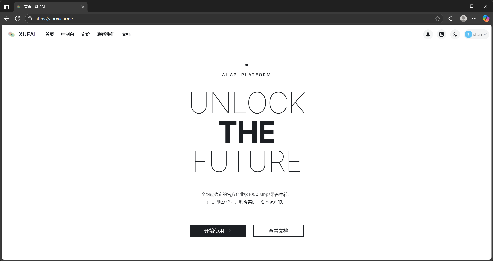
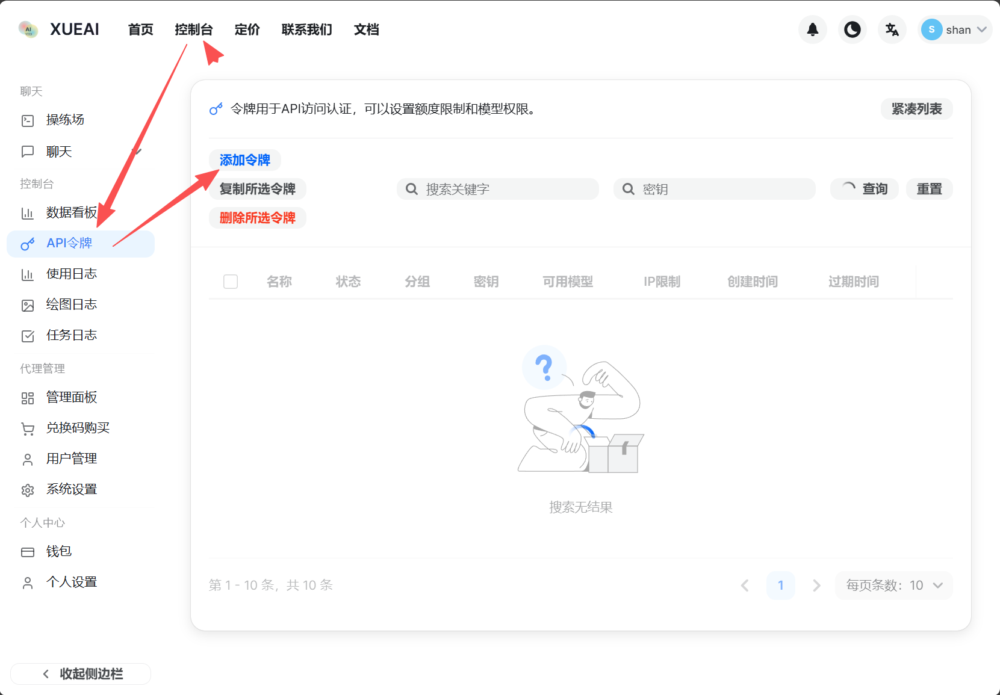
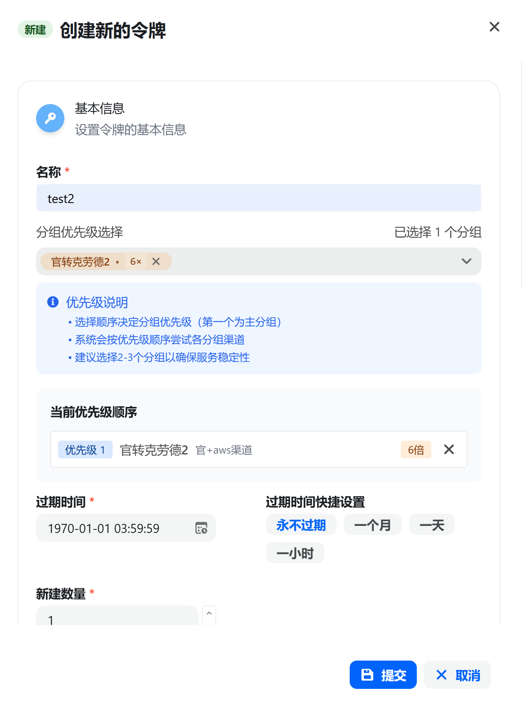
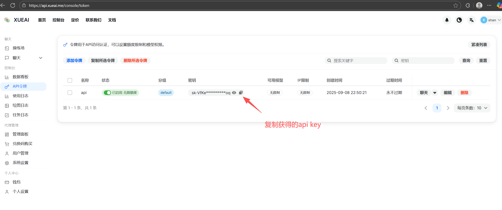
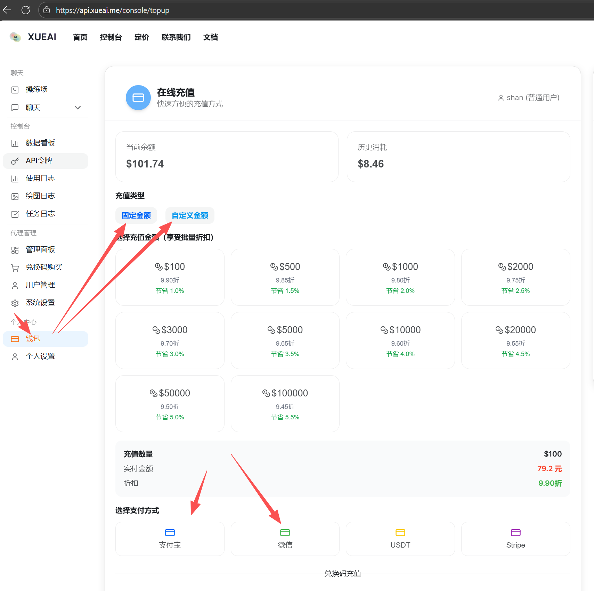
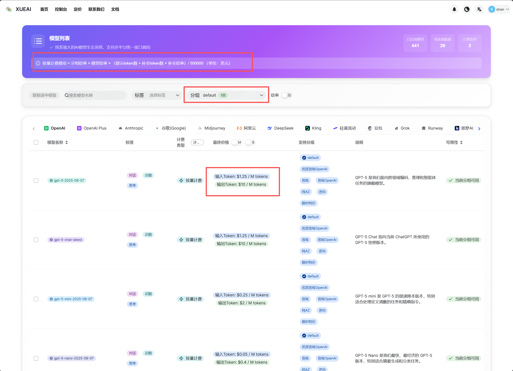

# 国内中转站API 接口

### 国内中转站API 接口
购买中转站的模型接口，我为了大家方便学习，自建了一个中转站，方便大家国内直接使用，并且价格比官方便宜很多。（也顺便有一点微薄盈利）

1.打开链接：http://api.xueai.me/ 使用GitHub账号或邮箱注册账号

2.点击控制台，点击API，点击添加令牌，

3.设置名称，分组选择官转克劳德2，额度无限制，点击提交（当然这里有很多分组，有很多其他模型，我们暂时先忽略）

4.获取api key

5.充值，可以固定金额充值，可以自定义金额。

6.关于费用计算，点击导航栏的“定价”，按量计费费用 = 分组倍率 × 模型倍率 × （提示token数 + 补全token数 × 补全倍率）/ 500000 （单位：人民币）

**注意不要大额充值，因为不能退款**

**注意不要大额充值，因为不能退款**

**注意不要大额充值，因为不能退款**

7.把上面获取的api key 复制到代码中，即可调用了！ 开启Agent开发之路！

> 更新: 2025-09-12 08:46:13  
> 原文: <https://www.yuque.com/lixinsi/hw0k6o/abqmzkwnuz3x6y5x>