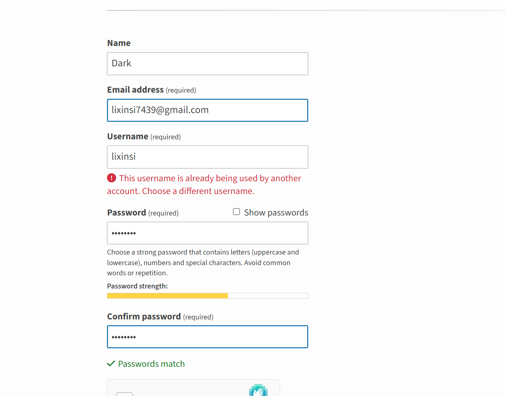

# 自动生成并发布MCP

今天弄个硬核又有意思的分享

让AI自己制作：”这个B班值不值得上”MCP人工智能工具，并自动将这个工具发布到公网，全世界都可以随便使用你的MCP工具。

### 因为之前有小伙伴问：现在根据我的模板可以随意制作MCP工具了，但是不知道怎么把工具上传到公网大家一起使用

### 今天给大家演示：让AI直接用”MCP+pypi发布模板“，用trae自动制作一个MCP(这个B班值不值得上)、自动测试、并自动发布到公网(pypi)全流程交给AI

## 好，今天我们举个例子，制作一个 ：

“这个B班值不值得上”的MCP

## 步骤1，打开Trae国际版，Trae里输入这句话：

根据这个开源链接：[https://github.com/Zippland/worth-calculator?tab=readme-ov-file#中文分析这个项目是如何计算这个B班值不值的？然后根据MCP模板制作这个MCP工具](https://github.com/Zippland/worth-calculator?tab=readme-ov-file#%E4%B8%AD%E6%96%87%E5%88%86%E6%9E%90%E8%BF%99%E4%B8%AA%E9%A1%B9%E7%9B%AE%E6%98%AF%E5%A6%82%E4%BD%95%E8%AE%A1%E7%AE%97%E8%BF%99%E4%B8%AAB%E7%8F%AD%E5%80%BC%E4%B8%8D%E5%80%BC%E7%9A%84%EF%BC%9F%E7%84%B6%E5%90%8E%E6%A0%B9%E6%8D%AEMCP%E6%A8%A1%E6%9D%BF%E5%88%B6%E4%BD%9C%E8%BF%99%E4%B8%AAMCP%E5%B7%A5%E5%85%B7)

````plain
#!/usr/bin/env python3
"""
🚀 MCP工具开发模板
快速创建MCP工具的精简模板

使用步骤：
1. 填写下方配置信息
2. 替换工具函数为你的功能
3. 运行测试：python MCP_PyPI_template.py
4. 发布到PyPI：参考文件末尾的发布指南
"""

import json
import logging
from datetime import datetime
from mcp.server.fastmcp import FastMCP

# ================================
# 🔧 配置区域 - 请填写以下信息
# ================================

# 基本信息（用于生成setup.py）
PACKAGE_NAME = "my-mcp-tool"  # PyPI包名（小写，用连字符）
TOOL_NAME = "我的MCP工具"  # 工具显示名称
VERSION = "0.1.0"  # 版本号
AUTHOR = "你的名字"  # 作者名
AUTHOR_EMAIL = "your.email@example.com"  # 作者邮箱
DESCRIPTION = "一个强大的MCP工具"  # 简短描述
URL = "https://github.com/yourusername/your-repo"  # 项目主页
LICENSE = "MIT"  # 许可证

# 依赖包列表
REQUIREMENTS = [
    "mcp>=1.0.0",
    "fastmcp>=0.1.0",
    # 在这里添加你的其他依赖
]

# ================================
# 🛠️ MCP工具核心代码
# ================================

# 设置日志
logging.basicConfig(level=logging.INFO)
logger = logging.getLogger(__name__)

# 创建MCP服务器
mcp = FastMCP(TOOL_NAME)

# ================================
# 🔧 在这里添加你的工具函数
# ================================

@mcp.tool()
def hello_world(name: str = "World") -> str:
    """
    一个简单的问候工具
    
    Args:
        name: 要问候的名字
    
    Returns:
        问候消息
    """
    return f"Hello, {name}! 这是来自 {TOOL_NAME} 的问候。"

@mcp.tool()
def get_current_time() -> str:
    """
    获取当前时间
    
    Returns:
        当前时间字符串
    """
    return datetime.now().strftime("%Y-%m-%d %H:%M:%S")

@mcp.tool()
def calculate_sum(a: float, b: float) -> float:
    """
    计算两个数的和
    
    Args:
        a: 第一个数
        b: 第二个数
    
    Returns:
        两数之和
    """
    return a + b

# ================================
# 🚀 主函数
# ================================

def main():
    """启动MCP服务器"""
    logger.info(f"启动 {TOOL_NAME}...")
    logger.info(f"版本: {VERSION}")
    logger.info(f"作者: {AUTHOR}")
    mcp.run()

if __name__ == "__main__":
    main()

# ================================
# 🧪 本地测试指南
# ================================
"""
🧪 如何在本地测试MCP工具：

1. 直接运行测试：
   ```bash
   # 在当前目录直接运行
   python MCP_PyPI_template.py
   
   # 如果看到类似输出说明启动成功：
   # INFO:__main__:启动 我的MCP工具...
   # INFO:__main__:版本: 0.1.0
   # INFO:__main__:作者: 你的名字
````

2. 配置Trae AI客户端测试：
   在Trae AI中，可以直接使用内置的MCP连接功能：

   方法1 - 使用Trae AI的MCP面板：

   * 打开Trae AI的MCP连接面板
   * 添加新的MCP服务器
   * 设置命令：python
   * 设置参数：\["d:/path/to/your/MCP\_PyPI\_template.py"]
   * 设置工作目录：d:/path/to/your/directory

   方法2 - 使用配置文件（如果支持）：

   ```json
   {
     "mcpServers": {
       "my-test-tool": {
         "command": "python",
         "args": [
           "d:/path/to/your/MCP_PyPI_template.py"
         ],
         "cwd": "d:/path/to/your/directory"
       }
     }
   }
   ```

3. 连接MCP服务器并测试工具功能

4. 验证工具是否正常工作：
   * 检查工具是否出现在Trae AI的工具列表中
   * 测试每个工具函数是否返回预期结果
   * 确认MCP连接状态正常，没有错误日志
   * 可以尝试调用hello\_world、get\_current\_time等示例函数
   * 在Trae AI中直接与MCP工具交互测试

5. 测试成功后再进行PyPI发布！

# ================================

# 📦 PyPI发布指南

# ================================

🚀 如何发布到PyPI：

⚠️ 重要：发布前必须先完成本地测试！

1. 准备项目结构：
   创建以下文件结构：
   my-mcp-tool/
   ├── my\_mcp\_tool/
   │   ├── **init**.py
   │   └── main.py  (复制本文件内容)
   ├── setup.py
   ├── README.md
   └── requirements.txt

2. 创建setup.py文件：
   ```python
   from setuptools import setup, find_packages

   with open("README.md", "r", encoding="utf-8") as fh:
       long_description = fh.read()

   setup(
       name="{PACKAGE_NAME}",
       version="{VERSION}",
       author="{AUTHOR}",
       author_email="{AUTHOR_EMAIL}",
       description="{DESCRIPTION}",
       long_description=long_description,
       long_description_content_type="text/markdown",
       url="{URL}",
       packages=find_packages(),
       classifiers=[
           "Development Status :: 3 - Alpha",
           "Intended Audience :: Developers",
           "License :: OSI Approved :: MIT License",
           "Operating System :: OS Independent",
           "Programming Language :: Python :: 3",
           "Programming Language :: Python :: 3.8+",
       ],
       python_requires=">=3.8",
       install_requires=[
           "mcp>=1.0.0",
           "fastmcp>=0.1.0",
       ],
       entry_points={
           "console_scripts": [
               "my-mcp-tool=my_mcp_tool.main:main",
           ],
       },
   )
   ```

3. 创建requirements.txt：
   ```
   mcp>=1.0.0
   fastmcp>=0.1.0
   ```

4. 创建README.md：

   ````markdown
   # {TOOL_NAME}

   {DESCRIPTION}

   ## 安装

   ```bash
   pip install {PACKAGE_NAME}
   ````

   ## 使用

   ```bash
   {PACKAGE_NAME}
   ```

   ```
   ```

5. 构建和上传：
   ```bash
   # 安装构建工具
   pip install build twine

   # 构建包
   python -m build

   # 上传到PyPI（需要先注册PyPI账号并获取API Token）
   twine upload dist/*
   ```

6. 使用API Token上传，用户必须提供token或用户名密码，否则上传失败，提示用户提供信息：
   ```bash
   # 方法1：环境变量
   export TWINE_USERNAME=__token__
   export TWINE_PASSWORD=pypi-your-api-token-here
   twine upload dist/*

   # 方法2：直接指定
   twine upload -u __token__ -p pypi-your-api-token-here dist/*
   ```

📝 注意事项：

* 用户必须提前注册PyPI账号，并获取API Token
* 包名必须在PyPI上唯一
* 建议先上传到TestPyPI测试：twine upload --repository testpypi dist/\*
* API Token比用户名密码更安全，推荐使用
* 每次发布前记得更新版本号

7. 发布后验证：
   ```bash
   # 安装你发布的包
   pip install your-package-name

   # 测试命令行工具
   your-package-name
   ```

8. MCP客户端配置（发布后）：
   ```json
   {
     "mcpServers": {
       "your-mcp-server": {
         "command": "uvx",
         "args": [
           "your-mcp-tool"
         ]
       }
     }
   }
   ```

🎉 完整流程总结：
本地开发 → 本地测试 → 构建包 → 上传PyPI → 安装验证 → 配置使用

"""

````

## 步骤2：
然后本地测试这个MCP

让trae给你一个本地测试的json配置文件，然后配置好进行测试。

## 步骤3：
注册PYPI账号，并获取token

然后和trae说：

根据我的模板，(xxx模板文件托到聊天框)，上传这个工具到pypi，我的api token 是xxxxx

下面是注册pypi的链接：

[https://pypi.org/](https://pypi.org/)

```plain
什么是 PyPI？

PyPI 是一个集中式的软件包仓库，开发者可以在这里发布自己的 Python 包，其他用户则可以方便地搜索、下载和安装这些包。它就像是 Python 包的"应用商店"。

主要功能

**包管理**：PyPI 托管了数十万个 Python 包，涵盖了数据科学、Web 开发、机器学习、自动化等各个领域。每个包都有详细的描述、版本历史、依赖关系等信息。

**版本控制**：支持语义化版本管理，开发者可以发布不同版本的包，用户可以安装特定版本或让系统自动选择合适的版本。

**依赖解析**：自动处理包之间的依赖关系，确保安装的包能够正常工作。

访问方式

https://packaging.python.org/， 注册PyPI 账号，获取PYPI的token
````



## 步骤4：

使用你的MCP

我的MCP 配置好了之后，trae给我生成了一个配置指南。

````plain
# 🎯 "这个B班值不值得上" - Trae MCP配置指南

## 📋 配置概述

这个指南教你如何在Trae AI IDE中配置"这个B班值不值得上"工作性价比计算器的MCP工具。

## 🚀 快速配置

### 方法一：使用PyPI包（推荐）

1. **安装包**
   ```bash
   pip install b-class-worth-calculator
````

2. **配置MCP服务器**

   在你的Trae配置文件中添加以下JSON配置：

   ```json
   {
     "mcpServers": {
       "work-worth-calculator": {
         "command": "b-class-worth-calculator",
         "args": [],
         "env": {}
       }
     }
   }
   ```

### 方法二：使用本地文件

如果你想使用本地开发版本：

```json
{
  "mcpServers": {
    "work-worth-calculator": {
      "command": "python",
      "args": ["d:\\MCP\\work_caculater\\MCP_PYPI_template.py"],
      "env": {
        "PYTHONPATH": "d:\\MCP\\work_caculater"
      }
    }
  }
}
```

## 📁 配置文件位置

### Windows

* 用户配置：<code>%APPDATA%\Trae\mcp_config.json</code>
* 项目配置：项目根目录下的 `mcp_config.json`

### macOS

* 用户配置：<code>~/Library/Application Support/Trae/mcp_config.json</code>
* 项目配置：项目根目录下的 `mcp_config.json`

### Linux

* 用户配置：<code>~/.config/Trae/mcp_config.json</code>
* 项目配置：项目根目录下的 `mcp_config.json`

## 🛠️ 完整配置示例

```json
{
  "mcpServers": {
    "work-worth-calculator": {
      "command": "b-class-worth-calculator",
      "args": [],
      "env": {},
      "description": "工作性价比计算器 - 帮你分析这个B班值不值得上",
      "timeout": 30000
    },
    "other-mcp-server": {
      "command": "other-command",
      "args": [],
      "env": {}
    }
  }
}
```

## 🎯 可用工具

配置成功后，你将获得以下MCP工具：

### 1. `calculate_job_worth` - 工作性价比计算

```
参数：
- annual_salary: 年薪总包（元）
- country: 工作国家/地区（默认：中国）
- work_days_per_week: 每周工作天数（默认：5）
- wfh_days_per_week: 每周居家办公天数（默认：0）
- annual_leave_days: 年假天数（默认：5）
- legal_holidays: 法定假日天数（默认：11）
- paid_sick_leave: 带薪病假天数（默认：0）
- daily_work_hours: 每日总工时（小时，默认：8）
- commute_hours: 每日通勤时间（小时，默认：1）
- rest_hours: 每日休息摸鱼时间（小时，默认：1）
- education: 学历水平（默认：本科）
- experience: 工作经验（默认：3-5年）
- city_level: 城市等级（默认：二线城市）
- work_environment: 工作环境（默认：一般）
```

### 2. `compare_jobs` - 工作对比

```
参数：
- job1_data: 第一份工作的JSON数据
- job2_data: 第二份工作的JSON数据
```

### 3. `get_calculation_template` - 获取计算模板

```
无参数，返回JSON格式的参数模板
```

### 4. `get_ppp_factors` - 获取PPP转换因子

```
无参数，返回支持的国家和地区列表
```

## 🔧 故障排除

### 问题1：命令未找到

```
Error: 'b-class-worth-calculator' is not recognized
```

**解决方案：**

1. 确保已安装包：`pip install b-class-worth-calculator`
2. 检查Python环境是否正确
3. 重启Trae AI

### 问题2：权限错误

```
Permission denied
```

**解决方案：**

1. 以管理员身份运行Trae
2. 检查文件路径权限
3. 使用绝对路径

### 问题3：模块导入错误

```
ModuleNotFoundError
```

**解决方案：**

1. 检查PYTHONPATH环境变量
2. 确保所有依赖已安装：`pip install -r requirements.txt`
3. 使用虚拟环境

## 📊 使用示例

### 在Trae中调用工具

1. **计算单个工作性价比**
   ```
   @work-worth-calculator calculate_job_worth
   年薪：350000
   国家：中国
   每周工作天数：5
   居家办公天数：2
   年假：12天
   工作环境：优秀
   ```

2. **对比两份工作**
   ```
   @work-worth-calculator compare_jobs
   工作1：{"annual_salary": 350000, "wfh_days_per_week": 2, ...}
   工作2：{"annual_salary": 280000, "wfh_days_per_week": 4, ...}
   ```

## 🎉 验证配置

配置完成后，你可以通过以下方式验证：

1. **检查MCP服务器状态**
   * 在Trae中查看MCP服务器列表
   * 确认"work-worth-calculator"显示为活跃状态

2. **测试工具调用**
   * 尝试调用`get_calculation_template`工具
   * 应该返回参数模板信息

3. **运行完整计算**
   * 使用`calculate_job_worth`进行一次完整计算
   * 检查返回结果是否包含性价比分数

## 📞 技术支持

如果遇到问题：

1. **检查日志**
   * Trae控制台输出
   * MCP服务器日志

2. **常见解决方案**
   * 重启Trae AI
   * 重新安装包
   * 检查网络连接

3. **联系支持**
   * GitHub Issues
   * 技术文档

***

🎯 **恭喜！你现在可以在Trae中使用"这个B班值不值得上"工具了！**

让数据指导你的职业选择，告别盲目跳槽！ 🚀

```
```


> 更新: 2025-08-02 10:30:36  
> 原文: <https://www.yuque.com/lixinsi/hw0k6o/cyadckk0gpnmea6a>