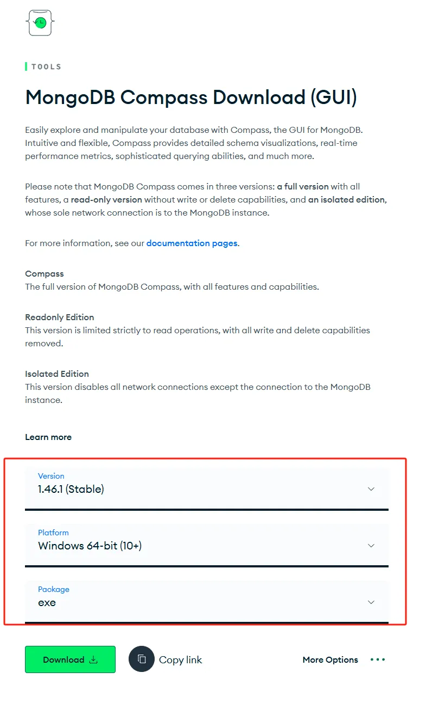
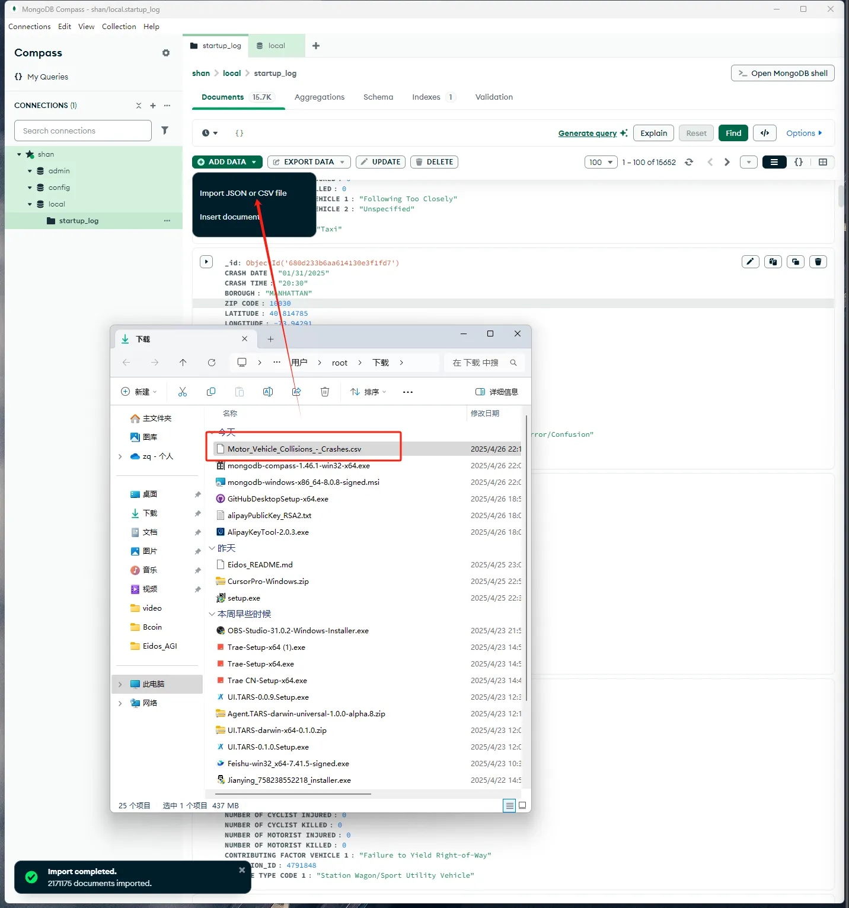

# 让AI查询并分析百万行数据

## 如果领导给了你一份报表，这份报表有150万条数据，让你紧急在15分钟内把分析报告给客户，并且要应对客户的各种问题，你怎么办？

我给你演示一下30s出一个报表，你想怎么分析，就怎么分析。


# Day15-从0开始Agent系列视频04-让AI查询并分析百万行数据

## 如果领导给了你一份报表，这份报表有150万条数据，让你紧急在15分钟内把分析报告给客户，并且要应对客户的各种问题，你怎么办？

我给你演示一下30s出一个报表，你想怎么分析，就怎么分析。

# MongoDB-MCP数据库

这种实时根据你的数据，实时出报表，用到的杀器就是：MongoDB数据库

本来网上有很多mongoDB-MCP，但是我测下来各种各样的垃圾问题，我一生气，花了半小时，自己写了个MCP，用起来非常丝滑。跟着视频做，你也可以实现AI分析百万行数据。当然未来也会教大家不需要写一行代码，快速开发MCP。

## 我写的这个Mongo-MCP是连接MongoDB数据库的工具，可以通过MongoDB数据库命令查询各种信息。

一听数据库你可能就蒙了，我根本不懂数据库怎么办。

不需要你懂数据库，只需要你懂怎么配置MCP即可。我往期视频也讲过怎么配置MCP。

# 现在讲一下详细的安装步骤：

## 1.先准备数据库

安装python（略）

安装node js，（直接下载安装https://nodejs.org/zh-cn）

下载mangodb 安装包，<https://www.mongodb.com/try/download/community>

然后打开安装下一步下一步即可，

下载MongoDB Compass，<https://www.mongodb.com/try/download/compass>




下载数据集，或使用你自己的数据集：<https://catalog.data.gov/dataset/motor-vehicle-collisions-crashes>



打开MongoDB Compass，导入数据：

## **2.首先安装python(具体步骤不讲了)，然后安装MCP SDK**

安装好python后，打开cmd输入：

`PIP install mcp[cli]`

安装MCP这个SDK，

配置好后，此时需要新开一个CMD，输入`MCP`验证是否生效。


### **注意：现在新版本直接输入**<code>**PIP install mcp[cli]**</code>**即可！无需配置环境变量了。**

### 至此，代码环境搭建完成。

`如果提示下面错误需要卸载python，重新安装python，去网上搜一下如何把python卸载干净！`


## **3.配置MCP服务**

cmd里面输入`pip install pymongo` 安装依赖包：

然后复制下面代码，新建一个.py的文件，粘贴到新建的py文件

````python
import subprocess
import re
from mcp.server.fastmcp import FastMCP
from mcp.server.fastmcp.prompts import base
from pymongo import MongoClient
import json
import os

mcp = FastMCP("MongoDB Toolkit", dependencies=["pymongo"])

def create_mongodb_connection(connection_string=None, host=None, port=None, username=None, password=None, database=None):
    """
    创建 MongoDB 连接
    可以使用连接字符串或单独的参数
    """
    try:
        if connection_string:
            client = MongoClient(connection_string)
        else:
            # 使用默认值，如果未提供
            host = host or "localhost"
            port = port or 27017
            
            # 如果提供了用户名和密码，使用认证
            if username and password:
                client = MongoClient(
                    host=host,
                    port=port,
                    username=username,
                    password=password,
                    authSource=database or "admin"
                )
            else:
                client = MongoClient(host=host, port=port)
        
        return client
    except Exception as e:
        raise Exception(f"MongoDB 连接错误: {str(e)}")

@mcp.tool()
def list_databases(connection_string=None, host=None, port=None, username=None, password=None):
    """
    列出 MongoDB 服务器上的所有数据库
    """
    try:
        client = create_mongodb_connection(
            connection_string=connection_string,
            host=host,
            port=port,
            username=username,
            password=password
        )
        
        databases = client.list_database_names()
        client.close()
        
        return {
            "status": "success",
            "databases": databases
        }
    except Exception as e:
        return {
            "status": "error",
            "message": f"列出数据库时出错: {str(e)}"
        }

@mcp.tool()
def list_collections(database, connection_string=None, host=None, port=None, username=None, password=None):
    """
    列出指定数据库中的所有集合
    """
    try:
        client = create_mongodb_connection(
            connection_string=connection_string,
            host=host,
            port=port,
            username=username,
            password=password,
            database=database
        )
        
        db = client[database]
        collections = db.list_collection_names()
        client.close()
        
        return {
            "status": "success",
            "database": database,
            "collections": collections
        }
    except Exception as e:
        return {
            "status": "error",
            "message": f"列出集合时出错: {str(e)}"
        }

@mcp.tool()
def find_documents(database, collection, query=None, projection=None, limit=10, skip=0, connection_string=None, host=None, port=None, username=None, password=None):
    """
    在集合中查找文档
    
    Args:
        database: 数据库名称
        collection: 集合名称
        query: 查询条件 (JSON 字符串或字典)
        projection: 投影 (JSON 字符串或字典)
        limit: 返回的最大文档数
        skip: 跳过的文档数
        connection_string, host, port, username, password: 连接参数
    """
    try:
        client = create_mongodb_connection(
            connection_string=connection_string,
            host=host,
            port=port,
            username=username,
            password=password,
            database=database
        )
        
        db = client[database]
        coll = db[collection]
        
        # 处理查询和投影参数
        if query:
            if isinstance(query, str):
                query = json.loads(query)
        else:
            query = {}
            
        if projection:
            if isinstance(projection, str):
                projection = json.loads(projection)
            cursor = coll.find(query, projection).limit(limit).skip(skip)
        else:
            cursor = coll.find(query).limit(limit).skip(skip)
        
        # 将结果转换为可序列化的列表
        results = []
        for doc in cursor:
            # 将 ObjectId 转换为字符串
            if '_id' in doc and hasattr(doc['_id'], '__str__'):
                doc['_id'] = str(doc['_id'])
            results.append(doc)
        
        client.close()
        
        return {
            "status": "success",
            "database": database,
            "collection": collection,
            "count": len(results),
            "documents": results
        }
    except Exception as e:
        return {
            "status": "error",
            "message": f"查询文档时出错: {str(e)}"
        }

@mcp.tool()
def insert_document(database, collection, document, connection_string=None, host=None, port=None, username=None, password=None, user_confirmed=False):
    """
    向集合中插入一个文档
    
    Args:
        database: 数据库名称
        collection: 集合名称
        document: 要插入的文档 (JSON 字符串或字典)
        connection_string, host, port, username, password: 连接参数
        user_confirmed: 用户是否确认执行此操作
    """
    # 需要用户确认的写操作
    if not user_confirmed:
        return {
            "requires_confirmation": True,
            "message": f"警告: 此操作将向 {database}.{collection} 中插入新文档。请确认执行。",
            "operation": "insert_document",
            "database": database,
            "collection": collection
        }
    
    try:
        client = create_mongodb_connection(
            connection_string=connection_string,
            host=host,
            port=port,
            username=username,
            password=password,
            database=database
        )
        
        db = client[database]
        coll = db[collection]
        
        # 处理文档参数
        if isinstance(document, str):
            document = json.loads(document)
        
        result = coll.insert_one(document)
        client.close()
        
        return {
            "status": "success",
            "database": database,
            "collection": collection,
            "inserted_id": str(result.inserted_id)
        }
    except Exception as e:
        return {
            "status": "error",
            "message": f"插入文档时出错: {str(e)}"
        }

@mcp.tool()
def update_documents(database, collection, filter_query, update, update_many=False, connection_string=None, host=None, port=None, username=None, password=None, user_confirmed=False):
    """
    更新集合中的文档
    
    Args:
        database: 数据库名称
        collection: 集合名称
        filter_query: 过滤条件 (JSON 字符串或字典)
        update: 更新操作 (JSON 字符串或字典)
        update_many: 是否更新多个文档
        connection_string, host, port, username, password: 连接参数
        user_confirmed: 用户是否确认执行此操作
    """
    # 需要用户确认的写操作
    if not user_confirmed:
        return {
            "requires_confirmation": True,
            "message": f"警告: 此操作将更新 {database}.{collection} 中的文档。请确认执行。",
            "operation": "update_documents",
            "database": database,
            "collection": collection,
            "update_many": update_many
        }
    
    try:
        client = create_mongodb_connection(
            connection_string=connection_string,
            host=host,
            port=port,
            username=username,
            password=password,
            database=database
        )
        
        db = client[database]
        coll = db[collection]
        
        # 处理查询和更新参数
        if isinstance(filter_query, str):
            filter_query = json.loads(filter_query)
        if isinstance(update, str):
            update = json.loads(update)
        
        if update_many:
            result = coll.update_many(filter_query, update)
            modified_count = result.modified_count
        else:
            result = coll.update_one(filter_query, update)
            modified_count = result.modified_count
        
        client.close()
        
        return {
            "status": "success",
            "database": database,
            "collection": collection,
            "matched_count": result.matched_count,
            "modified_count": modified_count
        }
    except Exception as e:
        return {
            "status": "error",
            "message": f"更新文档时出错: {str(e)}"
        }

@mcp.tool()
def delete_documents(database, collection, filter_query, delete_many=False, connection_string=None, host=None, port=None, username=None, password=None, user_confirmed=False):
    """
    删除集合中的文档
    
    Args:
        database: 数据库名称
        collection: 集合名称
        filter_query: 过滤条件 (JSON 字符串或字典)
        delete_many: 是否删除多个文档
        connection_string, host, port, username, password: 连接参数
        user_confirmed: 用户是否确认执行此操作
    """
    # 需要用户确认的写操作
    if not user_confirmed:
        return {
            "requires_confirmation": True,
            "message": f"警告: 此操作将从 {database}.{collection} 中删除文档。请确认执行。",
            "operation": "delete_documents",
            "database": database,
            "collection": collection,
            "delete_many": delete_many
        }
    
    try:
        client = create_mongodb_connection(
            connection_string=connection_string,
            host=host,
            port=port,
            username=username,
            password=password,
            database=database
        )
        
        db = client[database]
        coll = db[collection]
        
        # 处理查询参数
        if isinstance(filter_query, str):
            filter_query = json.loads(filter_query)
        
        if delete_many:
            result = coll.delete_many(filter_query)
            deleted_count = result.deleted_count
        else:
            result = coll.delete_one(filter_query)
            deleted_count = result.deleted_count
        
        client.close()
        
        return {
            "status": "success",
            "database": database,
            "collection": collection,
            "deleted_count": deleted_count
        }
    except Exception as e:
        return {
            "status": "error",
            "message": f"删除文档时出错: {str(e)}"
        }

@mcp.tool()
def aggregate(database, collection, pipeline, connection_string=None, host=None, port=None, username=None, password=None):
    """
    在集合上执行聚合操作
    
    Args:
        database: 数据库名称
        collection: 集合名称
        pipeline: 聚合管道 (JSON 字符串或列表)
        connection_string, host, port, username, password: 连接参数
    """
    try:
        client = create_mongodb_connection(
            connection_string=connection_string,
            host=host,
            port=port,
            username=username,
            password=password,
            database=database
        )
        
        db = client[database]
        coll = db[collection]
        
        # 处理管道参数
        if isinstance(pipeline, str):
            pipeline = json.loads(pipeline)
        
        cursor = coll.aggregate(pipeline)
        
        # 将结果转换为可序列化的列表
        results = []
        for doc in cursor:
            # 将 ObjectId 转换为字符串
            if '_id' in doc and hasattr(doc['_id'], '__str__'):
                doc['_id'] = str(doc['_id'])
            results.append(doc)
        
        client.close()
        
        return {
            "status": "success",
            "database": database,
            "collection": collection,
            "count": len(results),
            "results": results
        }
    except Exception as e:
        return {
            "status": "error",
            "message": f"执行聚合操作时出错: {str(e)}"
        }

@mcp.tool()
def execute_command(database, command, connection_string=None, host=None, port=None, username=None, password=None, user_confirmed=False):
    """
    在数据库上执行任意命令
    
    Args:
        database: 数据库名称
        command: 要执行的命令 (JSON 字符串或字典)
        connection_string, host, port, username, password: 连接参数
        user_confirmed: 用户是否确认执行此操作
    """
    # 需要用户确认的操作
    if not user_confirmed:
        return {
            "requires_confirmation": True,
            "message": f"警告: 此操作将在 {database} 数据库上执行自定义命令。请确认执行。",
            "operation": "execute_command",
            "database": database
        }
    
    try:
        client = create_mongodb_connection(
            connection_string=connection_string,
            host=host,
            port=port,
            username=username,
            password=password,
            database=database
        )
        
        db = client[database]
        
        # 处理命令参数
        if isinstance(command, str):
            command = json.loads(command)
        
        result = db.command(command)
        
        # 处理结果中的 ObjectId
        def process_object_ids(obj):
            if isinstance(obj, dict):
                for key, value in list(obj.items()):
                    if hasattr(value, '__str__') and not isinstance(value, (dict, list, str, int, float, bool, type(None))):
                        obj[key] = str(value)
                    elif isinstance(value, (dict, list)):
                        process_object_ids(value)
            elif isinstance(obj, list):
                for i, item in enumerate(obj):
                    if hasattr(item, '__str__') and not isinstance(item, (dict, list, str, int, float, bool, type(None))):
                        obj[i] = str(item)
                    elif isinstance(item, (dict, list)):
                        process_object_ids(item)
            return obj
        
        result = process_object_ids(result)
        client.close()
        
        return {
            "status": "success",
            "database": database,
            "result": result
        }
    except Exception as e:
        return {
            "status": "error",
            "message": f"执行命令时出错: {str(e)}"
        }

@mcp.prompt()
def analyze_database(database, connection_string=None, host=None, port=None, username=None, password=None, ctx=None):
    """
    分析数据库结构并提供概览
    """
    try:
        # 获取数据库中的集合
        collections_result = list_collections(
            database=database,
            connection_string=connection_string,
            host=host,
            port=port,
            username=username,
            password=password
        )
        
        if collections_result["status"] == "error":
            return [
                base.UserMessage(f"分析数据库 {database} 时出错: {collections_result['message']}"),
                base.AssistantMessage("无法分析数据库。请检查连接参数和数据库名称是否正确。")
            ]
        
        collections = collections_result["collections"]
        
        # 为每个集合获取样本文档和计数
        collection_info = []
        for collection in collections:
            # 获取文档计数
            count_result = find_documents(
                database=database,
                collection=collection,
                limit=0,
                connection_string=connection_string,
                host=host,
                port=port,
                username=username,
                password=password
            )
            
            # 获取样本文档
            sample_result = find_documents(
                database=database,
                collection=collection,
                limit=1,
                connection_string=connection_string,
                host=host,
                port=port,
                username=username,
                password=password
            )
            
            if sample_result["status"] == "success" and sample_result["count"] > 0:
                sample_doc = sample_result["documents"][0]
                doc_structure = json.dumps(sample_doc, indent=2)
            else:
                doc_structure = "无样本文档"
            
            collection_info.append({
                "name": collection,
                "count": count_result.get("count", 0) if count_result["status"] == "success" else "未知",
                "sample": doc_structure
            })
        
        # 构建分析报告
        analysis = f"# {database} 数据库分析\\n\\n"
        analysis += f"## 概览\\n\\n"
        analysis += f"- 数据库名称: {database}\\n"
        analysis += f"- 集合数量: {len(collections)}\\n\\n"
        
        analysis += f"## 集合详情\\n\\n"
        for info in collection_info:
            analysis += f"### {info['name']}\\n\\n"
            analysis += f"- 文档数量: {info['count']}\\n"
            analysis += f"- 样本文档结构:\\n\\n```json\\n{info['sample']}\\n```\\n\\n"
        
        return [
            base.UserMessage(f"请分析数据库 {database} 的结构"),
            base.AssistantMessage(analysis),
            base.AssistantMessage("您想了解这个数据库的哪些具体方面？我可以帮您查询特定集合、分析索引或执行其他操作。")
        ]
    except Exception as e:
        return [
            base.UserMessage(f"分析数据库 {database} 时出错"),
            base.AssistantMessage(f"分析数据库时发生错误: {str(e)}\\n\\n请检查连接参数和数据库名称是否正确。")
        ]

if __name__ == "__main__":
    mcp.run()
````

## **4.配置客户端以应用刚才写的py文件**

**claude desktop为例：**

win+r键输入： `%APPDATA%/Claude/claude_desktop_config.json`

编辑Claude desktop的json文件，args里面的路径就是你的py文件路径

```json
{
  "mcpServers": {
    "mongodb": {
      "command": "python",
      "args": [
        "C:\\\\Users\\\\root\\\\Desktop\\\\video\\\\day15\\\\mongodb.py"
      ]
    }
  }
}
```

如果你的json文件里有别的MCP，那么要精简一下配置插入到json里：

```json
{
    "mcpServers": {
      "其他MCP": {
        "command": "npx",
        "args": [
          "-y",
          "@upstash/context7-mcp"
        ]
      },
      "mongodb": {
        "command": "python",
        "args": [
          "C:\\\\Users\\\\root\\\\Desktop\\\\video\\\\day15\\\\mongodb.py"
        ]
      }
    }
  }
```

至此配置完成。

（如果是其他客户端，比如cursor，cherrystudio，trae等等，可以参考其他客户端如何配置MCP。）

## **效果示例：**

你可以让AI查询你所想问的所有问题，并给出图表等等。

对于小白用户可能有困难，如果遇到问题，欢迎进大本营，跟大家一起交流学习

[Day15(加餐)-MCP是如何与LLM“沟通”的](https://www.notion.so/Day15-MCP-LLM-1d82daab6476807d88b0d4ecfed9d601?pvs=21)


> 更新: 2025-08-01 22:08:40  
> 原文: <https://www.yuque.com/lixinsi/hw0k6o/mbg8zsrfa7xz70z5>