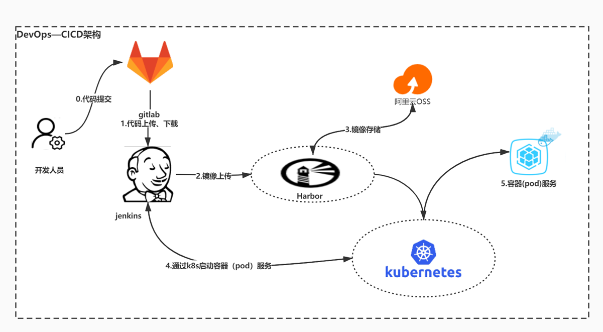
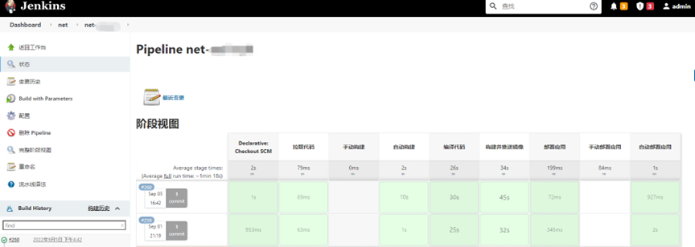
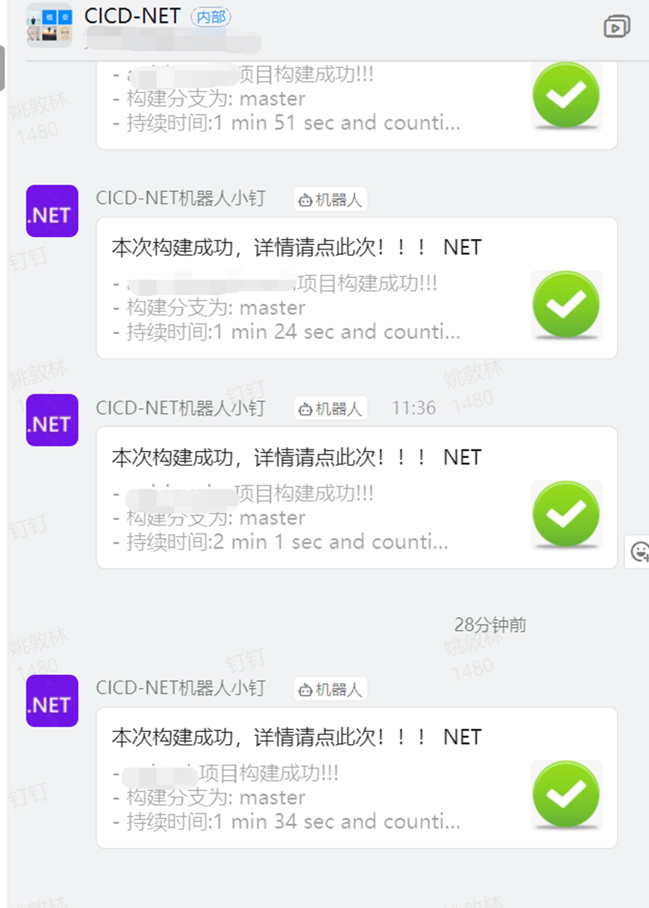
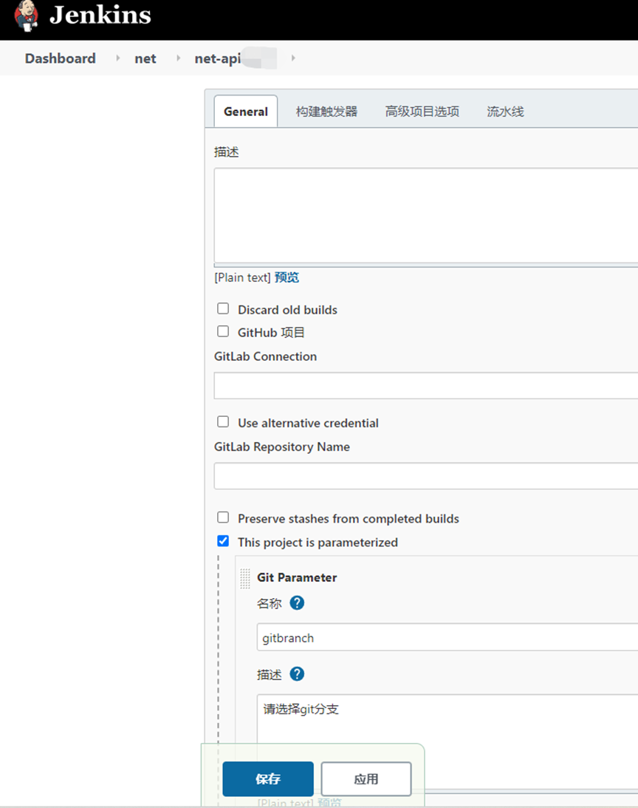

# CICD—Jenkins Gitlab自动化打包.net到K8S

### 温馨提示：环境搭建：Jenkins、gitlab、两者之间打通；钉钉机器人创建都已省略自己问度娘文章很多（整个打包过程全自动，开发人员只需要提交代码就可以自动构建）。
[附件: CICD—Jenkins Gitlab自动化打包.net到K8S.docx](./attachments/aUJrWymLFw5TbEus/CICD—Jenkins Gitlab自动化打包.net到K8S.docx)

**架构图：**



**效果图：**



**构建完成发布消息到钉钉**



### 第一步、安装依赖环境 （kubectl、dotnet-sdk-6.0）
[安装.](https://www.cnblogs.com/tianliupingzong/p/14023840.html)net 6

```shell
https://docs.x.x.x.xsoft.com/zh-tw/dotnet/core/install/linux-ubuntu
wget https://packages.x.x.x.xsoft.com/config/ubuntu/20.04/packages-x.x.x.xsoft-prod.deb -O packages-x.x.x.xsoft-prod.deb sudo dpkg -i packages-x.x.x.xsoft-prod.deb
--安装SDK
sudo apt-get update;
\sudo apt-get install -y apt-transport-https && \sudo apt-get update && \sudo apt-get install -y dotnet-sdk-6.0

```

**手动安装dotnet-6.0**

```shell
wget https://download.visualstudio.x.x.x.xsoft.com/download/pr/807f9d72-4940-4b1a-aa4a-8dbb0f73f5d7/cb666c22a87bf9413f29615e0ba94500/dotnet-sdk-6.0.200-linux-x64.tar.gz
```

```shell
mkdir -p $HOME/dotnet && tar zxf dotnet-sdk-6.0.200-linux-x64.tar.gz -C $HOME/dotnet #dotnet-6.0
```

```shell
source /etc/profile
```

```shell
export DOTNET_ROOT=$HOME/dotnet
export PATH=$HOME/dotnet:$PATH

```

### 第二步、配置Jenkins任务


**触发器**


流水线配置


**gitlab配置：**


**gitlab钩子设置**


### 第三步：编写构建脚本，所有分支、环境都用一套脚本打包简化重复工作。
```shell
#!groovy

pipeline {
    //代理
agent any
    //环境变量
    environment {
        REPOSITORY="git@xxxxxxxxxxxxxxxxxxxxxxxxxx.git"                           //git地址
        PROJECT_NAME = "xxxxx"                                                  //服务名
        BRANCH_DEV= "xxxx"                                                                //开发分支名
        BRANCH_TEST = "xxxxx"                                                             //测试分支
        BRANCH_PRE = "xxxxx"                                                           //演示分支
        BRANCH_PROD = "xxxxx"                                                           //生产分支
        NAMESPACE_DEV = "xxxxx"                                                               //开发命名空间
        NAMESPACE_TEST = "xxxxx"                                                              //测试命名空间
        NAMESPACE_PRE = "xxxxx"                                                               //演示命名空间
        NAMESPACE_PROD = "xxxxx"                                                              //生产命名空间
        IMAGE_TAG = "${sh(script:'date +%Y%m%d%H%M%S', returnStdout: true).trim()}"      //镜像的tag值
        IMAGE_REGISTRY = "xxxxx"                                                   //镜像仓库地址
        IMAGE_PROJECT = "xxxx"                                                     //镜像项目地址
        IMAGE_NAME = "${IMAGE_REGISTRY}/${IMAGE_PROJECT}/${PROJECT_NAME}:${IMAGE_TAG}"   //镜像名称
        JENKINSURL = "http://xxxxxxxxxxxxxxxxxxxx /job/"                         //jenkins任务回调地址
        BRANCH_NAME = "${params.gitbranch}"                                              //判断变量
        SCRIPT_PATH="${WORKSPACE}/deploy/"                                              //依赖包存放地址
    }
    //参数化构建
    parameters {
        gitParameter    branch: '', 
                        branchFilter: 'origin/(.*)', 
                        defaultValue: 'XXXX', 
                        description: '请选择git分支', 
                        name: 'gitbranch', 
                        quickFilterEnabled: false, 
                        selectedValue: 'NONE', 
                        sortMode: 'DESCENDING_SMART', 
                        tagFilter: '*', 
                        type: 'PT_BRANCH', 
                        useRepository: 'git@xxxxxxxxxxxxxxxxxxxxxxxxxx.git'
    }

    stages {
        stage('拉取代码') {
            parallel {
                //手动构建
                stage('手动构建') {
                    when {
                        not{
                            environment name: 'BRANCH_NAME', value: 'XXXX'
                        } 
                    }

                    environment {
                        BRANCH_NAME = "${params.gitbranch}"                                                 //项目的命名空间
                    }
                    steps {
                        echo "从代码仓库${REPOSITORY}拉取代码，分支是：${BRANCH_NAME}" 
                        deleteDir()
                        checkout([$class: 'GitSCM', 
                        branches: [[name: "${BRANCH_NAME}"]], 
                        extensions: [], 
                        userRemoteConfigs: [[credentialsId: 'xxxxxxxxxxxxxxxxxxxxxxxxxxxxxxxxxxxxxxxxx', url: "${REPOSITORY}"]]
                ])
                    }
                }
                //自动构建
                stage('自动构建') {
                    when {
                        
                            environment name: 'BRANCH_NAME', value: 'XXXX'
                        
                    }
                    environment {
                        BRANCH_NAME = "${gitlabBranch}"                                                 //项目的命名空间
                    }
                    steps {
                        echo "从代码仓库${REPOSITORY}拉取代码，分支是：${BRANCH_NAME}" 
                        deleteDir()
                        checkout([$class: 'GitSCM', 
                        branches: [[name: "${BRANCH_NAME}"]], 
                        extensions: [], 
                        userRemoteConfigs: [[credentialsId: 'xxxxxxxxxxxxxxxxxxxxxxxxxxxxxxxxxxxxxxxxx', url: "${REPOSITORY}"]]
                ])
                    }
                }
            }
        }

        stage('编译代码') {
            steps {
                    sh '''
                    #dotnet-6.0
                    export DOTNET_ROOT=$HOME/dotnet
                    export PATH=$HOME/dotnet:$PATH
                    cd ${WORKSPACE}/x.x.x.x.xxxx
                    dotnet add package xxxx.ApiUtil --version x.x.x.x -s https://xxxxxxxxxxxxxxxx/v3/index.json
                   dotnet add package xxxx.Code --version x.x.x.x -s https://xxxxxxxxxxxxxxxx/v3/index.json
                   dotnet add package xxxx.Util --version x.x.x.x -s https://xxxxxxxxxxxxxxxx/v3/index.json
                   dotnet add package xxxx.Util.MyCache --version x.x.x.x -s https://xxxxxxxxxxxxxxxx/v3/index.json
                   dotnet add package xxxx.Util.MyData --version x.x.x.x -s https://xxxxxxxxxxxxxxxx/v3/index.json
                    dotnet restore
                    dotnet publish -c release -o ./app
                   '''
                echo "编译代码成功"
            }
        }

        stage('构建并推送镜像') {
            steps {
                sh '''
                cd ${WORKSPACE}/x.x.x.x.yhzx
            	    docker build -t ${IMAGE_NAME} .
                docker push ${IMAGE_NAME}
                '''
                echo "构建并推送镜像成功"
            }
        }

        stage('部署应用') {
            parallel {
                //手动
                stage('手动部署应用') {
                    when {
                        not{
                            environment name: 'BRANCH_NAME', value: 'XXXX'
                        }
                    }

                    environment {
                        BRANCH_NAME = "${params.gitbranch}"                                                 //项目的命名空间
                    }        
                    steps{
                        script {
                            if(BRANCH_NAME==BRANCH_DEV){
                                env.NAMESPACE = "${NAMESPACE_DEV}"
                                env.KUBECONFIG = "/root/.kube/config"
                                sh "kubectl --kubeconfig=${KUBECONFIG} set image deploy/${PROJECT_NAME} ${PROJECT_NAME}=${IMAGE_NAME} -n ${NAMESPACE}"
                            }
                            if(BRANCH_NAME==BRANCH_TEST){
                                env.NAMESPACE = "${NAMESPACE_TEST}"
                                env.KUBECONFIG = "/root/.kube/config"
                                sh "kubectl --kubeconfig=${KUBECONFIG} set image deploy/${PROJECT_NAME} ${PROJECT_NAME}=${IMAGE_NAME} -n ${NAMESPACE}"
                            }
                            if(BRANCH_NAME==BRANCH_PRE){
                                env.NAMESPACE = "${NAMESPACE_PRE}"
                                env.KUBECONFIG = "/root/.kube/config.pre"
                                sh "kubectl --kubeconfig=${KUBECONFIG} set image deploy/${PROJECT_NAME} ${PROJECT_NAME}=${IMAGE_NAME} -n ${NAMESPACE}"
                            }                    
                            if(BRANCH_NAME==BRANCH_PROD){
                                echo "请手动拷贝镜像名:${IMAGE_NAME} 更新部署到生产环境K8S！"
                            }
                        }
                    }
                    post {
                        success {
                            dingtalk (
                                robot:'xxxxxxxxxxxxxxxxxxxxxxxxxxxxxxxxxxxxxxxx',
                                type:'LINK',
                                title: '本次构建成功，详情请点此次！！！',
                                text: ["- ${PROJECT_NAME}项目构建成功!!!\n- 构建分支为: ${BRANCH_NAME}\n- 持续时间:${currentBuild.durationString}\n- 任务:${BUILD_ID}"],
                                messageUrl:'${JENKINSURL}${JOB_NAME}/${BUILD_NUMBER}/console',
                                picUrl:'http://kmzsccfile.kmzscc.com/upload/2020/success.jpg'
                            ) 
                        }
                        failure {
                            dingtalk (
                                robot:'xxxxxxxxxxxxxxxxxxxxxxxxxxxxxxxxxxxxxxxx',
                                type:'LINK',
                                title: '本次构建失败，详情请点此次！！！',
                                text: ["- ${PROJECT_NAME}项目构建失败!!!\n- 构建分支为:${BRANCH_NAME}\n- 持续时间:${currentBuild.durationString}\n- 任务:${BUILD_ID}"],
                                messageUrl:'${JENKINSURL}${JOB_NAME}/${BUILD_NUMBER}/console',
                                picUrl:'http://kmzsccfile.kmzscc.com/upload/2020/error.jpg',
                            ) 
                        }
                    }
                }

                //自动部署应用
                stage('自动部署应用') {
                    when {
                        
                            environment name: 'BRANCH_NAME', value: 'XXXX'
                        
                    }
                    environment {
                        BRANCH_NAME = "${gitlabBranch}"                                                 //项目的命名空间
                    }
                    steps{
                        script {
                            if(gitlabBranch==BRANCH_DEV){
                                env.NAMESPACE = "${NAMESPACE_DEV}"
                                env.KUBECONFIG = "/root/.kube/config"
                                sh "kubectl --kubeconfig=${KUBECONFIG} set image deploy/${PROJECT_NAME} ${PROJECT_NAME}=${IMAGE_NAME} -n ${NAMESPACE}"
                            }
                                if(BRANCH_NAME==BRANCH_TEST){
                                env.NAMESPACE = "${NAMESPACE_TEST}"
                                env.KUBECONFIG = "/root/.kube/config"
                                sh "kubectl --kubeconfig=${KUBECONFIG} set image deploy/${PROJECT_NAME} ${PROJECT_NAME}=${IMAGE_NAME} -n ${NAMESPACE}"
                            }
                            if(gitlabBranch==BRANCH_PRE){
                                env.NAMESPACE = "${NAMESPACE_PRE}"
                                env.KUBECONFIG = "/root/.kube/config.pre"
                                sh "kubectl --kubeconfig=${KUBECONFIG} set image deploy/${PROJECT_NAME} ${PROJECT_NAME}=${IMAGE_NAME} -n ${NAMESPACE}"
                            }                    
                            if(gitlabBranch==BRANCH_PROD){
                                echo "请手动拷贝镜像名:${IMAGE_NAME} 更新部署到生产环境K8S！"
                            }
                        }
                    }
                    post {
                        success {
                            dingtalk (
                                robot:'xxxxxxxxxxxxxxxxxxxxxxxxxxxxxxxxxxxxxxxx',
                                type:'LINK',
                                title: '本次构建成功，详情请点此次！！！',
                                text: ["- ${PROJECT_NAME}项目构建成功!!!\n- 构建分支为: ${gitlabBranch}\n- 持续时间:${currentBuild.durationString}\n- 任务:${BUILD_ID}"],
                                messageUrl:'${JENKINSURL}${JOB_NAME}/${BUILD_NUMBER}/console',
                                picUrl:'http://kmzsccfile.kmzscc.com/upload/2020/success.jpg'
                            ) 
                        }
                        failure {
                            dingtalk (
                                robot:'xxxxxxxxxxxxxxxxxxxxxxxxxxxxxxxxxxxxxxxx',
                                type:'LINK',
                                title: '本次构建失败，详情请点此次！！！',
                                text: ["- ${PROJECT_NAME}项目构建失败!!!\n- 构建分支为:${gitlabBranch}\n- 持续时间:${currentBuild.durationString}\n- 任务:${BUILD_ID}"],
                                messageUrl:'${JENKINSURL}${JOB_NAME}/${BUILD_NUMBER}/console',
                                picUrl:'http://kmzsccfile.kmzscc.com/upload/2020/error.jpg',
                            ) 
                        }
                    }
                }
            }
        }
    }
}

```


> 更新: 2022-09-07 16:49:52  
> 原文: <https://www.yuque.com/lixinsi/osis9f/tutyun>