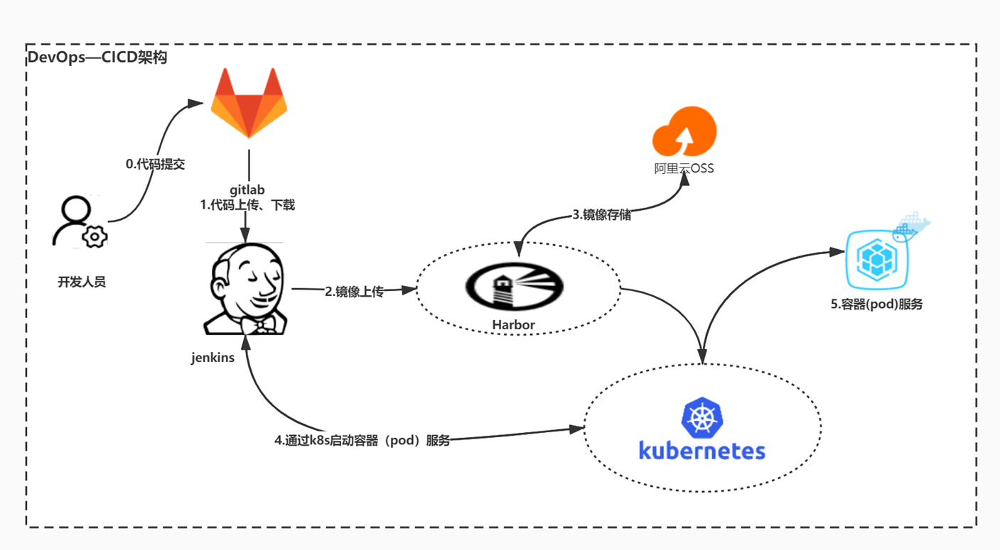
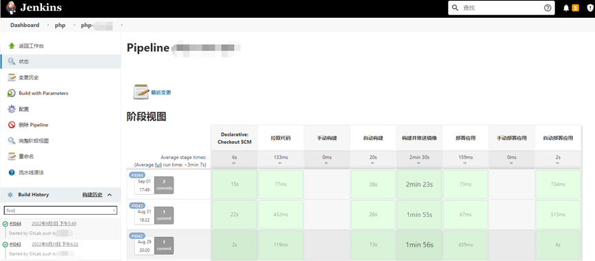
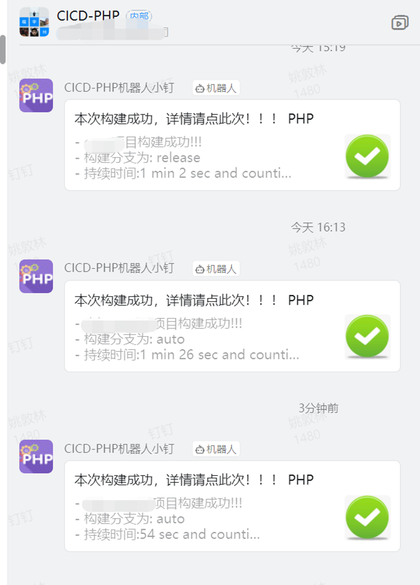
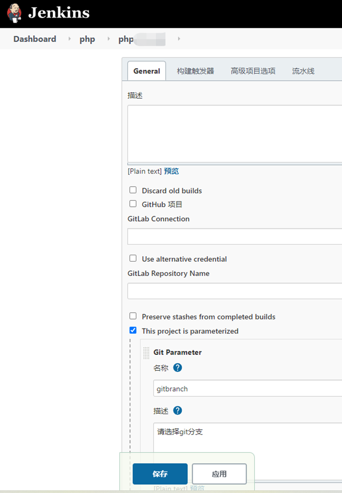
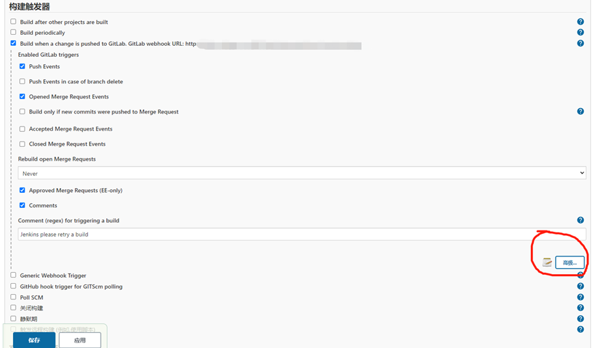
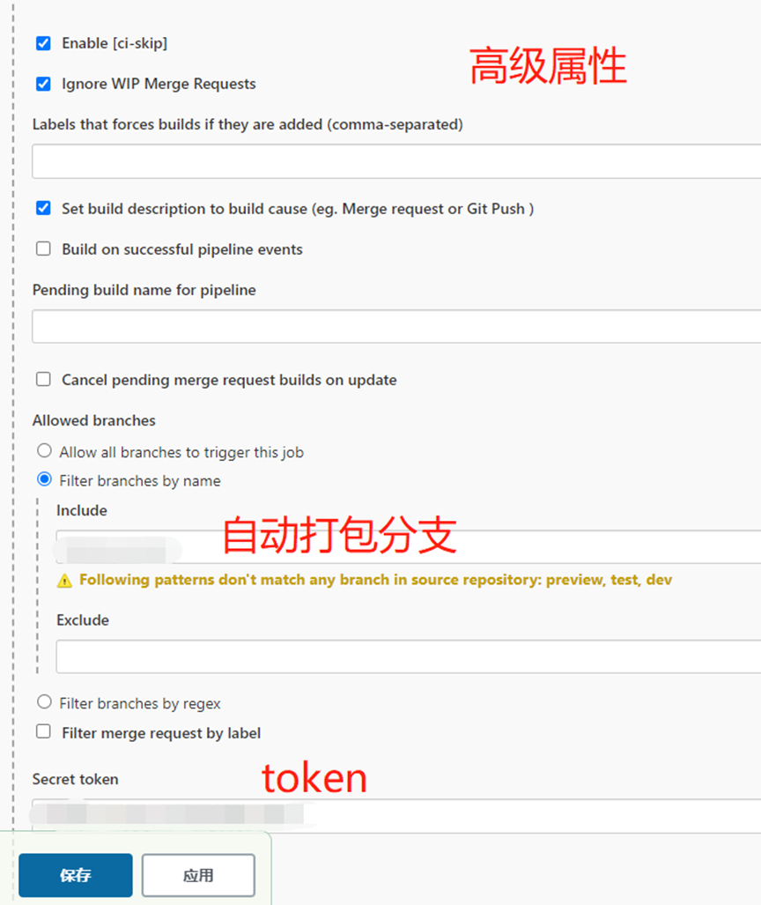
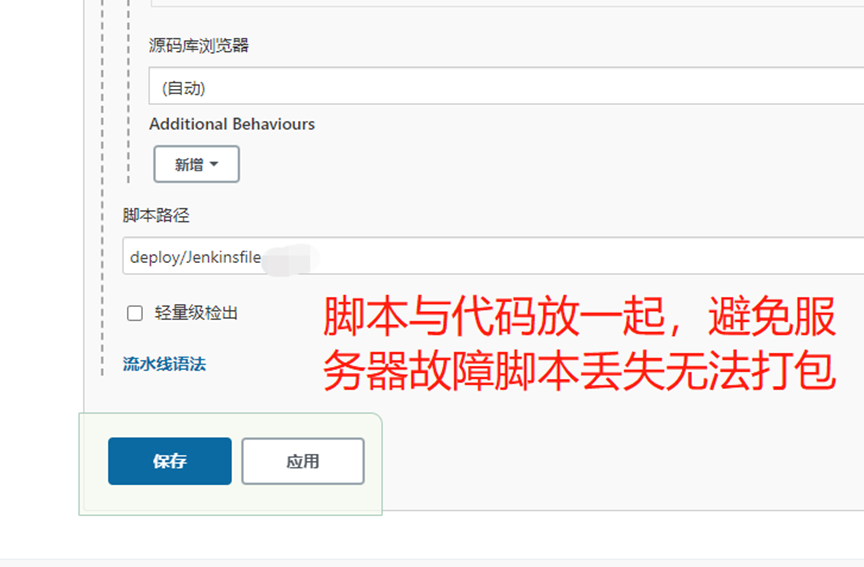
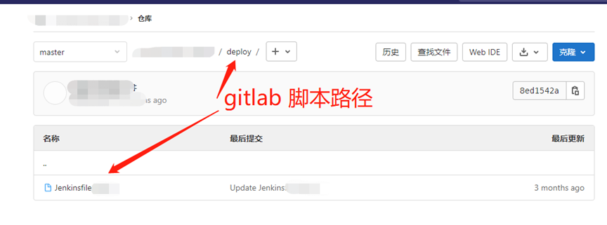
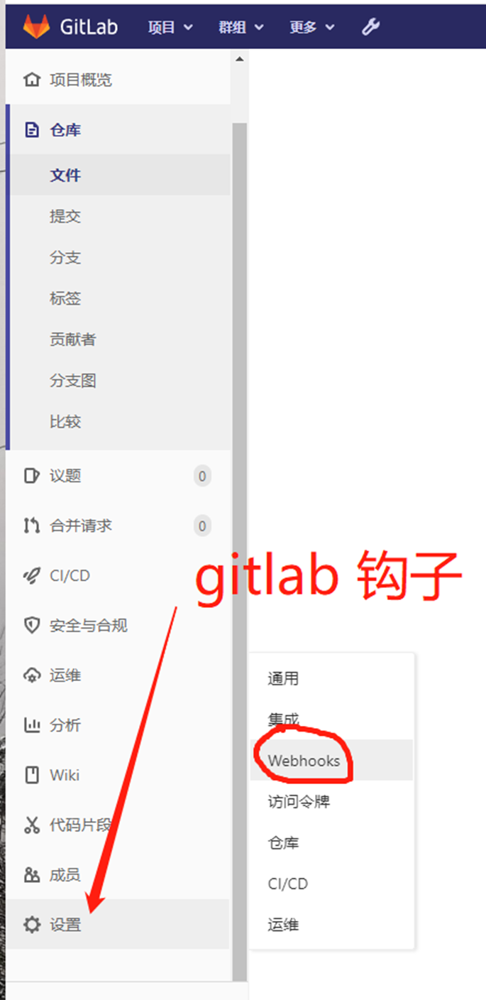
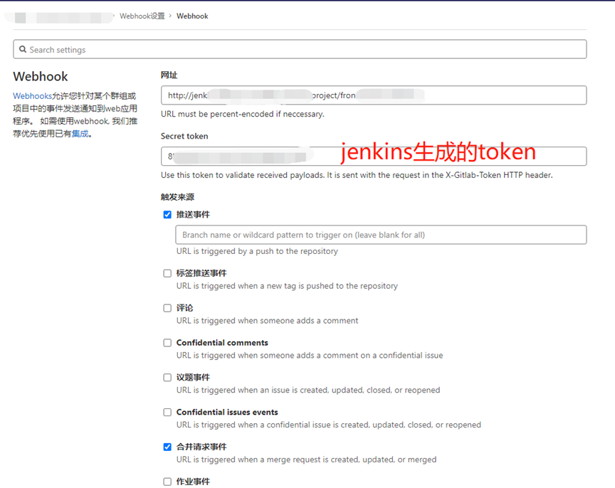

# CICD—Jenkins Gitlab自动化打包PHP到K8S

**温馨提示：环境搭建：Jenkins、gitlab、两者之间打通；钉钉机器人创建都已省略自己问度娘文章很多（整个打包过程全自动，开发人员只需要提交代码就可以自动构建）。**

**架构图：**[附件: CICD—Jenkins Gitlab自动化打包PHP到K8S.docx](./attachments/zoTohbeBjCFGEeta/CICD—Jenkins Gitlab自动化打包PHP到K8S.docx)



**效果图：**



**构建完成发布消息到钉钉**



### 第一步、安装依赖环境 （kubectl）
PHP无需编译

### 第二步、配置Jenkins任务


**触发器配置：**





**流水线配置：**




**gitlab配置：**



**gitlab钩子设置**





### 第三步：编写构建脚本，所有分支、环境都用一套脚本打包简化重复工作。
```shell
#!groovy

pipeline {
    //代理
agent any
    //环境变量
    environment {
        REPOSITORY="git@xxxxxxxxxxxxxxxxxxxxxxxxxxxxxxxxxxxxxxxxxxxx.git"                           //git地址
        PROJECT_NAME = "xxxxxxxx"                                                     //服务名
        PROJECT_NAME_HHB = "xxxxxx"                                                  //服务名2
        PROJECT_NAME_HHB_JAVA = "xxxxxx"                                        //服务名3
        BRANCH_DEVELOP= "xxxxx"                                                        //开发分支名
        BRANCH_DEV= "xxxx"                                                                   //测试分支名
        BRANCH_HHB = "xxxxx"                                                            //分支1
        BRANCH_HHB_test = "xxxxx"                                                            //分支2
        BRANCH_HHB_JAVA = "xxxxx"                                                           //分支3
        BRANCH_TEST = "xxxxx"                                                             //分支4
        BRANCH_PRE = "xxxxxx"                                                             //演示分支
        BRANCH_PROD = "xxxxx"                                                                 //生产分支
        NAMESPACE_DEVELOP = "xxxxx"                                                      //开发命名空间
        NAMESPACE_DEV = "xxxxxxx"                                                               //测试命名空间
        NAMESPACE_TEST = "xxxxxxx"                                                              //测试命名空间2
        NAMESPACE_HHB_JAVA = "xxxxxxx"                                                          //命名空间3
        NAMESPACE_HHB_DEV = "xxxx"                                                          //命名空间4
        NAMESPACE_PRE = "xxxxxx"                                                               //演示命名空间
        NAMESPACE_PROD = "xxxxx"                                                              //生产命名空间
        IMAGE_TAG = "${sh(script:'date +%Y%m%d%H%M%S', returnStdout: true).trim()}"      //镜像的tag值
        IMAGE_REGISTRY = "xxxxxxxx"                                                   //镜像仓库地址
        IMAGE_PROJECT = "xxxxxxxx"                                                     //镜像项目地址
        IMAGE_NAME = "${IMAGE_REGISTRY}/${IMAGE_PROJECT}/${PROJECT_NAME}:${IMAGE_TAG}"   //镜像名称
        JENKINSURL = "http://xxxxxxxxxxxx/job/"                         //jenkins任务回调地址
        BRANCH_NAME = "${params.gitbranch}"                                              //判断变量
        SCRIPT_PATH="${WORKSPACE}/deploy/"                                              //依赖包存放地址
    }
    //参数化构建
    parameters {
        gitParameter    branch: '', 
                        branchFilter: 'origin/(.*)', 
                        defaultValue: 'CICDXXXXXX', 
                        description: '请选择git分支', 
                        name: 'gitbranch', 
                        quickFilterEnabled: false, 
                        selectedValue: 'NONE', 
                        sortMode: 'DESCENDING_SMART', 
                        tagFilter: '*', 
                        type: 'PT_BRANCH', 
                        useRepository: 'git@xxxxxxxxxxxxxxxxxxxxxxxxxxxxxxxxxxxxxxxxxxxx.git'
    }

    stages {
        stage('拉取代码') {
            parallel {
                //手动构建
                stage('手动构建') {
                    when {
                        not{
                            environment name: 'BRANCH_NAME', value: 'CICDXXXXXX'
                        } 
                    }

                    environment {
                        BRANCH_NAME = "${params.gitbranch}"                                                 //项目的命名空间
                    }
                    steps {
                        echo "从代码仓库${REPOSITORY}拉取代码，分支是：${BRANCH_NAME}" 
                        deleteDir()
                        checkout([$class: 'GitSCM', 
                        branches: [[name: "${BRANCH_NAME}"]], 
                        extensions: [], 
                        userRemoteConfigs: [[credentialsId: 'xxxxxxxxxxxxxxxxxxxxxxxxxxxxxxxxxxxxxxxxxx', url: "${REPOSITORY}"]]
                ])
                    }
                }
                //自动构建
                stage('自动构建') {
                    when {
                        
                            environment name: 'BRANCH_NAME', value: 'CICDXXXXXX'
                        
                    }
                    environment {
                        BRANCH_NAME = "${gitlabBranch}"                                                 //项目的命名空间
                    }
                    steps {
                        echo "从代码仓库${REPOSITORY}拉取代码，分支是：${BRANCH_NAME}" 
                        deleteDir()
                        checkout([$class: 'GitSCM', 
                        branches: [[name: "${BRANCH_NAME}"]], 
                        extensions: [], 
                        userRemoteConfigs: [[credentialsId: 'xxxxxxxxxxxxxxxxxxxxxxxxxxxxxxxxxxxxxxxxxx', url: "${REPOSITORY}"]]
                ])
                    }
                }
            }
        }
        stage('构建并推送镜像') {
            steps {
                sh '''
                cd ${WORKSPACE}
                 docker build -t ${IMAGE_NAME} .
                 docker push ${IMAGE_NAME}
                '''
                echo "构建并推送镜像成功"
            }
        }

        stage('部署应用') {
            parallel {
                //手动
                stage('手动部署应用') {
                    when {
                        not{
                            environment name: 'BRANCH_NAME', value: 'CICDXXXXXX'
                        }
                    }

                    environment {
                        BRANCH_NAME = "${params.gitbranch}"                                                 //项目的命名空间
                    }        
                    steps{
                        script {
                            if(BRANCH_NAME==BRANCH_DEVELOP){
                                env.NAMESPACE = "${NAMESPACE_DEVELOP}"
                                env.KUBECONFIG = "/root/.kube/config"
                                sh "kubectl --kubeconfig=${KUBECONFIG} set image deploy/${PROJECT_NAME} ${PROJECT_NAME}=${IMAGE_NAME} -n ${NAMESPACE}"
                            }
                            if(BRANCH_NAME==BRANCH_DEV){
                                env.NAMESPACE = "${NAMESPACE_DEV}"
                                env.KUBECONFIG = "/root/.kube/config"
                                sh "kubectl --kubeconfig=${KUBECONFIG} set image deploy/${PROJECT_NAME} ${PROJECT_NAME}=${IMAGE_NAME} -n ${NAMESPACE}"
                            }
                            if(BRANCH_NAME==BRANCH_HHB){
                                env.NAMESPACE = "${NAMESPACE_HHB_DEV}"
                                env.KUBECONFIG = "/root/.kube/config.dev"
                                sh "kubectl --kubeconfig=${KUBECONFIG} set image deploy/${PROJECT_NAME_HHB} ${PROJECT_NAME_HHB}=${IMAGE_NAME} -n ${NAMESPACE}"
                            }
                            if(BRANCH_NAME==BRANCH_HHB){
                                env.NAMESPACE = "${NAMESPACE_TEST}"
                                env.KUBECONFIG = "/root/.kube/config"
                                sh "kubectl --kubeconfig=${KUBECONFIG} set image deploy/${PROJECT_NAME_HHB} ${PROJECT_NAME_HHB}=${IMAGE_NAME} -n ${NAMESPACE}"
                            }
                            if(BRANCH_NAME==BRANCH_HHB_JAVA){
                                env.NAMESPACE = "${NAMESPACE_HHB_JAVA}"
                                env.KUBECONFIG = "/root/.kube/config"
                                sh "kubectl --kubeconfig=${KUBECONFIG} set image deploy/${PROJECT_NAME_HHB_JAVA} ${PROJECT_NAME_HHB_JAVA}=${IMAGE_NAME} -n ${NAMESPACE}"
                            }
                            if(BRANCH_NAME==BRANCH_TEST){
                                echo "请手动拷贝镜像名:${IMAGE_NAME} 更新部署到相应的环境K8S！"
                            }
                            if(BRANCH_NAME==BRANCH_PRE){
                               echo "请手动拷贝镜像名:${IMAGE_NAME} 更新部署到相应的环境K8S！"
                            }                    
                            if(BRANCH_NAME==BRANCH_PROD){
                                echo "请手动拷贝镜像名:${IMAGE_NAME} 更新部署到生产环境K8S！"
                            }
                        }
                    }
                    post {
                        success {
                            dingtalk (
                                robot:'xxxxxxxxxxxxxxxxxxxxxxxxxxxxxxxxxxxxxxxxxx',
                                type:'LINK',
                                title: '本次构建成功，详情请点此次！！！',
                                text: ["- ${PROJECT_NAME}项目构建成功!!!\n- 构建分支为: ${BRANCH_NAME}\n- 持续时间:${currentBuild.durationString}\n- 任务:${BUILD_ID}"],
                                messageUrl:'${JENKINSURL}${JOB_NAME}/${BUILD_NUMBER}/console',
                                picUrl:'http://kmzsccfile.kmzscc.com/upload/2020/success.jpg'
                            ) 
                        }
                        failure {
                            dingtalk (
                                robot:'xxxxxxxxxxxxxxxxxxxxxxxxxxxxxxxxxxxxxxxxxx',
                                type:'LINK',
                                title: '本次构建失败，详情请点此次！！！',
                                text: ["- ${PROJECT_NAME}项目构建失败!!!\n- 构建分支为:${BRANCH_NAME}\n- 持续时间:${currentBuild.durationString}\n- 任务:${BUILD_ID}"],
                                messageUrl:'${JENKINSURL}${JOB_NAME}/${BUILD_NUMBER}/console',
                                picUrl:'http://kmzsccfile.kmzscc.com/upload/2020/error.jpg',
                            ) 
                        }
                    }
                }

                //自动部署应用
                stage('自动部署应用') {
                    when {
                        
                            environment name: 'BRANCH_NAME', value: 'CICDXXXXXX'
                        
                    }
                    environment {
                        BRANCH_NAME = "${gitlabBranch}"                                                 //项目的命名空间
                    }
                    steps{
                        script {
                            if(BRANCH_NAME==BRANCH_DEVELOP){
                                env.NAMESPACE = "${NAMESPACE_DEVELOP}"
                                env.KUBECONFIG = "/root/.kube/config"
                                sh "kubectl --kubeconfig=${KUBECONFIG} set image deploy/${PROJECT_NAME} ${PROJECT_NAME}=${IMAGE_NAME} -n ${NAMESPACE}"
                            }
                            if(BRANCH_NAME==BRANCH_DEV){
                                env.NAMESPACE = "${NAMESPACE_DEV}"
                                env.KUBECONFIG = "/root/.kube/config"
                                sh "kubectl --kubeconfig=${KUBECONFIG} set image deploy/${PROJECT_NAME} ${PROJECT_NAME}=${IMAGE_NAME} -n ${NAMESPACE}"
                            }
                            if(BRANCH_NAME==BRANCH_HHB){
                                env.NAMESPACE = "${NAMESPACE_HHB_DEV}"
                                env.KUBECONFIG = "/root/.kube/config.dev"
                                sh "kubectl --kubeconfig=${KUBECONFIG} set image deploy/${PROJECT_NAME_HHB} ${PROJECT_NAME_HHB}=${IMAGE_NAME} -n ${NAMESPACE}"
                            }
                            if(BRANCH_NAME==BRANCH_HHB){
                                env.NAMESPACE = "${NAMESPACE_DEV}"
                                env.KUBECONFIG = "/root/.kube/config"
                                sh "kubectl --kubeconfig=${KUBECONFIG} set image deploy/${PROJECT_NAME_HHB} ${PROJECT_NAME_HHB}=${IMAGE_NAME} -n ${NAMESPACE}"
                            }
                            if(BRANCH_NAME==BRANCH_HHB_JAVA){
                                env.NAMESPACE = "${NAMESPACE_HHB_JAVA}"
                                env.KUBECONFIG = "/root/.kube/config"
                                sh "kubectl --kubeconfig=${KUBECONFIG} set image deploy/${PROJECT_NAME_HHB_JAVA} ${PROJECT_NAME_HHB_JAVA}=${IMAGE_NAME} -n ${NAMESPACE}"
                            }
                            if(BRANCH_NAME==BRANCH_TEST){
                                echo "请手动拷贝镜像名:${IMAGE_NAME} 更新部署到相应的环境K8S！"
                            }
                            if(BRANCH_NAME==BRANCH_PRE){
                               echo "请手动拷贝镜像名:${IMAGE_NAME} 更新部署到相应的环境K8S！"
                            }                    
                            if(BRANCH_NAME==BRANCH_PROD){
                                echo "请手动拷贝镜像名:${IMAGE_NAME} 更新部署到生产环境K8S！"
                            }
                        }
                    }
                    post {
                        success {
                            dingtalk (
                                robot:'xxxxxxxxxxxxxxxxxxxxxxxxxxxxxxxxxxxxxxxxxx',
                                type:'LINK',
                                title: '本次构建成功，详情请点此次！！！',
                                text: ["- ${PROJECT_NAME}项目构建成功!!!\n- 构建分支为: ${gitlabBranch}\n- 持续时间:${currentBuild.durationString}\n- 任务:${BUILD_ID}"],
                                messageUrl:'${JENKINSURL}${JOB_NAME}/${BUILD_NUMBER}/console',
                                picUrl:'http://kmzsccfile.kmzscc.com/upload/2020/success.jpg'
                            ) 
                        }
                        failure {
                            dingtalk (
                                robot:'xxxxxxxxxxxxxxxxxxxxxxxxxxxxxxxxxxxxxxxxxx',
                                type:'LINK',
                                title: '本次构建失败，详情请点此次！！！',
                                text: ["- ${PROJECT_NAME}项目构建失败!!!\n- 构建分支为:${gitlabBranch}\n- 持续时间:${currentBuild.durationString}\n- 任务:${BUILD_ID}"],
                                messageUrl:'${JENKINSURL}${JOB_NAME}/${BUILD_NUMBER}/console',
                                picUrl:'http://kmzsccfile.kmzscc.com/upload/2020/error.jpg',
                            ) 
                        }
                    }
                }
            }
        }
    }
}

```


> 更新: 2022-09-07 16:50:47  
> 原文: <https://www.yuque.com/lixinsi/osis9f/fm3rlp>