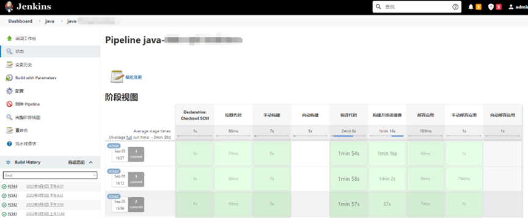
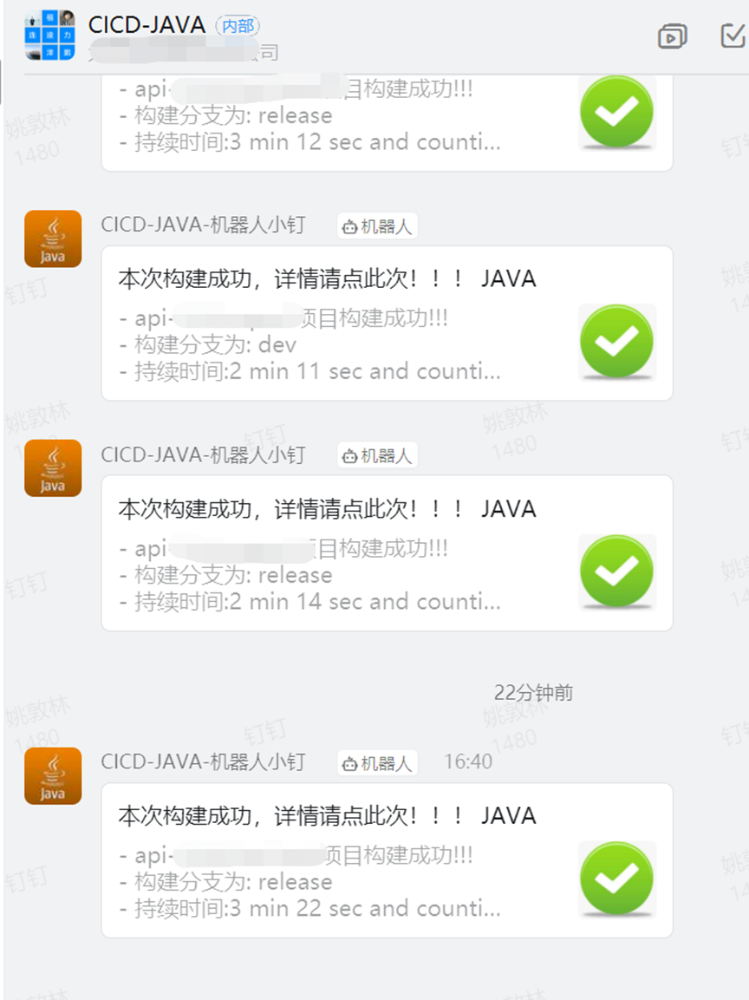
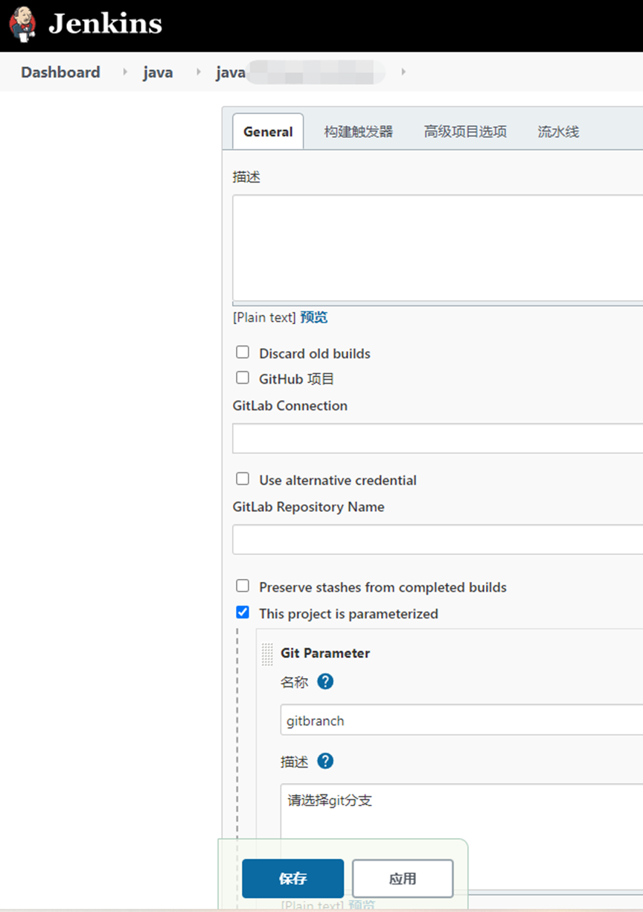

# CICD—Jenkins Gitlab自动化打包java到K8S

**温馨提示：环境搭建：Jenkins、gitlab、两者之间打通；钉钉机器人创建都已省略自己问度娘文章很多（整个打包过程全自动，开发人员只需要提交代码就可以自动构建）。**

****

**架构图：**[附件: CICD—Jenkins Gitlab自动化打包java到K8S.docx](./attachments/_2ZCL-8JOgp082Ix/CICD—Jenkins Gitlab自动化打包java到K8S.docx)



**效果图：**

**构建完成发布消息到钉钉**



### 第一步、安装依赖环境 （kubectl、jdk）
JDK11安装

```shell
sudo apt-get install openjdk-11-jdk
```

或者手动安装JDK

```shell
tar -zxvf jdk-11.0.6.tar.gz -C /usr/local/
ln -s jdk-11.0.6 jdk
```

#jdk11

```shell
export JAVA_HOME=/usr/local/jdk
export CLASSPATH=.:$JAVA_HOME/jre/lib/rt.jar:$JAVA_HOME/lib/dt.jar:$JAVA_HOME/lib/tools.jar
export PATH=$PATH:$JAVA_HOME/bin
```

#安装maven3.6.3

```shell
tar -zxvf apache-maven-3.6.3.tar.gz /usr/local/
ln -s apache-maven-3.6.3 maven
export M2_HOME=/usr/local/maven
export CLASSPATH=$CLASSPATH:$M2_HOME/lib
export PATH=$PATH:$M2_HOME/bin
```


### 第二步、配置Jenkins任务


**触发器**


流水线配置


**gitlab****配置：**


**gitlab****钩子设置**


### 第三步：编写构建脚本，所有分支、环境都用一套脚本打包简化重复工作。
```shell
#!groovy

pipeline {
//代理
agent any
//环境变量
environment {
REPOSITORY="git@xxxxxxxxxxxxxxxxx.git"                          //git地址
PROJECT_NAME = "xxxxxxx"                                                  //服务名
PROJECT_NAME_YLCS = "xxxx"                                                  //服务名2
BRANCH_DEV= "xxx"                                                                //开发分支名
BRANCH_TEST = "xxxx"                                                             //测试分支
BRANCH_TEST_YLCS = "xxxxx"                                                             //测试分支
BRANCH_PRE = "xxxx"                                                           //演示分支
BRANCH_PROD = "xxxxx"                                                           //生产分支
NAMESPACE_DEV ="xxxxx"                                                               //开发命名空间
NAMESPACE_TEST = "xxxx"                                                              //测试命名空间
NAMESPACE_PRE ="xxxx"                                                               //演示命名空间
NAMESPACE_PROD = "xxxxx"                                                              //生产命名空间
IMAGE_TAG = "${sh(script:'date +%Y%m%d%H%M%S', returnStdout: true).trim()}"      //镜像的tag值
IMAGE_REGISTRY = "xxxxxx"                                                   //镜像仓库地址
IMAGE_PROJECT ="xxxxx"                                                     //镜像项目地址
IMAGE_NAME = "${IMAGE_REGISTRY}/${IMAGE_PROJECT}/${PROJECT_NAME}:${IMAGE_TAG}"   //镜像名称
JENKINSURL = "http://xxxxxx/xxxxx/job/"                         //jenkins任务回调地址
BRANCH_NAME = "${params.gitbranch}"                                              //判断变量
SCRIPT_PATH="${WORKSPACE}/deploy/"                                              //依赖包存放地址
}
//参数化构建
parameters {
gitParameter    branch: '', 
               branchFilter: 'origin/(.*)', 
               defaultValue: 'XXXXXXX', 
               description: '请选择git分支', 
               name: 'gitbranch', 
               quickFilterEnabled: false, 
               selectedValue: 'NONE',
               sortMode:'DESCENDING_SMART', 
               tagFilter: '*', 
               type: 'PT_BRANCH', 
               useRepository: 'git@xxxxxxxxxxxxxxxxx.git'
}

stages{
stage('拉取代码') {
   parallel {
       //手动构建
       stage('手动构建') {
           when {
               not{
                   environment name:'BRANCH_NAME', value: 'XXXXXXX'
               } 
           }

           environment {
               BRANCH_NAME = "${params.gitbranch}"                                                 //项目的命名空间
           }
           steps {
               echo "从代码仓库${REPOSITORY}拉取代码，分支是：${BRANCH_NAME}" 
               deleteDir()
               checkout([$class: 'GitSCM', 
               branches:[[name: "${BRANCH_NAME}"]], 
               extensions: [], 
                       userRemoteConfigs: [[credentialsId: 'xxxxxxxxxxxxxxxxxxxxxxxxxxxxxxxxxxxxxxxxxx', url: "${REPOSITORY}"]]
       ])
           }
       }
       //自动构建
       stage('自动构建') {
           when {
               
                   environment name:'BRANCH_NAME', value: 'XXXXXXX'
               
           }
           environment {
               BRANCH_NAME = "${gitlabBranch}"                                                 //项目的命名空间
           }
           steps {
               echo "从代码仓库${REPOSITORY}拉取代码，分支是：${BRANCH_NAME}" 
               deleteDir()
               checkout([$class: 'GitSCM', 
               branches:[[name: "${BRANCH_NAME}"]], 
               extensions: [], 
               userRemoteConfigs: [[credentialsId: 'xxxxxxxxxxxxxxxxxxxxxxxxxxxxxxxxxxxxxxxxxx', url: "${REPOSITORY}"]]
       ])
           }
       }
   }
}

stage('编译代码') {
   steps {
       echo "start mvn build"
sh"mvn clean install -U"
       echo "编译代码成功"
   }
}

stage('构建并推送镜像') {
   steps {
       sh '''
       cd ${WORKSPACE}
dockerbuild -t ${IMAGE_NAME} .
dockerpush ${IMAGE_NAME}
       '''
       echo "构建并推送镜像成功"
   }
}

stage('部署应用') {
   parallel {
       //手动
       stage('手动部署应用') {
           when {
               not{
                   environment name:'BRANCH_NAME', value: 'XXXXXXX'
               }
           }

           environment {
               BRANCH_NAME = "${params.gitbranch}"                                                 //项目的命名空间
           }        
           steps{
               script {
                   if(BRANCH_NAME==BRANCH_DEV){
                       env.NAMESPACE= "${NAMESPACE_DEV}"
                       env.KUBECONFIG = "/root/.kube/config.dev"
                       sh "kubectl --kubeconfig=${KUBECONFIG} set image deploy/${PROJECT_NAME} ${PROJECT_NAME}=${IMAGE_NAME} -n ${NAMESPACE}"
                   }
                   if(BRANCH_NAME==BRANCH_TEST){
                       env.NAMESPACE= "${NAMESPACE_TEST}"
                       env.KUBECONFIG = "/root/.kube/config"
                       sh "kubectl --kubeconfig=${KUBECONFIG} set image deploy/${PROJECT_NAME} ${PROJECT_NAME}=${IMAGE_NAME} -n ${NAMESPACE}"
                   }
                   if(BRANCH_NAME==BRANCH_TEST_YLCS){
                       env.NAMESPACE= "${NAMESPACE_TEST}"
                       env.KUBECONFIG = "/root/.kube/config"
                       sh "kubectl --kubeconfig=${KUBECONFIG} set image deploy/${PROJECT_NAME_YLCS} ${PROJECT_NAME_YLCS}=${IMAGE_NAME} -n ${NAMESPACE}"
                   }
                   if(BRANCH_NAME==BRANCH_PRE){
                       env.NAMESPACE= "${NAMESPACE_PRE}"
                       env.KUBECONFIG = "/root/.kube/config.pre"
                       sh "kubectl --kubeconfig=${KUBECONFIG} --insecure-skip-tls-verify set image deploy/${PROJECT_NAME} ${PROJECT_NAME}=${IMAGE_NAME} -n ${NAMESPACE}"
                   }                    
                   if(BRANCH_NAME==BRANCH_PROD){
                       env.NAMESPACE= "${NAMESPACE_PROD}"
                       env.KUBECONFIG = "/root/.kube/config.prod"
                       sh "kubectl --kubeconfig=${KUBECONFIG} set image deploy/${PROJECT_NAME} ${PROJECT_NAME}=${IMAGE_NAME} -n ${NAMESPACE}"
                   }
               }
           }
           post {
               success {
                   dingtalk (
                       robot:'xxxxxxxxxxxxxxxxxxxxxxxxxxxxxxxxxxxxxxxxxx',
                       type:'LINK',
                       title: '本次构建成功，详情请点此次！！！',
                       text: ["- ${PROJECT_NAME}项目构建成功!!!\n- 构建分支为:${BRANCH_NAME}\n- 持续时间:${currentBuild.durationString}\n- 任务:${BUILD_ID}"],
                       messageUrl:'${JENKINSURL}${JOB_NAME}/${BUILD_NUMBER}/console',
                       picUrl:'http://kmzsccfile.kmzscc.com/upload/2020/success.jpg'
                   ) 
               }
               failure {
                   dingtalk (
                       robot:'xxxxxxxxxxxxxxxxxxxxxxxxxxxxxxxxxxxxxxxxxx',
                       type:'LINK',
                       title: '本次构建失败，详情请点此次！！！',
                       text: ["- ${PROJECT_NAME}项目构建失败!!!\n- 构建分支为:${BRANCH_NAME}\n- 持续时间:${currentBuild.durationString}\n- 任务:${BUILD_ID}"],
                       messageUrl:'${JENKINSURL}${JOB_NAME}/${BUILD_NUMBER}/console',
                       picUrl:'http://kmzsccfile.kmzscc.com/upload/2020/error.jpg',
                   ) 
               }
           }
       }

            //自动部署应用
       stage('自动部署应用') {
           when {
               
                   environment name:'BRANCH_NAME', value: 'XXXXXXX'
               
           }
           environment {
               BRANCH_NAME = "${gitlabBranch}"                                                 //项目的命名空间
           }
           steps{
               script {
                   if(gitlabBranch==BRANCH_DEV){
                       env.NAMESPACE= "${NAMESPACE_DEV}"
                       env.KUBECONFIG = "/root/.kube/config.dev"
                       sh "kubectl --kubeconfig=${KUBECONFIG} set image deploy/${PROJECT_NAME} ${PROJECT_NAME}=${IMAGE_NAME} -n ${NAMESPACE}"
                   }
                       if(BRANCH_NAME==BRANCH_TEST){
                       env.NAMESPACE= "${NAMESPACE_TEST}"
                       env.KUBECONFIG = "/root/.kube/config"
                       sh "kubectl --kubeconfig=${KUBECONFIG} --insecure-skip-tls-verify set image deploy/${PROJECT_NAME} ${PROJECT_NAME}=${IMAGE_NAME} -n ${NAMESPACE}"
                   }
                   if(BRANCH_NAME==BRANCH_TEST_YLCS){
                       env.NAMESPACE= "${NAMESPACE_TEST}"
                       env.KUBECONFIG = "/root/.kube/config"
                       sh "kubectl --kubeconfig=${KUBECONFIG} set image deploy/${PROJECT_NAME_YLCS} ${PROJECT_NAME_YLCS}=${IMAGE_NAME} -n ${NAMESPACE}"
                   }
                   if(gitlabBranch==BRANCH_PRE){
                       env.NAMESPACE= "${NAMESPACE_PRE}"
                       env.KUBECONFIG = "/root/.kube/config.pre"
                       sh "kubectl --kubeconfig=${KUBECONFIG} --insecure-skip-tls-verify set image deploy/${PROJECT_NAME_PRE} ${PROJECT_NAME_PRE}=${IMAGE_NAME} -n ${NAMESPACE}"
                   }                    
                   if(gitlabBranch==BRANCH_PROD){
                       env.NAMESPACE= "${NAMESPACE_PROD}"
                       env.KUBECONFIG = "/root/.kube/config.prod"
                       sh "kubectl --kubeconfig=${KUBECONFIG} set image deploy/${PROJECT_NAME} ${PROJECT_NAME}=${IMAGE_NAME} -n ${NAMESPACE}"
                   }
               }
           }
           post {
               success {
                   dingtalk (
                       robot:'xxxxxxxxxxxxxxxxxxxxxxxxxxxxxxxxxxxxxxxxxx',
                       type:'LINK',
                       title: '本次构建成功，详情请点此次！！！',
                       text: ["- ${PROJECT_NAME}项目构建成功!!!\n- 构建分支为:${gitlabBranch}\n- 持续时间:${currentBuild.durationString}\n- 任务:${BUILD_ID}"],
                       messageUrl:'${JENKINSURL}${JOB_NAME}/${BUILD_NUMBER}/console',
                       picUrl:'http://kmzsccfile.kmzscc.com/upload/2020/success.jpg'
                   ) 
               }
               failure {
                   dingtalk (
                       robot:'xxxxxxxxxxxxxxxxxxxxxxxxxxxxxxxxxxxxxxxxxx',
                       type:'LINK',
                       title: '本次构建失败，详情请点此次！！！',
                       text: ["- ${PROJECT_NAME}项目构建失败!!!\n- 构建分支为:${gitlabBranch}\n- 持续时间:${currentBuild.durationString}\n- 任务:${BUILD_ID}"],
                       messageUrl:'${JENKINSURL}${JOB_NAME}/${BUILD_NUMBER}/console',
                       picUrl:'http://kmzsccfile.kmzscc.com/upload/2020/error.jpg',
                   ) 
               }
           }
       }
   }
}
}
}

```


> 更新: 2022-09-07 16:49:40  
> 原文: <https://www.yuque.com/lixinsi/osis9f/ym1qg0>