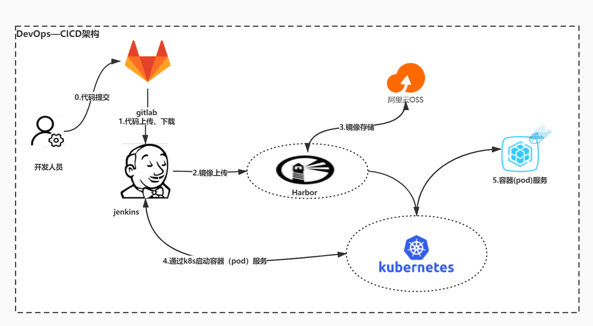
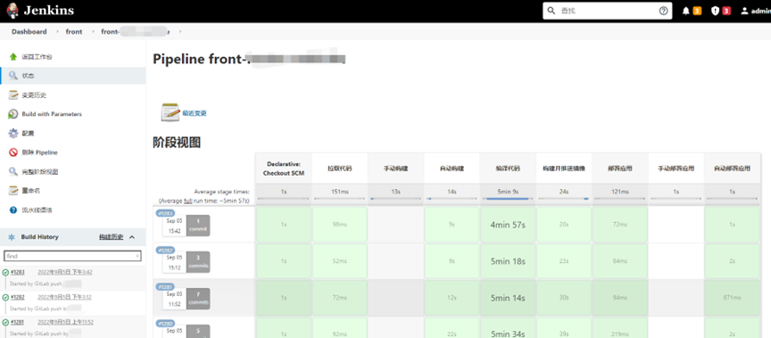
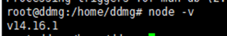
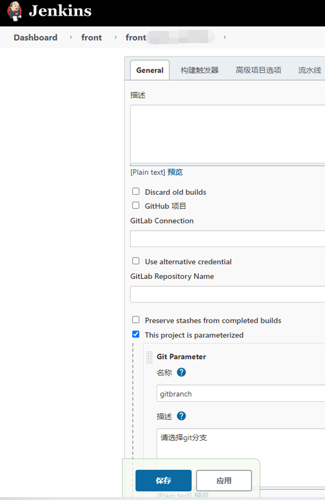
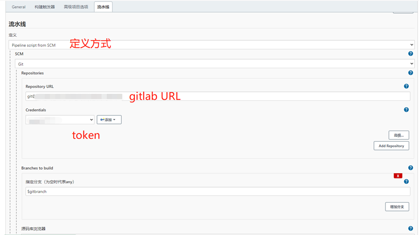

# CICD—Jenkins Gitlab自动化打包前端到K8S

### 温馨提示：环境搭建：Jenkins、gitlab、两者之间打通；钉钉机器人创建都已省略自己问度娘文章很多（整个打包过程全自动，开发人员只需要提交代码就可以自动构建）。
**架构图：**[附件: CICD—Jenkins Gitlab自动化打包前端到K8S.docx](./attachments/6L7dx0f2gtCuYiCK/CICD—Jenkins Gitlab自动化打包前端到K8S.docx)



**效果图：**




**构建完成发布消息到钉钉**


### 第一步、安装依赖环境 （kubectl、nodejs）
```shell
curl -sL https://deb.nodesource.com/setup_14.x | sudo -E bash -
sudo apt-get install -y nodejs
```



### 第二步、配置Jenkins任务


**触发器**


流水线配置



**gitlab****配置：**


**gitlab****钩子设置**


### 第三步：编写构建脚本，所有分支、环境都用一套脚本打包简化重复工作。
```shell
#!groovy

pipeline {
//代理
agent any
//环境变量
environment {
REPOSITORY="git@xxxxxxxxxxxxxxxxxxxxxxxx.git"                           //git地址
PROJECT_NAME = "front-xxxxxxxxxxx"                                                  //测试服务名
PROJECT_NAME_DEV = "xxxx"                                                  //开发服务名
       PROJECT_NAME_PRE = "xxxx"                                                  //开发服务名
PROJECT_NAME_PROD = "xxxx"                                                  //开发服务名
BRANCH_DEV= "xxxx"                                                                //开发分支名
BRANCH_TEST = "xxxx"                                                             //测试分支
BRANCH_PRE = "xxxx"                                                           //演示分支
BRANCH_PROD = "xxxx"                                                           //生产分支
NAMESPACE_DEV = "xxxxx"                                                               //开发命名空间
NAMESPACE_TEST = "xxxxx"                                                              //测试命名空间
NAMESPACE_PRE = "xxxx"                                                               //演示命名空间
NAMESPACE_PROD = "xxxx"                                                              //生产命名空间
IMAGE_TAG = "${sh(script:'date +%Y%m%d%H%M%S', returnStdout: true).trim()}"      //镜像的tag值
IMAGE_REGISTRY = "xxxxxxxx"                                                   //镜像仓库地址
IMAGE_PROJECT = "xxxxxxx"                                                     //镜像项目地址
IMAGE_NAME = "${IMAGE_REGISTRY}/${IMAGE_PROJECT}/${PROJECT_NAME}:${IMAGE_TAG}"   //镜像名称
JENKINSURL = "http://xxxxxxxxxxx/job/"                         //jenkins任务回调地址
BRANCH_NAME = "${params.gitbranch}"                                              //判断变量
}
//参数化构建
parameters {
gitParameter    branch: '', 
branchFilter: 'origin/(.*)', 
defaultValue: 'CICDxxxxx', 
description: '请选择git分支', 
name: 'gitbranch', 
quickFilterEnabled: false, 
selectedValue: 'NONE', 
sortMode: 'DESCENDING_SMART', 
tagFilter: '*', 
type: 'PT_BRANCH', 
useRepository: 'git@xxxxxxxgit'
}

stages {
stage('拉取代码') {
parallel {
//手动构建
stage('手动构建') {
when {
not{
environment name: 'BRANCH_NAME', value: 'CICDxxxxx'
} 
}

environment {
                    BRANCH_NAME = "${params.gitbranch}"                                                 //项目的命名空间
}
steps {
echo "从代码仓库${REPOSITORY}拉取代码，分支是：${BRANCH_NAME}" 
      deleteDir()
checkout([$class: 'GitSCM', 
branches: [[name: "${BRANCH_NAME}"]], 
extensions: [], 
userRemoteConfigs: [[credentialsId: '1b9ca2d6-xxxxxxxxx', url: "${REPOSITORY}"]]
])
}
}
//自动构建
stage('自动构建') {
when {

environment name: 'BRANCH_NAME', value: 'xxxxxx'

}
environment {
BRANCH_NAME = "${gitlabBranch}"                                                 //项目的命名空间
}
steps {
echo "从代码仓库${REPOSITORY}拉取代码，分支是：${BRANCH_NAME}" 
deleteDir()
checkout([$class: 'GitSCM', 
branches: [[name: "${BRANCH_NAME}"]], 
extensions: [], 
userRemoteConfigs: [[credentialsId: '1b9ca2d6xxxxxxxxxxxxxxx', url: "${REPOSITORY}"]]
])
}
}
}
}

stage('编译代码') {
steps {
sh '''
npm config set registry https://registry.npm.taobao.org
             npm i
             npm run build
'''
}
}

stage('构建并推送镜像') {
steps {
            sh '''
            cd ${WORKSPACE}/release/
docker build -t ${IMAGE_NAME} .
docker push ${IMAGE_NAME}
'''
}
}

stage('部署应用') {
parallel {
//手动
stage('手动部署应用') {
               when {
not{
environment name: 'BRANCH_NAME', value: 'CICDxxxxx'
}
}

environment {
BRANCH_NAME = "${params.gitbranch}"                                                 //项目的命名空间
}        
steps{
script {
if(BRANCH_NAME==BRANCH_DEV){
env.NAMESPACE = "${NAMESPACE_DEV}"
env.KUBECONFIG = "/root/.kube/config.dev"
sh "kubectl --kubeconfig=${KUBECONFIG} set image deploy/${PROJECT_NAME_DEV} ${PROJECT_NAME_DEV}=${IMAGE_NAME} -n ${NAMESPACE}"
}
if(BRANCH_NAME==BRANCH_TEST){
env.NAMESPACE = "${NAMESPACE_TEST}"
env.KUBECONFIG = "/root/.kube/config.test"
sh "kubectl --kubeconfig=${KUBECONFIG} set image deploy/${PROJECT_NAME} ${PROJECT_NAME}=${IMAGE_NAME} -n ${NAMESPACE}"
}
if(BRANCH_NAME==BRANCH_PRE){
                           env.NAMESPACE = "${NAMESPACE_PRE}"
env.KUBECONFIG = "/root/.kube/config.pre"
sh "kubectl --kubeconfig=${KUBECONFIG} --insecure-skip-tls-verify set image deploy/${PROJECT_NAME_PRE} ${PROJECT_NAME_PRE}=${IMAGE_NAME} -n ${NAMESPACE}"
}                    
if(BRANCH_NAME==BRANCH_PROD){
env.NAMESPACE = "${NAMESPACE_PROD}"
                  env.KUBECONFIG = "/root/.kube/config.prod"
sh "kubectl --kubeconfig=${KUBECONFIG} set image deploy/${PROJECT_NAME_PROD} ${PROJECT_NAME_PROD}=${IMAGE_NAME} -n ${NAMESPACE}"
}
                    }
}
post {
success {
dingtalk (
robot:'4485c798-xxxxxxxxxxxxxxxxx',
type:'LINK',
title: '本次构建成功，详情请点此次！！！',
text: ["- ${PROJECT_NAME}项目构建成功!!!\n- 构建分支为: ${BRANCH_NAME}\n- 持续时间:${currentBuild.durationString}\n- 任务:${BUILD_ID}"],
messageUrl:'${JENKINSURL}${JOB_NAME}/${BUILD_NUMBER}/console',
picUrl:'http://kmzsccfile.kmzscc.com/upload/2020/success.jpg'
) 
}
failure {
dingtalk (
robot:'4485c798-xxxxxxxxxxxxxxxxxxxxxxxx',
type:'LINK',
title: '本次构建失败，详情请点此次！！！',
                            text: ["- ${PROJECT_NAME}项目构建失败!!!\n- 构建分支为:${BRANCH_NAME}\n- 持续时间:${currentBuild.durationString}\n- 任务:${BUILD_ID}"],
messageUrl:'${JENKINSURL}${JOB_NAME}/${BUILD_NUMBER}/console',
                  picUrl:'http://kmzsccfile.kmzscc.com/upload/2020/error.jpg',
) 
}
}
}

//自动部署应用
stage('自动部署应用') {
when {

environment name: 'BRANCH_NAME', value: 'CICDxxxxxxx'

}
environment {
BRANCH_NAME = "${gitlabBranch}"                                                 //项目的命名空间
}
steps{
script {
if(gitlabBranch==BRANCH_DEV){
                              env.NAMESPACE = "${NAMESPACE_DEV}"
env.KUBECONFIG = "/root/.kube/config.dev"
sh "kubectl --kubeconfig=${KUBECONFIG} set image deploy/${PROJECT_NAME_DEV} ${PROJECT_NAME_DEV}=${IMAGE_NAME} -n ${NAMESPACE}"
}
if(BRANCH_NAME==BRANCH_TEST){
env.NAMESPACE = "${NAMESPACE_TEST}"
env.KUBECONFIG = "/root/.kube/config.test"
sh "kubectl --kubeconfig=${KUBECONFIG} set image deploy/${PROJECT_NAME} ${PROJECT_NAME}=${IMAGE_NAME} -n ${NAMESPACE}"
}
if(gitlabBranch==BRANCH_PRE){
env.NAMESPACE = "${NAMESPACE_PRE}"
env.KUBECONFIG = "/root/.kube/config.pre"
sh "kubectl --kubeconfig=${KUBECONFIG} --insecure-skip-tls-verify set image deploy/${PROJECT_NAME_PRE} ${PROJECT_NAME_PRE}=${IMAGE_NAME} -n ${NAMESPACE}"
}                    
if(gitlabBranch==BRANCH_PROD){
              env.NAMESPACE = "${NAMESPACE_PROD}"
env.KUBECONFIG = "/root/.kube/config.prod"
sh "kubectl --kubeconfig=${KUBECONFIG} set image deploy/${PROJECT_NAME_PROD} ${PROJECT_NAME_PROD}=${IMAGE_NAME} -n ${NAMESPACE}"
}
}
}
post {
success {
dingtalk (
robot:'4485c798-xxxxxxxxxxxxxxxxxxxxxxxxxxxxxx',
type:'LINK',
title: '本次构建成功，详情请点此次！！！',
text: ["- ${PROJECT_NAME}项目构建成功!!!\n- 构建分支为: ${gitlabBranch}\n- 持续时间:${currentBuild.durationString}\n- 任务:${BUILD_ID}"],
messageUrl:'${JENKINSURL}${JOB_NAME}/${BUILD_NUMBER}/console',
picUrl:'http://kmzsccfile.kmzscc.com/upload/2020/success.jpg'
) 
                      }
failure {
dingtalk (
robot:'4485c798-xxxxxxxxxxxxxxxxxxxxxxx',
type:'LINK',
title: '本次构建失败，详情请点此次！！！',
text: ["- ${PROJECT_NAME}项目构建失败!!!\n- 构建分支为:${gitlabBranch}\n- 持续时间:${currentBuild.durationString}\n- 任务:${BUILD_ID}"],
messageUrl:'${JENKINSURL}${JOB_NAME}/${BUILD_NUMBER}/console',
picUrl:'http://kmzsccfile.kmzscc.com/upload/2020/error.jpg',
) 
}
}
}
}
      }
}
}

版本2 ：依赖低版本nodejs和固定node_modules的打包脚本；
#!groovy

pipeline {
//代理
agent any
//环境变量
environment {
REPOSITORY="git@xxxxxxxxxxxxxxxxxxxxxxxx.git"                           //git地址
PROJECT_NAME = "xxxxxxxxx"                                                  //服务名
BRANCH_DEV= "xxxx"                                                                //开发分支名
BRANCH_TEST = "xxxx"                                                             //测试分支
BRANCH_PRE = "xxxx"                                                           //演示分支
BRANCH_PROD = "xxxx"                                                           //生产分支
NAMESPACE_DEV = "xxxx"                                                               //开发命名空间
NAMESPACE_TEST = "xxxx"                                                              //测试命名空间
NAMESPACE_PRE = "xxxx"                                                               //演示命名空间
NAMESPACE_PROD = "xxxx"                                                              //生产命名空间
IMAGE_TAG = "${sh(script:'date +%Y%m%d%H%M%S', returnStdout: true).trim()}"      //镜像的tag值
IMAGE_REGISTRY = "xxxxxx"                                                   //镜像仓库地址
IMAGE_PROJECT = "xxxxxx"                                                     //镜像项目地址
IMAGE_NAME = "${IMAGE_REGISTRY}/${IMAGE_PROJECT}/${PROJECT_NAME}:${IMAGE_TAG}"   //镜像名称
JENKINSURL = "http://xxxxxxxxx/job/"                         //jenkins任务回调地址
BRANCH_NAME = "${params.gitbranch}"                                              //判断变量
SCRIPT_PATH="${WORKSPACE}/deploy/"                                              //依赖包存放地址
}
//参数化构建
parameters {
gitParameter    branch: '', 
branchFilter: 'origin/(.*)', 
defaultValue: 'CICDxxxx', 
description: '请选择git分支', 
name: 'gitbranch', 
quickFilterEnabled: false, 
selectedValue: 'NONE', 
sortMode: 'DESCENDING_SMART', 
tagFilter: '*', 
type: 'PT_BRANCH', 
useRepository: 'git@xxxxxxxxxxxxxxxxxxxxxxxxxxxxxxxxx.git'
}

stages {
stage('拉取代码') {
parallel {
//手动构建
stage('手动构建') {
when {
not{
environment name: 'BRANCH_NAME', value: 'CICDxxxxxx'
} 
      }

environment {
BRANCH_NAME = "${params.gitbranch}"                                                 //项目的命名空间
}
steps {
echo "从代码仓库${REPOSITORY}拉取代码，分支是：${BRANCH_NAME}" 
deleteDir()
checkout([$class: 'GitSCM', 
branches: [[name: "${BRANCH_NAME}"]], 
extensions: [], 
userRemoteConfigs: [[credentialsId: '1b9ca2d6-xxxxxxxxxxxxxxxxxxx', url: "${REPOSITORY}"]]
])
}
}
//自动构建
stage('自动构建') {
when {

                   environment name: 'BRANCH_NAME', value: 'CICDxxxxxxxxxxxxx'

}
environment {
BRANCH_NAME = "${gitlabBranch}"                                                 //项目的命名空间
}
steps {
echo "从代码仓库${REPOSITORY}拉取代码，分支是：${BRANCH_NAME}" 
deleteDir()
checkout([$class: 'GitSCM', 
branches: [[name: "${BRANCH_NAME}"]], 
extensions: [], 
userRemoteConfigs: [[credentialsId: '1b9ca2d6-xxxxxxxxxxxxxxxx', url: "${REPOSITORY}"]]
])
}
}
       }
}

stage('编译代码') {
steps {
sh '''
#NODEJS8
export NODE_HOME=/usr/local/node/
export PATH=$NODE_HOME/bin:$PATH
cd ${WORKSPACE}
   tar -zxf ${SCRIPT_PATH}/node_modules.tar.gz
npm install vue-cli -g
npm rebuild node-sass --save-dev
npm run build
'''
echo "编译代码成功"
}
}

stage('构建并推送镜像') {
steps {
sh '''
cd ${WORKSPACE}/release/
               docker build -t ${IMAGE_NAME} .
            docker push ${IMAGE_NAME}
'''
echo "构建并推送镜像成功"
    }
}

stage('部署应用') {
parallel {
//手动
stage('手动部署应用') {
when {
not{
environment name: 'BRANCH_NAME', value: 'CICDxxxx'
}
}

environment {
BRANCH_NAME = "${params.gitbranch}"                                                 //项目的命名空间
}        
steps{
script {
if(BRANCH_NAME==BRANCH_DEV){
env.NAMESPACE = "${NAMESPACE_DEV}"
env.KUBECONFIG = "/root/.kube/config.dev"
sh "kubectl --kubeconfig=${KUBECONFIG} set image deploy/${PROJECT_NAME} ${PROJECT_NAME}=${IMAGE_NAME} -n ${NAMESPACE}"
                   }
if(BRANCH_NAME==BRANCH_TEST){
env.NAMESPACE = "${NAMESPACE_TEST}"
env.KUBECONFIG = "/root/.kube/config.test"
sh "kubectl --kubeconfig=${KUBECONFIG} set image deploy/${PROJECT_NAME} ${PROJECT_NAME}=${IMAGE_NAME} -n ${NAMESPACE}"
}
if(BRANCH_NAME==BRANCH_PRE){
env.NAMESPACE = "${NAMESPACE_PRE}"
env.KUBECONFIG = "/root/.kube/config.pre"
sh "kubectl --kubeconfig=${KUBECONFIG} set image deploy/${PROJECT_NAME} ${PROJECT_NAME}=${IMAGE_NAME} -n ${NAMESPACE}"
            }                    
if(BRANCH_NAME==BRANCH_PROD){
env.NAMESPACE = "${NAMESPACE_PROD}"
env.KUBECONFIG = "/root/.kube/config.prod"
           sh "kubectl --kubeconfig=${KUBECONFIG} set image deploy/${PROJECT_NAME} ${PROJECT_NAME}=${IMAGE_NAME} -n ${NAMESPACE}"
}
}
}
post {
   success {
dingtalk (
robot:'4485c798-xxxxxxxxxxxxxxxxxxxx',
type:'LINK',
title: '本次构建成功，详情请点此次！！！',
text: ["- ${PROJECT_NAME}项目构建成功!!!\n- 构建分支为: ${BRANCH_NAME}\n- 持续时间:${currentBuild.durationString}\n- 任务:${BUILD_ID}"],
messageUrl:'${JENKINSURL}${JOB_NAME}/${BUILD_NUMBER}/console',
picUrl:'http://kmzsccfile.kmzscc.com/upload/2020/success.jpg'
) 
}
failure {
dingtalk (
robot:'4485c798-xxxxxxxxxxxxxxxxxxxx',
type:'LINK',
title: '本次构建失败，详情请点此次！！！',
text: ["- ${PROJECT_NAME}项目构建失败!!!\n- 构建分支为:${BRANCH_NAME}\n- 持续时间:${currentBuild.durationString}\n- 任务:${BUILD_ID}"],
messageUrl:'${JENKINSURL}${JOB_NAME}/${BUILD_NUMBER}/console',
picUrl:'http://kmzsccfile.kmzscc.com/upload/2020/error.jpg',
) 
}
}
}

//自动部署应用
stage('自动部署应用') {
when {

                      environment name: 'BRANCH_NAME', value: 'CICDxxxxxxxxxxxxx'

}
environment {
BRANCH_NAME = "${gitlabBranch}"                                                 //项目的命名空间
}
steps{
script {
if(gitlabBranch==BRANCH_DEV){
env.NAMESPACE = "${NAMESPACE_DEV}"
env.KUBECONFIG = "/root/.kube/config.dev"
sh "kubectl --kubeconfig=${KUBECONFIG} set image deploy/${PROJECT_NAME} ${PROJECT_NAME}=${IMAGE_NAME} -n ${NAMESPACE}"
}
                               if(BRANCH_NAME==BRANCH_TEST){
env.NAMESPACE = "${NAMESPACE_TEST}"
env.KUBECONFIG = "/root/.kube/config.test"
sh "kubectl --kubeconfig=${KUBECONFIG} set image deploy/${PROJECT_NAME} ${PROJECT_NAME}=${IMAGE_NAME} -n ${NAMESPACE}"
}
if(gitlabBranch==BRANCH_PRE){
env.NAMESPACE = "${NAMESPACE_PRE}"
                              env.KUBECONFIG = "/root/.kube/config.pre"
sh "kubectl --kubeconfig=${KUBECONFIG} set image deploy/${PROJECT_NAME} ${PROJECT_NAME}=${IMAGE_NAME} -n ${NAMESPACE}"
}                    
if(gitlabBranch==BRANCH_PROD){
env.NAMESPACE = "${NAMESPACE_PROD}"
env.KUBECONFIG = "/root/.kube/config.prod"
sh "kubectl --kubeconfig=${KUBECONFIG} set image deploy/${PROJECT_NAME} ${PROJECT_NAME}=${IMAGE_NAME} -n ${NAMESPACE}"
}
}
}
post {
success {
dingtalk (
robot:'4485c798-xxxxxxxxxxxxxxxxxxxxxxxxx',
type:'LINK',
title: '本次构建成功，详情请点此次！！！',
text: ["- ${PROJECT_NAME}项目构建成功!!!\n- 构建分支为: ${gitlabBranch}\n- 持续时间:${currentBuild.durationString}\n- 任务:${BUILD_ID}"],
messageUrl:'${JENKINSURL}${JOB_NAME}/${BUILD_NUMBER}/console',
picUrl:'http://kmzsccfile.kmzscc.com/upload/2020/success.jpg'
) 
}
failure {
        dingtalk (
robot:'4485c798-xxxxxxxxxxxxxxxxxxxxxxxxxxxx',
type:'LINK',
title: '本次构建失败，详情请点此次！！！',
text: ["- ${PROJECT_NAME}项目构建失败!!!\n- 构建分支为:${gitlabBranch}\n- 持续时间:${currentBuild.durationString}\n- 任务:${BUILD_ID}"],
messageUrl:'${JENKINSURL}${JOB_NAME}/${BUILD_NUMBER}/console',
picUrl:'http://kmzsccfile.kmzscc.com/upload/2020/error.jpg',
) 
}
}
}
}
}
}
}
```


> 更新: 2022-09-07 16:50:20  
> 原文: <https://www.yuque.com/lixinsi/osis9f/qrys5d>