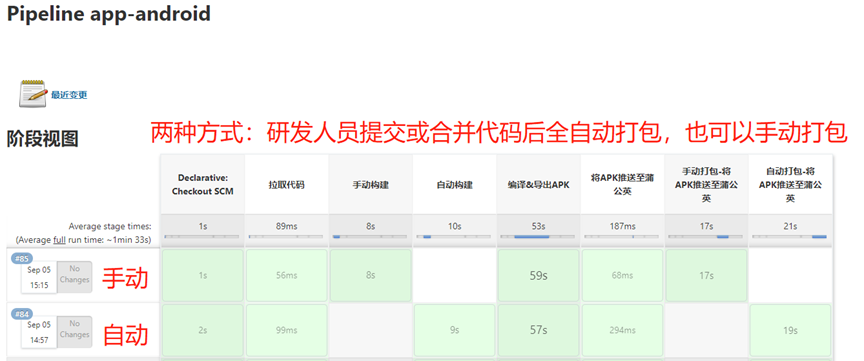
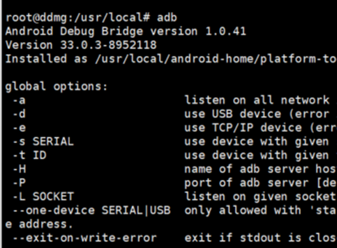
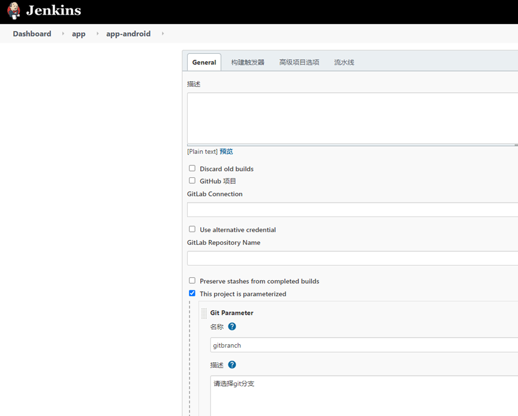
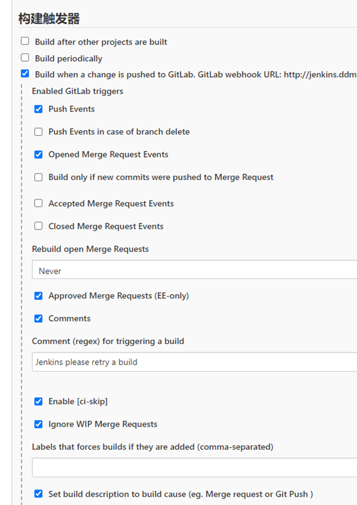
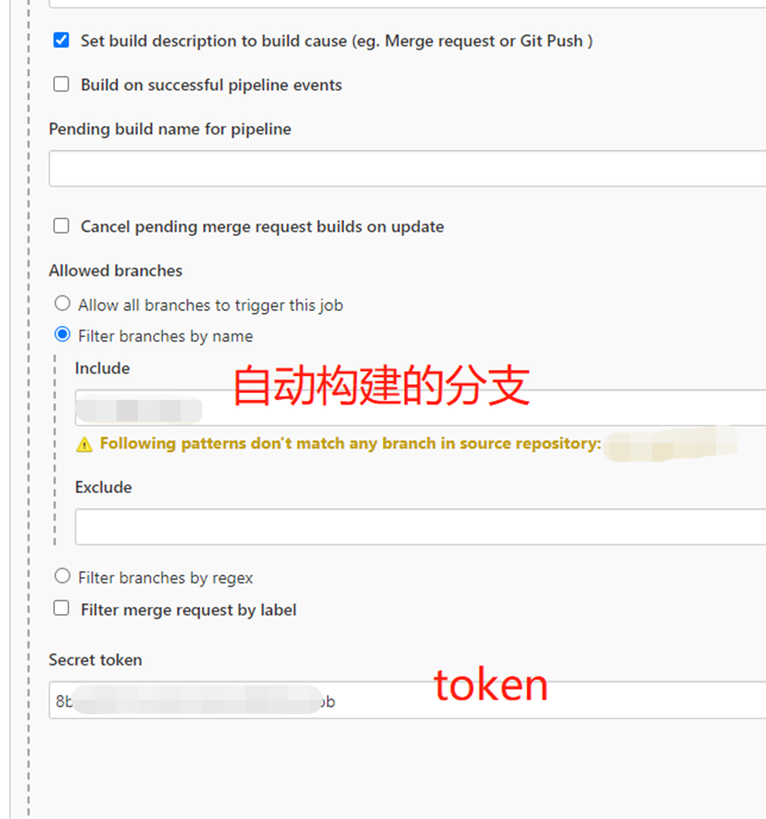
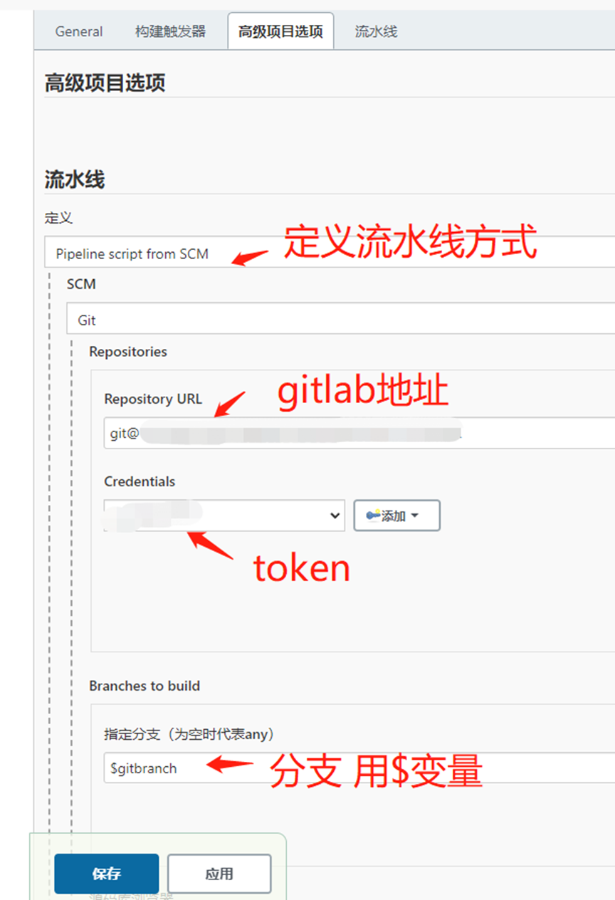
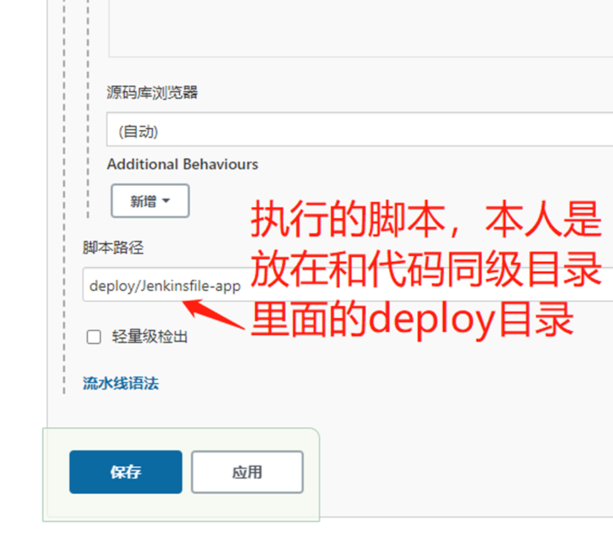
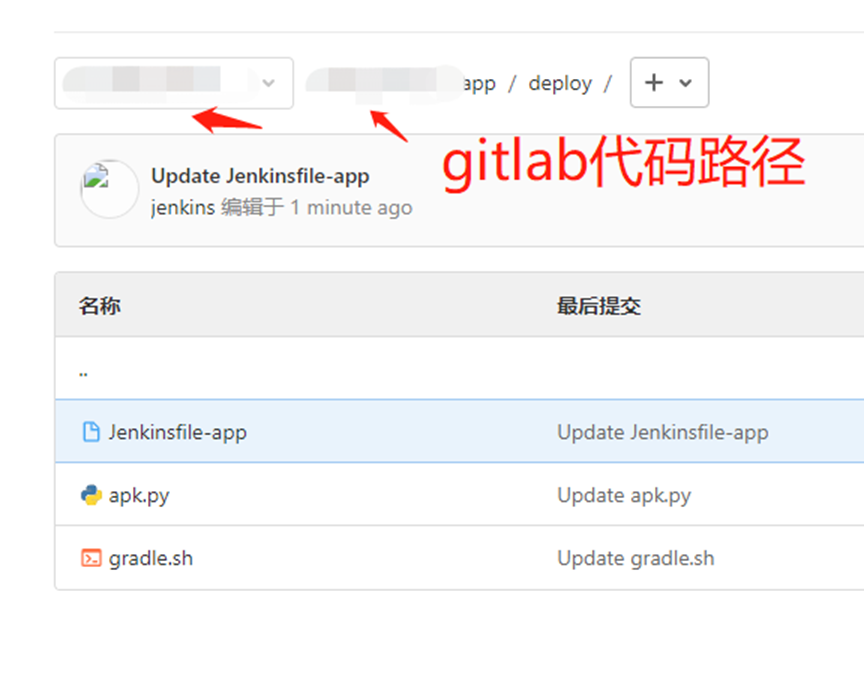

# Jenkins+Gitlab自动化打包安卓app

###   温馨提示：环境搭建：Jenkins、gitlab、两者之间打通；钉钉机器人创建都已省略不知道的问度娘文章很多（整个打包过程全自动，开发人员只需要提交代码就可以自动构建）。
[附件: 5.8 Jenkins+Gitlab 自动化打包安卓-APK.docx](./attachments/9UZ_as0EOQHUggwt/5.8 Jenkins+Gitlab 自动化打包安卓-APK.docx)




### 第一步：安装环境
**1****、****Linux**[下安装安装android sdk & gradle](https://www.cnblogs.com/kaerxifa/p/11200017.html)

首先在centOS环境通常我们将文件安装在/usr/local目录下 

新建android-home文件夹，用来存放安装文件

```shell
mkdir android-home
```

切换到该目录下

```shell
cd android-home/
```

下载android sdk

```shell
wget https://dl.google.com/android/repository/sdk-tools-linux-4333796.zip
```

解压：

```shell
unzip sdk-tools-linux-4333796.zip
```

在当前目录下新建文件夹 android-tools，并将解压得到的tools文件夹放到android-tools

```shell
mv tools/ android-tools
```

step2:

将android-home添加到环境变量

这里platform-tools这个文件夹还没有生成，别担心，后面执行了sdkmanager 的命令后，就会在android-home目录下生成了

```shell
echo "export ANDROID_HOME=/usr/local/android-home" >> /etc/profile
echo "export PATH=\$PATH:\$ANDROID_HOME/android-tools:\$ANDROID_HOME/android-tools/bin:\$ANDROID_HOME/platform-tools" >> /etc/profile

```

使配置生效

```shell
source /etc/profile
```

step3:

在android-home目录下新建android-sdk文件夹

```shell
[root@67 android-home]# mkdir android-sdk
```

切换到该目录下

```shell
cd android-sdk
```


安装这些命令：

```shell
sdkmanager "build-tools;19.1.0"
sdkmanager "build-tools;20.0.0"
sdkmanager "build-tools;21.1.2"
sdkmanager "build-tools;22.0.1"
sdkmanager "build-tools;23.0.1"
sdkmanager "build-tools;23.0.3"
sdkmanager "build-tools;24.0.0"
sdkmanager "build-tools;24.0.1"
sdkmanager "build-tools;24.0.2"
sdkmanager "build-tools;24.0.3"
sdkmanager "build-tools;25.0.0"
sdkmanager "build-tools;25.0.1"
sdkmanager "build-tools;25.0.2"
sdkmanager "build-tools;25.0.3"
sdkmanager "build-tools;26.0.0"
sdkmanager "build-tools;26.0.1"
sdkmanager "build-tools;26.0.2"
sdkmanager "build-tools;26.0.3"

sdkmanager "build-tools;27.0.0"
sdkmanager "build-tools;27.0.1"
sdkmanager "build-tools;27.0.2"
sdkmanager "build-tools;27.0.3"

sdkmanager "build-tools;28.0.0"
sdkmanager "build-tools;28.0.1"
sdkmanager "build-tools;28.0.2"
sdkmanager "build-tools;28.0.3"

sdkmanager "platform-tools"
sdkmanager "platforms;android-10"
sdkmanager "platforms;android-11"
sdkmanager "platforms;android-12"
sdkmanager "platforms;android-13"
sdkmanager "platforms;android-14"
sdkmanager "platforms;android-15"
sdkmanager "platforms;android-16"
sdkmanager "platforms;android-17"
sdkmanager "platforms;android-18"
sdkmanager "platforms;android-19"

sdkmanager "platforms;android-20"
sdkmanager "platforms;android-21"
sdkmanager "platforms;android-22"
sdkmanager "platforms;android-23"
sdkmanager "platforms;android-24"
sdkmanager "platforms;android-25"
sdkmanager "platforms;android-26"
sdkmanager "platforms;android-27"
sdkmanager "platforms;android-28"
```


可以先执行1行命令看一下是不是能正常运行

我执行了1个命令，出现了一个警告：Warning: File /root/.android/repositories.cfg could not be loaded. 


说是是在目录 /root/.android/ 下没有找到文件repositories.cfg

解决办法：

使用touch命令在根目录下新建一个repositories.cfg文件就可以了

```shell
touch ~/.android/repositories.cfg
```

然后执行sdkmanager xxxx就没问题了。


执行完的效果：

在android-home目录下多了4个文件夹


step4:

输入命令adb，出现如下信息，表示android sdk环境安装好了



接下来安装gradle环境

step1:

首先cd到android-home的同级目录

```shell
cd /usr/local
```


下载gradle，这里要注意下载与你项目编译使用的gradle版本保持一致，否则不能正常编译

```shell
wget https://services.gradle.org/distributions/gradle-7.5-bin.zip
```

解压到当前目录

```shell
unzip gradle-7.5-bin.zip
```

step2:

将gradle添加到环境变量：

```shell
echo "export GRADLE_HOME=/usr/local/android-home/gradle-7.5" >> /etc/profile
echo "export PATH=\$PATH:\$GRADLE_HOME/bin" >> /etc/profile
```

使配置生效

```shell
source /etc/profile
```

step3: 

使用gradle -version命令查看gradle版本 验证gradle安装成功，

看到如下信息，就说明gradle环境搭建完毕了


环境变量：

```shell
export ANDROID_HOME=/usr/local/android-home
export PATH=$PATH:$ANDROID_HOME/android-tools:$ANDROID_HOME/android-tools/bin:$ANDROID_HOME/platform-tools

export GRADLE_HOME=/usr/local/android-home/gradle-7.5
export PATH=$PATH:$GRADLE_HOME/bin
```


### 第二步、配置Jenkins Pipeline


触发器





流水线







### 第三步、pipeline脚本编写：deploy/Jenkinsfile-app
```shell
#!groovy

pipeline {
//代理
agent any
//环境变量
environment {
REPOSITORY="git@xxxxxxxxxxxxxxxxxxxxxxxxxx.git"                                   //git地址
PROJECT_NAME = "app-android"                                                      //服务名
BRANCH_DEV= "xxxxxxxxx"                                                           //开发分支名
BRANCH_TEST = "xxxxx"                                                             //测试分支
BRANCH_PRE = "xxxxxxx"                                                           //演示分支
BRANCH_PROD = "xxxxxx"                                                           //生产分支
JENKINSURL = "http://xxxxxxxx/jenkins/job/"                                     //jenkins任务回调地址
BRANCH_NAME = "${params.gitbranch}"                                              //判断变量
SCRIPT_PATH="${WORKSPACE}/deploy/"                                              //依赖包存放地址
}
//参数化构建
parameters {
gitParameter    branch: '', 
branchFilter: 'origin/(.*)', 
defaultValue: 'CICDxxxx', 
description: '请选择git分支', 
         name: 'gitbranch', 
quickFilterEnabled: false, 
selectedValue: 'NONE', 
sortMode: 'DESCENDING_SMART', 
tagFilter: '*', 
type: 'PT_BRANCH', 
useRepository: 'git@xxxxxxxxxxxxxxxxxxxxx.git'
}

stages {
stage('拉取代码') {
parallel {
//手动构建
stage('手动构建') {
when {
not{
environment name: 'BRANCH_NAME', value: 'CICDxxxx'
} 
}

environment {
BRANCH_NAME = "${params.gitbranch}"                                                 //项目的命名空间
}
steps {
echo "从代码仓库${REPOSITORY}拉取代码，分支是：${BRANCH_NAME}" 
deleteDir()
         checkout([$class: 'GitSCM', 
branches: [[name: "${BRANCH_NAME}"]], 
extensions: [], 
userRemoteConfigs: [[credentialsId: '1b9ca2d6-xxxxxxxxxxxxxxxxx', url: "${REPOSITORY}"]]
               ])
}
}
//自动构建
stage('自动构建') {
when {

environment name: 'BRANCH_NAME', value: 'CICDxxxx'

}
environment {
BRANCH_NAME = "${gitlabBranch}"                                                 //项目的命名空间
}
steps {
echo "从代码仓库${REPOSITORY}拉取代码，分支是：${BRANCH_NAME}" 
deleteDir()
checkout([$class: 'GitSCM', 
branches: [[name: "${BRANCH_NAME}"]], 
                      extensions: [], 
userRemoteConfigs: [[credentialsId: '1b9ca2d6-xxxxxxxxxxxxxx', url: "${REPOSITORY}"]]
])
}
}
}
}

stage('编译&导出APK') {
steps {
sh '''
sh ${WORKSPACE}/deploy/gradle.sh
'''
echo "编译&导出APK成功"
}
}

stage('将APK推送至蒲公英') {
parallel {
//手动
stage('手动打包-将APK推送至蒲公英') {
when {
not{
environment name: 'BRANCH_NAME', value: 'CICDxxxxxx'
}
}

environment {
BRANCH_NAME = "${params.gitbranch}"                                                 //项目的命名空间
}        
steps{
script {
              sh '''
python3 ${WORKSPACE}/deploy/apk.py
'''
echo "APK推送至蒲公英成功"
}
}
post {
      success {
dingtalk (
robot:'4485c798-xxxxxxxxxxxxxxxxxxxxxxxxx',
type:'MARKDOWN',
title: '本次构建成功，详情请点此次！！！',
text: ["- ${PROJECT_NAME}项目构建成功！！！\n- 构建分支为: ${BRANCH_NAME}\n- 持续时间:${currentBuild.durationString}\n- 任务:${BUILD_ID}\n- 下载APP：请扫码！！！\n- \n "],
messageUrl:'${JENKINSURL}${JOB_NAME}/${BUILD_NUMBER}/console',
picUrl:'http://kmzsccfile.kmzscc.com/upload/2020/success.jpg'
) 
               }
failure {
dingtalk (
robot:'4485c798-84e7-4e4e-b5a7-bc2879b303a1',
type:'LINK',
title: '本次构建失败，详情请点此次！！！',
text: ["- ${PROJECT_NAME}项目构建失败!!!\n- 构建分支为:${BRANCH_NAME}\n- 持续时间:${currentBuild.durationString}\n- 任务:${BUILD_ID}"],
messageUrl:'${JENKINSURL}${JOB_NAME}/${BUILD_NUMBER}/console',
picUrl:'http://kmzsccfile.kmzscc.com/upload/2020/error.jpg',
) 
}
}
}

//自动部署应用
stage('自动打包-将APK推送至蒲公英') {
when {

environment name: 'BRANCH_NAME', value: 'CICD8899'

}
environment {
BRANCH_NAME = "${gitlabBranch}"                                                 //项目的命名空间
}
steps{
script {
sh '''
           python3 ${WORKSPACE}/deploy/apk.py
'''
echo "APK推送至蒲公英成功"
}
}
post {
success {
dingtalk (
robot:'4485c798-xxxxxxxxxxxxxxxxxxxxxxxxx',
//type:'LINK',
type:'MARKDOWN',
                     title: '本次构建成功，详情请点此次！！！',
text: ["- ${PROJECT_NAME}项目构建成功！！！\n- 构建分支为: ${BRANCH_NAME}\n- 持续时间:${currentBuild.durationString}\n- 任务:${BUILD_ID}\n- 下载APP：请扫码！！！\n- \n "],
messageUrl:'${JENKINSURL}${JOB_NAME}/${BUILD_NUMBER}/console',
picUrl:'http://kmzsccfile.kmzscc.com/upload/2020/success.jpg'
) 
  }
failure {
dingtalk (
robot:'4485c798-xxxxxxxxxxxxxxxxxxxx',
type:'LINK',
title: '本次构建失败，详情请点此次！！！',
text: ["- ${PROJECT_NAME}项目构建失败!!!\n- 构建分支为:${gitlabBranch}\n- 持续时间:${currentBuild.durationString}\n- 任务:${BUILD_ID}"],
messageUrl:'${JENKINSURL}${JOB_NAME}/${BUILD_NUMBER}/console',
picUrl:'http://kmzsccfile.kmzscc.com/upload/2020/error.jpg',
) 
}
}
}
}
      }
}
}

第四步、编译&导出APK包
# !/bin/sh
## 项目名
##使配置文件生效，否则会报gradle:命令找不到

export GRADLE_HOME=/usr/local/android-home/gradle-7.5
export PATH=$PATH:$GRADLE_HOME/bin

export ANDROID_HOME=/usr/local/android-home
export PATH=$PATH:$ANDROID_HOME/android-tools:$ANDROID_HOME/android-tools/bin:$ANDROID_HOME/platform-tools

##android目录（model级）
GRADLEWORKPATH=${WORKSPACE}/android

#resources文件的存放路径
RESOURCES=${WORKSPACE}/unpackage/resources
#unpackage文件的存放路径
UPDATEPACKAGE=${WORKSPACE}/android/xxxxxxxxxxx/apps

#更新包
cp -a ${RESOURCES}/* ${UPDATEPACKAGE}/
echo -e "============app下面的包已更新============"


##切换到gradle工作目录
cd ${GRADLEWORKPATH}/


## 清理缓存
gradle clean

echo -e "============清理APK缓存==========="

## 导出APK包
gradle assembleRelease

echo -e "============导出 APK SUCCESS============"

第五步、将APK推送至蒲公英
import requests
import os

#账号配置信息
url = "https://upload.pgyer.com/apiv1/app/upload"
uKey = "xxxxxxxxxxxxxxxx"
api_key="xxxxxxxxxxxxxxx"


apkPath ="xxxxxxxxxxxxxxxxx.apk"
apkfile = {"file":open(apkPath,"rb")}
headers = {"enctype":"multipart/form-data"}
payload= {
"uKey":uKey,
"_api_key":api_key,
"installType":1,
"updateDescription":"android自动化打包"
}


r = requests.post(url,data= payload,headers=headers,files = apkfile)
jsonResult = r.json()
print(jsonResult)


#保存二维码至本地
appQRCodeURL = jsonResult["data"]["appQRCodeURL"]
print("appQRCodeURL: %s "%appQRCodeURL)
response = requests.get(appQRCodeURL)
imgp = "xxxxxxxxxxxxxxxxxxxx"
qr_image_file_path = os.path.join(imgp,"QRCode.png")
print(qr_image_file_path)


with open(qr_image_file_path,"wb") as f:
f.write(response.content)
```

### 第四步、发送钉钉消息到群里


> 更新: 2022-09-07 16:51:04  
> 原文: <https://www.yuque.com/lixinsi/osis9f/kskvh6>