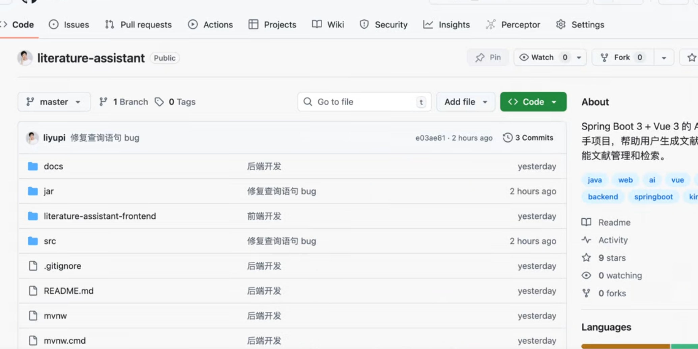

# AI智能文档生成系统

[https://github.com/liyupi/literature-assistant](https://github.com/liyupi/literature-assistant)




### Claude code 切换模型 
```plain
# Linux/mac0S 启动高速版 kimi-k2-turbo-preview 模型
export ANTHROPIC_BASE_URL=https://api.moonshot.cn/anthropic
export ANTHROPIC_AUTH_TOKEN=<你的 API 密钥>
export ANTHROPIC_MODEL=kimi-k2-turbo-preview
export ANTHROPIC_SMALL_FAST_MODEL=kimi-k2-turbo-preview

# Windows Powershell 启动高速版 kimi-k2-turbo-preview 模型
$env:ANTHROPIC_BASE_URL="https://api.moonshot.cn/anthropic"
$env:ANTHROPIC_AUTH_TOKEN=<你的 API 密钥>
$enV:ANTHROPIC_MODEL='kimi-k2-turbo-preview'
$enV:ANTHROPIC_SMALL_FAST_MODEL="kimi-k2-turbo-preview'
```


### 后端
```plain
你是一位资深的Java后端开发专家，精通SpringBoot框架和企业级应用开发。请帮我构建一个完整的文献助手后端系统，使用SpringBoot3.5作为核心框架。系统需要支持PDF、Word、Markdown等多种格式的文献上传和解析功能。集成KimiAI接口实现智能文献分析和阅读指南生成，通过SSE技术提供实时响应。建立完整的数据库设计，包含文献信息存储、分类标签管理和用户操作记录。确保代码结构清晰、异常处理完善，并提供完整的API接口文档。
```

#### 后端模块
```plain
后端开发
项目初始化
你是一位顶尖的java开发者，请根据spingboot3.5框架帮我生成完整的项目基础开发模板，包括Hutool工具类，Knife4j
接口文档，自定义异常，响应包类，全局异常处理，请求包装类，全局跨域配置等。配置文件使用utf-8编码以及yml格式，并
基础Lombok。

文献阅读指南生成
帮我实现AI生成文献阅读指南功能。用户上传pdf、markdown、word格式的文献，后端解析其内容并作为用户提示词传给A，AI通过SSE响应，后端通过SSE将响应返回。注意apikey需要从前端传入，我使用的是KimiAl，使用Okhttp对接，在resources目录下预留系统提示词的位置。

文献归类和描述
我希望能够归类整理已导入的文献，便于用户检索和查看已经添加过的文献。请引入MyBatis-plus和MySQL依赖，写下本项目的DDL，只需要-个文献表，必须要文献路径、文件大小、标签、描述、创建时间、修改时间、逻辑删除字段。在生成文献阅读指南完成后，使用虚拟线程再次调用A1，根据阅读指南进行分类和描述，响应格式必须是纯净json格式。

查询接口
请增加一个分页查询接口，目的是便于用户检索和查看已经添加过的文献，查询条件包括分类描述、指南等。

下载功能
仿照当前的代码风格，添加一个下载功能，能够根据文献id下载对应的文件。尽量使用Hutool的工具类简化代码。

批量导入
添加一个新的接口，功能是批量导入，关键点:功能与导入完全一致，使用CompleteFuture +虚拟线程池并发处理，每当一个文件处理完成之后，就通过SSE返回该文件处理完成的信息，批量上传一次最多16个。
```

### 前端
```plain
你是一位精通Vue.js的前端开发专家，擅长构建现代化的用户界面和交互体验。请为我开发一个专业的文献助手前端应用，使用Vue 3+Vite + ElementPlus技术栈。界面需要支持文献文件的拖拽上传、实时进度显示和批量处理功能。实现当后端API的完整对接，包括SSE实时数据流处理和响应式数据展示。设计简洁专业的学术风格界面，包含文献列表详情查看、搜索筛选和分页功能确保良好的用户体验，包括加载状态、错误处理和移动端适配。
```

#### 前端模块
```plain
项目初始化
你是一位精通Vue.js的前端开发专家。你的任务是为我们已经开发完成的"文献助手"后端应用，构建一个功能完整、用户体验优秀的前端界面创建一个单页应用，用户可以在此上传学术文献、实时查看AI生成的阅读指南、并对已导入的文献库进行浏览、检索和管理。技术栈必须使用Vue 3、Vite、Element Plus、Axios、Pinia、EventSource和marked。设计风格要现代、简洁、专业、学术化。

请将应用拆分为以下核心的视图和组件:
1)主列表视图，这是应用的首页和核心功能区包含顶部标题、导入文献按钮、筛选区域、文献表格和分页组件。
核心组件设计
2)作为导入文献模态框，包含文件上传表单、APIKey输入、生成指南按钮和实时内容展示区域。
3)文献详情视图，展示单个文献的完整信息，包括元数据、标签、描述和阅读指南的Markdown渲染。

下载功能
批量导入
状态管理
根据后端的下载功能接口，在操作列查看详情按钮的左侧以及详情页添加下载按钮。
我正在做一个文献批量导入功能，要求前端能够实时看到多篇文献的进度，参考当前项目的已有功能帮我实现。后端接口是POST/api/literature/batch-import，通过SSE流式响应实时返回处理进度。注意不需要每个文件单独的进度条，有一个总的进度条即可。
请创建一个文件来管理全局状态。包括存储当前页的文献列表、文献总数、控制表格等组件的加载状态、存储API请求的错误信息、保存当前的筛选和分页条件。
```

### 联调
```plain
你是一位经验丰富的全栈开发工程师，擅长前后端联调和系统集成优化。请帮我完成文献助手系统的前后端对接工作，确保所有功能模块正常运行。重点检查API接口的数据格式匹配、错误状态处理和异常情况的用户提示。优化文件上传的并发处理逻辑，确保大文件和批量操作的稳定性。完善用户交互体验包括加载动画、操作反馈和响应式布局适配。进行全面的功能测试和性能调优，确保系统在生产环境中的稳定运行。
```


```plain
把遇到的bug告诉AI，主要是修复前后端对接的过程，优化用户体验和性能，·完善错误处理以及边界情况。
```


> 更新: 2025-09-15 08:55:18  
> 原文: <https://www.yuque.com/lixinsi/xdiarx/surzobzt90f764av>