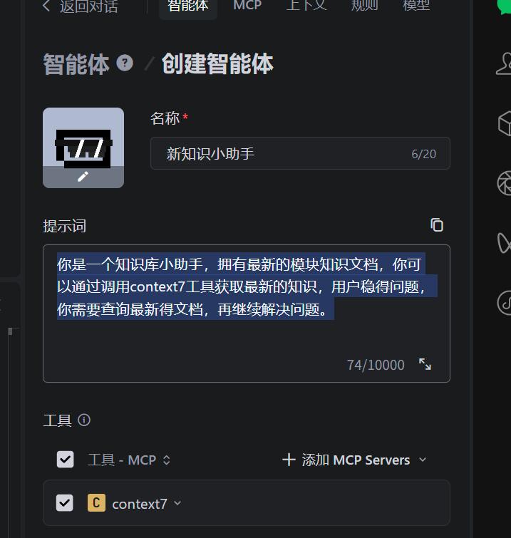
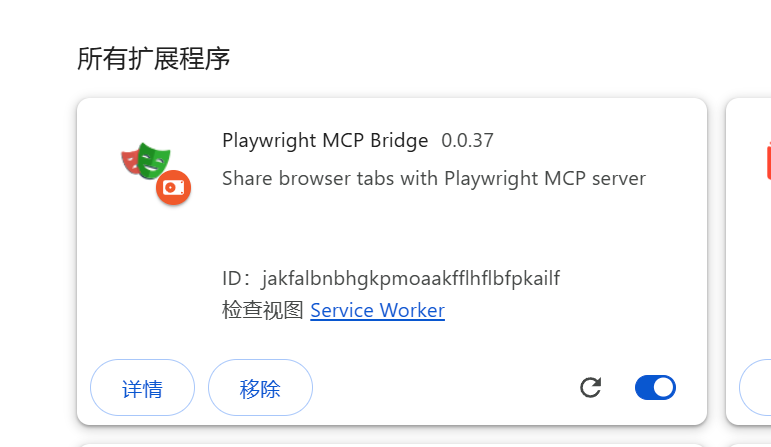
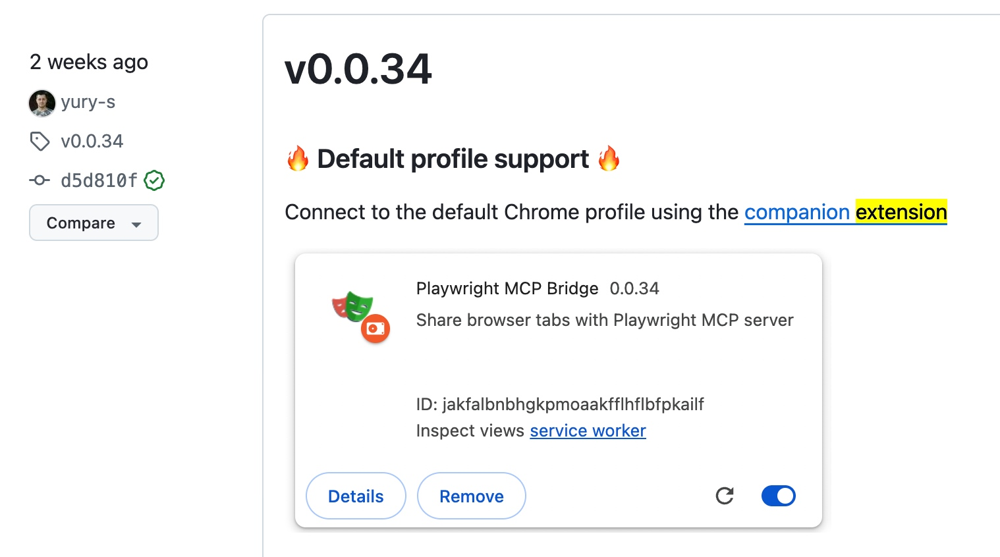
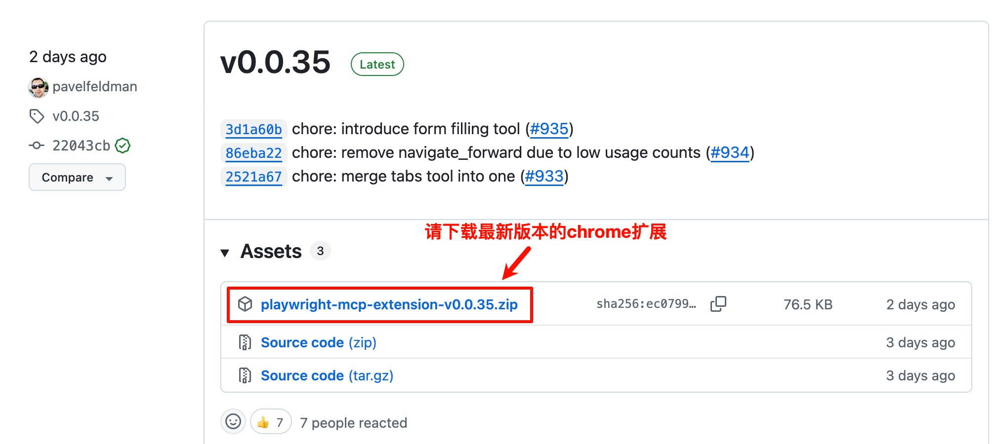
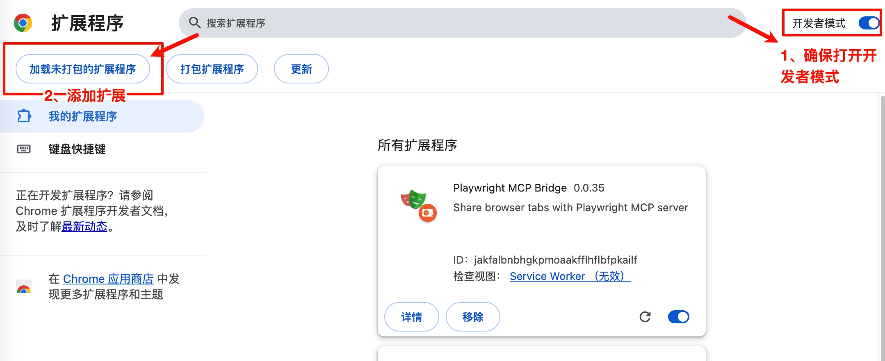
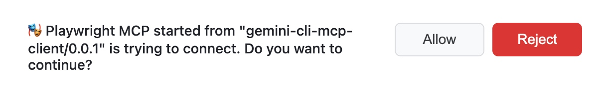
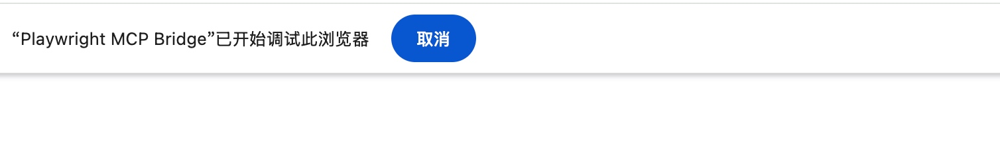

# Trae通过context7获取最新得文档以及Playwright MCP

```plain
你是一个知识库小助手，拥有最新的模块知识文档，你可以通过调用context7工具获取最新的知识，用户稳得问题，你需要查询最新得文档，再继续解决问题。你是一个知识库小助手，拥有最新的模块知识文档，你可以通过调用context7工具获取最新的知识，用户稳得问题，你需要查询最新得文档，再继续解决问题。
```



### Playwright MCP

首先需要再<https://github.com/microsoft/playwright-mcp/releases>下载浏览器扩展



<font style="color:rgb(0, 0, 0);">Playwright是Microsoft开源的一款自动化测试工具，用于控制浏览器进行自动化操作。它的主要特点是支持多种主流浏览器（Chromium、Firefox和WebKit），提供统一的API来操作这些浏览器。</font>

[<font style="color:rgb(29, 88, 209);">https://playwright.dev/</font>](https://playwright.dev/)<font style="color:rgb(0, 0, 0);">\ </font>[<font style="color:rgb(29, 88, 209);">https://github.com/microsoft/playwright</font>](https://github.com/microsoft/playwright)

<font style="color:rgb(0, 0, 0);">Playwright官方为了LLM及智能体使用，打造了Playwright MCP，让 AI 可以像人一样“真正”操作网页。</font>

[<font style="color:rgb(29, 88, 209);">https://github.com/microsoft/playwright-mcp</font>](https://github.com/microsoft/playwright-mcp)

<font style="color:rgb(0, 0, 0);">Playwright MCP 支持复用 Chrome 登录态（即复用现有浏览器的 cookies、用户会话等），是通过“Playwright MCP Chrome Extension”实现的，这为自动化测试和数据采集带来了新的可能。</font>



# <font style="color:rgb(0, 0, 0);">如何配置使用？</font>

[<font style="color:rgb(29, 88, 209);">https://github.com/microsoft/playwright-mcp/tree/main/extension</font>](https://github.com/microsoft/playwright-mcp/tree/main/extension)

## <font style="color:rgb(0, 0, 0);">1、下载扩展</font>

<font style="color:rgb(0, 0, 0);">下载最新版本Chrome扩展\ </font>[<font style="color:rgb(29, 88, 209);">https://github.com/microsoft/playwright-mcp/releases</font>](https://github.com/microsoft/playwright-mcp/releases)



<font style="color:rgb(0, 0, 0);">下载后，需要解压缩这个压缩包到一个目录。</font>

## <font style="color:rgb(0, 0, 0);">2、安装到 Chrome</font>

1. <font style="color:rgb(0, 0, 0);">打开 Chrome，访问</font><font style="color:rgb(0, 0, 0);"> </font><code><font style="color:rgb(192, 52, 29);background-color:rgb(251, 229, 225);">chrome://extensions/</font></code>
2. <font style="color:rgb(0, 0, 0);">开启"开发者模式"</font>
3. <font style="color:rgb(0, 0, 0);">点击"加载未打包的扩展程序"，选择下载并解压缩后的扩展文件夹</font>



<font style="color:rgb(0, 0, 0);">右下的扩展程序是已经安装好的</font>

## <font style="color:rgb(0, 0, 0);">3、配置 MCP 服务器</font>

<font style="color:rgb(0, 0, 0);">我这里用的Gemini-CLI来配置，相关的配置方法请看：\ </font>[<font style="color:rgb(29, 88, 209);">让 Gemini-CLI 使用MCP服务</font>](https://mp.weixin.qq.com/s/-MraN1sibVPdD04onS0lpg)

<font style="color:rgb(0, 0, 0);">配置时的关键是：\ </font><font style="color:rgb(0, 0, 0);">只要通过</font><font style="color:rgb(0, 0, 0);"> </font><code><font style="color:rgb(192, 52, 29);background-color:rgb(251, 229, 225);">--extension</font></code><font style="color:rgb(0, 0, 0);"> </font><font style="color:rgb(0, 0, 0);">参数启动 MCP server 并安装官方提供的浏览器扩展，即可让 MCP 直接连接到你已登录的 Chrome/Edge/Chromium 实例，实现会话复用。</font>

```json
{
  "mcpServers": {
    "playwright-extension": {
      "command": "npx",
      "args": [
        "@playwright/mcp@latest",
        "--extension"
      ]
    }
  }
}
```

<font style="color:rgb(0, 0, 0);">使用时，AI 会在你当前的 Chrome 浏览器里面打开页面，并且请求授权：</font>



<font style="color:rgb(0, 0, 0);">点击授权后，Playwright 就可以完全操控你的 Chrome 了，这时候的浏览器界面上面会有下面提示信息：</font>



# <font style="color:rgb(0, 0, 0);">使用体验</font>

<font style="color:rgb(0, 0, 0);">我在GeminiCLI中体验的命令如下：</font>

*<font style="color:rgb(85, 85, 85);">请用 Playwright访问微博，看看我特别关注的有啥新的内容，按照第一项原理整理下。</font>*

<font style="color:rgb(0, 0, 0);">我的微博特别关注中的信息如下图：\ </font>

<font style="color:rgb(0, 0, 0);">Gemini的执行过程关键点如下：</font>

* <font style="color:rgb(0, 0, 0);">好的，我将使用 Playwright 访问微博。由于我无法直接登录您的微博账号，我将先打开微博首页。您需要手动登录后，我才能继续操作。</font>
* <font style="color:rgb(0, 0, 0);">第一步，访问微博首页。\ </font><font style="color:rgb(0, 0, 0);">...</font>
* <font style="color:rgb(0, 0, 0);">我已经打开了微博首页。看起来您已经登录了账号“蝈蝈俊”。\ </font><font style="color:rgb(0, 0, 0);">接下来，我需要找到“特别关注”的动态。通常“特别关注”会作为“首页”信息流的一种。我现在点击“首页”来刷新信息流，然后寻找“特别关注”的选项。\ </font><font style="color:rgb(0, 0, 0);">...</font>
* <font style="color:rgb(0, 0, 0);">好的，我已经点击了“首页”，现在我找到了“特别关注”的链接。我将点击它来查看您特别关注的微博。\ </font><font style="color:rgb(0, 0, 0);">...</font>
* <font style="color:rgb(0, 0, 0);">好的，我已经打开了您特别关注的微博页面。</font>

<font style="color:rgb(0, 0, 0);">第一条新内容是 i陆三金 在3分钟前转发的微博，原博主是 零重力瓦力。</font>

<font style="color:rgb(0, 0, 0);">主要内容是关于 Google 最新发布的AI图片编辑工具 Nano Banana，它有一些有趣的功能：</font>

```
- <font style="color:rgb(0, 0, 0);">改变图像风格</font>
- <font style="color:rgb(0, 0, 0);">通过草图指定人物动作</font>
- <font style="color:rgb(0, 0, 0);">替换图中的物品</font>
- <font style="color:rgb(0, 0, 0);">改变图中场景的视点</font>
```

<font style="color:rgb(0, 0, 0);">并提供了试用地址：aistudio.google.com/apps/bundled/pixshop</font>

<font style="color:rgb(0, 0, 0);">可以看出，Playwright 访问了保持登录态的微博页面，另外AI+Playwright也能从文字理解成对应的网址和点击链接。</font>

# <font style="color:rgb(0, 0, 0);">分析</font>

<font style="color:rgb(0, 0, 0);">Playwright MCP 能够复用 Chrome 登录态，本质上，它通过两种核心方式实现：“状态持久化”和“连接已打开的浏览器实例”。</font>

[<font style="color:rgb(29, 88, 209);">https://bbs.huaweicloud.com/blogs/456932</font>](https://bbs.huaweicloud.com/blogs/456932)

* <font style="color:rgb(0, 0, 0);">状态持久化是通过保存和加载cookies、localStorage等实现，</font>
* <font style="color:rgb(0, 0, 0);">CDP连接则是通过Chrome DevTools Protocol连接已运行的浏览器实例。</font>

<font style="color:rgb(0, 0, 0);">这个能力带来的变化：</font>

*<font style="color:rgb(85, 85, 85);">这将大幅降低浏览器自动化的门槛，让"说人话"也能驱动自动化脚本，显著提升效率。</font>*

<font style="color:rgb(0, 0, 0);">Playwright MCP 复用登录态的能力降低了模拟登录和应对复杂验证的技术门槛。</font>

<font style="color:rgb(0, 0, 0);">但是，这绝不意味着可以无视规则随意采集：</font>

* **<font style="color:rgb(0, 0, 0);">技术门槛的降低不等于法律和道德门槛的降低</font>**<font style="color:rgb(0, 0, 0);">：网站的内容和数据可能受到著作权、隐私权、商业秘密等法律保护。未经授权采集、使用或传播这些信息，可能会带来严重的法律风险。</font>
* **<font style="color:rgb(0, 0, 0);">网站的反爬机制依然存在</font>**<font style="color:rgb(0, 0, 0);">：许多网站会监控异常流量和行为模式。即使通过复用登录态成功访问，过于频繁或不规范的请求仍然可能触发风控，导致 IP 被封、账号受限等问题。</font>
* **<font style="color:rgb(0, 0, 0);">伦理考量</font>**<font style="color:rgb(0, 0, 0);">：在采集任何数据前，都应思考其目的和影响，是否侵犯了用户隐私或破坏了网站的正常运营。</font>


> 更新: 2025-09-13 17:16:22  
> 原文: <https://www.yuque.com/lixinsi/xdiarx/axvw1ewl61eu5yes>