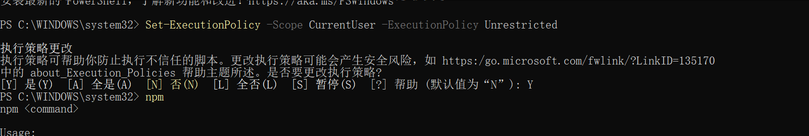
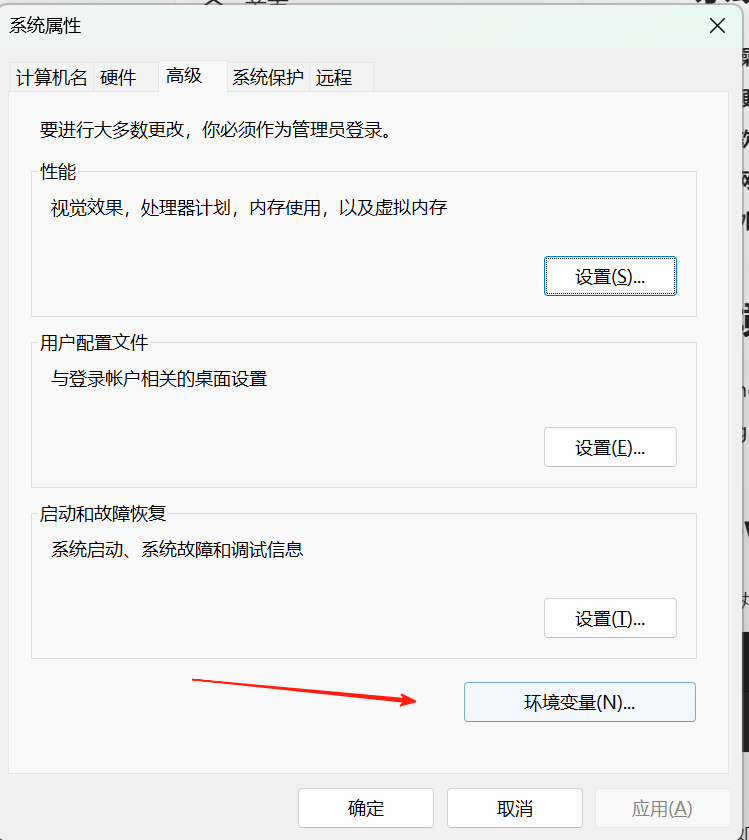
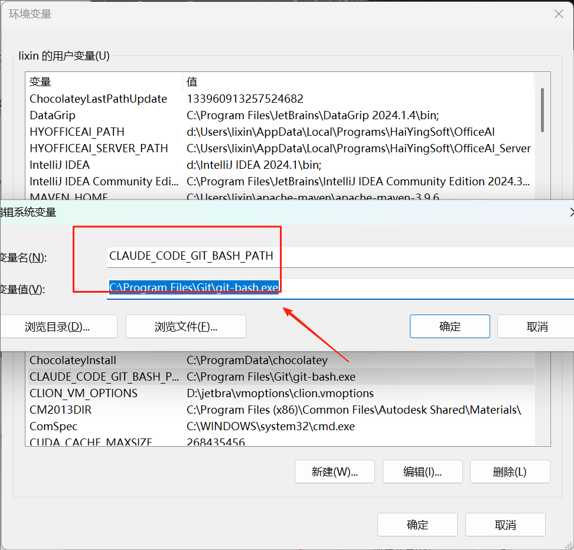

# Windows原生安装claudecode方法

## 系统要求
+ **操作系统** : macOS 10.15+、Ubuntu 20.04+/Debian 10+ 或 Windows 10+
+ **硬件** : 4GB+ RAM
+ **软件** : [Node.js 18+](https://nodejs.org/en/download)
+ **网络** : 身份验证和 AI 处理所需的互联网连接
+ **外壳** : 在 Bash、Zsh 或 Fish 中效果最好

## 环境安装
+ nodejs 安装[https://nodejs.org/en](https://nodejs.org/en)
+ git 安装[https://git-scm.com/](https://git-scm.com/)

## powershell 无法执行脚本报错解决
+ 执行下面 powershell 语句

```plain
Set-ExecutionPolicy -Scope CurrentUser -ExecutionPolicy Unrestricted
```


+ 如截图
+ 

## 安装完 git 后添加环境变量，新建环境变量



C:\Users\lixin\npm


## 在 powershell 里面运行安装命令
```plain
npm install -g @anthropic-ai/claude-code
```

```plain
npm uninstall -g @anthropic-ai/claude-code
```

```bash
npm update -g claude-code
```

## 启动 claude
+ 在安装目录里面启动 claude

```plain
C:\Users\lixin\npm
```

### 设置 Claude 环境变量
```plain
setx ANTHROPIC_AUTH_TOKEN "sk-phjbiqHwISH5JpDNZanUVB8n1wy1wsjiMlgJhKfr0I7uywAU"
setx ANTHROPIC_BASE_URL "https://pmpjfbhq.cn-nb1.rainapp.top"

setx ANTHROPIC_AUTH_TOKEN "sk-phjbiqHwISH5JpDNZanUVB8n1wy1wsjiMlgJhKfr0I7uywAU"
setx ANTHROPIC_BASE_URL "https://anyrouter.top"

export ANTHROPIC_AUTH_TOKEN "sk-phjbiqHwISH5JpDNZanUVB8n1wy1wsjiMlgJhKfr0I7uywAU"
export ANTHROPIC_BASE_URL "https://pmpjfbhq.cn-nb1.rainapp.top"
```


> 更新: 2026-04-09 21:20:03  
> 原文: <https://www.yuque.com/lixinsi/xdiarx/taxzn1gzzo97gsph>