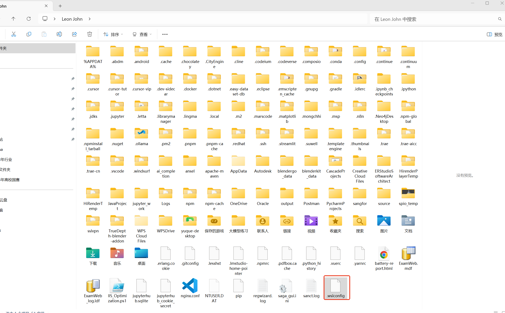

# Windows安装Claudecode

### 1.安装
```powershell
wsl --install -d Ubuntu-24.04
```

### 2.进行用户名设置以及密码设置
```powershell
用户名：lixinsi
密码：Aa@#4520
```

### 3.设置为 wsl2
```powershell

wsl --set-default-version 2
```

### 4.迁移到非系统盘
```powershell
wsl --shutdown wsl --list --verbose
```

### 5.导出到非系统盘
```plain
wsl --export Ubuntu-24.04 D:\wsl\ubuntu.tar
```

### 6.注销 c 盘 wsl 系统
```plain
wsl --unregister Ubuntu-24.04 
```

### 7.执行导入
```plain
wsl --import Ubuntu-24.04 D:\wsl\  D:\wsl\ubuntu.tar --version 2
```

### 8 查看导入情况
```plain
wsl --list --verbose
```

### 9.接下来进行子系统网络代理设置，新建.wslconfig
```plain
%userprofile%
```

```plain
[wsl2]
networkingMode = mirrored
autoProxy = true
```




> 更新: 2025-07-13 10:51:14  
> 原文: <https://www.yuque.com/lixinsi/xdiarx/ktgdgce05d9ig5m7>