# cfnew免费节点搭建

### 仓库地址
[https://github.com/byJoey/cfnew](https://github.com/byJoey/cfnew)


### 下载文件 pages.zip
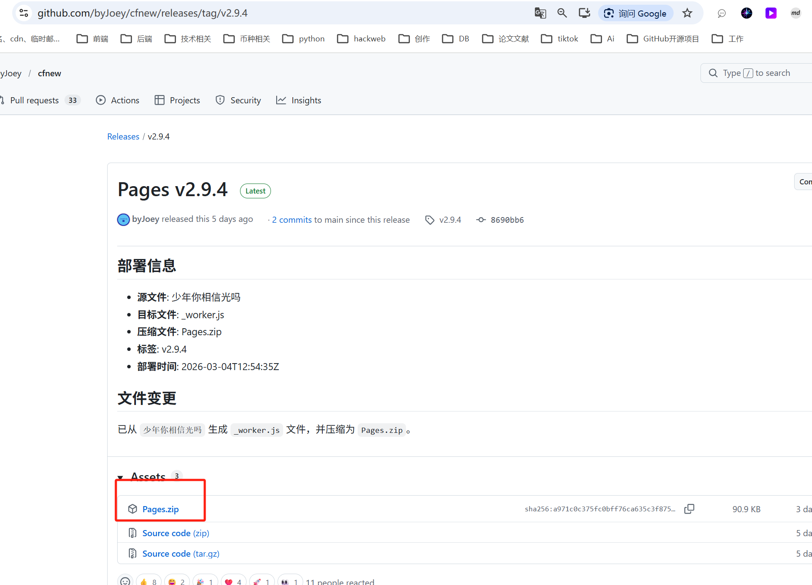

### 登入 cloudflare 部署
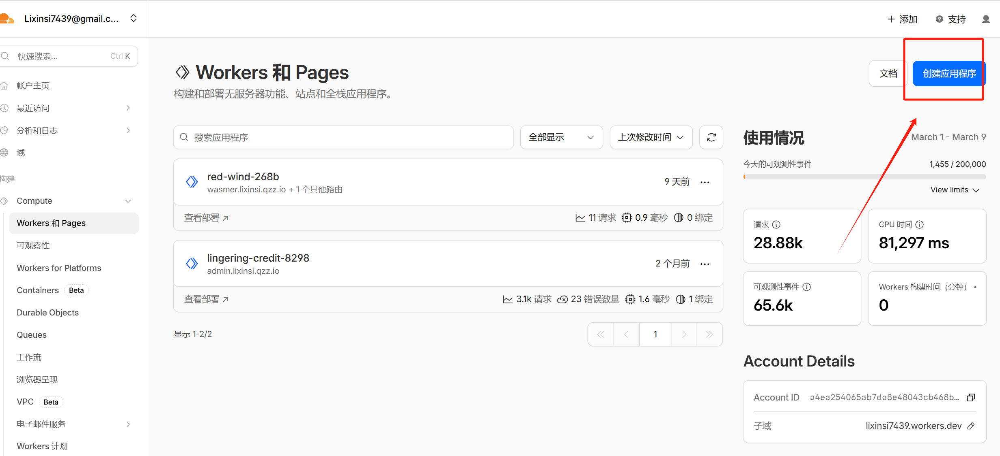

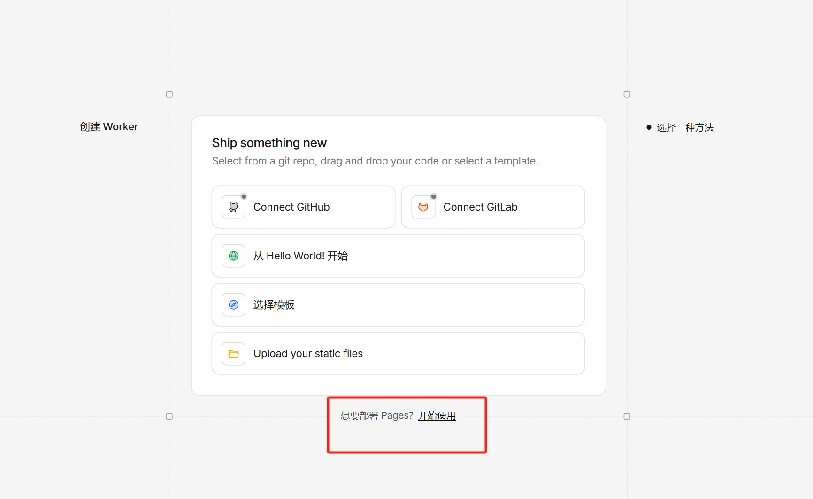

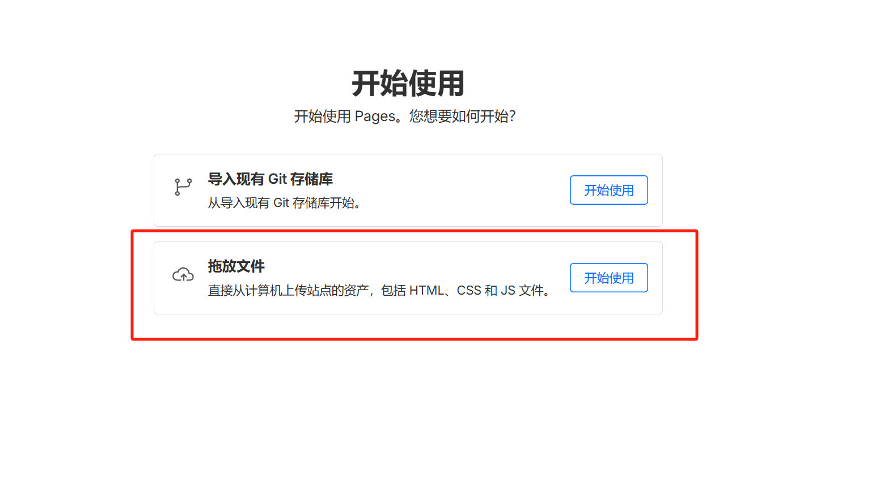

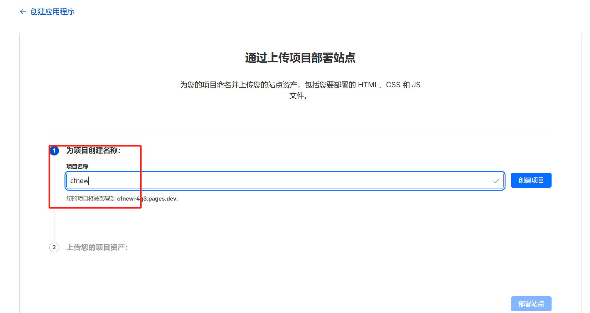

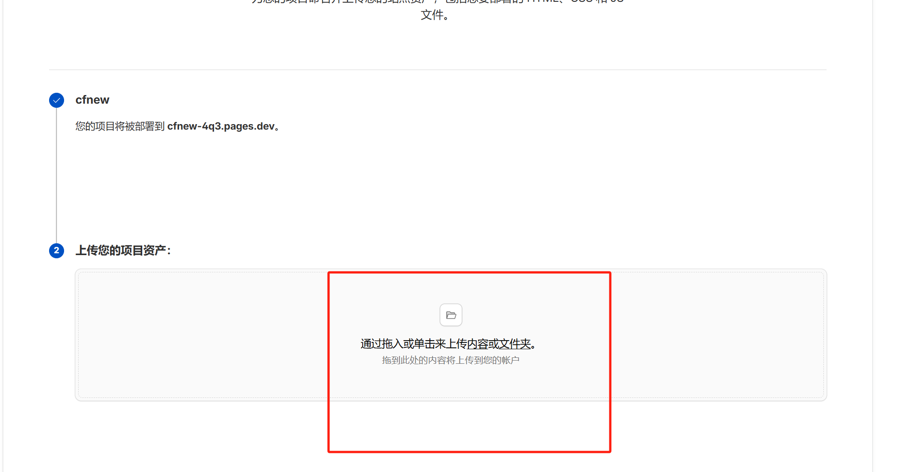

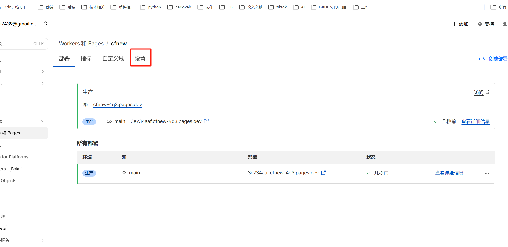

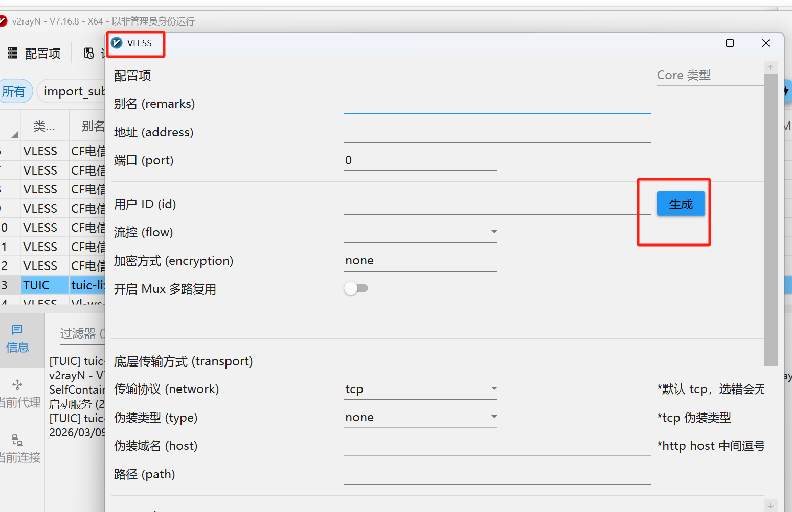

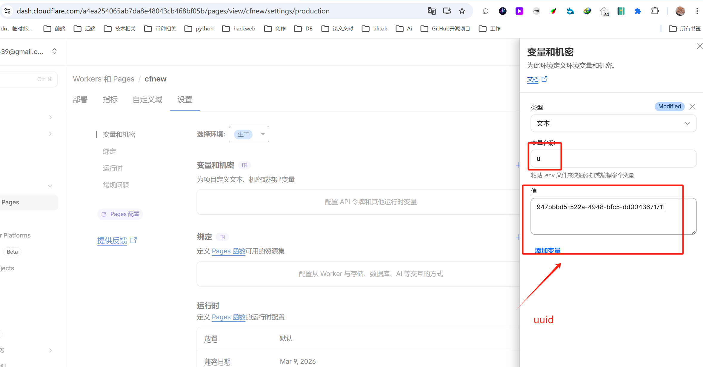


### 绑定存储空间
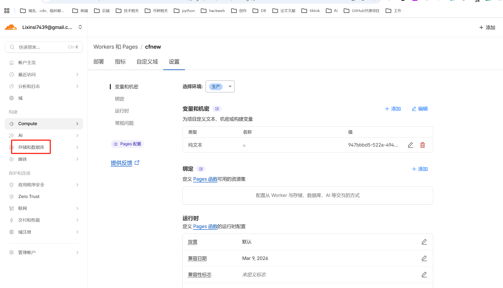

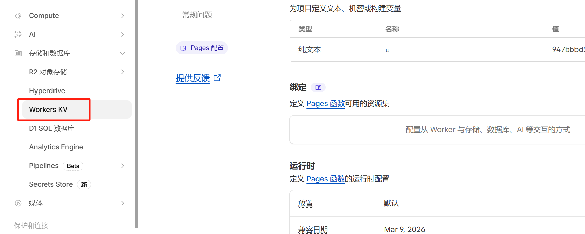

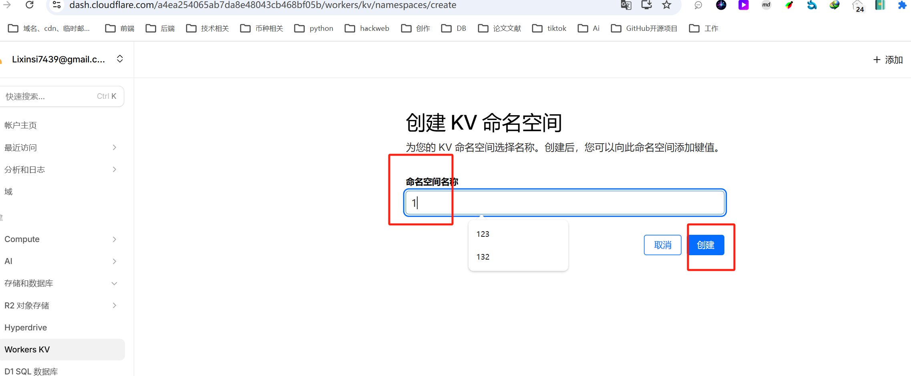

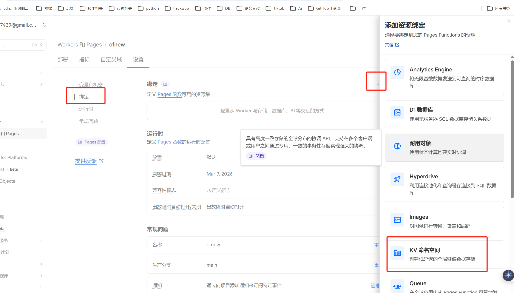

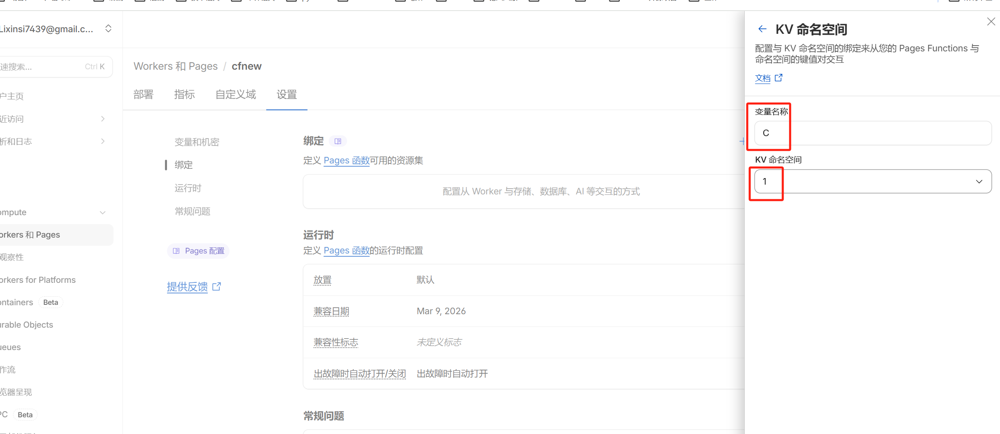

### {"error":"UUID错误 请注意变量名称是u不是uuid"}解决
#### 再次部署项目
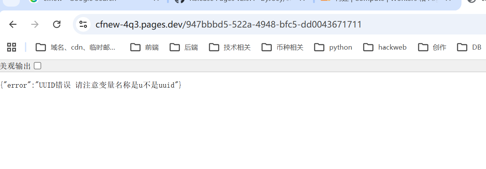

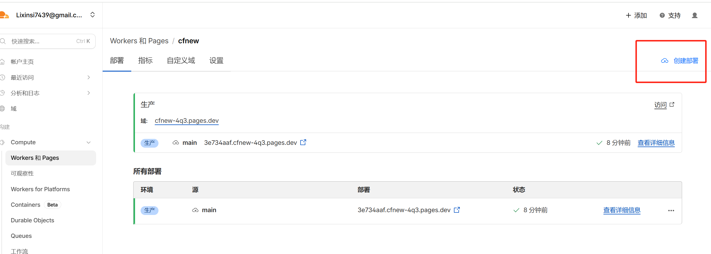

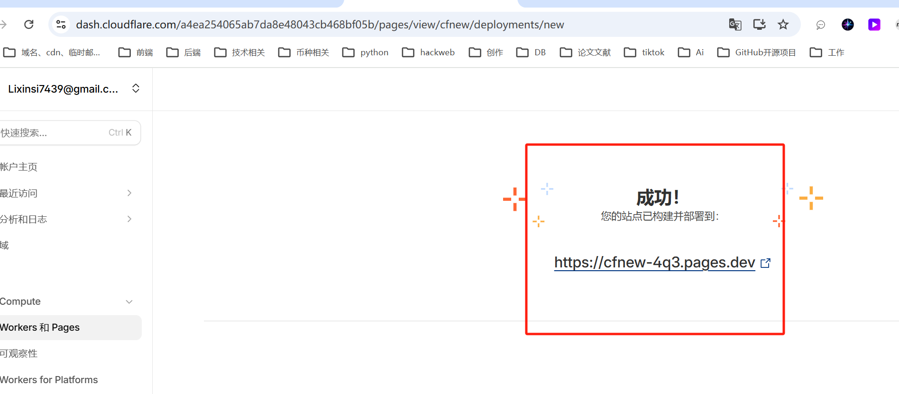

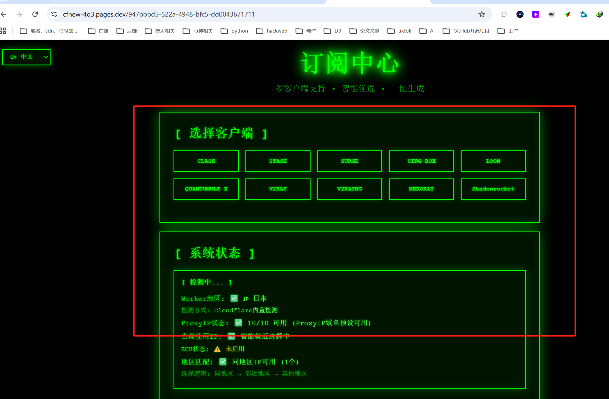

[https://cfnew-4q3.pages.dev/947bbbd5-522a-4948-bfc5-dd0043671711](https://cfnew-4q3.pages.dev/947bbbd5-522a-4948-bfc5-dd0043671711)

### 更改地区
```sql
# 指定 ProxyIP（不要同时写 wk）
/?ed=2048&p=1.1.1.1
/?ed=2048&p=proxy.example.com:443
/?ed=2048&p=[2001:db8::1]:443

# 指定地区（让 Worker 自动选该地区的 ProxyIP）
/?ed=2048&wk=jp
/?ed=2048&wk=sg&rm=no

# 指定 SOCKS5（可与 wk 搭配）
/?ed=2048&s=user:pass@socks5.host:1080&wk=us
```

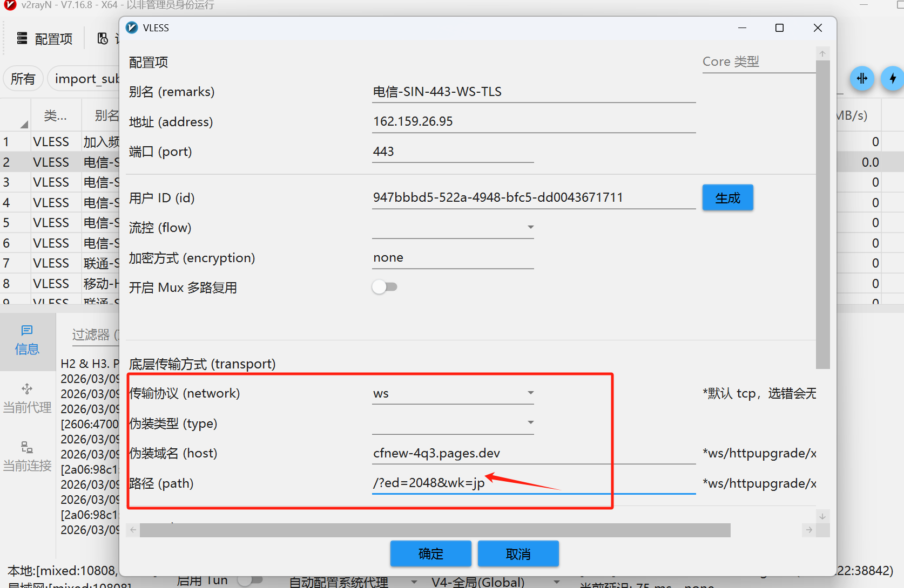


> 更新: 2026-03-09 13:49:31  
> 原文: <https://www.yuque.com/lixinsi/xdiarx/kq556gve2fadzg28>