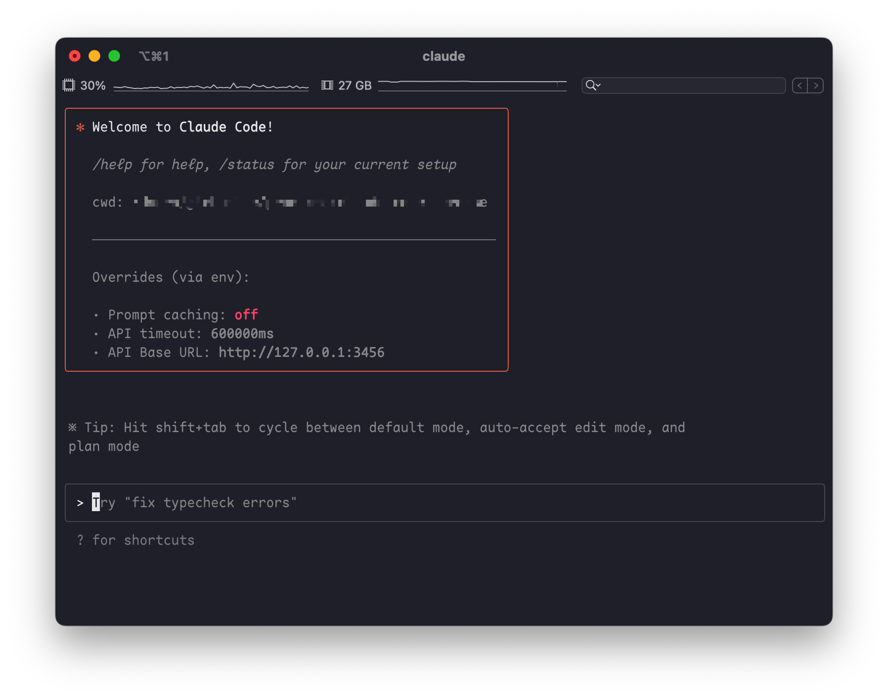
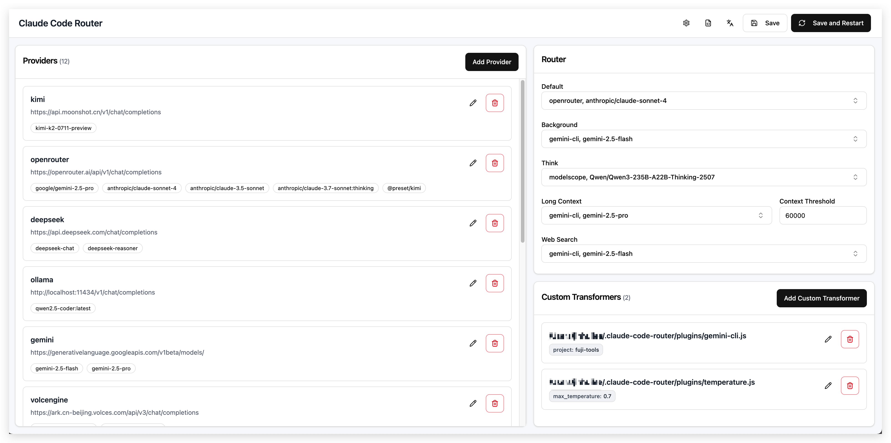
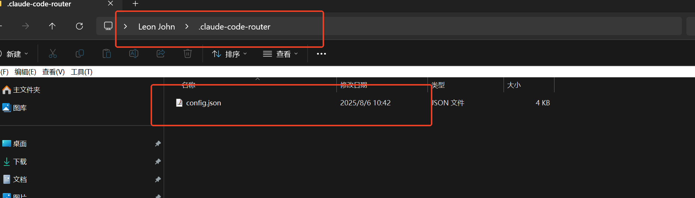

# claude-code-router免费试用claude

# <font style="color:rgb(31, 35, 40);">Claude Code Router  Claude 代码工艺路线</font>

<font style="color:rgb(89, 99, 110);">一款强大的工具，可将 Claude Code 请求路由到不同的模型，并自定义任何请求。</font>



## <font style="color:rgb(31, 35, 40);">✨</font><font style="color:rgb(31, 35, 40);"> 功能</font>

* **<font style="color:rgb(31, 35, 40);">模型路由</font>**<font style="color:rgb(31, 35, 40);">: 根据您的需求将请求路由到不同的模型（例如，后台任务、思考、长上下文）。</font>
* **<font style="color:rgb(31, 35, 40);">多提供商支持</font>**<font style="color:rgb(31, 35, 40);">: 支持 OpenRouter、DeepSeek、Ollama、Gemini、Volcengine 和 SiliconFlow 等各种模型提供商。</font>
* **<font style="color:rgb(31, 35, 40);">请求/响应转换</font>**<font style="color:rgb(31, 35, 40);">: 使用转换器为不同的提供商自定义请求和响应。</font>
* **<font style="color:rgb(31, 35, 40);">动态模型切换</font>**<font style="color:rgb(31, 35, 40);">: 在 Claude Code 中使用</font><font style="color:rgb(31, 35, 40);"> </font><code><font style="color:rgb(31, 35, 40);background-color:rgba(129, 139, 152, 0.12);">/model</font></code><font style="color:rgb(31, 35, 40);"> </font><font style="color:rgb(31, 35, 40);">命令动态切换模型。</font>
* **<font style="color:rgb(31, 35, 40);">GitHub Actions 集成</font>**<font style="color:rgb(31, 35, 40);">: 在您的 GitHub 工作流程中触发 Claude Code 任务。</font>
* **<font style="color:rgb(31, 35, 40);">插件系统</font>**<font style="color:rgb(31, 35, 40);">: 使用自定义转换器扩展功能。</font>

## <font style="color:rgb(31, 35, 40);">🚀</font><font style="color:rgb(31, 35, 40);"> 快速入门</font>

### <font style="color:rgb(31, 35, 40);">1. 安装</font>

<font style="color:rgb(31, 35, 40);">首先，请确保您已安装</font><font style="color:rgb(31, 35, 40);"> </font>[<font style="color:rgb(9, 105, 218);">Claude Code</font>](https://docs.anthropic.com/en/docs/claude-code/quickstart)<font style="color:rgb(31, 35, 40);">：</font>

```plain
npm install -g @anthropic-ai/claude-code
```

<font style="color:rgb(31, 35, 40);">然后，安装 Claude Code Router：</font>

```plain
npm install -g @musistudio/claude-code-router
```

### <font style="color:rgb(31, 35, 40);">2. 配置</font>

<font style="color:rgb(31, 35, 40);">创建并配置您的</font><font style="color:rgb(31, 35, 40);"> </font><code><font style="color:rgb(31, 35, 40);background-color:rgba(129, 139, 152, 0.12);">~/.claude-code-router/config.json</font></code><font style="color:rgb(31, 35, 40);"> </font><font style="color:rgb(31, 35, 40);">文件。有关更多详细信息，您可以参考</font><font style="color:rgb(31, 35, 40);"> </font><code><font style="color:rgb(31, 35, 40);background-color:rgba(129, 139, 152, 0.12);">config.example.json</font></code><font style="color:rgb(31, 35, 40);">。</font>

<code><font style="color:rgb(31, 35, 40);background-color:rgba(129, 139, 152, 0.12);">config.json</font></code><font style="color:rgb(31, 35, 40);"> </font><font style="color:rgb(31, 35, 40);">文件有几个关键部分：</font>

* <code>**<font style="color:rgb(31, 35, 40);background-color:rgba(129, 139, 152, 0.12);">PROXY_URL</font>**</code><font style="color:rgb(31, 35, 40);"> </font><font style="color:rgb(31, 35, 40);">(可选): 您可以为 API 请求设置代理，例如：</font><code><font style="color:rgb(31, 35, 40);background-color:rgba(129, 139, 152, 0.12);">"PROXY_URL": "http://127.0.0.1:7890"</font></code><font style="color:rgb(31, 35, 40);">。</font>
* <code>**<font style="color:rgb(31, 35, 40);background-color:rgba(129, 139, 152, 0.12);">LOG</font>**</code><font style="color:rgb(31, 35, 40);"> </font><font style="color:rgb(31, 35, 40);">(可选): 您可以通过将其设置为</font><font style="color:rgb(31, 35, 40);"> </font><code><font style="color:rgb(31, 35, 40);background-color:rgba(129, 139, 152, 0.12);">true</font></code><font style="color:rgb(31, 35, 40);"> </font><font style="color:rgb(31, 35, 40);">来启用日志记录。日志文件将位于</font><font style="color:rgb(31, 35, 40);"> </font><code><font style="color:rgb(31, 35, 40);background-color:rgba(129, 139, 152, 0.12);">$HOME/.claude-code-router.log</font></code><font style="color:rgb(31, 35, 40);">。</font>
* <code>**<font style="color:rgb(31, 35, 40);background-color:rgba(129, 139, 152, 0.12);">APIKEY</font>**</code><font style="color:rgb(31, 35, 40);"> </font><font style="color:rgb(31, 35, 40);">(可选): 您可以设置一个密钥来进行身份验证。设置后，客户端请求必须在</font><font style="color:rgb(31, 35, 40);"> </font><code><font style="color:rgb(31, 35, 40);background-color:rgba(129, 139, 152, 0.12);">Authorization</font></code><font style="color:rgb(31, 35, 40);"> </font><font style="color:rgb(31, 35, 40);">请求头 (例如,</font><font style="color:rgb(31, 35, 40);"> </font><code><font style="color:rgb(31, 35, 40);background-color:rgba(129, 139, 152, 0.12);">Bearer your-secret-key</font></code><font style="color:rgb(31, 35, 40);">) 或</font><font style="color:rgb(31, 35, 40);"> </font><code><font style="color:rgb(31, 35, 40);background-color:rgba(129, 139, 152, 0.12);">x-api-key</font></code><font style="color:rgb(31, 35, 40);"> </font><font style="color:rgb(31, 35, 40);">请求头中提供此密钥。例如：</font><code><font style="color:rgb(31, 35, 40);background-color:rgba(129, 139, 152, 0.12);">"APIKEY": "your-secret-key"</font></code><font style="color:rgb(31, 35, 40);">。</font>
* <code>**<font style="color:rgb(31, 35, 40);background-color:rgba(129, 139, 152, 0.12);">HOST</font>**</code><font style="color:rgb(31, 35, 40);"> </font><font style="color:rgb(31, 35, 40);">(可选): 您可以设置服务的主机地址。如果未设置</font><font style="color:rgb(31, 35, 40);"> </font><code><font style="color:rgb(31, 35, 40);background-color:rgba(129, 139, 152, 0.12);">APIKEY</font></code><font style="color:rgb(31, 35, 40);">，出于安全考虑，主机地址将强制设置为</font><font style="color:rgb(31, 35, 40);"> </font><code><font style="color:rgb(31, 35, 40);background-color:rgba(129, 139, 152, 0.12);">127.0.0.1</font></code><font style="color:rgb(31, 35, 40);">，以防止未经授权的访问。例如：</font><code><font style="color:rgb(31, 35, 40);background-color:rgba(129, 139, 152, 0.12);">"HOST": "0.0.0.0"</font></code><font style="color:rgb(31, 35, 40);">。</font>
* <code>**<font style="color:rgb(31, 35, 40);background-color:rgba(129, 139, 152, 0.12);">Providers</font>**</code><font style="color:rgb(31, 35, 40);">: 用于配置不同的模型提供商。</font>
* <code>**<font style="color:rgb(31, 35, 40);background-color:rgba(129, 139, 152, 0.12);">Router</font>**</code><font style="color:rgb(31, 35, 40);">: 用于设置路由规则。</font><code><font style="color:rgb(31, 35, 40);background-color:rgba(129, 139, 152, 0.12);">default</font></code><font style="color:rgb(31, 35, 40);"> </font><font style="color:rgb(31, 35, 40);">指定默认模型，如果未配置其他路由，则该模型将用于所有请求。</font>
* <code>**<font style="color:rgb(31, 35, 40);background-color:rgba(129, 139, 152, 0.12);">API_TIMEOUT_MS</font>**</code><font style="color:rgb(31, 35, 40);">: API 请求超时时间，单位为毫秒。</font>

<font style="color:rgb(31, 35, 40);">这是一个综合示例：</font>

```plain
{
  "APIKEY": "your-secret-key",
  "PROXY_URL": "http://127.0.0.1:7890",
  "LOG": true,
  "API_TIMEOUT_MS": 600000,
  "Providers": [
    {
      "name": "openrouter",
      "api_base_url": "https://openrouter.ai/api/v1/chat/completions",
      "api_key": "sk-xxx",
      "models": [
        "google/gemini-2.5-pro-preview",
        "anthropic/claude-sonnet-4",
        "anthropic/claude-3.5-sonnet",
        "anthropic/claude-3.7-sonnet:thinking"
      ],
      "transformer": {
        "use": ["openrouter"]
      }
    },
    {
      "name": "deepseek",
      "api_base_url": "https://api.deepseek.com/chat/completions",
      "api_key": "sk-xxx",
      "models": ["deepseek-chat", "deepseek-reasoner"],
      "transformer": {
        "use": ["deepseek"],
        "deepseek-chat": {
          "use": ["tooluse"]
        }
      }
    },
    {
      "name": "ollama",
      "api_base_url": "http://localhost:11434/v1/chat/completions",
      "api_key": "ollama",
      "models": ["qwen2.5-coder:latest"]
    },
    {
      "name": "gemini",
      "api_base_url": "https://generativelanguage.googleapis.com/v1beta/models/",
      "api_key": "sk-xxx",
      "models": ["gemini-2.5-flash", "gemini-2.5-pro"],
      "transformer": {
        "use": ["gemini"]
      }
    },
    {
      "name": "volcengine",
      "api_base_url": "https://ark.cn-beijing.volces.com/api/v3/chat/completions",
      "api_key": "sk-xxx",
      "models": ["deepseek-v3-250324", "deepseek-r1-250528"],
      "transformer": {
        "use": ["deepseek"]
      }
    },
    {
      "name": "modelscope",
      "api_base_url": "https://api-inference.modelscope.cn/v1/chat/completions",
      "api_key": "",
      "models": ["Qwen/Qwen3-Coder-480B-A35B-Instruct", "Qwen/Qwen3-235B-A22B-Thinking-2507"],
      "transformer": {
        "use": [
          [
            "maxtoken",
            {
              "max_tokens": 65536
            }
          ],
          "enhancetool"
        ],
        "Qwen/Qwen3-235B-A22B-Thinking-2507": {
          "use": ["reasoning"]
        }
      }
    },
    {
      "name": "dashscope",
      "api_base_url": "https://dashscope.aliyuncs.com/compatible-mode/v1/chat/completions",
      "api_key": "",
      "models": ["qwen3-coder-plus"],
      "transformer": {
        "use": [
          [
            "maxtoken",
            {
              "max_tokens": 65536
            }
          ],
          "enhancetool"
        ]
      }
    },
    {
      "name": "aihubmix",
      "api_base_url": "https://aihubmix.com/v1/chat/completions",
      "api_key": "sk-",
      "models": [
        "Z/glm-4.5",
        "claude-opus-4-20250514",
        "gemini-2.5-pro"
      ]
    }
  ],
  "Router": {
    "default": "deepseek,deepseek-chat",
    "background": "ollama,qwen2.5-coder:latest",
    "think": "deepseek,deepseek-reasoner",
    "longContext": "openrouter,google/gemini-2.5-pro-preview",
    "longContextThreshold": 60000,
    "webSearch": "gemini,gemini-2.5-flash"
  }
}
```

### <font style="color:rgb(31, 35, 40);">3. 使用 Router 运行 Claude Code</font>

<font style="color:rgb(31, 35, 40);">使用 router 启动 Claude Code：</font>

<font style="color:rgb(31, 35, 40);background-color:rgb(246, 248, 250);">ccr code</font>

**<font style="color:rgb(89, 99, 110);">注意</font>**<font style="color:rgb(89, 99, 110);">: 修改配置文件后，需要重启服务使配置生效：</font>

<font style="color:rgb(89, 99, 110);background-color:rgb(246, 248, 250);">ccr restart</font>

### <font style="color:rgb(31, 35, 40);">4. UI 模式 (Beta)</font>

<font style="color:rgb(31, 35, 40);">为了获得更直观的体验，您可以使用 UI 模式来管理您的配置：</font>

<font style="color:rgb(31, 35, 40);background-color:rgb(246, 248, 250);">ccr ui</font>

<font style="color:rgb(31, 35, 40);">这将打开一个基于 Web 的界面，您可以在其中轻松查看和编辑您的</font><font style="color:rgb(31, 35, 40);"> </font><code><font style="color:rgb(31, 35, 40);background-color:rgba(129, 139, 152, 0.12);">config.json</font></code><font style="color:rgb(31, 35, 40);"> </font><font style="color:rgb(31, 35, 40);">文件。</font>



**<font style="color:rgb(89, 99, 110);">注意</font>**<font style="color:rgb(89, 99, 110);">: UI 模式目前处于测试阶段。这是一个 100% vibe coding的项目，包括项目的初始化，我只是新建了一个文件夹和一个project.md文档。所有代码均由 ccr + qwen3-coder + gemini(webSearch) 实现。如有问题请提交 issue。</font>

#### <font style="color:rgb(31, 35, 40);">Providers</font><font style="color:rgb(31, 35, 40);">  </font><font style="color:rgb(31, 35, 40);">提供商</font>

<code><font style="color:rgb(31, 35, 40);background-color:rgba(129, 139, 152, 0.12);">Providers</font></code><font style="color:rgb(31, 35, 40);"> </font><font style="color:rgb(31, 35, 40);">数组是您定义要使用的不同模型提供商的地方。每个提供商对象都需要：</font>

* <code><font style="color:rgb(31, 35, 40);background-color:rgba(129, 139, 152, 0.12);">name</font></code><font style="color:rgb(31, 35, 40);">: 提供商的唯一名称。</font>
* <code><font style="color:rgb(31, 35, 40);background-color:rgba(129, 139, 152, 0.12);">api_base_url</font></code><font style="color:rgb(31, 35, 40);">: 聊天补全的完整 API 端点。</font>
* <code><font style="color:rgb(31, 35, 40);background-color:rgba(129, 139, 152, 0.12);">api_key</font></code><font style="color:rgb(31, 35, 40);">: 您提供商的 API 密钥。</font>
* <code><font style="color:rgb(31, 35, 40);background-color:rgba(129, 139, 152, 0.12);">models</font></code><font style="color:rgb(31, 35, 40);">: 此提供商可用的模型名称列表。</font>
* <code><font style="color:rgb(31, 35, 40);background-color:rgba(129, 139, 152, 0.12);">transformer</font></code><font style="color:rgb(31, 35, 40);"> </font><font style="color:rgb(31, 35, 40);">(可选): 指定用于处理请求和响应的转换器。</font>

#### <font style="color:rgb(31, 35, 40);">Transformers</font><font style="color:rgb(31, 35, 40);">  </font><font style="color:rgb(31, 35, 40);">变压器</font>

<font style="color:rgb(31, 35, 40);">Transformers 允许您修改请求和响应负载，以确保与不同提供商 API 的兼容性。</font>

* **<font style="color:rgb(31, 35, 40);">全局 Transformer</font>**<font style="color:rgb(31, 35, 40);">: 将转换器应用于提供商的所有模型。在此示例中，</font><code><font style="color:rgb(31, 35, 40);background-color:rgba(129, 139, 152, 0.12);">openrouter</font></code><font style="color:rgb(31, 35, 40);"> </font><font style="color:rgb(31, 35, 40);">转换器将应用于</font><font style="color:rgb(31, 35, 40);"> </font><code><font style="color:rgb(31, 35, 40);background-color:rgba(129, 139, 152, 0.12);">openrouter</font></code><font style="color:rgb(31, 35, 40);"> </font><font style="color:rgb(31, 35, 40);">提供商下的所有模型。</font>

```plain
{
   "name": "openrouter",
   "api_base_url": "https://openrouter.ai/api/v1/chat/completions",
   "api_key": "sk-xxx",
   "models": [
     "google/gemini-2.5-pro-preview",
     "anthropic/claude-sonnet-4",
     "anthropic/claude-3.5-sonnet"
   ],
   "transformer": { "use": ["openrouter"] }
 }
```

* **<font style="color:rgb(31, 35, 40);">特定于模型的 Transformer</font>**<font style="color:rgb(31, 35, 40);">: 将转换器应用于特定模型。在此示例中，</font><code><font style="color:rgb(31, 35, 40);background-color:rgba(129, 139, 152, 0.12);">deepseek</font></code><font style="color:rgb(31, 35, 40);"> </font><font style="color:rgb(31, 35, 40);">转换器应用于所有模型，而额外的</font><font style="color:rgb(31, 35, 40);"> </font><code><font style="color:rgb(31, 35, 40);background-color:rgba(129, 139, 152, 0.12);">tooluse</font></code><font style="color:rgb(31, 35, 40);"> </font><font style="color:rgb(31, 35, 40);">转换器仅应用于</font><font style="color:rgb(31, 35, 40);"> </font><code><font style="color:rgb(31, 35, 40);background-color:rgba(129, 139, 152, 0.12);">deepseek-chat</font></code><font style="color:rgb(31, 35, 40);"> </font><font style="color:rgb(31, 35, 40);">模型。</font>

```plain
{
   "name": "deepseek",
   "api_base_url": "https://api.deepseek.com/chat/completions",
   "api_key": "sk-xxx",
   "models": ["deepseek-chat", "deepseek-reasoner"],
   "transformer": {
     "use": ["deepseek"],
     "deepseek-chat": { "use": ["tooluse"] }
   }
 }
```

* **<font style="color:rgb(31, 35, 40);">向 Transformer 传递选项</font>**<font style="color:rgb(31, 35, 40);">: 某些转换器（如</font><font style="color:rgb(31, 35, 40);"> </font><code><font style="color:rgb(31, 35, 40);background-color:rgba(129, 139, 152, 0.12);">maxtoken</font></code><font style="color:rgb(31, 35, 40);">）接受选项。要传递选项，请使用嵌套数组，其中第一个元素是转换器名称，第二个元素是选项对象。</font>

```plain
{
  "name": "siliconflow",
  "api_base_url": "https://api.siliconflow.cn/v1/chat/completions",
  "api_key": "sk-xxx",
  "models": ["moonshotai/Kimi-K2-Instruct"],
  "transformer": {
    "use": [
      [
        "maxtoken",
        {
          "max_tokens": 16384
        }
      ]
    ]
  }
}
```

**<font style="color:rgb(31, 35, 40);">可用的内置 Transformer：</font>**

* <code><font style="color:rgb(31, 35, 40);background-color:rgba(129, 139, 152, 0.12);">Anthropic</font></code><font style="color:rgb(31, 35, 40);">: 如果你只使用这一个转换器，则会直接透传请求和响应(你可以用它来接入其他支持Anthropic端点的服务商)。</font>
* <code><font style="color:rgb(31, 35, 40);background-color:rgba(129, 139, 152, 0.12);">deepseek</font></code><font style="color:rgb(31, 35, 40);">: 适配 DeepSeek API 的请求/响应。</font>
* <code><font style="color:rgb(31, 35, 40);background-color:rgba(129, 139, 152, 0.12);">gemini</font></code><font style="color:rgb(31, 35, 40);">: 适配 Gemini API 的请求/响应。</font>
* <code><font style="color:rgb(31, 35, 40);background-color:rgba(129, 139, 152, 0.12);">openrouter</font></code><font style="color:rgb(31, 35, 40);">: 适配 OpenRouter API 的请求/响应。它还可以接受一个</font><font style="color:rgb(31, 35, 40);"> </font><code><font style="color:rgb(31, 35, 40);background-color:rgba(129, 139, 152, 0.12);">provider</font></code><font style="color:rgb(31, 35, 40);"> </font><font style="color:rgb(31, 35, 40);">路由参数，以指定 OpenRouter 应使用哪些底层提供商。有关更多详细信息，请参阅</font><font style="color:rgb(31, 35, 40);"> </font>[<font style="color:rgb(9, 105, 218);">OpenRouter 文档</font>](https://openrouter.ai/docs/features/provider-routing)<font style="color:rgb(31, 35, 40);">。请参阅下面的示例：</font>

```plain
"transformer": {
    "use": ["openrouter"],
    "moonshotai/kimi-k2": {
      "use": [
        [
          "openrouter",
          {
            "provider": {
              "only": ["moonshotai/fp8"]
            }
          }
        ]
      ]
    }
  }
```

* <code><font style="color:rgb(31, 35, 40);background-color:rgba(129, 139, 152, 0.12);">groq</font></code><font style="color:rgb(31, 35, 40);">: 适配 groq API 的请求/响应</font>
* <code><font style="color:rgb(31, 35, 40);background-color:rgba(129, 139, 152, 0.12);">maxtoken</font></code><font style="color:rgb(31, 35, 40);">: 设置特定的</font><font style="color:rgb(31, 35, 40);"> </font><code><font style="color:rgb(31, 35, 40);background-color:rgba(129, 139, 152, 0.12);">max_tokens</font></code><font style="color:rgb(31, 35, 40);"> </font><font style="color:rgb(31, 35, 40);">值。</font>
* <code><font style="color:rgb(31, 35, 40);background-color:rgba(129, 139, 152, 0.12);">tooluse</font></code><font style="color:rgb(31, 35, 40);">: 优化某些模型的工具使用(通过</font><code><font style="color:rgb(31, 35, 40);background-color:rgba(129, 139, 152, 0.12);">tool_choice</font></code><font style="color:rgb(31, 35, 40);">参数)。</font>
* <code><font style="color:rgb(31, 35, 40);background-color:rgba(129, 139, 152, 0.12);">gemini-cli</font></code><font style="color:rgb(31, 35, 40);"> </font><font style="color:rgb(31, 35, 40);">(实验性): 通过 Gemini CLI</font><font style="color:rgb(31, 35, 40);"> </font>[<font style="color:rgb(9, 105, 218);">gemini-cli.js</font>](https://gist.github.com/musistudio/1c13a65f35916a7ab690649d3df8d1cd)<font style="color:rgb(31, 35, 40);"> </font><font style="color:rgb(31, 35, 40);">对 Gemini 的非官方支持。</font>
* <code><font style="color:rgb(31, 35, 40);background-color:rgba(129, 139, 152, 0.12);">reasoning</font></code><font style="color:rgb(31, 35, 40);">: 用于处理</font><font style="color:rgb(31, 35, 40);"> </font><code><font style="color:rgb(31, 35, 40);background-color:rgba(129, 139, 152, 0.12);">reasoning_content</font></code><font style="color:rgb(31, 35, 40);"> </font><font style="color:rgb(31, 35, 40);">字段。</font>
* <code><font style="color:rgb(31, 35, 40);background-color:rgba(129, 139, 152, 0.12);">sampling</font></code><font style="color:rgb(31, 35, 40);">: 用于处理采样信息字段，如</font><font style="color:rgb(31, 35, 40);"> </font><code><font style="color:rgb(31, 35, 40);background-color:rgba(129, 139, 152, 0.12);">temperature</font></code><font style="color:rgb(31, 35, 40);">、</font><code><font style="color:rgb(31, 35, 40);background-color:rgba(129, 139, 152, 0.12);">top_p</font></code><font style="color:rgb(31, 35, 40);">、</font><code><font style="color:rgb(31, 35, 40);background-color:rgba(129, 139, 152, 0.12);">top_k</font></code><font style="color:rgb(31, 35, 40);"> </font><font style="color:rgb(31, 35, 40);">和</font><font style="color:rgb(31, 35, 40);"> </font><code><font style="color:rgb(31, 35, 40);background-color:rgba(129, 139, 152, 0.12);">repetition_penalty</font></code><font style="color:rgb(31, 35, 40);">。</font>
* <code><font style="color:rgb(31, 35, 40);background-color:rgba(129, 139, 152, 0.12);">enhancetool</font></code><font style="color:rgb(31, 35, 40);">: 对 LLM 返回的工具调用参数增加一层容错处理（这会导致不再流式返回工具调用信息）。</font>
* <code><font style="color:rgb(31, 35, 40);background-color:rgba(129, 139, 152, 0.12);">cleancache</font></code><font style="color:rgb(31, 35, 40);">: 清除请求中的</font><font style="color:rgb(31, 35, 40);"> </font><code><font style="color:rgb(31, 35, 40);background-color:rgba(129, 139, 152, 0.12);">cache_control</font></code><font style="color:rgb(31, 35, 40);"> </font><font style="color:rgb(31, 35, 40);">字段。</font>
* <code><font style="color:rgb(31, 35, 40);background-color:rgba(129, 139, 152, 0.12);">vertex-gemini</font></code><font style="color:rgb(31, 35, 40);">: 处理使用 vertex 鉴权的 gemini api。</font>

**<font style="color:rgb(31, 35, 40);">自定义 Transformer:</font>**

<font style="color:rgb(31, 35, 40);">您还可以创建自己的转换器，并通过</font><font style="color:rgb(31, 35, 40);"> </font><code><font style="color:rgb(31, 35, 40);background-color:rgba(129, 139, 152, 0.12);">config.json</font></code><font style="color:rgb(31, 35, 40);"> </font><font style="color:rgb(31, 35, 40);">中的</font><font style="color:rgb(31, 35, 40);"> </font><code><font style="color:rgb(31, 35, 40);background-color:rgba(129, 139, 152, 0.12);">transformers</font></code><font style="color:rgb(31, 35, 40);"> </font><font style="color:rgb(31, 35, 40);">字段加载它们。</font>

```plain
{
  "transformers": [
      {
        "path": "$HOME/.claude-code-router/plugins/gemini-cli.js",
        "options": {
          "project": "xxx"
        }
      }
  ]
}
```

#### <font style="color:rgb(31, 35, 40);">Router</font><font style="color:rgb(31, 35, 40);">  </font><font style="color:rgb(31, 35, 40);">路由器</font>

<code><font style="color:rgb(31, 35, 40);background-color:rgba(129, 139, 152, 0.12);">Router</font></code><font style="color:rgb(31, 35, 40);"> </font><font style="color:rgb(31, 35, 40);">对象定义了在不同场景下使用哪个模型：</font>

* <code><font style="color:rgb(31, 35, 40);background-color:rgba(129, 139, 152, 0.12);">default</font></code><font style="color:rgb(31, 35, 40);">: 用于常规任务的默认模型。</font>
* <code><font style="color:rgb(31, 35, 40);background-color:rgba(129, 139, 152, 0.12);">background</font></code><font style="color:rgb(31, 35, 40);">: 用于后台任务的模型。这可以是一个较小的本地模型以节省成本。</font>
* <code><font style="color:rgb(31, 35, 40);background-color:rgba(129, 139, 152, 0.12);">think</font></code><font style="color:rgb(31, 35, 40);">: 用于推理密集型任务（如计划模式）的模型。</font>
* <code><font style="color:rgb(31, 35, 40);background-color:rgba(129, 139, 152, 0.12);">longContext</font></code><font style="color:rgb(31, 35, 40);">: 用于处理长上下文（例如，> 60K 令牌）的模型。</font>
* <code><font style="color:rgb(31, 35, 40);background-color:rgba(129, 139, 152, 0.12);">longContextThreshold</font></code><font style="color:rgb(31, 35, 40);"> </font><font style="color:rgb(31, 35, 40);">(可选): 触发长上下文模型的令牌数阈值。如果未指定，默认为 60000。</font>
* <code><font style="color:rgb(31, 35, 40);background-color:rgba(129, 139, 152, 0.12);">webSearch</font></code><font style="color:rgb(31, 35, 40);">: 用于处理网络搜索任务，需要模型本身支持。如果使用</font><code><font style="color:rgb(31, 35, 40);background-color:rgba(129, 139, 152, 0.12);">openrouter</font></code><font style="color:rgb(31, 35, 40);">需要在模型后面加上</font><code><font style="color:rgb(31, 35, 40);background-color:rgba(129, 139, 152, 0.12);">:online</font></code><font style="color:rgb(31, 35, 40);">后缀。</font>

<font style="color:rgb(31, 35, 40);">您还可以使用</font><font style="color:rgb(31, 35, 40);"> </font><code><font style="color:rgb(31, 35, 40);background-color:rgba(129, 139, 152, 0.12);">/model</font></code><font style="color:rgb(31, 35, 40);"> </font><font style="color:rgb(31, 35, 40);">命令在 Claude Code 中动态切换模型：</font><font style="color:rgb(31, 35, 40);"> </font><code><font style="color:rgb(31, 35, 40);background-color:rgba(129, 139, 152, 0.12);">/model provider_name,model_name</font></code><font style="color:rgb(31, 35, 40);"> </font><font style="color:rgb(31, 35, 40);">示例:</font><font style="color:rgb(31, 35, 40);"> </font><code><font style="color:rgb(31, 35, 40);background-color:rgba(129, 139, 152, 0.12);">/model openrouter,anthropic/claude-3.5-sonnet</font></code>

#### <font style="color:rgb(31, 35, 40);">自定义路由器</font>

<font style="color:rgb(31, 35, 40);">对于更高级的路由逻辑，您可以在</font><font style="color:rgb(31, 35, 40);"> </font><code><font style="color:rgb(31, 35, 40);background-color:rgba(129, 139, 152, 0.12);">config.json</font></code><font style="color:rgb(31, 35, 40);"> </font><font style="color:rgb(31, 35, 40);">中通过</font><font style="color:rgb(31, 35, 40);"> </font><code><font style="color:rgb(31, 35, 40);background-color:rgba(129, 139, 152, 0.12);">CUSTOM_ROUTER_PATH</font></code><font style="color:rgb(31, 35, 40);"> </font><font style="color:rgb(31, 35, 40);">字段指定一个自定义路由器脚本。这允许您实现超出默认场景的复杂路由规则。</font>

<font style="color:rgb(31, 35, 40);">在您的</font><font style="color:rgb(31, 35, 40);"> </font><code><font style="color:rgb(31, 35, 40);background-color:rgba(129, 139, 152, 0.12);">config.json</font></code><font style="color:rgb(31, 35, 40);"> </font><font style="color:rgb(31, 35, 40);">中配置:</font>

```plain
{
  "CUSTOM_ROUTER_PATH": "$HOME/.claude-code-router/custom-router.js"
}
```

<font style="color:rgb(31, 35, 40);">自定义路由器文件必须是一个导出</font><font style="color:rgb(31, 35, 40);"> </font><code><font style="color:rgb(31, 35, 40);background-color:rgba(129, 139, 152, 0.12);">async</font></code><font style="color:rgb(31, 35, 40);"> </font><font style="color:rgb(31, 35, 40);">函数的 JavaScript 模块。该函数接收请求对象和配置对象作为参数，并应返回提供商和模型名称的字符串（例如</font><font style="color:rgb(31, 35, 40);"> </font><code><font style="color:rgb(31, 35, 40);background-color:rgba(129, 139, 152, 0.12);">"provider_name,model_name"</font></code><font style="color:rgb(31, 35, 40);">），如果返回</font><font style="color:rgb(31, 35, 40);"> </font><code><font style="color:rgb(31, 35, 40);background-color:rgba(129, 139, 152, 0.12);">null</font></code><font style="color:rgb(31, 35, 40);"> </font><font style="color:rgb(31, 35, 40);">则回退到默认路由。</font>

<font style="color:rgb(31, 35, 40);">这是一个基于</font><font style="color:rgb(31, 35, 40);"> </font><code><font style="color:rgb(31, 35, 40);background-color:rgba(129, 139, 152, 0.12);">custom-router.example.js</font></code><font style="color:rgb(31, 35, 40);"> </font><font style="color:rgb(31, 35, 40);">的</font><font style="color:rgb(31, 35, 40);"> </font><code><font style="color:rgb(31, 35, 40);background-color:rgba(129, 139, 152, 0.12);">custom-router.js</font></code><font style="color:rgb(31, 35, 40);"> </font><font style="color:rgb(31, 35, 40);">示例：</font>

```plain
// $HOME/.claude-code-router/custom-router.js

/**
 * 一个自定义路由函数，用于根据请求确定使用哪个模型。
 *
 * @param {object} req - 来自 Claude Code 的请求对象，包含请求体。
 * @param {object} config - 应用程序的配置对象。
 * @returns {Promise<string|null>} - 一个解析为 "provider,model_name" 字符串的 Promise，如果返回 null，则使用默认路由。
 */
module.exports = async function router(req, config) {
  const userMessage = req.body.messages.find(m => m.role === 'user')?.content;

  if (userMessage && userMessage.includes('解释这段代码')) {
    // 为代码解释任务使用更强大的模型
    return 'openrouter,anthropic/claude-3.5-sonnet';
  }

  // 回退到默认的路由配置
  return null;
};
```

##### <font style="color:rgb(31, 35, 40);">子代理路由</font>

<font style="color:rgb(31, 35, 40);">对于子代理内的路由，您必须在子代理提示词的</font>**<font style="color:rgb(31, 35, 40);">开头</font>**<font style="color:rgb(31, 35, 40);">包含</font><font style="color:rgb(31, 35, 40);"> </font><code><font style="color:rgb(31, 35, 40);background-color:rgba(129, 139, 152, 0.12);"><CCR-SUBAGENT-MODEL>provider,model</CCR-SUBAGENT-MODEL></font></code><font style="color:rgb(31, 35, 40);"> </font><font style="color:rgb(31, 35, 40);">来指定特定的提供商和模型。这样可以将特定的子代理任务定向到指定的模型。</font>

**<font style="color:rgb(31, 35, 40);">示例：</font>**

```plain
<CCR-SUBAGENT-MODEL>openrouter,anthropic/claude-3.5-sonnet</CCR-SUBAGENT-MODEL>
请帮我分析这段代码是否存在潜在的优化空间...
```

## <font style="color:rgb(31, 35, 40);">🤖</font><font style="color:rgb(31, 35, 40);"> GitHub Actions</font><font style="color:rgb(31, 35, 40);">  </font><font style="color:rgb(31, 35, 40);">查看 GitHub 操作</font>

<font style="color:rgb(31, 35, 40);">将 Claude Code Router 集成到您的 CI/CD 管道中。在设置</font><font style="color:rgb(31, 35, 40);"> </font>[<font style="color:rgb(9, 105, 218);">Claude Code Actions</font>](https://docs.anthropic.com/en/docs/claude-code/github-actions)<font style="color:rgb(31, 35, 40);"> </font><font style="color:rgb(31, 35, 40);">后，修改您的</font><font style="color:rgb(31, 35, 40);"> </font><code><font style="color:rgb(31, 35, 40);background-color:rgba(129, 139, 152, 0.12);">.github/workflows/claude.yaml</font></code><font style="color:rgb(31, 35, 40);"> </font><font style="color:rgb(31, 35, 40);">以使用路由器：</font>

```plain
name: Claude Code

on:
  issue_comment:
    types: [created]
  # ... other triggers

jobs:
  claude:
    if: |
      (github.event_name == 'issue_comment' && contains(github.event.comment.body, '@claude')) ||
      # ... other conditions
    runs-on: ubuntu-latest
    permissions:
      contents: read
      pull-requests: read
      issues: read
      id-token: write
    steps:
      - name: Checkout repository
        uses: actions/checkout@v4
        with:
          fetch-depth: 1

      - name: Prepare Environment
        run: |
          curl -fsSL https://bun.sh/install | bash
          mkdir -p $HOME/.claude-code-router
          cat << 'EOF' > $HOME/.claude-code-router/config.json
          {
            "log": true,
            "OPENAI_API_KEY": "${{ secrets.OPENAI_API_KEY }}",
            "OPENAI_BASE_URL": "https://api.deepseek.com",
            "OPENAI_MODEL": "deepseek-chat"
          }
          EOF
        shell: bash

      - name: Start Claude Code Router
        run: |
          nohup ~/.bun/bin/bunx @musistudio/claude-code-router@1.0.8 start &
        shell: bash

      - name: Run Claude Code
        id: claude
        uses: anthropics/claude-code-action@beta
        env:
          ANTHROPIC_BASE_URL: http://localhost:3456
        with:
          anthropic_api_key: "any-string-is-ok"
```

<font style="color:rgb(31, 35, 40);">这种设置可以实现有趣的自动化，例如在非高峰时段运行任务以降低 API 成本。</font>

### <font style="color:rgb(31, 35, 40);">安装完成后在目录 C:\Users\lixin\ 下面新建.claude-code-router 下面新建 config.json</font>



### <font style="color:rgb(31, 35, 40);">使用 qwen-code 免费方案</font>

#### <https://github.com/QwenLM/qwen-code?tab=readme-ov-file><font style="color:rgb(31, 35, 40);">

</font><font style="color:rgb(31, 35, 40);">Free Option: ModelScope provides 2,000 free API calls per day for users in mainland China. OpenRouter offers up to 1,000 free API calls per day worldwide. For setup instructions, see </font>[<font style="color:rgb(9, 105, 218);">API Configuration</font>](https://github.com/QwenLM/qwen-code?tab=readme-ov-file#api-configuration)<font style="color:rgb(31, 35, 40);">.\ </font><font style="color:rgb(31, 35, 40);">💡</font><font style="color:rgb(31, 35, 40);"> 免费选项 ：ModelScope 每天为中国大陆用户提供 2,000 次免费 API 调用 。OpenRouter 每天在全球范围内提供多达 1，000 个免费 API 调用 。有关设置说明，请参阅 </font>[<font style="color:rgb(9, 105, 218);">API 配置</font>](https://github.com/QwenLM/qwen-code?tab=readme-ov-file#api-configuration)<font style="color:rgb(31, 35, 40);">。</font>

```bash
{
  "env": {
    "ANTHROPIC_BASE_URL": "https://openrouter.ai/api",
    "ANTHROPIC_AUTH_TOKEN": "sk-or-v1-YOUR-KEY-HERE",
    "ANTHROPIC_API_KEY": "",
    "ANTHROPIC_MODEL": "openrouter/free"
  }
}
```

```bash
{
  "APIKEY": "your-secret-key",
  "PROXY_URL": "http://127.0.0.1:10808",
  "LOG": true,
  "API_TIMEOUT_MS": 600000,
  "NON_INTERACTIVE_MODE": false,
  "Providers": [
    {
      "name": "openrouter",
      "api_base_url": "https://openrouter.ai/api/v1/chat/completions",
      "api_key": "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",
      "models": [
        "google/gemini-2.5-pro-preview",
        "anthropic/claude-sonnet-4",
        "anthropic/claude-3.5-sonnet",
        "anthropic/claude-3.7-sonnet:thinking"
      ],
      "transformer": {
        "use": ["openrouter"]
      }
    },
    {
      "name": "deepseek",
      "api_base_url": "https://api.deepseek.com/chat/completions",
      "api_key": "sk-08090b8782904fc09cee9da664a187c2",
      "models": ["deepseek-chat", "deepseek-reasoner"],
      "transformer": {
        "use": ["deepseek"],
        "deepseek-chat": {
          "use": ["tooluse"]
        }
      }
    },
    {
      "name": "ollama",
      "api_base_url": "http://localhost:11434/v1/chat/completions",
      "api_key": "ollama",
      "models": ["qwen2.5-coder:latest"]
    },
    {
      "name": "gemini",
      "api_base_url": "https://generativelanguage.googleapis.com/v1beta/models/",
      "api_key": "sk-xxx",
      "models": ["gemini-2.5-flash", "gemini-2.5-pro"],
      "transformer": {
        "use": ["gemini"]
      }
    },
    {
      "name": "volcengine",
      "api_base_url": "https://ark.cn-beijing.volces.com/api/v3/chat/completions",
      "api_key": "sk-xxx",
      "models": ["deepseek-v3-250324", "deepseek-r1-250528"],
      "transformer": {
        "use": ["deepseek"]
      }
    },
    {
      "name": "modelscope",
      "api_base_url": "https://api-inference.modelscope.cn/v1/chat/completions",
      "api_key": "",
      "models": ["Qwen/Qwen3-Coder-480B-A35B-Instruct", "Qwen/Qwen3-235B-A22B-Thinking-2507"],
      "transformer": {
        "use": [
          [
            "maxtoken",
            {
              "max_tokens": 65536
            }
          ],
          "enhancetool"
        ],
        "Qwen/Qwen3-235B-A22B-Thinking-2507": {
          "use": ["reasoning"]
        }
      }
    },
    {
      "name": "dashscope",
      "api_base_url": "https://dashscope.aliyuncs.com/compatible-mode/v1/chat/completions",
      "api_key": "",
      "models": ["qwen3-coder-plus"],
      "transformer": {
        "use": [
          [
            "maxtoken",
            {
              "max_tokens": 65536
            }
          ],
          "enhancetool"
        ]
      }
    },
    {
      "name": "aihubmix",
      "api_base_url": "https://aihubmix.com/v1/chat/completions",
      "api_key": "sk-",
      "models": [
        "Z/glm-4.5",
        "claude-opus-4-20250514",
        "gemini-2.5-pro"
      ]
    }
  ],
  "Router": {
    "default": "deepseek,deepseek-chat",
    "background": "ollama,qwen2.5-coder:latest",
    "think": "deepseek,deepseek-reasoner",
    "longContext": "openrouter,google/gemini-2.5-pro-preview",
    "longContextThreshold": 60000,
    "webSearch": "gemini,gemini-2.5-flash"
  }
}
```

```bash
{
  "APIKEY": "your-secret-key",
  "PROXY_URL": "http://127.0.0.1:10808",
  "LOG": true,
  "API_TIMEOUT_MS": 600000,
  "NON_INTERACTIVE_MODE": false,

  "Providers": [
    {
      "name": "openrouter",
      "api_base_url": "https://openrouter.ai/api/v1/chat/completions",
      "api_key": "你的OpenRouterKey",
      "models": [
        "StepFun/step-3.5-flash",
        "NVIDIA/nemotron-3-super",
        "ArceeAI/trinity-preview",
        "Zai/glm-4.5-air",
        "NVIDIA/nemotron-nano-30b-a3b",
        "NVIDIA/nemotron-nano-9b-v2",
        "NVIDIA/nemotron-nano-12b-2-vl",
        "MiniMax/mini-max-m2.5",
        "Qwen/qwen3-next-80b-a3b",
        "Qwen/qwen3-coder-480b-a3sb"
      ],
      "transformer": {
        "use": ["openrouter"]
      }
    },

    {
      "name": "deepseek",
      "api_base_url": "https://api.deepseek.com/chat/completions",
      "api_key": "你的DeepSeekAPIKey",
      "models": [
        "deepseek-chat",
        "deepseek-reasoner"
      ],
      "transformer": {
        "use": ["deepseek"],
        "deepseek-chat": {
          "use": ["tooluse"]
        }
      }
    },

    {
      "name": "ollama",
      "api_base_url": "http://localhost:11434/v1/chat/completions",
      "api_key": "ollama",
      "models": [
        "qwen2.5-coder:latest",
        "deepseek-coder:6.7b",
        "codellama:13b",
        "phi3:medium"
      ]
    },

    {
      "name": "modelscope",
      "api_base_url": "https://api-inference.modelscope.cn/v1/chat/completions",
      "api_key": "",
      "models": [
        "Qwen/Qwen2.5-Coder-32B-Instruct",
        "Qwen/Qwen2.5-72B-Instruct"
      ],
      "transformer": {
        "use": [
          [
            "maxtoken",
            {
              "max_tokens": 65536
            }
          ],
          "enhancetool"
        ]
      }
    }
  ],

  "Router": {
    "default": [
      "openrouter,StepFun/step-3.5-flash",
      "openrouter,NVIDIA/nemotron-3-super",
      "deepseek,deepseek-chat"
    ],

    "think": [
      "deepseek,deepseek-reasoner",
      "openrouter,StepFun/step-3.5-flash"
    ],

    "longContext": [
      "openrouter,NVIDIA/nemotron-nano-12b-2-vl",
      "openrouter,StepFun/step-3.5-flash"
    ],

    "coding": [
      "openrouter,Qwen/qwen3-coder-480b-a3sb",
      "openrouter,Qwen/qwen3-next-80b-a3b"
    ],

    "background": [
      "openrouter,MiniMax/mini-max-m2.5",
      "openrouter,NVIDIA/nemotron-nano-9b-v2"
    ],

    "webSearch": [
      "openrouter,StepFun/step-3.5-flash"
    ],

    "longContextThreshold": 60000
  }
}
```


> 更新: 2026-03-26 17:57:21  
> 原文: <https://www.yuque.com/lixinsi/xdiarx/nwq7u298fci15ux7>