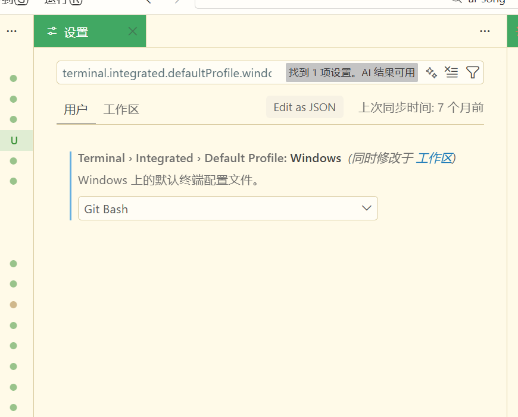

# 解决windows claude code弹窗问题

### powershell
```sql
# 1. 删除旧变量
[System.Environment]::SetEnvironmentVariable("CLAUDE_CODE_GIT_BASH_PATH", $null, "User")
[System.Environment]::SetEnvironmentVariable("CLAUDE_CODE_GIT_BASH_PATH", $null, "Machine")

# 2. 设置新变量
[System.Environment]::SetEnvironmentVariable("CLAUDE_CODE_GIT_BASH_PATH", "C:\Program Files\Git\bin\bash.exe", "User")

# 3. 验证
Write-Host "=== 环境变量设置完成 ===" -ForegroundColor Green
Write-Host "用户级别：$([System.Environment]::GetEnvironmentVariable('CLAUDE_CODE_GIT_BASH_PATH', 'User'))"
Write-Host "系统级别：$([System.Environment]::GetEnvironmentVariable('CLAUDE_CODE_GIT_BASH_PATH', 'Machine'))"
Write-Host "请完全重启 VSCode 后运行：echo `$env:CLAUDE_CODE_GIT_BASH_PATH" -ForegroundColor Yellow
```



```sql
terminal.integrated.defaultProfile.windows
```


> 更新: 2026-03-09 13:27:52  
> 原文: <https://www.yuque.com/lixinsi/xdiarx/qgvt5sa5r78dadst>