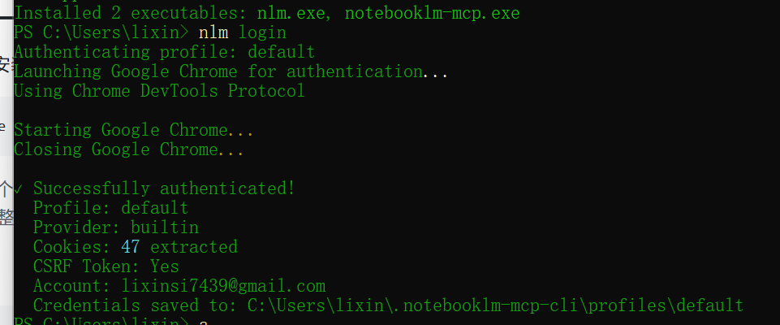
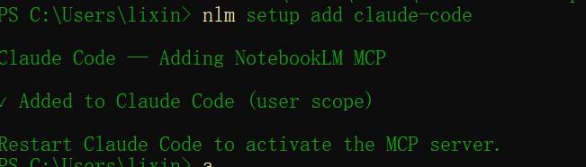

# 谷歌免费AI + Claude Code：颠覆传统的AI编程工作流

### 仓库地址[https://github.com/jacob-bd/notebooklm-mcp-cli](https://github.com/jacob-bd/notebooklm-mcp-cli)
```sql
uv tool install notebooklm-mcp-cli
```

### 完成身份验证
```sql
nlm login
```




### 配置 claudecode mcp 服务器
```sql
# Add to any supported tool
nlm setup add claude-code
nlm setup add claude-desktop
nlm setup add gemini
nlm setup add cursor
nlm setup add windsurf

# Generate JSON config for any other tool
nlm setup add json

# Check which tools are configured
nlm setup list

# Diagnose installation & auth issues
nlm doctor
```




### 实用
```sql
use the yt-search skill to find the latest trending videoson Claude Code Skills. Once we have those videos, sendthem over to NotebookLM using the notebooklm skill. Give meits analysis on the top Claude Code skills, then havenotebooklm create an infographic in a handwritten /blueprint style depicting that analysis on the top skills.
```

### 安装技能
```sql
notebooklm skill install
```


> 更新: 2026-03-10 09:06:14  
> 原文: <https://www.yuque.com/lixinsi/xdiarx/egn48kk4q2q7loav>