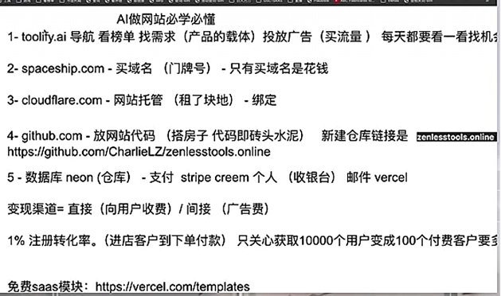
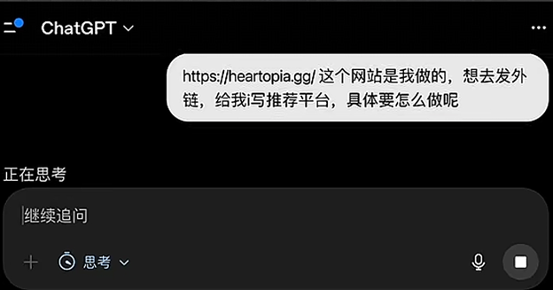
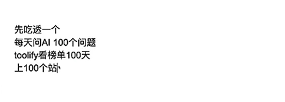

# 出海必备


## AI做网站必学必懂
1.[https://toolify.ai](https://toolify.ai)导航看榜单找需求(产品的载体)投放广告(买流量)每天都要看一看找机会

2.spaceship.com-买域名(门牌号)-只有买域名是花钱

3.cloudflare.com-网站托管(租了块地)-绑定

4.github.com-放网站代码 (搭房子代码即砖头水泥)新建仓库链接是zenlesstools.online

https://github.com/CharlieLZ/zenlesstools.online

5.数据库neon (仓库)- 支付 stripe creem个人(收银台)邮件vercel变现渠道=直接(向用户收费)/间接(广告费)

1%注册转化率。(进店客户到下单付款)只关心获取10000个用户变成100个付费客户要

免费saas模块:[https://vercel.com/template](https://vercel.com/templates)

[s](https://vercel.com/templates)

### 网站必备插件
[https://aitdk.com/zh](https://aitdk.com/zh) 查看网站流量，注册日期，关键词等几十上百个功能

[https://immersivetranslate.com/](https://immersivetranslate.com/)沉浸式翻译，网页上所有语言都转成中


### 流量获取渠道
1.付费，广告，比较贵，适合团队，已经验证的商业模式

2.SEO，搜索引擎，比较慢，新词热词做新站=蹭额点

3.产品自增长，自裂变，用户看到愿意口碑推荐，免费就可以用

4.网红大v推荐、社媒营销，buildin public

top one:

firstone新词热词新站蹭热点供小于求

number one门槛拍照技术实力

onlyone免费可用第一个


prompt:你用大白话打比方告诉我具体要做哪些工作给我梳理一个sop还有checki些方法




```bash
https://heartopia.gg/这个网站是我做的，想去发外链，给我i写推荐平台，具体要怎么做呢
```


```bash
seo是什么，怎么做，新词热词做新站=蹭热点，具体怎么弄，游戏站怎么着，找大网站新上线的新游戏新页面，去做攻略
```


门槛:程序员+产品经理有基础优缺点:起步慢平台多需要都熟悉但大多免费

信号:一千个用户

先吃透一个每天问AI100个问题

toolify看榜单100天

上100个站




```bash
作为个人我在https://www.toolify.ai/zh/里卖弄怎么找需求开始制作第一个网址，最终盈利，我想用免费方案，spaceship.com我已经购买了lxs.best域名，我有GitHub仓库，还有cloudfare，数据库的话neon (仓库) creem个人(收银台)邮件vercel，变现渠道=直接(向用户收费)/间接(广告费)。免费saas模块:https://vercel.com/template可以使用
```

```bash
用frontend-design skill帮我重新设计页面
```


> 更新: 2026-05-09 10:44:23  
> 原文: <https://www.yuque.com/lixinsi/khzg7n/kstm6d5vyiogi560>