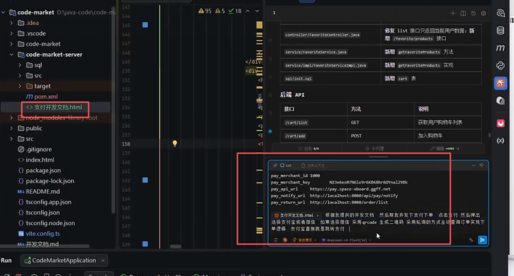

# 支付对接

```bash
pay_merchant_id 1000
pay_merchant_key N23e6eoR7N6le9r6KB68hr60Ynal296k
pay_api_url https://pay.space-xboard.ggff.net
pay_notify_url http://localhost:8080/api/pay/notify
pay_return_url http://localhost:8080/order/list
根据我提供的开发文档 然后帮我开发下支付下单 点击支付然后弹出，
支付开发文档.html选择支付宝或者微信 
如果选择微信，采用qrcode生成二维码 
采用轮询的方式主动查询订单实现下单逻辑
支付宝直撞就是跳转支付
```




> 更新: 2026-05-09 08:25:53  
> 原文: <https://www.yuque.com/lixinsi/khzg7n/wfo6qsda7kqkohsa>