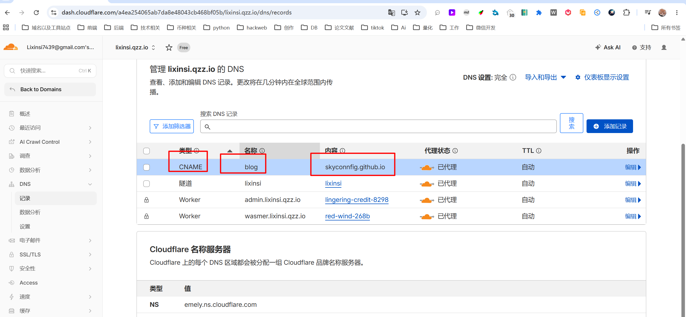
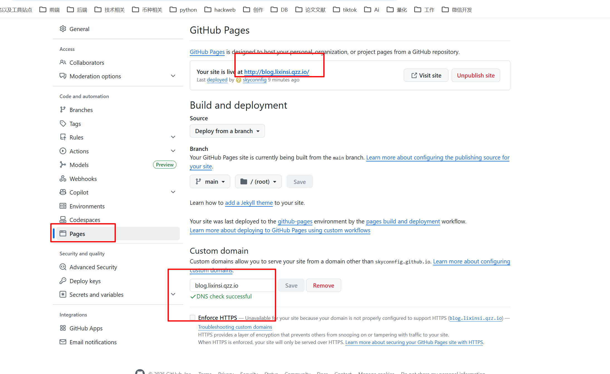
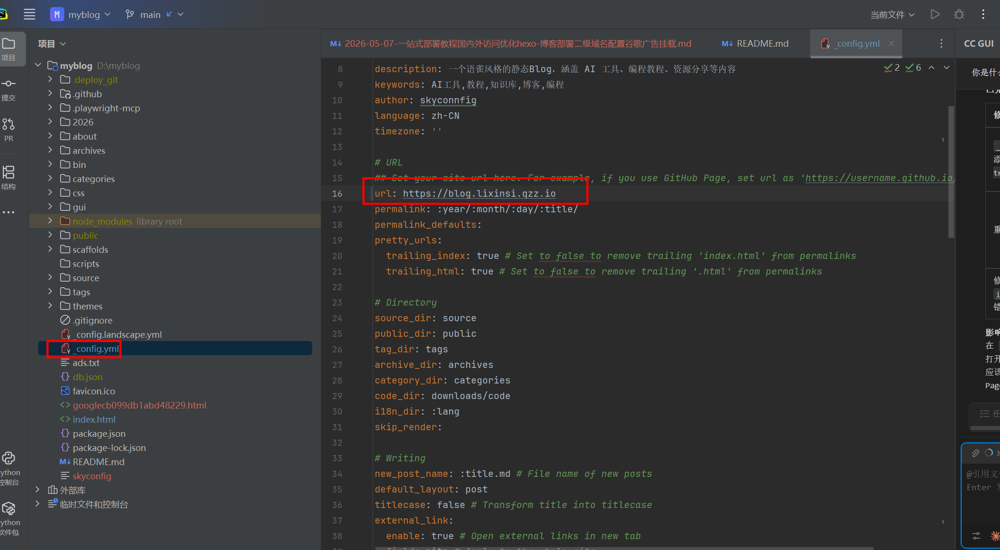

# 整个 GitHub Pages + Cloudflare + 自定义域名 + HTTPS 流程总结🚀

***

# 🌟 GitHub Pages 自定义域名 + HTTPS 标准流程（复用版）

## 1️⃣ 前提条件

* 已注册 GitHub 账号
* 已创建仓库 `用户名.github.io`（公开）
* 已购买或使用免费二级域名（支持修改 DNS）

***

## 2️⃣ 配置域名 DNS（Cloudflare）

### 二级域名（推荐）

| 类型 | Name / 主机 | Target / 值 | Proxy 状态 |
| --- | --- | --- | --- |
| CNAME | lixinsi | 用户名.github.io | DNS only（灰色） |

### 根域名（裸域）

| 类型 | Name | Target / 值 | Proxy 状态 |
| --- | --- | --- | --- |
| A | @ | 185.199.108.153 | DNS only |
| A | @ | 185.199.109.153 | DNS only |
| A | @ | 185.199.110.153 | DNS only |
| A | @ | 185.199.111.153 | DNS only |

⚠️ 注意：初期 GitHub 检测 DNS 时必须灰色云（DNS only），代理开启（橙色云）可等 HTTPS 生效后再打开加速



***

## 3️⃣ GitHub Pages 设置

1. 仓库 → Settings → Pages
2. Source：`main` / `docs` 分支（根据你项目）
3. Custom domain：填写完整域名，例如 `lixinsi.qzz.io`
4. 勾选：`Enforce HTTPS`
5. 保存，等待几分钟
6. 

***

## 4️⃣ 验证生效

* 命令行验证：

```bash
nslookup lixinsi.qzz.io
# 输出应为: skyconnfig.github.io（CNAME）
```

* 浏览器访问：`https://lixinsi.qzz.io`
* HTTPS 小锁出现 → 成功

***

## 5️⃣ GitHub Pages + Hexo 部署快速复用命令

```bash
# 初始化博客
hexo init my-blog
cd my-blog
npm install

# 部署工具
npm install hexo-deployer-git --save

# 配置 _config.yml
deploy:
  type: git
  repo: https://github.com/用户名/用户名.github.io.git
  branch: main

# 发布
hexo clean
hexo g
hexo d

#配置域名如图
```



***

## 6️⃣ 提示 & 复用技巧

* **二级域名首选 CNAME** → 简单可靠
* **裸域 A记录** → 备用
* **灰色云 DNS only** → 初期通过 GitHub DNS 检查
* **HTTPS 生效后可以开启 Cloudflare CDN** → 加速 + 防护
* **免费域名** → 流量大可能不稳定，生产建议买 `.xyz` / `.site`
* **复用模板** → 以后换博客只需修改 CNAME + GitHub 仓库即可

***


> 更新: 2026-05-08 14:28:55  
> 原文: <https://www.yuque.com/lixinsi/khzg7n/nogetaldimh71g09>