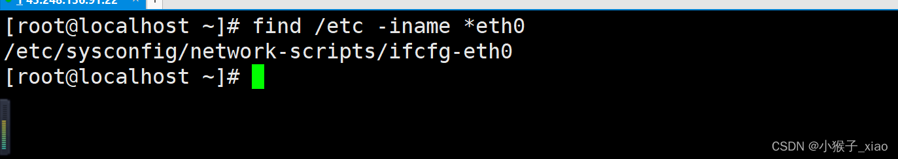

# CentOS网络配置

无论是自己搭建的虚拟机，还是自己购买的物理机，云主机，最重要的一个问题就是，首先得让网络联通，今天在这里分享一下，centos的网络配置。

部署环境：centos 7.6

1. 首先要编辑网卡配置文件，linux centos 7.5的网卡配置文件路径是：

/etc/sysconfig/network-scripts/ifcfg-eth0，此路径非常重要，以后企业主机网络不通，可从此配置文件中查看，那么这么长的路径，万一有一天，忘记了，怎么办呢？这里大家 一定要善用find命令；因为我只是知道网卡配置文件在/etc目录下，名字是eth0结尾，因此find命令为：find /etc -iname *eth0，此命令的结果如图：

vi  /etc/sysconfig/network-scripts/ifcfg-eth0

[root[@localhost ](/localhost ) ~]# vi /etc/sysconfig/network-scripts/ifcfg-em1 

DEVICE=em1  
BOOTPROTO=none  
HWADDR=00:A0:D1:EA:F0:E4  
IPV6INIT=yes  
IPV6_AUTOCONF=yes  
NM_CONTROLLED=yes  
ONBOOT=yes  
TYPE=Ethernet  
UUID="467384d9-bc11-4a27-a15e-1d1d9d42fe4b"  
DNS1=172.16.0.10  
USERCTL=no  
IPADDR=172.16.2.10  
NETMASK=255.255.0.0  
GATEWAY=172.16.0.10

vi  /etc/sysconfig/network

NETWORKING=yes  
HOSTNAME=localhost

3,  # vi /etc/resolv.conf

generated by /sbin/dhclient-script  
nameserver 172.16.0.10  
search localhost

vi /etc/hosts

127.0.0.1   localhost localhost.localdomain localhost4 localhost4.localdomain4  
::1         localhost localhost.localdomain localhost6 localhost6.localdomain6

重启网络设置使其生效： service network restart

关闭防火墙  
chkconfig iptables off  
service iptables stop

————————————————  
版权声明：本文为CSDN博主「小猴子_xiao」的原创文章，遵循CC 4.0 BY-SA版权协议，转载请附上原文出处链接及本声明。  
原文链接：[https://blog.csdn.net/m0_56221131/article/details/125973262](https://blog.csdn.net/m0_56221131/article/details/125973262)

> 更新: 2022-11-27 13:40:43  
> 原文: <https://www.yuque.com/lixinsi/gbsggt/pa2ruslsmrnkops8>