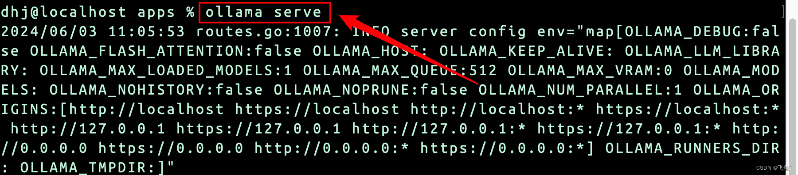
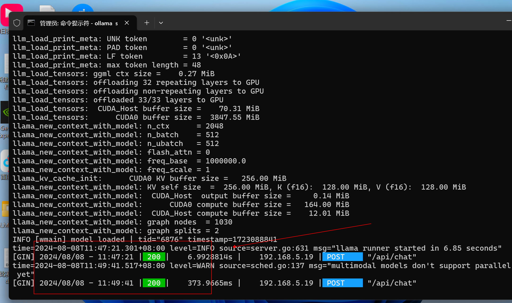

# Dify

#### 官方文档

#### <https://docs.dify.ai/getting-started/install-self-hosted/docker-compose> Compose 进行部署条件

| 操作系统 | 软件 | 解释 |
| --- | --- | --- |
| macOS 10.14 或更高版本 | Docker 桌面 | 将 Docker 虚拟机 (VM) 设置为至少使用 2 个虚拟 CPU (vCPU) 和 8 GB 初始内存。否则，安装可能会失败。有关更多信息，请参阅[Mac 版 Docker Desktop 安装指南](https://docs.docker.com/desktop/mac/install/)。 |
| Linux 平台 | Docker 19.03 或更高版本 Docker Compose 1.25.1 或更高版本 | 有关如何安装 Docker 和 Docker Compose 的更多信息，请参阅[Docker 安装指南](https://docs.docker.com/engine/install/)和[Docker Compose 安装指南。](https://docs.docker.com/compose/install/) |
| 启用了 WSL 2 的 Windows | Docker 桌面 | 我们建议将源代码和其他与 Linux 容器绑定的数据存储在 Linux 文件系统中，而不是 Windows 文件系统中。有关更多信息，请参阅[在 Windows 上使用 WSL 2 后端的 Docker Desktop 安装指南。](https://docs.docker.com/desktop/windows/install/#wsl-2-backend) |

\[！重要的]

Dify 0.6.12 对 Docker Compose 部署进行了重大改进，旨在改善您的设置和更新体验。有关更多信息，请阅读[README.md](https://github.com/langgenius/dify/blob/main/docker/README.md)。

### 克隆化

将 Dify 源代码克隆到本地机器：

复制

```plain
git clone https://github.com/langgenius/dify.git
```

### 启动 Dify

进入Dify源码中的docker目录，执行以下命令启动Dify：

复制

```plain
cd dify/docker
cp .env.example .env
docker compose up -d
```

如果你的系统安装了 Docker Compose V2 而不是 V1，请使用`docker compose`而不是`docker-compose`。运行 检查是否是这种情况`$ docker compose version`。[请在此处阅读更多信息](https://docs.docker.com/compose/#compose-v2-and-the-new-docker-compose-command)。

部署结果：

复制

```plain
[+] Running 11/11
 ✔ Network docker_ssrf_proxy_network  Created                                                                 0.1s 
 ✔ Network docker_default             Created                                                                 0.0s 
 ✔ Container docker-redis-1           Started                                                                 2.4s 
 ✔ Container docker-ssrf_proxy-1      Started                                                                 2.8s 
 ✔ Container docker-sandbox-1         Started                                                                 2.7s 
 ✔ Container docker-web-1             Started                                                                 2.7s 
 ✔ Container docker-weaviate-1        Started                                                                 2.4s 
 ✔ Container docker-db-1              Started                                                                 2.7s 
 ✔ Container docker-api-1             Started                                                                 6.5s 
 ✔ Container docker-worker-1          Started                                                                 6.4s 
 ✔ Container docker-nginx-1           Started                                                                 7.1s
```

最后检查所有容器是否运行成功：

复制

```plain
docker compose ps
```

其中包括3个核心服务：`api / worker / web`，和6个依赖组件：`weaviate / db / redis / nginx / ssrf_proxy / sandbox`。

复制

```plain
NAME                  IMAGE                              COMMAND                   SERVICE      CREATED              STATUS                        PORTS
docker-api-1          langgenius/dify-api:0.6.13         "/bin/bash /entrypoi…"   api          About a minute ago   Up About a minute             5001/tcp
docker-db-1           postgres:15-alpine                 "docker-entrypoint.s…"   db           About a minute ago   Up About a minute (healthy)   5432/tcp
docker-nginx-1        nginx:latest                       "sh -c 'cp /docker-e…"   nginx        About a minute ago   Up About a minute             0.0.0.0:80->80/tcp, :::80->80/tcp, 0.0.0.0:443->443/tcp, :::443->443/tcp
docker-redis-1        redis:6-alpine                     "docker-entrypoint.s…"   redis        About a minute ago   Up About a minute (healthy)   6379/tcp
docker-sandbox-1      langgenius/dify-sandbox:0.2.1      "/main"                   sandbox      About a minute ago   Up About a minute             
docker-ssrf_proxy-1   ubuntu/squid:latest                "sh -c 'cp /docker-e…"   ssrf_proxy   About a minute ago   Up About a minute             3128/tcp
docker-weaviate-1     semitechnologies/weaviate:1.19.0   "/bin/weaviate --hos…"   weaviate     About a minute ago   Up About a minute             
docker-web-1          langgenius/dify-web:0.6.13         "/bin/sh ./entrypoin…"   web          About a minute ago   Up About a minute             3000/tcp
docker-worker-1       langgenius/dify-api:0.6.13         "/bin/bash /entrypoi…"   worker       About a minute ago   Up About a minute             5001/tcp
```

### 升级Dify

进入dify源码的docker目录，执行以下命令：

复制

```plain
cd dify/docker
docker compose down
git pull origin main
docker compose pull
docker compose up -d
```

### 访问 Dify

最后访问<http://localhost/install>即可使用已部署的Dify。

### 定制Dify

直接编辑文件中的环境变量值`.env`。然后使用以下命令重新启动 Dify：

复制

```plain
docker compose down
docker compose up -d
```

可以在 docker/.env.example 下找到完整的带注释的环境变量。

### docker compose 安装好后对接 ollma

```sql
set OLLAMA_HOST=0.0.0.0:11434
```

<font style="color:rgb(77, 77, 77);">但是通过命令行执行命令 ollama serve 启动后，</font><font style="color:rgb(77, 77, 77);"> </font>[<font style="color:rgb(77, 77, 77);">http</font>](https://so.csdn.net/so/search?q=http\&spm=1001.2101.3001.7020)<font style="color:rgb(77, 77, 77);">://192.168.1.158:11434 可成功访问。</font>



导入成功后会返回

，，


> 更新: 2024-08-12 17:21:15  
> 原文: <https://www.yuque.com/lixinsi/gbsggt/intogauoy2rno3ug>