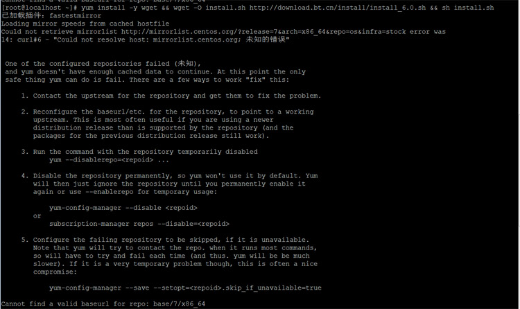

# Docker 基本概念

## 
## 安装dockers出现报错


<font style="color:rgb(85, 85, 85);">新买的服务器使用yum安装宝塔面板的时候提示：Cannot find a valid baseurl for repo: base/7/x86_64，如果出现这个问题，请按照下面的操作方法已经完美解决。</font>

<font style="color:rgb(85, 85, 85);">  
</font>

<font style="color:rgb(85, 85, 85);">登陆服务器后。</font>

<font style="color:rgb(85, 85, 85);">  
</font>

<font style="color:rgb(85, 85, 85);">输入： vi /etc/resolv.conf  回车键打开：</font>

<font style="color:rgb(85, 85, 85);">  
</font>

<font style="color:rgb(85, 85, 85);">国内的机器添加一行：</font>

<font style="color:rgb(85, 85, 85);">nameserver 114.114.114.114</font>

<font style="color:rgb(85, 85, 85);">  
</font>

<font style="color:rgb(85, 85, 85);">国外的添加一行：</font>

<font style="color:rgb(85, 85, 85);">nameserver 8.8.8.8</font>

<font style="color:rgb(85, 85, 85);">  
</font>

<font style="color:rgb(85, 85, 85);">添加后esc键，复制 :wq! 回车保存。</font>

<font style="color:rgb(85, 85, 85);">  
</font>

<font style="color:rgb(85, 85, 85);">修改完之后，需要重启网卡。</font>

<font style="color:rgb(85, 85, 85);">  
</font>

<font style="color:rgb(85, 85, 85);">centos6的网卡重启方法：service network restart</font>

## centos下安装docker
### 1.移除以前的docker相关包
```bash
sudo yum install -y yum-utils
sudo yum-config-manager \
--add-repo \
http://mirrors.aliyun.com/docker-ce/linux/centos/docker-ce.repo
```

## 2.配置yum源
```bash
sudo yum install -y yum-utils
sudo yum-config-manager \
--add-repo \
http://mirrors.aliyun.com/docker-ce/linux/centos/docker-ce.repo

```

## 3.安装docker
```bash
sudo yum install -y docker-ce docker-ce-cli containerd.io


#以下是在安装k8s的时候使用
yum install -y docker-ce-20.10.7 docker-ce-cli-20.10.7  containerd.io-1.4.6
```

## 4.启动
```bash
systemctl enable docker --now
```


## 5.配置加速
#### 这里额外添加了docker的生产环境核心配置crgroup
```bash
sudo mkdir -p /etc/docker
sudo tee /etc/docker/daemon.json <<-'EOF'
{
  "registry-mirrors": ["https://82m9ar63.mirror.aliyuncs.com"],
  "exec-opts": ["native.cgroupdriver=systemd"],
  "log-driver": "json-file",
  "log-opts": {
    "max-size": "100m"
  },
  "storage-driver": "overlay2"
}
EOF
sudo systemctl daemon-reload
sudo systemctl restart docker
```

。、


> 更新: 2024-02-22 13:25:06  
> 原文: <https://www.yuque.com/lixinsi/gbsggt/zkmzsw>