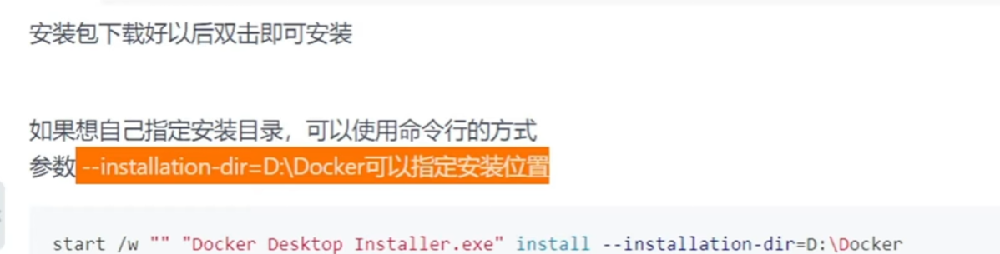
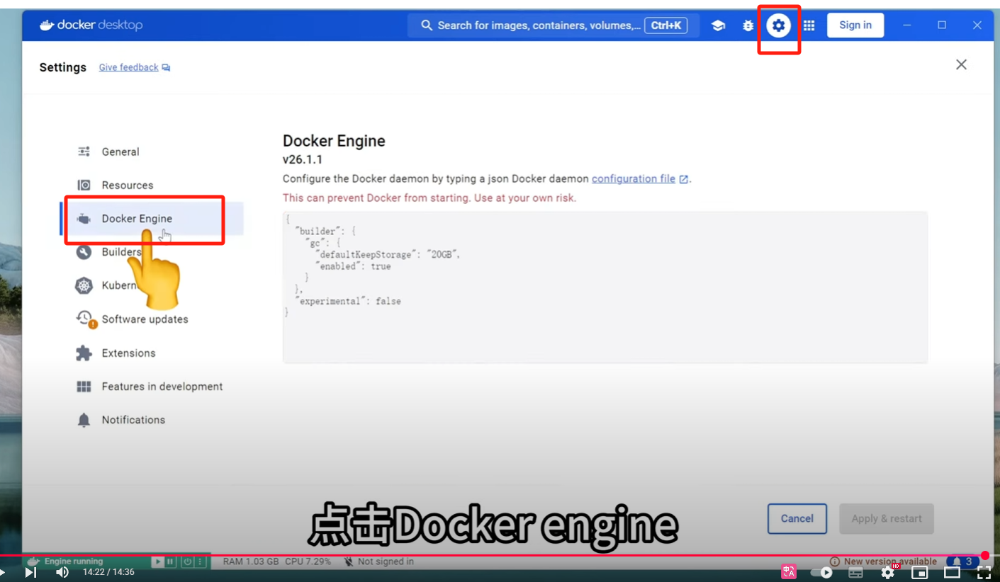
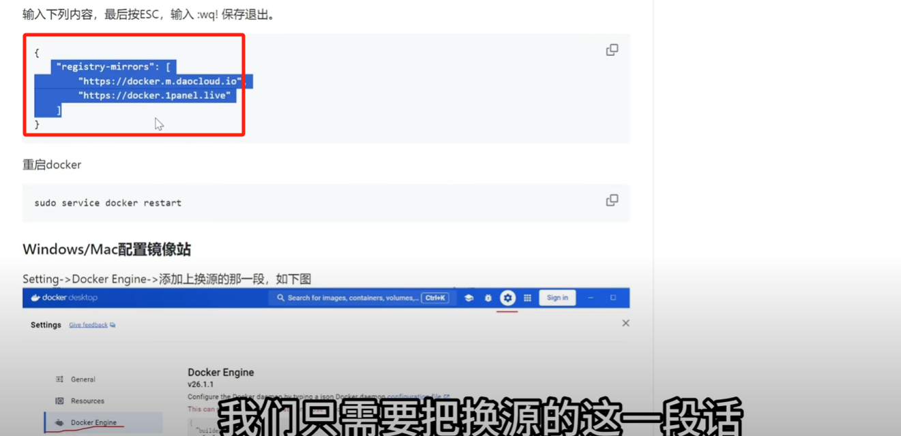
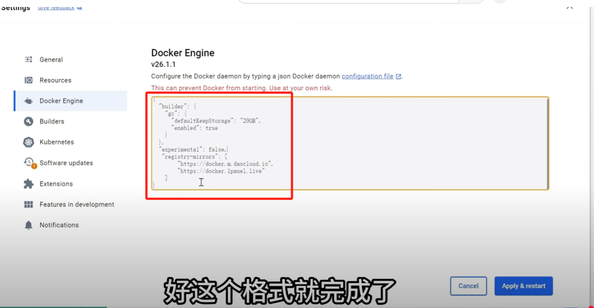

# Docker指定安装目录

### 1.删除所有 docker 镜像
```sql
docker rmi $(docker images -q) -f
```

### 2.想自己指定安装目录，可以使用命令行的方式
```python
start /w "" "Docker Desktop Installer.exe" install --installation-dir=D:\Docker
```



### 3 .配置镜像源加速


```dockerfile
  {
    “registry=mirrors”:[
    "https://docker.m.daocloud.io"
    "https://docker.1panel.live"
    ]
  }
```






> 更新: 2025-04-28 14:47:59  
> 原文: <https://www.yuque.com/lixinsi/gbsggt/iymky96llcrlyfg3>