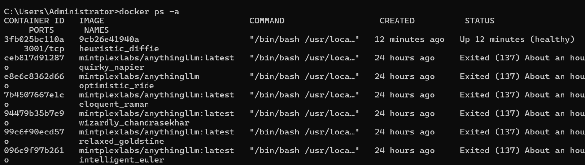
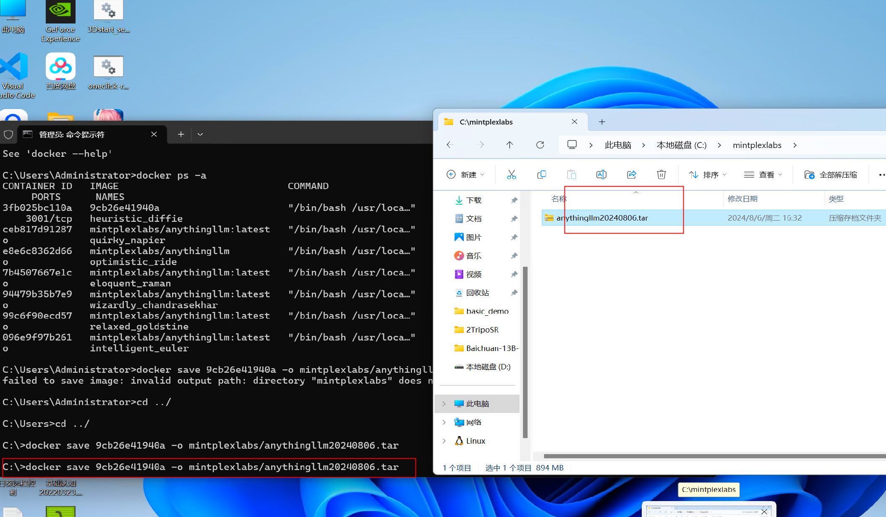
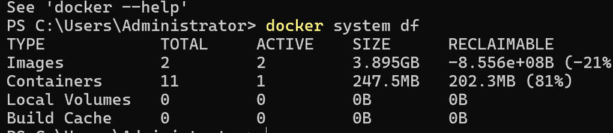
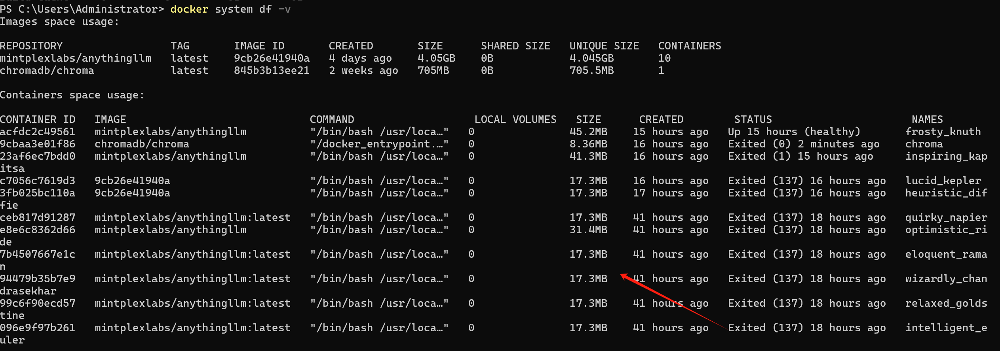

# Docker本地化打包以及迁移运行

### 1.查看正在运行 docker 镜像
```sql
docker ps -a
```



### 2.导出镜像windows 导出镜像
```sql
docker save imageID -o saveImageName.tar

docker save imageID > saveImageName.tar
```

### C 盘新建文件夹mintplexlabs
```sql
docker save 9cb26e41940a -o mintplexlabs/anythingllm20240806.tar
```



### Docker 重新启动 anythingllm
```sql
docker run -d -p 3001:3001  mintplexlabs/anythingllm
```

### Docker 启动向量数据库
```sql
docker run -d -p 8000:8000 --name chroma chromadb/chroma
```

### Docker 查看存储空间
```sql
docker system df
```



### 查看<font style="color:rgb(0, 0, 0);">查看单个image、container大小</font>
```sql
docker system df -v 
```



## <font style="color:rgb(0, 0, 0);">docker system prune命令可以用于清理磁盘，删除关闭的容器、无用的数据卷和网络，以及dangling镜像(即无tag的镜像)</font>
```dockerfile
docker system prune
#清除的彻底
docker system prune -a  命令清理得更加彻底，可以将没有容器使用Docker镜像都删掉
注意，这两个命令会把你暂时关闭的容器，以及暂时没有用到的Docker镜像都删掉了…所以使用之前一定要想清楚.。
```

### <font style="color:rgb(79, 79, 79);">生成自己的docker镜像</font>


```dockerfile
docker build -f ./docker/Dockerfile -t anythingllm:my_1.0 .
```

<font style="color:rgb(77, 77, 77);">如果想要有更多的自主和控制，比如加一些api接口。</font>

<font style="color:rgb(77, 77, 77);">2.1 下载代码</font>

```bash
git clone https://github.com/Mintplex-Labs/anything-llm.git
```

<font style="color:rgb(77, 77, 77);">2.2</font><font style="color:rgb(77, 77, 77);"> </font>**<font style="color:rgb(77, 77, 77);">Windows</font>**<font style="color:rgb(77, 77, 77);">下生成镜像</font>

<font style="color:rgb(77, 77, 77);">进入代码目录anything-llm, 执行命令</font>

```bash
docker build -f ./docker/Dockerfile -t anythingllm:my_1.0 .
```

<font style="color:rgb(77, 77, 77);">如果中间超时报错了可以多跑几次，因为会访问github下载一些依赖的东西，而我们访问github是不稳定的， 如果你有代理服务就最好了。</font>

<font style="color:rgb(77, 77, 77);">参考链接：</font>[https://blog.csdn.net/myepicure/article/details/139154711](https://blog.csdn.net/myepicure/article/details/139154711)


> 更新: 2024-08-07 10:05:29  
> 原文: <https://www.yuque.com/lixinsi/gbsggt/qdqlkmxkw8y83fm2>