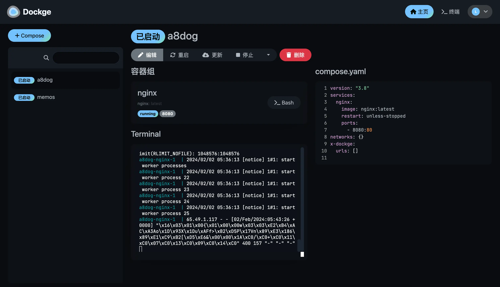

# Dockge：一个美观、易用的 Docker Compose 管理平台

<font style="color:rgb(51, 51, 51);">dockge：一个美观、易用的 Docker Compose 管理平台。该项目提供了一个 Web 界面，用于管理 docker-compose.yaml 文件。它开箱即用、界面设计精美，支持交互式编辑 compose.yaml 文件、更新 docker 镜像，以及启动、停止、重启、删除 docker 等操作。</font>

<font style="color:rgb(51, 51, 51);"></font>




## <font style="color:rgb(51, 51, 51);">安装教程：</font>
<font style="color:rgb(51, 51, 51);">首先需要准备一台vps云服务器，这里我推荐</font>**<font style="color:rgb(0, 0, 255);">伍六七云</font>**<font style="color:rgb(51, 51, 51);">：</font>[https://www.vps567.com/](https://www.4awl.net/go?_=5d0865b42faHR0cHM6Ly93d3cudnBzNTY3LmNvbS9hZmYvQkhZRUpKTVA%3D)<font style="color:rgb(51, 51, 51);"> </font>**<font style="color:rgb(255, 0, 0);">香港2H1G 5M服务器只需要15元</font>**

<font style="color:rgb(51, 51, 51);">Github：</font>[https://github.com/louislam/dockge](https://www.4awl.net/go?_=11047862bbaHR0cHM6Ly9naXRodWIuY29tL2xvdWlzbGFtL2RvY2tnZQ%3D%3D)

<font style="color:rgb(51, 51, 51);">首先安装好 Docker 和 Docker-Compose:</font>

**<font style="color:rgb(51, 51, 51);">Docker安装：</font>**

```shell
wget -qO- get.docker.com | bash
systemctl start docker
systemctl enable docker
```

Docker-Compose 安装：

```shell
sudo curl -L "https://github.com/docker/compose/releases/download/1.29.2/docker-compose-$(uname -s)-$(uname -m)" -o /usr/local/bin/docker-compose
sudo chmod +x /usr/local/bin/docker-compose
sudo ln -s /usr/local/bin/docker-compose /usr/bin/docker-compose
```

<font style="color:rgb(51, 51, 51);">再执行下面的命令安装 Dockge</font>

```shell
mkdir -p /opt/stacks /opt/dockge
cd /opt/dockge
curl https://raw.githubusercontent.com/louislam/dockge/master/compose.yaml --output compose.yaml
docker compose up -d
```


<font style="color:rgb(51, 51, 51);">打开 IP+5001 端口即可访问管理 Dockge，有趣的是 UI 和Uptime Kuma一样的。</font>

## <font style="color:rgb(51, 51, 51);">更新 Dockge：</font>
```shell
cd /opt/dockge
docker compose pull && docker compose up -d
```


> 更新: 2024-07-10 21:28:56  
> 原文: <https://www.yuque.com/lixinsi/gbsggt/nc3xsdeyz2g93pmv>