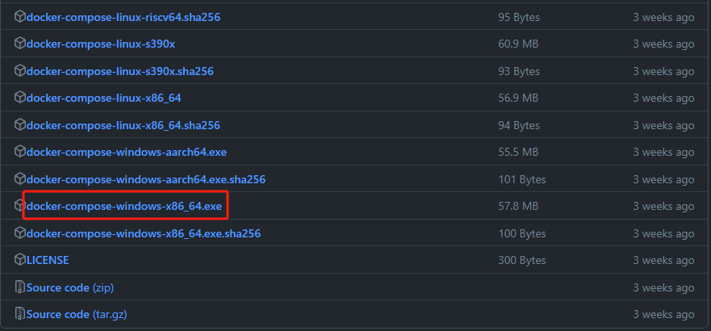
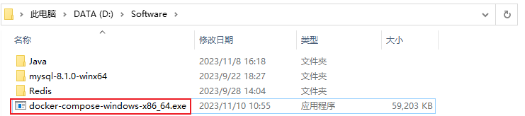
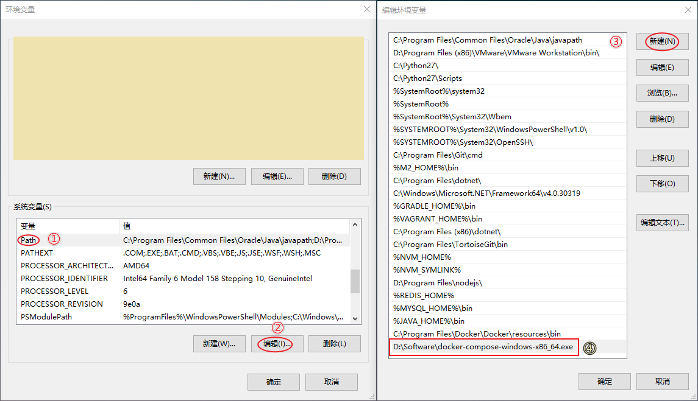
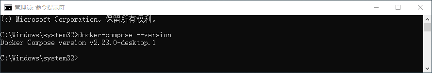

# Windows 安装 Docker Compose

#### 目录

* [前言](https://blog.csdn.net/u013737132/article/details/134521228#_4)
* [什么是 Docker Compose ？](https://blog.csdn.net/u013737132/article/details/134521228#_Docker_Compose__8)
* [安装 Docker Compose](https://blog.csdn.net/u013737132/article/details/134521228#_Docker_Compose_10)
* [配置环境变量](https://blog.csdn.net/u013737132/article/details/134521228#_23)
* [结语](https://blog.csdn.net/u013737132/article/details/134521228#_37)
* [开源项目](https://blog.csdn.net/u013737132/article/details/134521228#_47)

## 前言

在当今[软件开发](https://so.csdn.net/so/search?q=%E8%BD%AF%E4%BB%B6%E5%BC%80%E5%8F%91\&spm=1001.2101.3001.7020)和部署领域，容器化技术的应用已成为提高效率和系统可移植性的关键手段。Docker，作为领先的容器化平台，为开发人员提供了轻松构建、打包和分发应用程序的解决方案。为了方便管理多个容器，Docker Compose应运而生。本文将引导您在Windows操作系统上安装Docker Compose，并通过添加环境变量使其全局可用。通过这些简单步骤，您将能够配置Docker Compose，并充分利用容器化技术。

## 什么是 Docker Compose ？

Docker Compose是Docker官方提供的一个用于定义和运行多容器Docker应用程序的工具。通过一个单独的docker-compose.yml配置文件，开发人员可以定义应用程序的服务、网络、卷等相关配置，并通过简单的命令一键启动整个应用程序。这种方式使得开发、测试和部署多容器应用变得更加轻松，同时保持了配置的一致性。Docker Compose的出现为复杂的容器编排提供了简便的解决方案，使得开发人员能够更专注于应用程序的开发和优化。

## 安装 Docker Compose

官方安装文档：[https://docs.docker.com/desktop/install/windows-install/](https://docs.docker.com/desktop/install/windows-install/)

版本选择下载地址：[https://github.com/docker/compose/releases](https://github.com/docker/compose/releases)

直接下载地址：[docker-compose-windows-x86\_64.exe](https://github.com/docker/compose/releases/download/v2.23.0/docker-compose-windows-x86_64.exe)

下载后的文件位置

## 配置环境变量

为了让Docker Compose在你的系统中全局可用，你需要把其添加到你的系统环境变量中。首先找到docker-compose.exe的路径，然后将此路径添加到系统环境变量的Path中。

按下 Win + R 组合键来打开运行对话框，然后输入<code>sysdm.cpl</code>并按回车键，打开系统属性窗口。在系统属性窗口中，切换到**高级**标签，点击**环境变量**按钮，进入环境变量配置页面。

编辑系统变量的 Path 添加docker-cmpose 的可执行文件路径： D:\Software\docker-compose-windows-x86\_64.exe

输入<code>docker-compose --version</code> 查看版本

## 结语

随着软件开发领域的不断演进，微服务架构和[容器化](https://so.csdn.net/so/search?q=%E5%AE%B9%E5%99%A8%E5%8C%96\&spm=1001.2101.3001.7020)技术成为现代应用开发的重要组成部分。在这个背景下，Docker Compose作为一个强大的工具，为开发人员提供了简便而高效的方式来编排、管理和部署复杂的微服务应用。

通过本文，我们详细介绍了在Windows操作系统上[安装Docker](https://so.csdn.net/so/search?q=%E5%AE%89%E8%A3%85Docker\&spm=1001.2101.3001.7020) Compose的步骤，并强调了Docker Compose在微服务架构中的重要作用。其灵活的配置文件、易用的命令行工具以及对多种中间件和服务的支持，使得开发人员能够更专注于业务逻辑的开发，而无需过多关注底层的部署和管理细节。

在使用Docker Compose的过程中，开发人员能够通过一个简单的配置文件定义整个应用程序的结构，确保各个组件之间的协作无缝而一致。这种集中化的管理方式大大简化了微服务应用的开发周期，提高了开发团队的生产力。

因此，借助Docker Compose，我们可以更加轻松地驾驭复杂的微服务架构，构建可伸缩、可维护的分布式应用。在未来的软件开发中，Docker Compose将继续发挥其重要作用，为开发人员提供更便捷、高效的容器编排解决方案。

> 更新: 2024-08-08 09:05:28  
> 原文: <https://www.yuque.com/lixinsi/gbsggt/dbr1fvbd3iibuc5l>