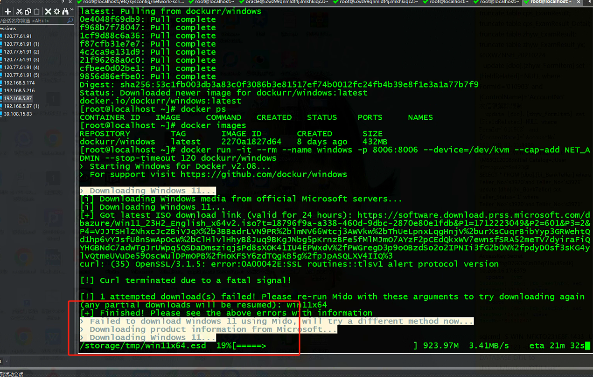

# centos安装win系统

### 1.docker拉去Windows镜像
```dockerfile
docker pull dockurr/windows
```

### 2.docker-compose.yml文件
```dockerfile
version: "3"
services:
  windows:
    image: dockurr/windows
    container_name: windows
    environment:
      VERSION: "win11"
    devices:
      - /dev/kvm
    cap_add:
      - NET_ADMIN
    ports:
      - 8006:8006
      - 3389:3389/tcp
      - 3389:3389/udp
    stop_grace_period: 2m
    restart: on-failure

    #磁盘分区
    volumes:
      -./data:/storage

    #kvm内存/CPU/磁盘大小配置
      environment:
      RAM_SIZE:"8G"
      CPU_CORES:3
      DISK_SIZE:"100G"
```

### 
### 3.执行docker run命令，截图如下
```dockerfile
docker run -it --rm --name windows -p 8006:8006 --device=/dev/kvm --cap-add NET_ADMIN --stop-timeout 120 dockurr/windows
```




> 更新: 2024-04-06 22:22:49  
> 原文: <https://www.yuque.com/lixinsi/gbsggt/rmif6xt4bm6x7noc>