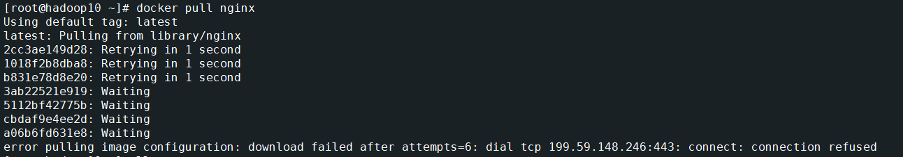
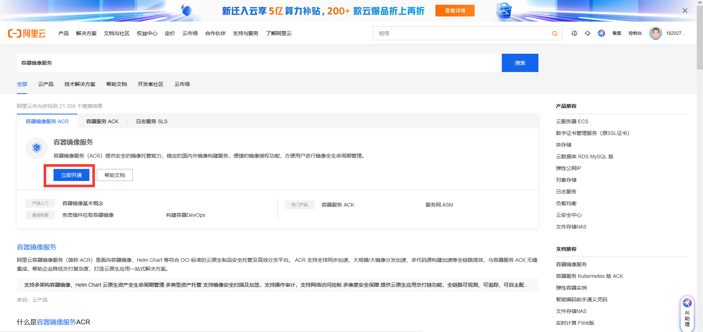
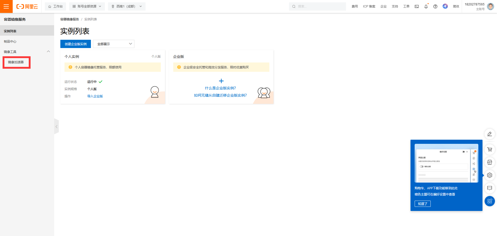
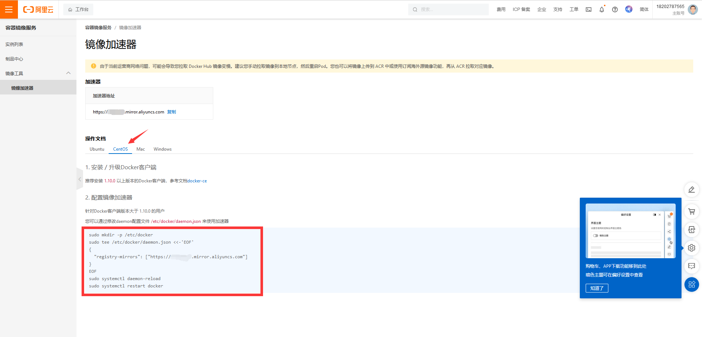
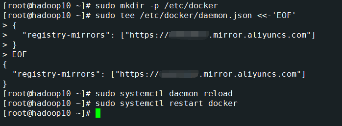
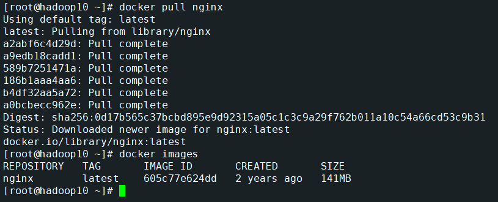

# docker拉取镜像失败error pulling image configuration: download failed after attempts=6: dial tcp 199.59.148.246:443: connect: connectio

<font style="color:rgb(35, 38, 59);">最近很多朋友遇到docker拉取镜像失败的问题  
</font><font style="color:rgb(35, 38, 59);">  
因为一些网络问题，无法访问docker官方镜像仓库，我们可以通过设置阿里云镜像加速器的方式解决该问题。  
解决方法：  
1.访问阿里云官网，并登录</font>

```bash
https://www.aliyun.com/
```

<font style="color:rgb(35, 38, 59);">2.搜索 容器镜像服务  
</font><font style="color:rgb(35, 38, 59);">  
</font><font style="color:rgb(35, 38, 59);">3.点击 立即开通  
</font><font style="color:rgb(35, 38, 59);">  
</font><font style="color:rgb(35, 38, 59);">4.根据提示免费开通个人版，开通后如图  
</font><font style="color:rgb(35, 38, 59);">  
</font><font style="color:rgb(35, 38, 59);">5.在左侧菜单栏找到 镜像加速器 并进入，可以看到设置镜像加速的命令  
</font><font style="color:rgb(35, 38, 59);">  
</font><font style="color:rgb(35, 38, 59);">6.在服务器上执行设置镜像加速的命令  
</font><font style="color:rgb(35, 38, 59);">  
</font><font style="color:rgb(35, 38, 59);">7.执行docker pull命令，可以看到可以拉取镜像了  
</font>

<font style="color:rgb(35, 38, 59);">  
</font>

**<font style="color:rgb(221, 221, 221);">__EOF__</font>**


> 更新: 2024-07-11 09:40:35  
> 原文: <https://www.yuque.com/lixinsi/gbsggt/tdz1yt73pt6widrp>