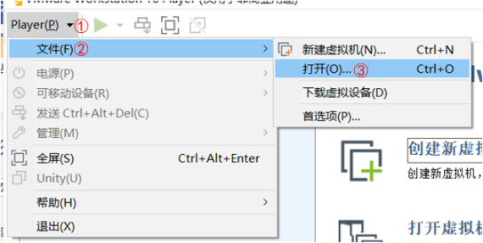
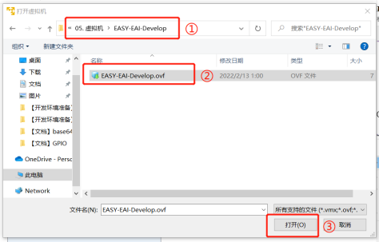
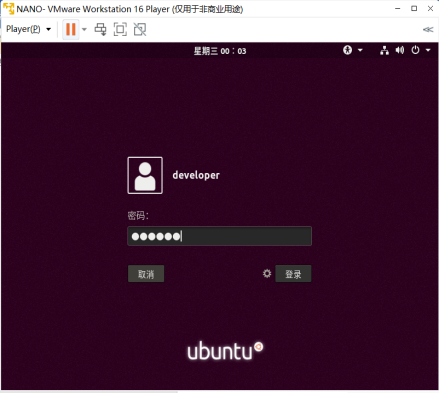
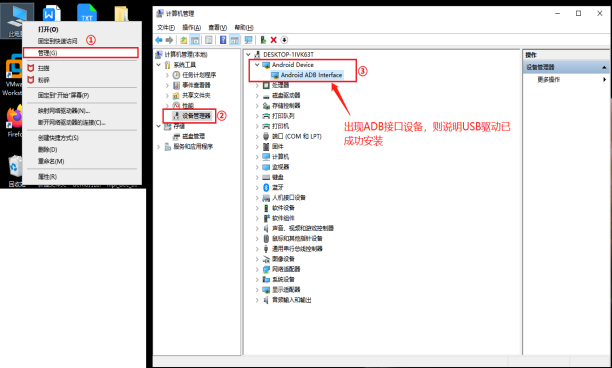
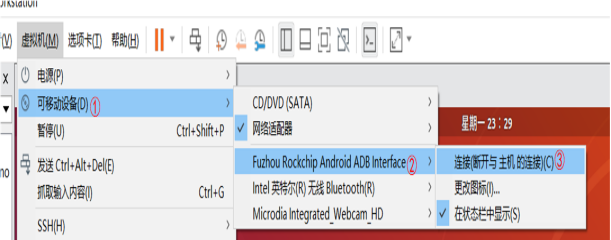
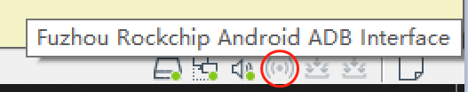

# 算法模型部署流程

# **湖南典阅教育科技有限公司**
## **算法模型部署流程**
## **一、****开发环境准备**
#### **（一）****、****Linux****虚拟机准备**
##### **1、****V****Mwa****re****环境搭载**
**1.1、****VMware****虚拟机下载**

可在官网下载vmware-pro15虚拟机版本，官网下载地址如下：[https://www.vmware.com/cn.html](https://www.vmware.com/cn.html)

<font style="color:rgb(0,0,0);">也可在百度网盘下载，</font>

<font style="color:rgb(0,0,0);">链接：</font><font style="color:rgb(0,0,0);">https://pan.baidu.com/s/1W541Le42jRhEHM8jp9grnw</font>

<font style="color:rgb(0,0,0);">提取码：</font><font style="color:rgb(0,0,0);">0825</font>

<font style="color:rgb(255,0,0);">＊推荐下载方式为网盘下载，防止出现版本不匹配现象</font>

**1.2、****VMware****安装**

解压下载的vmware-pro15.zip安装包，解压之后得到如下两个文件

<font style="color:rgb(0,0,0);">运行</font><font style="color:rgb(0,0,0);">VMware-workstation-full-15.5.0-14665864.exe文件，开始安装，根据提示执行下一步操作，</font>


在安装至如下界面时选择许可证按钮，输入正确许可证密钥

许可证密钥获取方法：打开解压文件后得到的注册机文件夹

运行里面的exe文件，如下所示，点击Generate按钮生成许可证密钥，


将得到的输入安装界面


输入后完成安装，后续进行VMware下的Ubuntu安装。

##### **2、****使用****Ubuntu****镜像**
Ubuntu镜像文件百度网盘获取：

链接：https://pan.baidu.com/s/1fb5YOq4HHiBTB8bIrLhMyw

提取码：<font style="color:rgb(0,0,0);">0825</font>

<font style="color:rgb(255,0,0);">＊该镜像文件我司以搭建完整</font>

**2.1****、导入****Ubuntu****镜像**

下载Ubuntu镜像之后，VMware打开操作如下：



<font style="color:rgb(0,0,0);"></font>  打开镜像源文件如下所示。



打开ovf文件后，需要定位本地的虚拟机名字和保存地址，如下所示。

<font style="color:rgb(0,0,0);"></font>

导入成功后如下所示。

<font style="color:rgb(0,0,0);"></font>


**2.2****、打开****Ubuntu****虚拟机**

点击“播放虚拟机”后，即可进入Ubuntu虚拟机。登录密码为“123456”。



**2.3****、****Ubuntu****镜像资源**

Ubuntu镜像默认搭建好初级的开发环境，文件如下所示。

| **<font style="color:rgb(255,255,255);">工具</font>** | **<font style="color:rgb(255,255,255);">描述</font>** |
| :---: | :---: |
| <font style="color:rgb(0,0,0);">/opt/rv1126_rv1109_sdk</font> | <font style="color:rgb(0,0,0);">交叉编译工具</font> |
| <font style="color:rgb(0,0,0);">qtcreator</font> | <font style="color:rgb(0,0,0);">qt编译环境</font> |
| <font style="color:rgb(0,0,0);">.bashrc</font> | <font style="color:rgb(0,0,0);">编译环境配置文件</font> |


#### **（二）、USB驱动安装**
##### **1、****下载驱动包**
百度网盘下载：

链接：[https://pan.baidu.com/s/1eUmVC5Tn_QI2WRCxyOcYPA](https://pan.baidu.com/s/1eUmVC5Tn_QI2WRCxyOcYPA)

提取码：<font style="color:rgb(0,0,0);">0825</font>

##### **2、****安装****USB****驱动**
安装驱动前，最好先断开USB的物理连接。解压缩USB驱动包DriverAssitant_v5.0.zip，打开“DriverInstall.exe”可看见以下窗口。

<font style="color:rgb(0,0,0);"></font>

点击“驱动安装”，等待片刻，程序会提示“安装驱动成功”，表示USB驱动已安装成功，部分系统需要重启电脑才能生效。

<font style="color:rgb(0,0,0);"></font>

 安装驱动成功后，即可开始对板卡执行固件烧录、ADB调试等操作。


##### **3、确认结果**
<font style="color:rgb(0,0,0);"></font>最后确认驱动是否已经被正确安装。

**<font style="color:rgb(0,0,0);">Window平台：</font>**



如果Window平台上没有出现ADB接口设备，则USB有可能被虚拟机接管。

**<font style="color:rgb(0,0,0);">虚拟机：</font>**



链接成功会在虚拟机的右下角图标内会显色标注一个USB接口设备，如下所示。



#### **（三）、安装以及调试**
##### 1.部署过程1
```bash
 cd /opt/
 ls
cd yolov5_detect_C_demo/
  ls
 cd yolov5_detect_C_demo/
  ./build.sh 
  //demon文件拷贝到开发板里面
 cp yolov5_detect_demo_release/ /mnt/userdata/ -rf
 

```

##### 2.部署过程2
```bash
//进入开发板
adb shell
//退出开发板
exit
  cd /opt/
  ls
  cd yolov5_detect_C_demo/
  ls
    5 cd yolov5_detect_C_demo/
    6  ls
    7  ./build
    8  ./build.sh 
    9  cp yolov5_detect_demo_release/ /mnt/userdata/ -rf
   10  ll
   11  history

```

##### 3.注意事项
adb通讯端口窗口要一直开启  另外一个终端也要开启

[EASY EAI灵眸科技 | 让边缘AI落地更简单](https://www.easy-eai.com/document_details/3/137)


> 更新: 2023-09-25 17:03:13  
> 原文: <https://www.yuque.com/lixinsi/gbsggt/hi1uittrich93gt8>