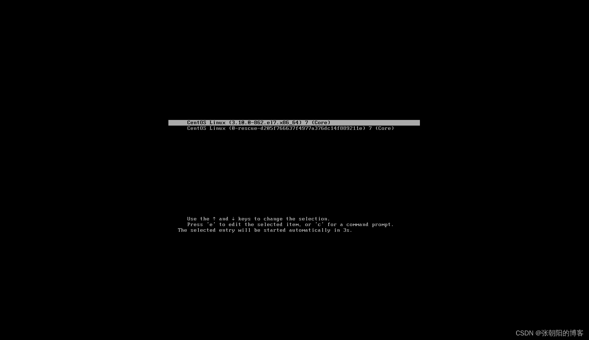
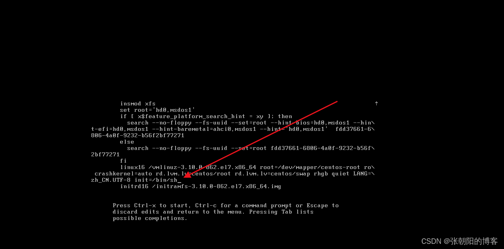
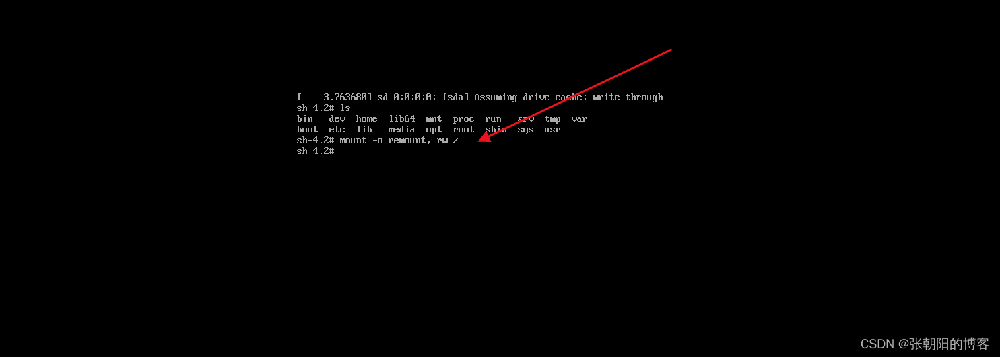
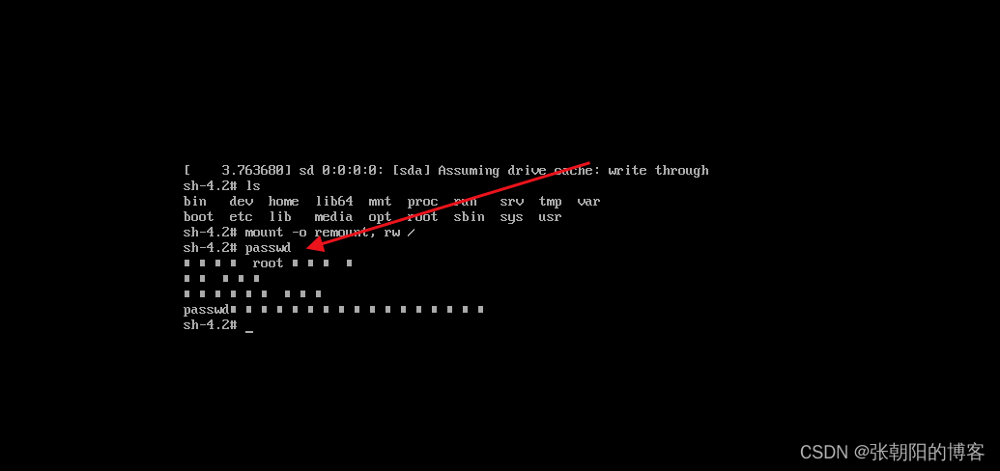
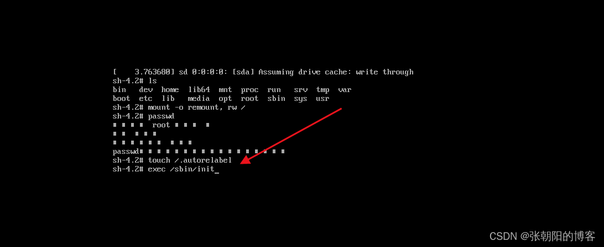
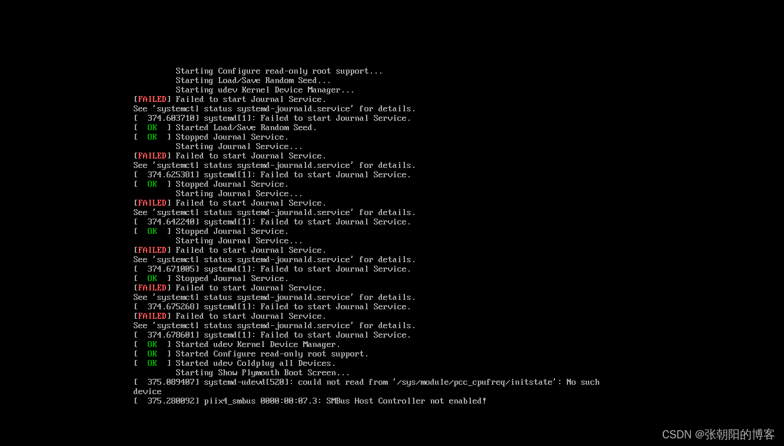
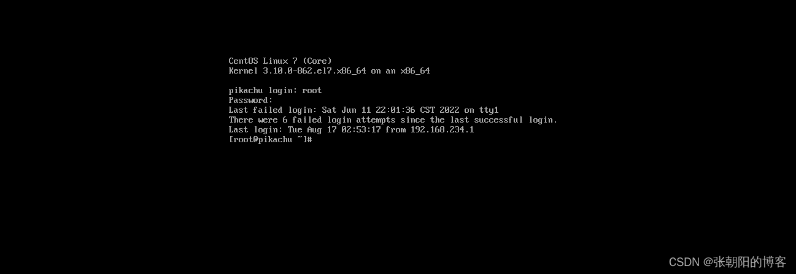

# Centos7忘记密码怎么办

Centos7忘记密码怎么办

一、按“e”进入

二、按方向键↓移动到如图所示位置，输入init=/bin/sh ，同事按Ctrl+X，进入到Emergency模式

 

三、 输入ls查看一下当前目录，输入mount -o remount, rw / 挂载根目录

四、输入passwd来更改root用户的密码，按照提示输入两遍密码

 

五、输入touch /.autorelabel来更新系统信息   输入exec /sbin/init来重启系统

六、出现如下界面，等待重启 

输入密码，修改成功 

## 修改ip地址
编辑 /etc/sysconfig/network-scripts/ifcfg-eth0

TYPE=Ethernet  
BOOTPROTO=static **静态ip**  
DEFROUTE=yes  
IPV4_FAILURE_FATAL=no  
IPV6INIT=yes  
IPV6_AUTOCONF=yes  
IPV6_DEFROUTE=yes  
IPV6_FAILURE_FATAL=no  
NAME=eno16777736  
UUID=34bbe4fa-f0b9-4ced-828a-f7f7e1094e4a  
DEVICE=eno16777736  
ONBOOT=yes  
PEERDNS=yes  
PEERROUTES=yes  
IPV6_PEERDNS=yes  
IPV6_PEERROUTES=yes  
IPADDR=192.168.179.3 **ip地址**  
NETMASK=255.255.255.0 **子网掩码**  
GATEWAY=192.168.179.2 **网关**

运行 service network restart

## 修改dns地址
编辑/etc/resolv.conf  
修改文件内容 nameserver 114.114.114.114

## 常用dns地址
114.114.114.114  
114.114.115.115  
223.5.5.5 阿里  
223.6.6.6 阿里  
180.76.76.76 百度

更改主机名字

hostnamectl set-hostname master

 

> 更新: 2022-07-21 10:51:04  
> 原文: <https://www.yuque.com/lixinsi/ii9bf8/rlw882>