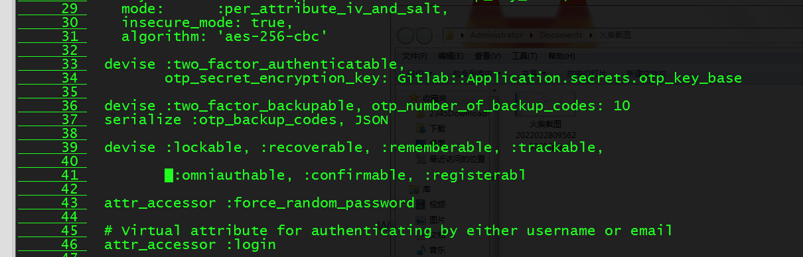

# gitlab部署

    1  hostnamectl set-hostname master1

    2  exit

    3  ifconfig

    4  hostnamectl set-hostname gitlab

    5  exit

    6  yum install -y curl policycoreutils-python openssh-server

     //安装gitlab依赖库

    7  sudo yum install curl policycoreutils open-ssh-server openssh-clients   

    8  sudo systemctl enable sshd   //开机自己启动

    9  pa aux | grep ssh

   10  ps aux | grep ssh            //查看进程是否起来

   11  netstat -anpt | grep 22   //查看端口是否起来

自己在云服务器中搭建了一个gitlab（系统为CentOS 7.6），首先是自己申请了一个阿里云账号，按照教程（云服务器 ECS 建站教程：GitLab的安装及使用-阿里云开发者社区 (aliyun.com)）操作，没有问题，然后使用公司阿里云账号再次搭建了一个gitlab，然而初始化的时候修改管理员密码的时候总是失败，提示见下图

 在网上找了一些解决方案，如刷新、提高密码复杂度、在服务器里面用命令修改密码等都试过，都没有解决。

如果大家尝试上面方法也无法解决，可以试试这个，最后我的解决方案是：

修改gitlab的端口，因为我之前设置的端口被其他服务占用了，导致修改管理员密码失败，后来在服务器中改了一下端口问题完美解决。

查看端口占用情况：netstat -tunlp

修改gitlab端口的方法如下：

1、修改nginx端口（此处修改的端口号可根据查看端口占用情况，选择一个未被占用的端口）

vi /etc/gitlab/gitlab.rb

打开gitlab.rb后，修改nginx监听端口： 

nginx['listen_port']=9082

2、修改

vi /var/opt/gitlab/nginx/conf/gitlab-http.conf

server {

    listen *:9082;

3、如果开启了防火墙，则需要添加端口允许访问（如果关闭防火墙则可以暂时跳过此步）

firewall-cmd --zone=public --permanent --add-port=9082/tcp

 

firewall-cmd --reload   # 防火墙重新加载配置

其他防火墙常用命令

systemctl status firewalld  # 查看防火墙状态

systemctl start firewalld   # 开启防火墙

systemctl stop firewalld    # 关闭防火墙

firewall-cmd --zone=public --list-ports  # 查看防火墙对外开放的端口号

firewall-cmd --zone=public --permanent --remove-port=9082/tcp   # 删除防火墙对外开放的端口号

firewall-cmd --zone=public --permanent --add-port=9082/tcp  # 添加防火墙对外开放的端口号

firewall-cmd --reload   # 防火墙重新加载配置

 4、保存配置，重启gitlab

sudo gitlab-ctl reconfigure     # 重新加载配置

sudo gitlab-ctl restart         # 重启所有gitlab组件

其他gitlab常用命令 

sudo gitlab-ctl start       # 启动所有 gitlab 组件；

sudo gitlab-ctl stop        # 停止所有 gitlab 组件；

sudo gitlab-ctl restart     # 重启所有 gitlab 组件；

sudo gitlab-ctl status      # 查看 gitlab 状态；

sudo gitlab-ctl reconfigure        # 重新加载gitlab配置；

sudo vim /etc/gitlab/gitlab.rb     # 修改默认的配置文件；

gitlab-rake gitlab:check SANITIZE=true --trace    # 检查gitlab；

sudo gitlab-ctl tail        # 查看日志；

5、 在阿里云服务器ECS实例中，设置安全组允许你设置的端口访问即可

至此，在浏览器中输入ip:port 后可以成功修改密码（由于服务重启浏览器中输入ip端口号后有可能需要等待几分钟），成功进入管理界面。

1. 修改一下配置文件：vi /opt/gitlab/embedded/service/gitlab-rails/app/models/user.rb在54行左右找到以下代码：devise :lockable, :recoverable, :rememberable, :trackable,:validatable, :omniauthable, :confirmable, :registerable去掉“:validatable,”
2. 3重新配置，重启即可：gitlab-ctl reconfiguregitlab-ctl restart重新访问没有提示邮箱验证，可离线修改密码了

> 更新: 2022-03-13 22:16:03  
> 原文: <https://www.yuque.com/lixinsi/ii9bf8/ierd0n>