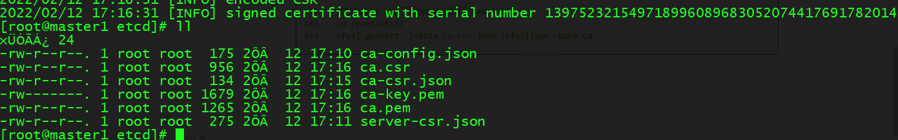

# k8s1.15安装操作文档

### 一.系统初始化


```shell
#初始化工具安装
#所有节点
yum install net-tools vim wget lrzsz git -y

#关闭防火墙和Selinux
#所有节点
systemctl stop firewalld
systemctl disable firewalld
sed -i 's/^SELINUX=enforcing$/SELINUX=permissive/' /etc/selinux/config
reboot

#设置时区
#所有节点
\cp /usr/share/zoneinfo/Asia/Shanghai /etc/localtime -rf

#关闭交换分区
#所有节点
swapoff -a
sed -ri 's/.*swap.*/#&/' /etc/fstabsed -ri 's/.*swap.*/#&/' /etc/fstab

#设置时间同步
#所有节点
yum install -y ntpdate
ntpdate -u ntp.api.bz
echo "*/5 * * * * ntpdate time7.aliyun.com >/dev/null 2>&1" >> /etc/crontab
service crond restart
chkconfig crond on

##注意第一次安装删除
rm /etc/yum.repos.d/epel.repo -rf
```

### 二.k8s安装
```shell
#设置主机名
master1 10.0.1.134
master2 10.0.1.129
master3 10.0.1.130
node1   10.0.1.133
node2   10.0.1.135

#所有节点
#设置主机名
cat > /etc/hosts <<EOF
127.0.0.1 localhost localhost.localdomain localhost4 localhost4.localdomain4
::1       localhost localhost.localdomain localhost6 localhost6.localdomain6
192.168.5.178 master
192.168.5.170 node1
192.168.5.215 node2
EOF
#所有节点
#设置免密码登入
#丛任意master节点分发配置到其它所有的节点（其中包括master和node）
#本示例从master1分发
ssh-keygen -t rsa -p "" -f /root/.ssh/id_rsa
#更改ssh免密密码
export mypass=sa123
name=(master node1 node2)
#分发
for i in ${name[@]};do
expect -c "
spawn ssh-copy-id -i /root/.ssh/id_rsa.pub root@$i
	expect {
  	\"*yes/no*\" {send \"yes\r\";exp_continue}
  \"*password*\" {send \"$mypass\r\";exp_continue}
  \"*password*\" {send \"$mypass\r\";exp_continue}
 }"
done
#测试链接
ssh node1


#优化内核参数
#查看原来参数

#所有节点
cat >/etc/sysctl.conf <<EOF
net.bridge.bridge-nf-call-iptables=1
net.bridge.bridge-nf-call-ip6tables=1
net.ipv4.ip_forward=1
vm.swappiness=0
fs.file-max=52706963
fs.nr_open=52706963
EOF

#应用内核配置
sysctl -p

#高可用节点安装Keepalived
yum install -y keepalived

#配置证书
#在master分发机上操作
#创建软件目录
mkdir /soft && cd /soft
#下载安装软件包
wget https://pkg.cfssl.org/R1.2/cfssl_linux-amd64
wget https://pkg.cfssl.org/R1.2/cfssljson_linux-amd64
wget https://pkg.cfssl.org/R1.2/cfssl-certinfo_linux-amd64

chmod +x cfssl_linux-amd64 cfssljson_linux-amd64 cfssl-certinfo_linux-amd64

mv cfssl_linux-amd64 /usr/local/bin/cfssl
mv cfssljson_linux-amd64 /usr/local/bin/cfssljson
mv cfssl-certinfo_linux-amd64 /usr/bin/cfssl-certinfo

#生成etcd证书
#创建一个目录(master1)
mkdir /root/etcd && cd /root/etcd

#ca证书配置
cat << EOF | tee ca-config.json
{
	"signing": {
		"default": {
			"expiry": "87600h"
		},
		"profiles": {
			"www": {
				"expiry": "87600h",
				"usages": [
					"signing",
					"key encipherment",
					"server auth",
					"client auth"
				]
			}
		}
	}
}
EOF
#创建ca证书请求文件(master1)
cat << EOF | tee ca-csr.json
{
	"CN": "etcd CA",
	"key": {
		"algo": "rsa",
		"size": 2048
	},
	"names": [{
		"C": "CN",
		"L": "Beijing",
		"ST": "Beijing"
	}]
}
EOF

#创建rtcd证书请求文件
#可以把所有的master ip加入到csr文件中（master1）
10.0.1.134 10.0.1.129 10.0.1.130
cat << EOF | tee server-csr.json
{
	"CN": "etcd",
	"hosts": [
		"master1",
		"master2",
		"master3",
		"10.0.1.134",
		"10.0.1.129",
		"10.0.1.130"
	],
	"key": {
		"algo": "rsa",
		"size": "2048"
	},
	"names": [
        {
		"C": "CN",
		"L": "Beijing",
		"ST": "Beijing"
	}
    ]
}
EOF

#生成etcd ca证书和etcd公私钥(master1)
cd /root/etcd/
cfssl gencert -initca ca-csr.json |cfssljson -bare ca -


```



```shell
生成server证书的时候出错
json:无法将字符串解组为int类型的Go值
cfssl gencert -ca=ca.pem -ca-key=ca-key.pem -config=ca-config.json -profile=www server-csr.json | cfssljson -bare server
```

```shell
#下载etcd软件包
cd /soft/
wget https://github.com/etcd-io/etcd/releases/download/v3.4.13/etcd-v3.4.13-linux-amd64.tar.gz
[root@master1 soft]# tar -xvf etcd-v3.4.13-linux-amd64.tar.gz
[root@master1 soft]# cp -p etcd-v3.4.13-linux-amd64/etcd* /usr/local/bin/
#拷贝到另外两台master上
[root@master1 soft]# for i in master2 master3;do scp /usr/local/bin/etc* $i:/usr/local/bin/;done
#编辑修改etcd配置文件
#注意修改每个节点的etcd name
#注意修改每个节点的监听地址
#创建配置文件目录
[root@master1 soft]# mkdir -p /etc/etcd/cfg/
vi /etc/etcd/cfg/etcd.conf 
cat > /usr/lib/systemd/system/etcd.service<<EOFL
[Unit]
Description=Etcd Server
After=network.target
After=network-online.target
Wants=network-online.target

[Service]
Type=notify
EnvironmentFile=/etc/etcd/cfg/etcd.conf
ExecStart=/usr/local/bin/etcd \
--initial-cluster-state=new \
--cert-file=/etc/etcd/ssl/server.pem \
--key-file=/etc/etcd/ssl/server-key.pem \
--peer-cert-file=/etc/etcd/ssl/server-key.pem \
--peer-key--file=/etc/etcd/ssl/server-key.pem \
--trusted-ca-file=/etc/etcd/ssl/ca.pem \
--peer-trusted-ca-file=/etc/etcd/ssl/ca.pem
Restart=on-failure
LimitNOFILE=65536

[Install]
WantedBy=multi-user.target
EOFL

#复制etcd到指定目录
[root@master1 ~]# mkdir -p /etc/etcd/ssl/
[root@master1 ~]# \cp /root/etcd/*pem /etc/etcd/ssl/ -rf

#复制etcd证书到每个节点
[root@master1 ~]# for i in master2 master3 node1 node2;do ssh $i mkdir -p /etc/etcd/{cfg,ssl};done
[root@master1 ~]# for i in master2 master3 node1 node2;do scp /etc/etcd/ssl/* $i:/etc/etcd/ssl/ ;done
[root@master1 ~]# for i in master2 master3 node1 node2;do echo $i "-------->"; ssh $i ls /etc/etcd/ssl/;done

#启动etcd(所有节点)
systemctl daemon-reload
chkconfig etcd on
service etcd start
```


> 更新: 2022-06-22 17:11:49  
> 原文: <https://www.yuque.com/lixinsi/ii9bf8/mgz0xp>