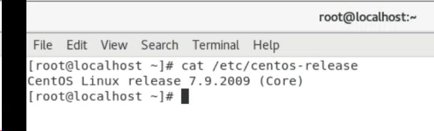

# k8s集群搭建

## 1.1 安装方式


+ kubernetes有多种部署方式，目前主流的方式有kubeadm、minikube、二进制包。


+ ① minikube：一个用于快速搭建单节点的kubernetes工具。
+ ② kubeadm：一个用于快速搭建kubernetes集群的工具。
+ ③ 二进制包：从官网上下载每个组件的二进制包，依次去安装，此方式对于理解kubernetes组件更加有效。


> + 我们需要安装kubernetes的集群环境，但是又不想过于麻烦，所以选择kubeadm方式。
>

## 1.2 主机规划
| 角色 | IP地址 | 操作系统 | 配置 |
| --- | --- | --- | --- |
| Master | 192.168.5.100 | CentOS7.8+，基础设施服务器 | 2核CPU，2G内存，50G硬盘 |
| Node1 | 192.168.5.101 | CentOS7.8+，基础设施服务器 | 2核CPU，2G内存，50G硬盘 |
| Node2 | 192.168.5.102 | CentOS7.8+，基础设施服务器 | 2核CPU，2G内存，50G硬盘 |


# 2 环境搭建


## 2.1 前言


+ 本次环境搭建需要三台CentOS服务器（一主二从），然后在每台服务器中分别安装Docker（18.06.3）、kubeadm（1.18.0）、kubectl（1.18.0）和kubelet（1.18.0）。


> 没有特殊说明，就是三台机器都需要执行。
>
> **<font style="color:rgb(38, 38, 38);">2.2 环境初始化</font>**<font style="color:rgb(38, 38, 38);">  
</font><font style="color:rgb(38, 38, 38);">  
</font>
>
> 
>
> **<font style="color:rgb(38, 38, 38);">2.2.1 检查操作系统的版本</font>**<font style="color:rgb(38, 38, 38);">  
</font><font style="color:rgb(38, 38, 38);">  
</font><font style="color:rgb(38, 38, 38);">●检查操作系统的版本（要求操作系统的版本至少在7.5以上）：  
</font>
>

```bash
cat /etc/redhat-release
```




**<font style="color:rgb(38, 38, 38);">2.2.2 关闭防火墙和禁止防火墙开机启动</font>**<font style="color:rgb(38, 38, 38);">  
</font><font style="color:rgb(38, 38, 38);">  
</font><font style="color:rgb(38, 38, 38);">●关闭防火墙：</font>

```bash
systemctl stop firewalld
```

+ 禁止防火墙开机启动：

```bash
systemctl disable firewalld
```

### 2.2.3 设置主机名


+ 设置主机名：


```bash
hostnamectl set-hostname <hostname>
```

+ 设置192.168.5.100的主机名：

```bash
hostnamectl set-hostname k8s-master
```

+ 设置192.168.5.101的主机名：

```bash
hostnamectl set-hostname k8s-node1
```

+ 设置192.168.5.102的主机名：

```bash
hostnamectl set-hostname k8s-node2
```

**<font style="color:rgb(38, 38, 38);">2.2.4 主机名解析</font>**<font style="color:rgb(38, 38, 38);">  
</font><font style="color:rgb(38, 38, 38);">  
</font><font style="color:rgb(38, 38, 38);">●为了方便后面集群节点间的直接调用，需要配置一下主机名解析，企业中推荐使用内部的DNS服务器。</font>

```bash
cat >> /etc/hosts << EOF
192.168.5.178 k8s-master
192.168.5.170 k8s-node1
192.168.5.215 k8s-node2
EOF
```

**<font style="color:rgb(38, 38, 38);">2.2.5 时间同步</font>**<font style="color:rgb(38, 38, 38);">  
</font><font style="color:rgb(38, 38, 38);">  
</font><font style="color:rgb(38, 38, 38);">●kubernetes要求集群中的节点时间必须精确一致，所以在每个节点上添加时间同步：</font>

```bash
yum install ntpdate -y
```

```bash
ntpdate time.windows.com
```

### 2.2.6 关闭selinux


+ 查看selinux是否开启：

```bash
getenforce
```

<font style="color:rgb(38, 38, 38);">永久关闭selinux，需要重启：  
</font>

```bash
sed -i 's/enforcing/disabled/' /etc/selinux/config
```

+ 临时关闭selinux，重启之后，无效：

```bash
setenforce 0
```

### 2.2.7 关闭swap分区


+ 永久关闭swap分区，需要重启

```bash
sed -ri 's/.*swap.*/#&/' /etc/fstab
```

+ <font style="color:rgb(38, 38, 38);">临时关闭swap分区，重启之后，无效：：  
</font>

```bash
swapoff -a
```

**<font style="color:rgb(38, 38, 38);">2.2.8 将桥接的IPv4流量传递到iptables的链</font>**<font style="color:rgb(38, 38, 38);">  
</font><font style="color:rgb(38, 38, 38);">  
</font><font style="color:rgb(38, 38, 38);">●在每个节点上将桥接的IPv4流量传递到iptables的链：</font>

```bash
cat > /etc/sysctl.d/k8s.conf << EOF
net.bridge.bridge-nf-call-ip6tables = 1
net.bridge.bridge-nf-call-iptables = 1
net.ipv4.ip_forward = 1
vm.swappiness = 0
EOF
```

```shell
# 加载br_netfilter模块
modprobe br_netfilter
```

```shell
# 查看是否加载
lsmod | grep br_netfilter
```

```shell
# 生效
sysctl --system
```


### 2.2.9 开启ipvs


+ 在kubernetes中service有两种代理模型，一种是基于iptables，另一种是基于ipvs的。ipvs的性能要高于iptables的，但是如果要使用它，需要手动载入ipvs模块。
+ 在每个节点安装ipset和ipvsadm：

```shell
yum -y install ipset ipvsadm
```

+ 在所有节点执行如下脚本：

```shell
cat > /etc/sysconfig/modules/ipvs.modules <<EOF
#!/bin/bash
modprobe -- ip_vs
modprobe -- ip_vs_rr
modprobe -- ip_vs_wrr
modprobe -- ip_vs_sh
modprobe -- nf_conntrack_ipv4
EOF
```

+ 授权、运行、检查是否加载：

<font style="color:rgb(38, 38, 38);">  
</font>

```shell
chmod 755 /etc/sysconfig/modules/ipvs.modules && bash /etc/sysconfig/modules/ipvs.modules && lsmod | grep -e ip_vs -e nf_conntrack_ipv4
```

+ 检查是否加载：

```shell
lsmod | grep -e ipvs -e nf_conntrack_ipv4
```

**<font style="color:rgb(38, 38, 38);">2.2.10 重启三台机器</font>**<font style="color:rgb(38, 38, 38);">  
</font><font style="color:rgb(38, 38, 38);">  
</font><font style="color:rgb(38, 38, 38);">●重启三台Linux机器：</font>

```shell
reboot
```

<font style="color:rgb(38, 38, 38);"></font>

**<font style="color:rgb(38, 38, 38);">2.3 每个节点安装Docker、kubeadm、kubelet和kubectl</font>**<font style="color:rgb(38, 38, 38);">  
</font>**<font style="color:rgb(38, 38, 38);">2.3.1 安装Docker</font>**<font style="color:rgb(38, 38, 38);">  
</font><font style="color:rgb(38, 38, 38);">●安装Docker：  
  
</font>

```shell
wget https://mirrors.aliyun.com/docker-ce/linux/centos/docker-ce.repo -O /etc/yum.repos.d/docker-ce.repo
```

```shell
yum -y install docker-ce-18.06.3.ce-3.el7
```

```shell
systemctl enable docker && systemctl start docker
```

+ 设置Docker镜像加速器：

```shell
sudo mkdir -p /etc/docker
```

```shell
sudo tee /etc/docker/daemon.json <<-'EOF'
{
  "exec-opts": ["native.cgroupdriver=systemd"],	
  "registry-mirrors": ["https://du3ia00u.mirror.aliyuncs.com"],	
  "live-restore": true,
  "log-driver":"json-file",
  "log-opts": {"max-size":"500m", "max-file":"3"},
  "storage-driver": "overlay2"
}
EOF
```

<font style="color:rgb(38, 38, 38);">  
  
</font>

<font style="color:rgb(38, 38, 38);">  
  
  
</font>

<font style="color:rgb(38, 38, 38);">  
  
  
</font>

+ 


> 更新: 2022-06-22 16:44:00  
> 原文: <https://www.yuque.com/lixinsi/ii9bf8/bya8ha>