# 安装PLSql教程

# 1.PLSQL Developer 14安装
下载链接：[plsql](https://www.32r.com/soft/79279.html)

是一款专为Oracle打造的[数据库](https://www.32r.com/zt/128.html)管理软件，由Allround Automations公司全新推出发行。该软件侧重于易用性、代码品质和生产力，充分发挥Oracle应用程序开发过程中的主要优势。除此之外，这款软件功能强大，操作方便，拥有语法高亮显示、SQL和PL/SQL帮助、对象描述、代码助理、编译器提示、重构、PL/SQL美化器、代码内容、代码层次结构、代码折叠、超链接导航等诸多复杂功能，全方位满足用户的使用需求。  
与此同时，全新版本的PLSQL Developer 14破解版带来了许多升级和优化，例如改进表定义编辑器的功能，可以直接在网格中编辑，复制和粘贴索引和分区存储。新增测试管理器功能，以方便用户快速确定所有测试是否正确运行，并在程序出现错误时，及时调查错误的原因，为用户节省时间和精力。改进了项目，添加了对Git和Subversion的支持。并且还修复了许多bug，致力于带给用户更加优质的使用体验。  
PS.此次为你带来的是PLSQL Developer 14中文破解版，附带注册机和汉化补丁，可以有效汉化和激活软件，亲测可用，欢迎有需要的用户下载使用。  
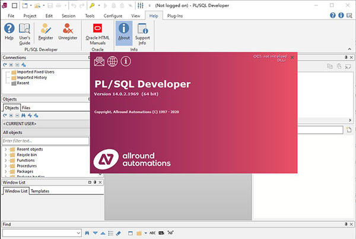

### PLSQL Developer 14破解版安装教程
1、在本站下载解压缩包后，获得PLSQL Developer 14 32和64位原程序，注册信息以及语言包。  
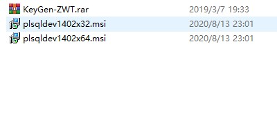  
2、这里小编以PLSQL Developer 14 64位为例，双击plsqldev1402x64.msi开始安装。  
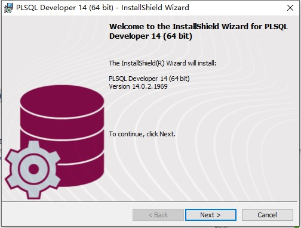  
3、阅读并同意软件安装协议。  
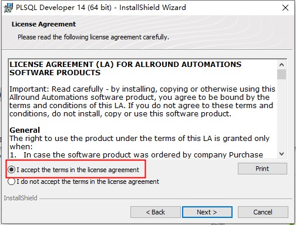  
4、设置软件安装路径，注册选项中，我们选择第二项，填入注册信息。  
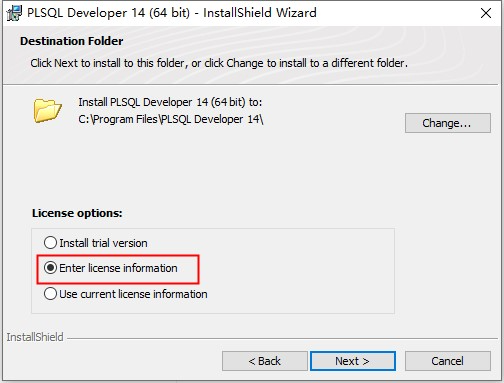  
5、打开注册机，点击generate生成注册信息。  
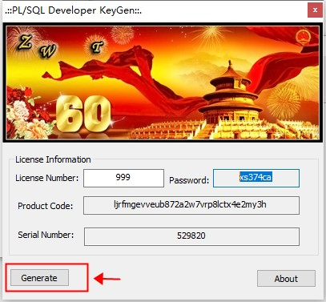  
6、将注册信息填入对应的信息栏中。  
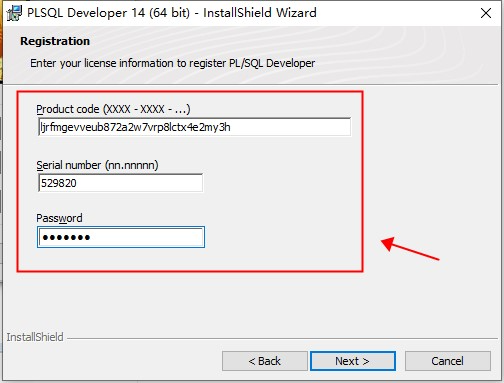  
7、安装模式默认即可。  
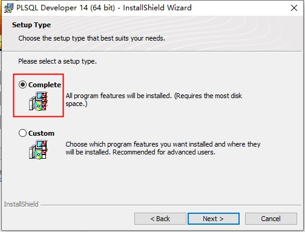  
8、等待程序安装完毕，点击【Finish】按钮即可。  
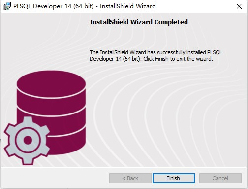  
9、这时候我们回到压缩包找到language内的chinese.exe运行它(如果想要体验其他语言也可以安装运行别的文件)。  
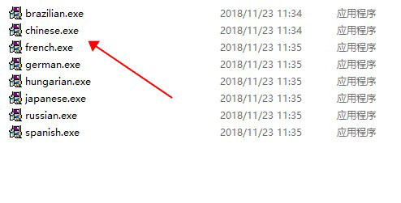  
10、目标选择PLSQL Developer 14安装根目录文件夹  
默认路径为：C:\Program Files\PLSQL Developer 14  
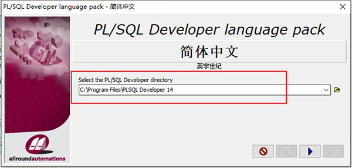  
11、完成上述操作后我们来运行桌面快捷方式，即可获得PLSQL Developer 14汉化破解版。  
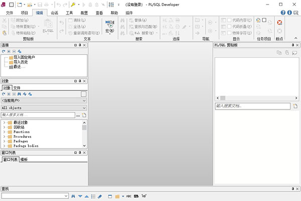  
 

### PLSQL Developer 14怎么导出数据库
PLSQL Developer是Oracle数据库用来导入导出的数据库的工具之一，现在小编为大家介绍一下PLSQL Developer怎么导出数据库，希望能帮到大家。  
1、在PLSQL Developer主界面单击菜单栏中的“工具（T）”菜单  
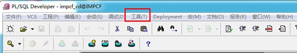  
2、在单击“工具（T）”菜单后弹出的子菜单中单击“导出用户对象（U）”  
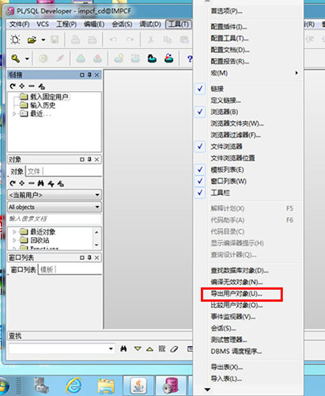  
3、在单击“导出用户对象（U）”标签后弹出的窗口中选择“用户”、在“输出文件”中选择.sql类型文件等信息后按“导出”按钮即可。  
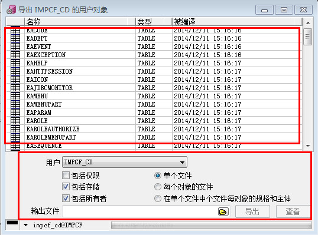

### 新功能
1、SQL窗口改进  
现在，您可以同时显示多个结果集并可以进行比较：  
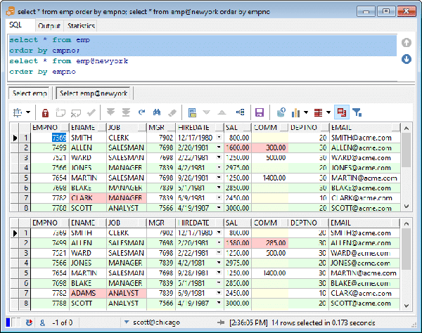  
现在可以按需获取CLOB和BLOB，以提高查询性能。  
2、命令窗口改进  
添加了新的EXPORT TABLES和EXPORT OBJECTS命令。这使您可以自动执行频繁的导出作业。您可以从交互式导出工具轻松构建命令行。  
BEAUTIFY命令现在支持通配符。  
现在，在输入@之后，CONNECT命令将显示数据库列表。  
现在支持WITH_PLSQL提示。  
3、对象[浏览器](https://www.32r.com/zt/llq/)改进  
现在，对象浏览器将显示函数和过程的所有重载版本。  
现在，您可以过滤多个以逗号分隔的对象名称（例如，“ dept％，emp％”）。  
现在，您可以从弹出菜单刷新实例化视图。  
4、文件浏览器增强  
Git和Subversion支持已添加。  
文件图标现在指示PL / SQL Developer文件类型。  
现在，您可以根据名称，大小，日期，只读状态和版本控制状态来过滤文件。 您可以在选项对话框中指定过滤器：  
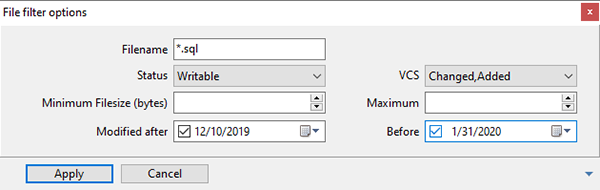  
您也可以直接在文件浏览器顶部输入过滤器表达式：  
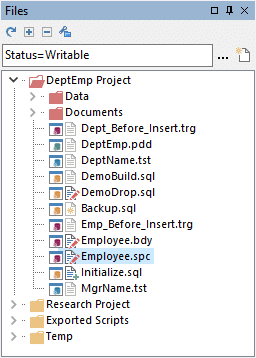  
5、项目改进  
Git和Subversion支持已添加。  
文件图标现在指示PL / SQL Developer文件类型。  
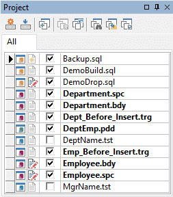  
6、改进表定义编辑器的功能  
现在可以直接在网格中编辑，复制和粘贴索引和分区存储。  
添加了对行存档的支持。  
7、连接列表改进  
窗口图标现在指示PL / SQL Developer窗口类型。  
连接状态图标移到左侧以保持一致。  
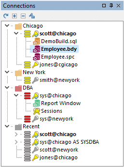  
8、会话窗口改进  
现在，您可以定义可以从会话列表的弹出菜单执行的会话操作：  
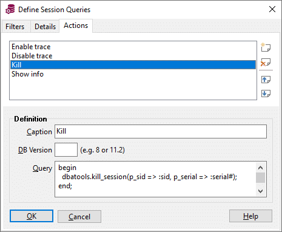  
 

> 更新: 2024-03-11 11:13:58  
> 原文: <https://www.yuque.com/lixinsi/ii9bf8/nxpzwx>