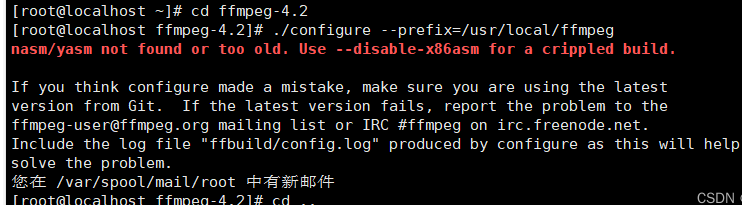
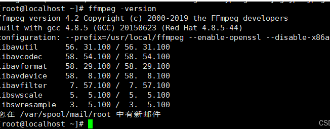

# CentOS环境安装ffmpeg

这是我在网上搜罗的方法，亲测好用 ，借此写篇文章，分享给大家。


温馨提示：安装ffmpeg过程会很慢，因为它集成的功能太多了，所以在安装过程中不必长时间等待，执行命令后可暂时先去忙别的事（下载看网速，一般情况下安装时非常慢，如第2、5步）。


1.下载ffmpeg工具包并解压

```bash
wget http://www.ffmpeg.org/releases/ffmpeg-4.2.tar.gz
tar -zxvf ffmpeg-4.2.tar.gz
```

2.进入工具包文件夹并进行安装，将ffmpeg安装至/usr/local/ffmpeg下

```bash
 cd ffmpeg-4.2
 
./configure --prefix=/usr/local/ffmpeg
./configure --prefix=/usr/local/ffmpeg --enable-openssl --disable-x86asm
make && make install
```

注意：若出现以下报错，请跳至第五步，待第五步安装成功后再返回第二步。




3.配置环境变量，使其ffmpeg命令生效

```bash
 #利用vi编辑环境变量
vi /etc/profile
 
#在最后位置处添加环境变量，点击i进入编辑模式，esc键可退出编辑模式
export PATH=$PATH:/usr/local/ffmpeg/bin
 
#退出编辑模式后，:wq 保存退出
#刷新资源，使其生效
source /etc/profile
```

4.查看ffmpeg版本，验证是否安装成功

```bash
ffmpeg -version
```

若出现以下内容，则安装成功。



5.若第二步出现图片中的错误信息，则需要安装yasm


记得退出ffmpeg工具包文件夹，cd .. 返回上一层

```bash

 #下载yasm工具包
wget http://www.tortall.net/projects/yasm/releases/yasm-1.3.0.tar.gz
 
#解压
tar -zxvf yasm-1.3.0.tar.gz
 
#进入工具包文件夹并开始安装
cd yasm-1.3.0
./configure
make && make install
```

安装完成后直接返回第二步即可，此时命令就不会报错了。


> 更新: 2024-02-21 13:10:31  
> 原文: <https://www.yuque.com/lixinsi/gpngnc/uu9imevsg949aboa>