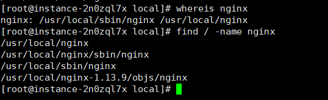
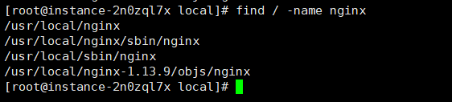
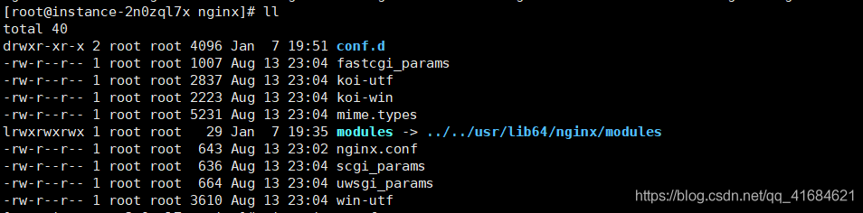

# Centos7.3 卸载 Nginx（彻底卸载） 并重新安装 Nginx（RPM源yum安装）

##### <font style="color:rgb(0, 0, 0);">卸载nginx</font>
1. <font style="color:rgb(51, 51, 51);">首先输入命令 </font><font style="color:rgb(10, 191, 91);background-color:rgb(243, 245, 249);">ps -ef | grep nginx</font><font style="color:rgb(51, 51, 51);">检查一下nginx服务是否在运行。如果在运行就停止运行，需要在nginx的安装目录下的sbin执行，如果配置了环境就不需要了：</font>

```bash
./nginx -s stop
```

1. <font style="color:rgb(51, 51, 51);">查找、删除Nginx相关文件</font>
2. <font style="color:rgb(51, 51, 51);">查看Nginx相关文件：</font>

```bash
whereis nginx
```



+ <font style="color:rgb(51, 51, 51);">find查找相关文件</font>

```bash
find / -name nginx
```



+ <font style="color:rgb(51, 51, 51);">依次删除find查找到的所有目录：</font>

```bash
rm -rf /usr/local/nginx  /usr/local/sbin/nginx /usr/local/nginx-1.13.9/objs/nginx
```

1. <font style="color:rgb(51, 51, 51);">再使用yum清理</font>

```bash
yum remove nginx
```

+ <font style="color:rgb(51, 51, 51);">安装 Nginx</font>
+ <font style="color:rgb(51, 51, 51);">添加nginx</font>

```bash
rpm -Uvh http://nginx.org/packages/centos/7/noarch/RPMS/nginx-release-centos-7-0.el7.ngx.noarch.rpm
```

+ <font style="color:rgb(51, 51, 51);">启动 Nginx</font>

```bash
systemctl start nginx.service
```

+ <font style="color:rgb(51, 51, 51);">设置开机自启 Nginx</font>

```bash
systemctl enable nginx.service
```

<font style="color:rgb(51, 51, 51);">nginx的配置文件在/etc/nginx/nginx.conf，目录在/etc/nginx</font>




+ <font style="color:rgb(51, 51, 51);">自定义的配置文件放在/etc/nginx/conf.d</font>
+ <font style="color:rgb(51, 51, 51);">项目文件存放在/usr/share/nginx/html/</font>
+ <font style="color:rgb(0, 82, 217);">日志文件</font><font style="color:rgb(51, 51, 51);">存放在/var/log/nginx/</font>
+ <font style="color:rgb(51, 51, 51);">还有一些其他的安装文件都在/etc/nginx</font>
+ <font style="color:rgb(51, 51, 51);">安装完成之后就可以访问： </font>
+ 

  
 


> 更新: 2024-02-23 09:26:36  
> 原文: <https://www.yuque.com/lixinsi/gpngnc/aib70f3gtkza1ubw>