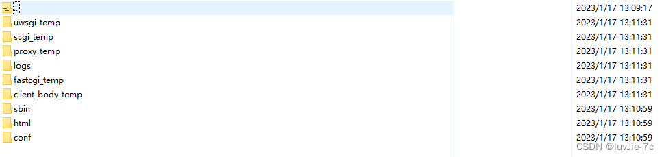

# Nginx单独开启SSL模块和HTTP2模块，无需重新覆盖安装

## <font style="color:rgb(79, 79, 79);">前言</font>
<font style="color:rgb(77, 77, 77);"></font>

## <font style="color:rgb(79, 79, 79);">一、下载安装解压</font>
安装nginx需要的依赖

```bash
yum install gcc\* pcre\* zlib\* –y
```

#### <font style="color:rgb(79, 79, 79);background-color:rgb(238, 240, 244);">1.进入临时文件夹里（随便一个都行）</font>
```bash
#nginx启动路径
/usr/local/nginx/sbin
./nginx

#nginx源码编译路径
/usr/local/src/nginx-1.9.7

#nginx配置文件路径
/usr/local/nginx/conf

#查看nginx状态
 systemctl status nginx
```

#### <font style="color:rgb(79, 79, 79);">2.下载并</font>[安装nginx](https://so.csdn.net/so/search?q=%E5%AE%89%E8%A3%85nginx&spm=1001.2101.3001.7020)<font style="color:rgb(79, 79, 79);">压缩包</font>
```bash
wget http://nginx.org/download/nginx-1.9.7tar.gz
```

#### <font style="color:rgb(79, 79, 79);">3.解压该压缩包</font>
```bash
tar -xvf nginx-1.23.3.tar.gz
```

#### <font style="color:rgb(79, 79, 79);">4.创建目标文件夹</font>
```bash
cd /tmp/nginx-1.23.3
```

#### **<font style="color:rgb(79, 79, 79);background-color:rgb(251, 212, 208);">5.（默认会安装在/usr/local/nginx）这里通过configure命令指定安装目录</font>**
```bash
./configure --prefix=/usr/local/nginx --with-http_stub_status_module --with-http_ssl_module --with-http_v2_module
 ./configure --prefix=/usr/local/nginx --with-openssl=/usr/local/src/openssl-1.0.2d --with-http_stub_status_module --with-http_ssl_module --with-http_gzip_static_module
```

#### <font style="color:rgb(79, 79, 79);">6.编译安装</font>
```bash
make && make install
```

#### <font style="color:rgb(79, 79, 79);">7.最后生成的文件夹具体如下</font>


#### <font style="color:rgb(79, 79, 79);">8.nginx常用命令</font>
```bash
#停止nginx
./nginx -s stop

#启动nginx
./nginx

#查看nginx进程
 ps -ef | grep nginx

 #重载nginx配置
 ./nginx -s reload
```

#### <font style="color:rgb(79, 79, 79);">9.安装nginxhttp2</font>
```bash
./configure --prefix=/usr/local/nginx --with-http_stub_status_module --with-http_ssl_module --with-http_v2_module

#备份原来的nginx
cp /usr/local/nginx/sbin/nginx /usr/local/nginx/sbin/nginx.bak

#覆盖nginx
cp ./objs/nginx /usr/local/nginx/sbin/

#查看nginx安装的模块
/usr/local/nginx/sbin/nginx -V
```

## <font style="color:rgb(79, 79, 79);">二、SSL模块安装（</font>[SSL证书](https://so.csdn.net/so/search?q=SSL%E8%AF%81%E4%B9%A6&spm=1001.2101.3001.7020)<font style="color:rgb(79, 79, 79);">）用于nginx配置文件修改请求  </font>**<font style="color:rgb(79, 79, 79);background-color:rgb(251, 212, 208);">没此需求可略过</font>**
```bash

#user  nobody;
worker_processes  1;

#error_log  logs/error.log;
#error_log  logs/error.log  notice;
#error_log  logs/error.log  info;

#pid        logs/nginx.pid;


events {
    worker_connections  1024;
}


http {
    include       mime.types;
    default_type  application/octet-stream;

    #log_format  main  '$remote_addr - $remote_user [$time_local] "$request" '
    #                  '$status $body_bytes_sent "$http_referer" '
    #                  '"$http_user_agent" "$http_x_forwarded_for"';

    #access_log  logs/access.log  main;

    sendfile        on;
    #tcp_nopush     on;

    #keepalive_timeout  0;
    keepalive_timeout  65;

    #gzip  on;

       server {

    #listen       80;需要安装http2
        listen       443 ssl http2;
        server_name  _;
        #证书路径
        ssl_certificate      /usr/local/nginx/conf/ssl/server.crt;
        ssl_certificate_key  /usr/local/nginx/conf/ssl/server.key;

        # For SRS homepage, console and players
        #   http://r.ossrs.net/console/
        #   http://r.ossrs.net/players/
        location / {
           proxy_pass http://192.168.5.147:8080/;
        }
        # For SRS streaming, for example:
        #   http://r.ossrs.net/live/livestream.flv
        #   http://r.ossrs.net/live/livestream.m3u8
        location ~ /.+/.*\.(flv|m3u8|ts|aac|mp3)$ {
           proxy_pass http://192.168.5.147:8080$request_uri;
        }
        # For SRS backend API for console.
        location /api/ {
           proxy_pass http://192.168.5.147:1985/api/;
        }
        # For SRS WebRTC publish/play API.
        location /rtc/ {
           proxy_pass http://192.168.5.147:1985/rtc/;
    }
        #error_page  404              /404.html;

        # redirect server error pages to the static page /50x.html
        #
        error_page   500 502 503 504  /50x.html;
        location = /50x.html {
            root   html;
        }

        # proxy the PHP scripts to Apache listening on 127.0.0.1:80
        #
        #location ~ \.php$ {
        #    proxy_pass   http://127.0.0.1;
        #}

        # pass the PHP scripts to FastCGI server listening on 127.0.0.1:9000
        #
        #location ~ \.php$ {
        #    root           html;
        #    fastcgi_pass   127.0.0.1:9000;
        #    fastcgi_index  index.php;
        #    fastcgi_param  SCRIPT_FILENAME  /scripts$fastcgi_script_name;
        #    include        fastcgi_params;
        #}

        # deny access to .htaccess files, if Apache's document root
        # concurs with nginx's one
        #
        #location ~ /\.ht {
        #    deny  all;
        #}
    }


    # another virtual host using mix of IP-, name-, and port-based configuration
    #
    #server {
    #    listen       8000;
    #    listen       somename:8080;
    #    server_name  somename  alias  another.alias;

    #    location / {
    #        root   html;
    #        index  index.html index.htm;
    #    }
    #}


    # HTTPS server
    #
    #server {
    #    listen       443 ssl;
    #    server_name  localhost;

    #    ssl_certificate      cert.pem;
    #    ssl_certificate_key  cert.key;

    #    ssl_session_cache    shared:SSL:1m;
    #    ssl_session_timeout  5m;

    #    ssl_ciphers  HIGH:!aNULL:!MD5;
    #    ssl_prefer_server_ciphers  on;

    #    location / {
    #        root   html;
    #        index  index.html index.htm;
    #    }
    #}


}

```

[附件: nginx.conf](./attachments/5QAnDiejDCVCBqW6/nginx.conf)


> 更新: 2024-02-23 13:02:12  
> 原文: <https://www.yuque.com/lixinsi/gpngnc/ozis2vb1q8gg06y7>