# Redhat Linux破解root密码

Linux破解root密码是RHCSA中的第一道题，只有破解密码才能继续之后的操作。（后期会整理出RHCSA和RHCE的相关题目）而在平时，我们是用Linux虚拟机的时候，如果一不小心忘记了root密码，那就GG了，几乎是什么事都做不了。作为一个Linux玩家，这种事是绝对不允许的！那就来看看Linux怎么破解root密码的吧！

# 破解环境
+ RHEL7.4（7的版本都差不多，之前的版本可能会有差异）

# 开始破解
1. 开启虚拟机，进入引导界面迅速按⬆⬇j键，然后选择**Red Hat Enterprise Linux Server (3.10.0-693.e17.x86_64) 7.4 (Mapio)**,按E进入编辑模式

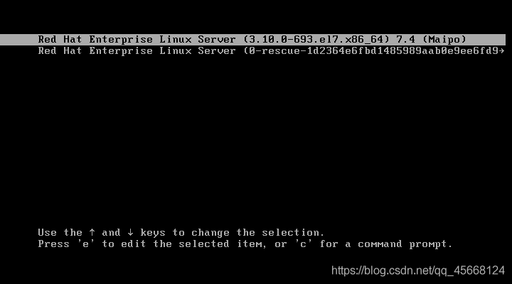

1. 使用⬇向下直到看到**initrd16**,然后在它的上一行末尾加上rd.break，然后Ctrl+X使系统继续运行。

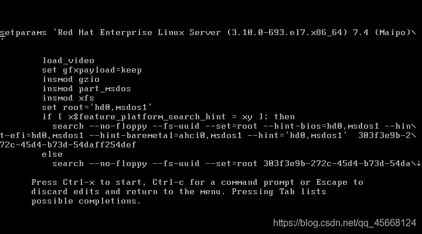  
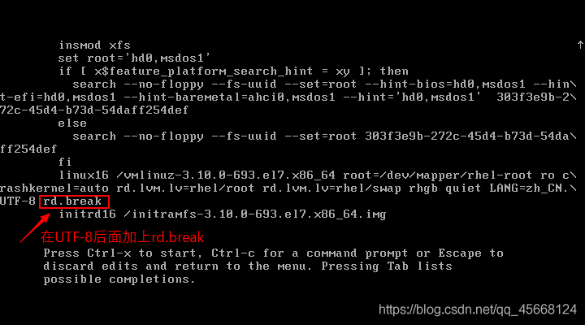

1. 然后会进入紧急救援模式，使用mount -o remount,rw /sysroot重新以读写的方式挂载系统。重新挂载之后，切换到单用户模式。

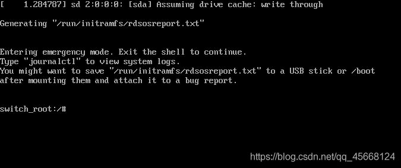

1. 注意看前面的提示符，进入单用户模式之后，就可以修改密码了。可以使用passwd来修改(会要求输入两遍密码)。一般我们直接就使用echo "密码" | passwd --stdin root来修改密码（一遍过，不会提示要输入第二遍确认）。

这里修改密码，不会看到提示密码修改成功，只会看到很多的小方块，如果害怕没有修改成功，想看到提示，修改一下语言的变量就可以了。  
使用LANG=en修改语言为英语，然后修改成功后就可以看到提示了。

1. 然后就是创建.autorelabel文件，这是**必须要创建**的，如果不创建或是创建错误，那么就会密码破解失败。创建完成后可以直接重启reboot，也可以exit退出单用户，再exit退出紧急救援模式。然后系统就会重启或是继续运行。

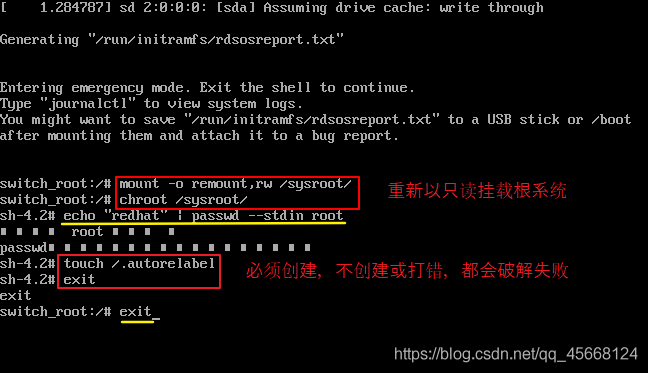

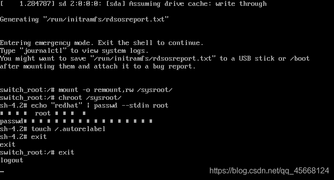

以上内容均属原创，转载请注明出处。 

1. 等系统重新启动后，直接使用设置的root密码就可以登录系统了。

# linux下nmon的安装及使用
查看redhat版本

cat /etc/redhat-release 

nmon 是一款系统监控程序，可以用来对CPU、磁盘、内存等资源指标来做实时监控。

1.下载nmon压缩包：

http://nmon.sourceforge.net/pmwiki.php?n=Site.Download

根据系统的发型版本及CPU位数选择相应的压缩包下载，如系统发行版本为：7.4

[root@node1 ~]# cat /etc/redhat-release

Red Hat Enterprise Linux Server release 7.4 (Maipo)

[root@node1 ~]# uname -a

Linux node1 3.10.0-693.el7.x86_64 #1 SMP Thu Jul 6 19:56:57 EDT 2017 x86_64 x86_64 x86_64 GNU/Linux

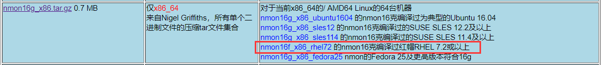

2.下载到系统中

[root@node1 highgo]# ll nmon16g_x86.tar.gz

-rw-------. 1 highgo highgo 692079 Feb 12 11:04 nmon16g_x86.tar.gz

3.解压

[root@node1 highgo]# tar -xvf nmon16g_x86.tar.gz

nmon16g_x86_fedora25

nmon16g_x86_rhel72

nmon16g_x86_sles114

nmon16g_x86_sles12

nmon16g_x86_ubuntu1604

4.将nmon16g_x86_rhel72复制到环境变量的路径下

[root@node1 bin]# mkdir /usr/local/bin/nmon

[root@node1 nmon]# cp nmon16g_x86_rhel72 /usr/local/bin/nmon/

[root@node1 nmon]# ll

total 400

-rwxrwxrwx. 1 root root 406334 Feb 12 11:12 nmon16g_x86_rhel72

cd /usr/local/bin/nmon

chmod +777  nmon16g_x86_rhel72

4.启动nmon

[root@node1 nmon]# ./nmon16g_x86_rhel72

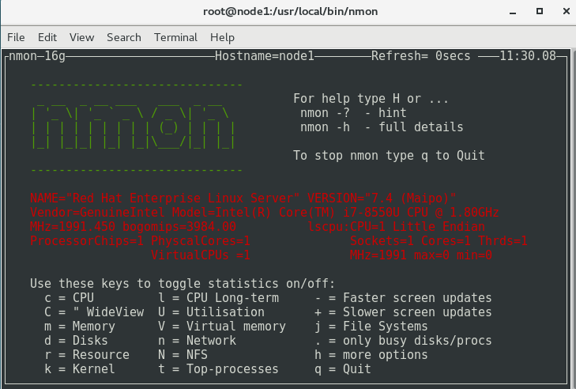

5.采集系统性能信息，并生成报告

执行./nmon -s3 -c60 -f -m ./report，-s3为每3s收集一次性能信息，-c60为收集60次，-f为生成的文件名包含该文件创建时间，-m ./report为指定测试报告存储路径

[root@node1 nmon]# ./nmon16g_x86_rhel72 -s3 -c60 -f -m /opt/report

[root@node1 nmon]# cd /opt/report/

[root@node1 report]# ll

total 36

-rw-r--r--. 1 root root 33733 Feb 12 11:33 node1_200212_1133.nmon

如每隔5秒采集一次，一共采集12次，就是1分钟的数据（生成的文件已标红）：

[qgc@localhost nmon16d]$ nmon -f -s 5 -c 12 -m /home/qgc/Desktop/

[qgc@localhost nmon16d]$ nmon -f -T -s 5 -c 12 -m /home/qgc/Desktop/

数据采集完毕后，如需关闭nmon进程，需要获取nmon的pid（已标红）

[qgc@localhost Desktop]$ ps -ef | grep nmon

qgc        4455（pid）   4349（ppid）  0 23:40 pts/0    00:00:00 nmon

qgc        4491   4429  0 23:40 pts/1    00:00:00 grep nmon

再安全杀掉该进程：kill -9 pid

[qgc@localhost Desktop]$ kill -9 4455

[qgc@localhost Desktop]$ ps -ef | grep nmon

qgc        4493   4429  0 23:40 pts/1    00:00:00 grep nmon

**六，数据分析**

**1****，下载****nmon analyser**

借助nmon analyser可以把nmon采集的数据生成直观的Excel表，nmon analyser可以在IBM的官网下载，[https://www.ibm.com/developerworks/community/wikis/home?lang=en#!/wiki/Power+Systems/page/nmon_analyser](https://bbs.huaweicloud.com/forum/thread-23199-1-1.html#)

在windows上下载后解压，有word和exce两个文档，Word是说明文档，包括更新日志，详细参数等，其中的Excel就是nmon analyser工具了。

**2****，打开****nmon analyser**

双击打开nmon analyser v54.xlsm，点击Analyze nmon data按钮：  

******注：**因为我用的个人免费版WPS（10.1），没有包含宏，需要安装宏插件(VBA for WPS)，Excel是自带宏插件的，如果宏不能运行，需要做以下操作：  
工具 -> 宏 -> 安全性 -> 中，然后再打开文件并允许运行宏。

**3****，下载****VBA for WPS**

地址：[https://pan.baidu.com/s/1QzW4ebQxYQtxgVfkTmxVJw](https://pan.baidu.com/s/1QzW4ebQxYQtxgVfkTmxVJw)，下载VBA7.0.1590_For WPS(中文).exe后，先退出WPS，再直接安装就行，再次打开nmon analyser，启用宏

**4****，使用****nmon analyser****生成图表**

成功打开nmon analyser后，点击Analyze nmon data按钮，选择nmon数据文件，会再次提示另存为，选择地址保存即可。 

  

# Nmon实时监控并生成HTML监控报
之前的文章介绍了服务端监控工具：Nmon使用方法，最近在github找到了一个nmon自动监控并生成HTML格式报告的工具：**easyNmon**，使用体验蛮不错的，这里介绍下它的安装及使用方法。

**一、关于easyNmon说明**

说明：为了方便多场景批量监控，作者用golang写了个监控程序，可以通过web页面启动和停止nmon服务， 适配Loadrunner和jmeter进行性能测试，可以做到批量执行场景并生成监控报告！

环境适配：该执行文件默认为CentOS（6.5-7.4）版本，Ubuntu和SUSE需要下载对应版本的nmon替换！

**二、下载安装**

**1、文件下载**

通过github下载该执行文件，然后上传到[服务器](https://cloud.tencent.com/product/cvm?from=10680)，使用 tar -zxvf easyNmon.tar.gz 命令解压，如下图：

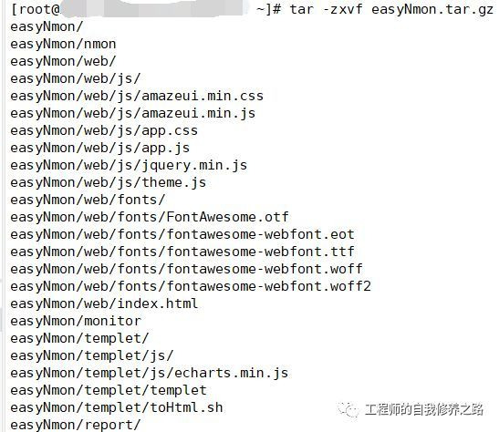

解压后会生成一个easyNmon文件夹，进入该文件夹，通过命令 ./monitor& 启动easyNmon服务（后缀加&为后台运行）。

**2、常用信息查看**

在easyNmon目录下，输入 ./monitor -h 查看相关信息，如下图：

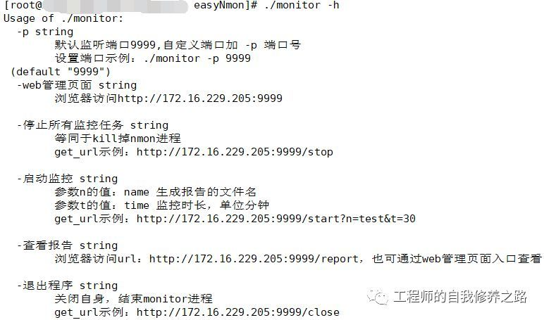

**3、web页面**

可以通过帮助信息里面的信息，访问web页面查看该工具的页面管理功能，如下图：

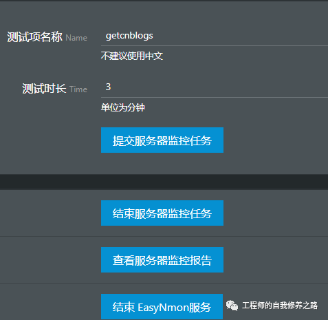

PS：如果是[云服务器](https://cloud.tencent.com/product/cvm?from=10680)，需要在云服务器控制台开启对应的安全组规则，否则无法访问！！！（上图是我的阿里云私有IP，访问的web地址需要换成公有IP地址）

**4、修改端口**

默认端口为9999，如果需要修改访问web页面的地址端口，需要自行修改，命令为 ./monitor -p 端口号 ，修改后查看帮助信息，如下图：

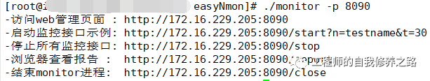

**三、监控服务使用**

**1、集成jmeter启动**

安装好之后，在jmeter中添加线程组，然后按照如下格式填写对应的信息，添加仅一次控制器（因为后台服务启动后，只需要启动一次监控服务即可）

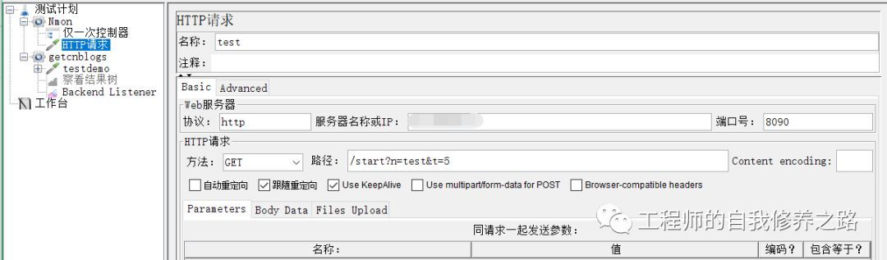

**2、web页面启动**

接下来，就是启动压测脚本，进行压测并查看服务器监控报告。

**四、HTML格式监控报告**

**PS**：压测脚本结束后，默认生成监控报告，手动停止测试脚本，也会自动生成监控报告，可以通过访问web页面的报告页面查看，如下图：

**1、**[grafana](https://cloud.tencent.com/product/tcmg?from=10680)**测试结果**

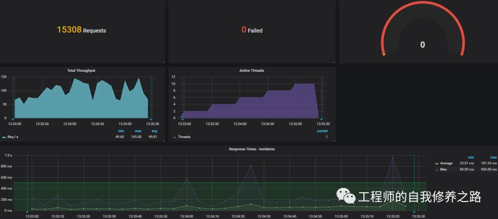

**2、easyNmon监控报告**

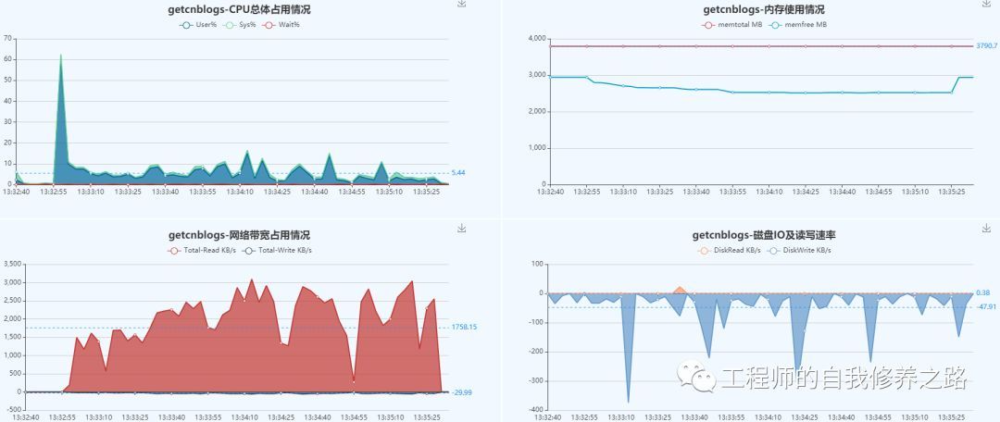

> 更新: 2022-08-07 08:50:22  
> 原文: <https://www.yuque.com/lixinsi/gpngnc/qgi31i>