# Windows Server 2016安装AD并开启SSL

[AD](https://docs.microsoft.com/zh-cn/windows-server/identity/ad-ds/active-directory-domain-services)<font style="color:rgb(51, 51, 51);background-color:rgb(248, 248, 253);">是Active Directory的简写，中文称活动目录。活动目录(Active Directory)主要提供以下功能：</font>

+ <font style="color:rgb(51, 51, 51);background-color:rgb(248, 248, 253);">1、服务器及客户端计算机管理</font>
+ <font style="color:rgb(51, 51, 51);background-color:rgb(248, 248, 253);">2、用户服务</font>
+ <font style="color:rgb(51, 51, 51);background-color:rgb(248, 248, 253);">3、资源管理</font>
+ <font style="color:rgb(51, 51, 51);background-color:rgb(248, 248, 253);">4、桌面配置</font>
+ <font style="color:rgb(51, 51, 51);background-color:rgb(248, 248, 253);">5、应用系统支撑等；</font>

## <font style="color:rgb(51, 51, 51);background-color:rgb(248, 248, 253);">AD域角色安装</font>
<font style="color:rgb(51, 51, 51);background-color:rgb(248, 248, 253);">在需要安装AD域控制器的电脑上打开服务器管理器，点击</font>**<font style="color:rgb(51, 51, 51);background-color:rgb(248, 248, 253);">添加角色和功能</font>**

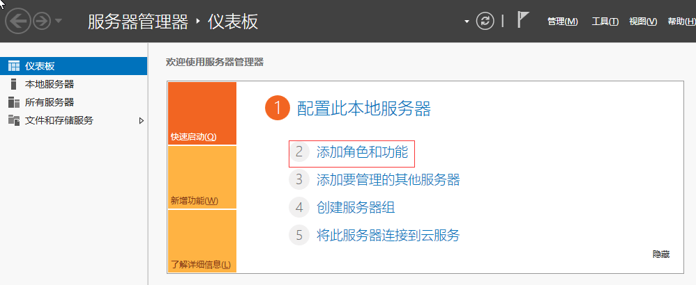

<font style="color:rgb(51, 51, 51);background-color:rgb(248, 248, 253);">打开</font>**<font style="color:rgb(51, 51, 51);background-color:rgb(248, 248, 253);">添加角色和功能向导</font>**<font style="color:rgb(51, 51, 51);background-color:rgb(248, 248, 253);">，点击</font>**<font style="color:rgb(51, 51, 51);background-color:rgb(248, 248, 253);">下一步</font>**

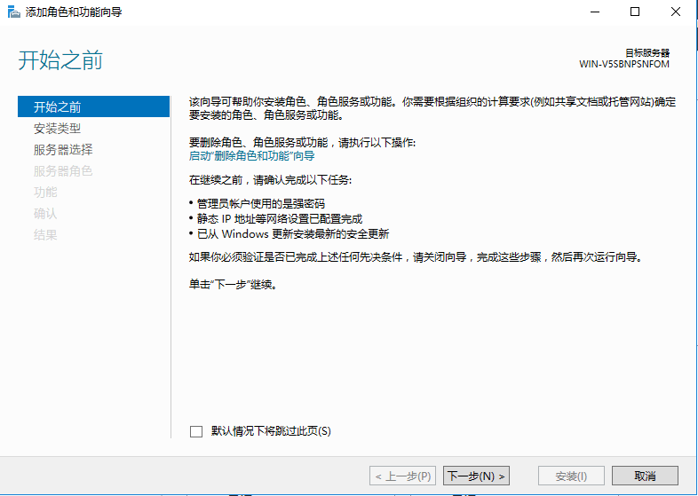

<font style="color:rgb(51, 51, 51);background-color:rgb(248, 248, 253);">安装类型选择</font>**<font style="color:rgb(51, 51, 51);background-color:rgb(248, 248, 253);">基于角色或基于功能的安装</font>**<font style="color:rgb(51, 51, 51);background-color:rgb(248, 248, 253);">，点击</font>**<font style="color:rgb(51, 51, 51);background-color:rgb(248, 248, 253);">下一步</font>**

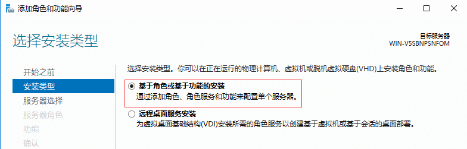

<font style="color:rgb(51, 51, 51);background-color:rgb(248, 248, 253);">服务器选择</font>**<font style="color:rgb(51, 51, 51);background-color:rgb(248, 248, 253);">从服务器池中选择服务器</font>**<font style="color:rgb(51, 51, 51);background-color:rgb(248, 248, 253);">，再选中池中的本地服务器，点击</font>**<font style="color:rgb(51, 51, 51);background-color:rgb(248, 248, 253);">下一步</font>**

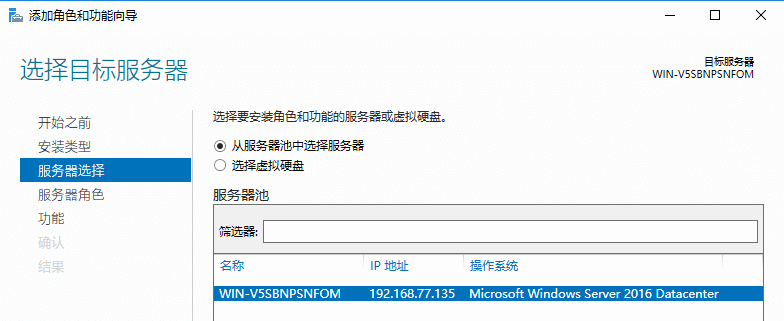

<font style="color:rgb(51, 51, 51);background-color:rgb(248, 248, 253);">服务器角色选择</font>**<font style="color:rgb(51, 51, 51);background-color:rgb(248, 248, 253);">Active Directory域服务</font>**<font style="color:rgb(51, 51, 51);background-color:rgb(248, 248, 253);">，会弹出</font>**<font style="color:rgb(51, 51, 51);background-color:rgb(248, 248, 253);">添加Active Directory域服务所需的功能？</font>**<font style="color:rgb(51, 51, 51);background-color:rgb(248, 248, 253);">，点击</font>**<font style="color:rgb(51, 51, 51);background-color:rgb(248, 248, 253);">添加功能</font>**

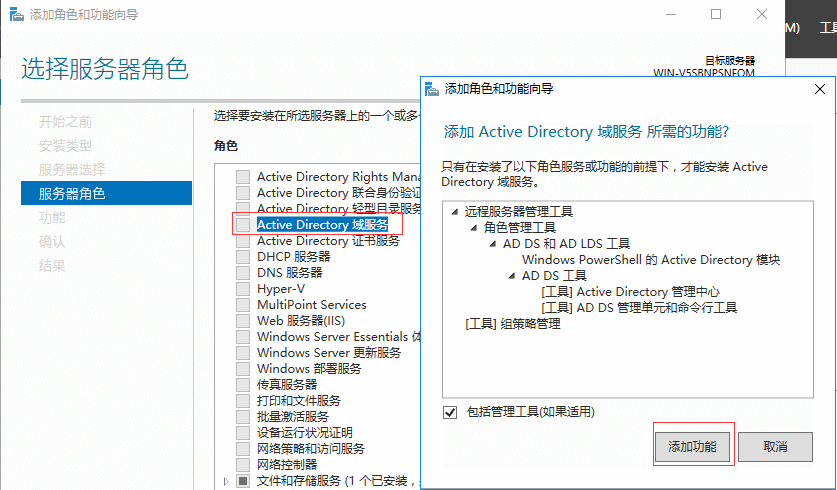

<font style="color:rgb(51, 51, 51);background-color:rgb(248, 248, 253);">点击</font>**<font style="color:rgb(51, 51, 51);background-color:rgb(248, 248, 253);">下一步</font>**<font style="color:rgb(51, 51, 51);background-color:rgb(248, 248, 253);">， 这里不需要选择</font>

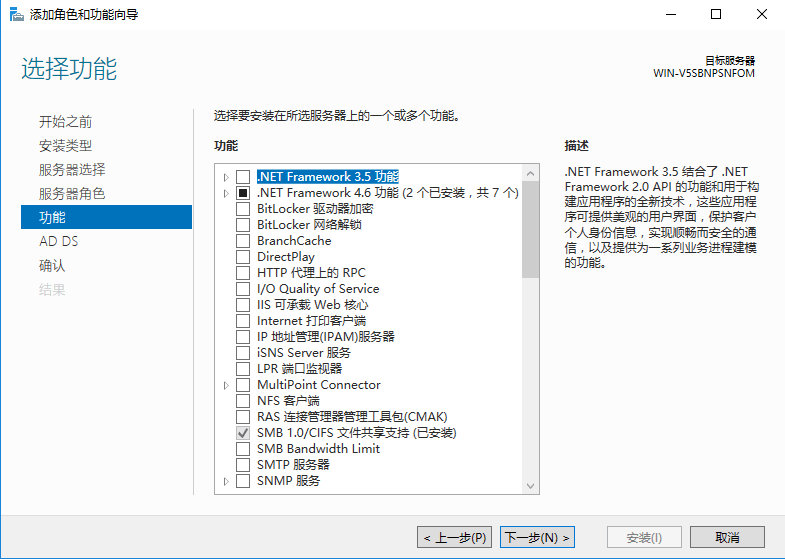

<font style="color:rgb(51, 51, 51);background-color:rgb(248, 248, 253);">点击</font>**<font style="color:rgb(51, 51, 51);background-color:rgb(248, 248, 253);">下一步</font>**

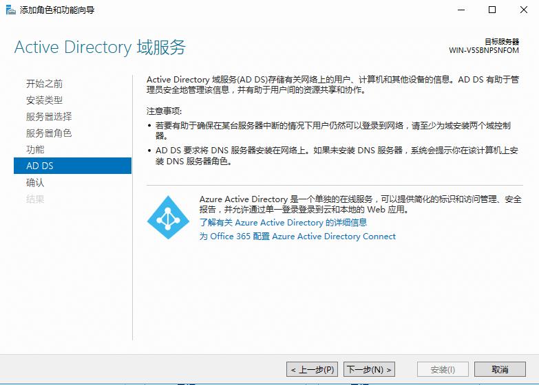

<font style="color:rgb(51, 51, 51);background-color:rgb(248, 248, 253);">确认这里勾选</font>**<font style="color:rgb(51, 51, 51);background-color:rgb(248, 248, 253);">如果需要，自动重新启动目标服务器</font>**<font style="color:rgb(51, 51, 51);background-color:rgb(248, 248, 253);">，点击</font>**<font style="color:rgb(51, 51, 51);background-color:rgb(248, 248, 253);">安装</font>**

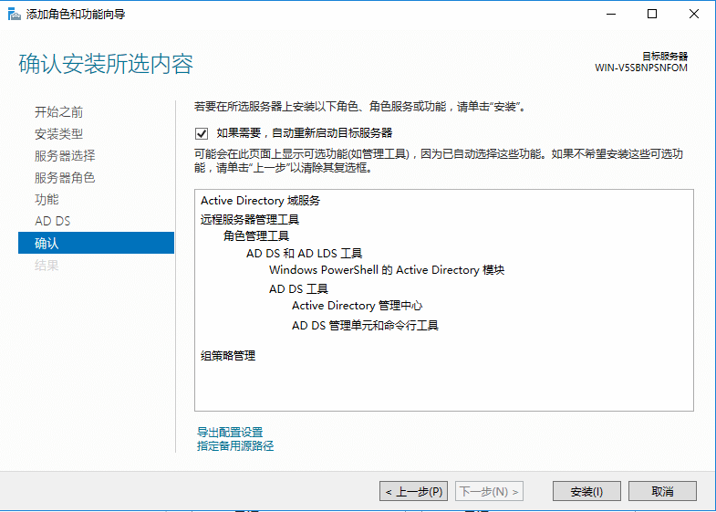

<font style="color:rgb(51, 51, 51);background-color:rgb(248, 248, 253);">Active Directory域服务角色安装完成，点</font>**<font style="color:rgb(51, 51, 51);background-color:rgb(248, 248, 253);">关闭</font>**

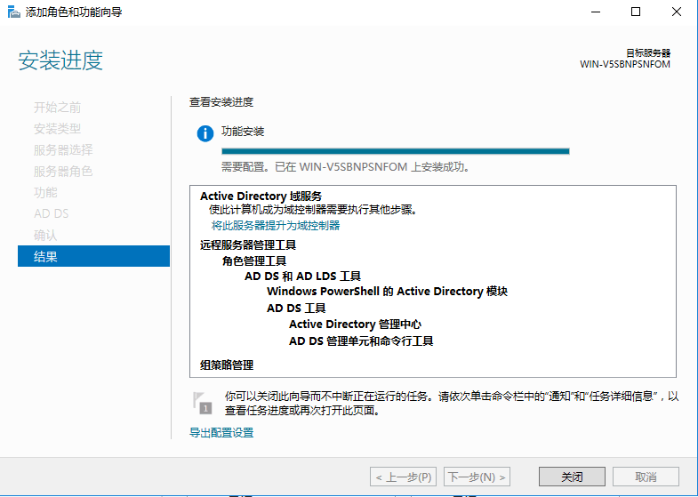

## <font style="color:rgb(51, 51, 51);background-color:rgb(248, 248, 253);">运行部署向导</font>
<font style="color:rgb(51, 51, 51);background-color:rgb(248, 248, 253);">运行AD DS（Active Directory域服务的简称）部署向导，打开本地服务器的服务器管理器，点击</font>**<font style="color:rgb(51, 51, 51);background-color:rgb(248, 248, 253);">通知</font>**<font style="color:rgb(51, 51, 51);background-color:rgb(248, 248, 253);">-</font>**<font style="color:rgb(51, 51, 51);background-color:rgb(248, 248, 253);">将此服务器提升为域控制器</font>**

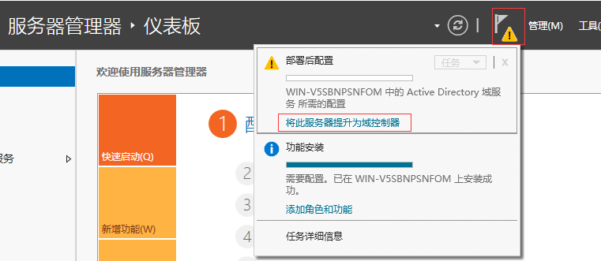

<font style="color:rgb(51, 51, 51);background-color:rgb(248, 248, 253);">打开AD DS的部署向导，由于我们这里是部署新的AD控制器，所以部署配置选择</font>**<font style="color:rgb(51, 51, 51);background-color:rgb(248, 248, 253);">添加新林</font>**<font style="color:rgb(51, 51, 51);background-color:rgb(248, 248, 253);">，把</font>**<font style="color:rgb(51, 51, 51);background-color:rgb(248, 248, 253);">根域名</font>**<font style="color:rgb(51, 51, 51);background-color:rgb(248, 248, 253);">设置成</font>**<font style="color:rgb(51, 51, 51);background-color:rgb(248, 248, 253);">lework.com</font>**<font style="color:rgb(51, 51, 51);background-color:rgb(248, 248, 253);">，点击</font>**<font style="color:rgb(51, 51, 51);background-color:rgb(248, 248, 253);">下一步</font>**

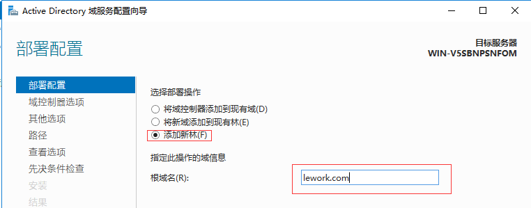

<font style="color:rgb(51, 51, 51);background-color:rgb(248, 248, 253);">解释：</font>

+ <font style="color:rgb(51, 51, 51);background-color:rgb(248, 248, 253);">将域控制器添加到现有域：在现有的域控制器中添加新的域控制器</font>
+ <font style="color:rgb(51, 51, 51);background-color:rgb(248, 248, 253);">将新域添加到现有林：在现有的林中新建域，与林中现有的域不同</font>
+ <font style="color:rgb(51, 51, 51);background-color:rgb(248, 248, 253);">添加新林：在没有林的情况下新建林</font>

<font style="color:rgb(51, 51, 51);background-color:rgb(248, 248, 253);">设置域密码，点击下一步</font>

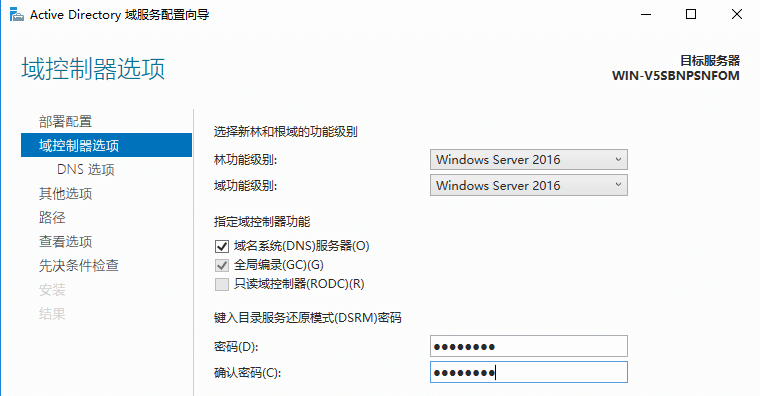

<font style="color:rgb(51, 51, 51);background-color:rgb(248, 248, 253);">域控制器选项：</font>

+ <font style="color:rgb(51, 51, 51);background-color:rgb(248, 248, 253);">林功能级别（包含Windows Server 2008到Windows Server 2016级别都有）：Windows Server 2016</font>
+ <font style="color:rgb(51, 51, 51);background-color:rgb(248, 248, 253);">域功能级别（只包含Windows Server 2016域功能）：Windows Server 2016 指定域控制器功能：默认</font>

<font style="color:rgb(51, 51, 51);background-color:rgb(248, 248, 253);">点击</font>**<font style="color:rgb(51, 51, 51);background-color:rgb(248, 248, 253);">下一步</font>**

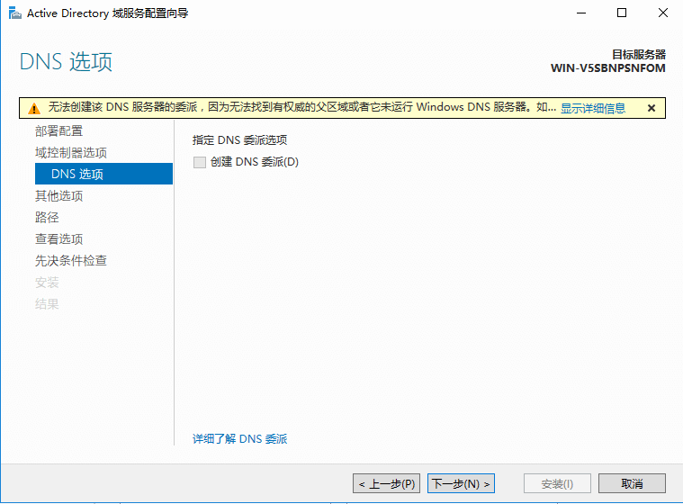

<font style="color:rgb(51, 51, 51);background-color:rgb(248, 248, 253);">点击</font>**<font style="color:rgb(51, 51, 51);background-color:rgb(248, 248, 253);">下一步</font>**

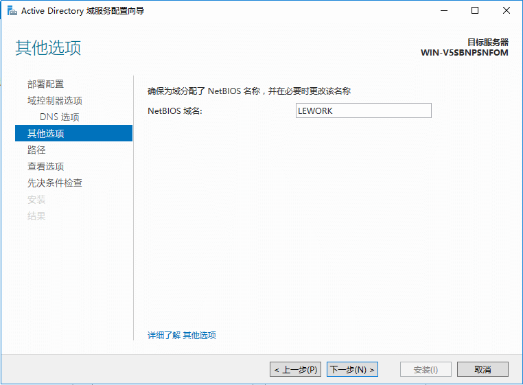

<font style="color:rgb(51, 51, 51);background-color:rgb(248, 248, 253);">设置AD DS的数据库、日志文件和SYSVOL的位置，点击</font>**<font style="color:rgb(51, 51, 51);background-color:rgb(248, 248, 253);">下一步</font>**

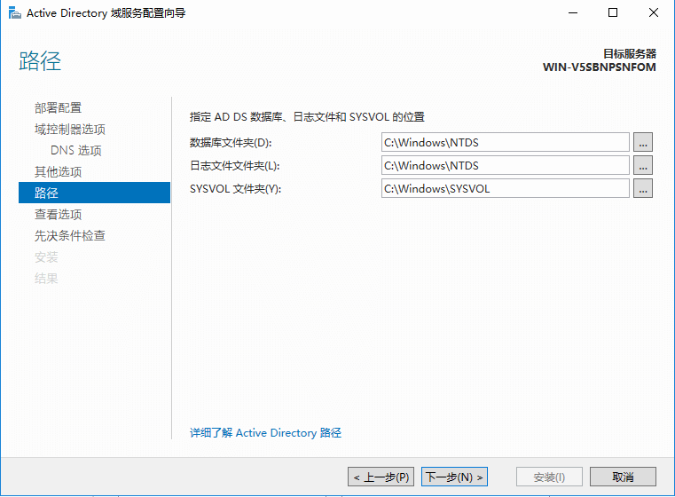

<font style="color:rgb(51, 51, 51);background-color:rgb(248, 248, 253);">点击</font>**<font style="color:rgb(51, 51, 51);background-color:rgb(248, 248, 253);">下一步</font>**

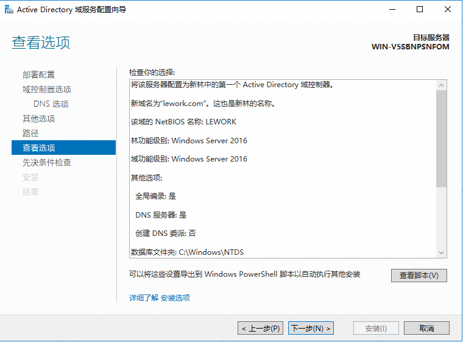

<font style="color:rgb(51, 51, 51);background-color:rgb(248, 248, 253);">先决条件检查通过，点击</font>**<font style="color:rgb(51, 51, 51);background-color:rgb(248, 248, 253);">安装</font>**<font style="color:rgb(51, 51, 51);background-color:rgb(248, 248, 253);">，如果不通过请根据提示查看原因</font>

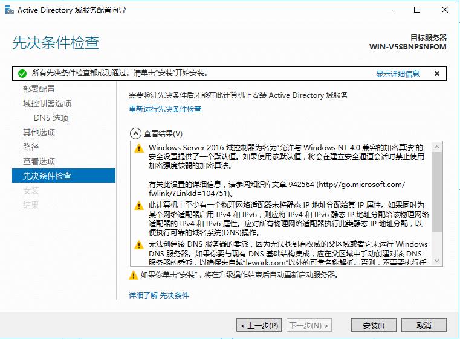

<font style="color:rgb(51, 51, 51);background-color:rgb(248, 248, 253);">正在进行自动部署，部署完成后会自动重启服务器</font>

<font style="color:rgb(51, 51, 51);background-color:rgb(248, 248, 253);">AD域控制器部署完成，打开</font>**<font style="color:rgb(51, 51, 51);background-color:rgb(248, 248, 253);">服务器管理器</font>**<font style="color:rgb(51, 51, 51);background-color:rgb(248, 248, 253);">-</font>**<font style="color:rgb(51, 51, 51);background-color:rgb(248, 248, 253);">工具</font>**<font style="color:rgb(51, 51, 51);background-color:rgb(248, 248, 253);">-</font>**<font style="color:rgb(51, 51, 51);background-color:rgb(248, 248, 253);">Active Directory用户和计算机</font>**

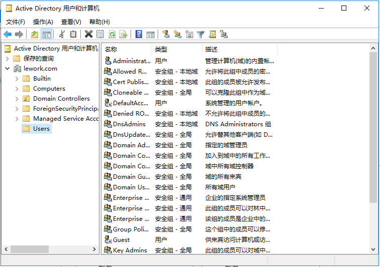

<font style="color:rgb(51, 51, 51);background-color:rgb(248, 248, 253);">就可以看到我们刚才部署好的域，这样一个完整的域就部署完成了</font>

## <font style="color:rgb(51, 51, 51);background-color:rgb(248, 248, 253);">启用LDAPS</font>
### <font style="color:rgb(51, 51, 51);background-color:rgb(248, 248, 253);">创建证书颁发机构</font>
<font style="color:rgb(51, 51, 51);background-color:rgb(248, 248, 253);">添加</font>**<font style="color:rgb(51, 51, 51);background-color:rgb(248, 248, 253);">Active Directory 证书服务</font>**<font style="color:rgb(51, 51, 51);background-color:rgb(248, 248, 253);"> </font><font style="color:rgb(51, 51, 51);background-color:rgb(248, 248, 253);">角色</font>

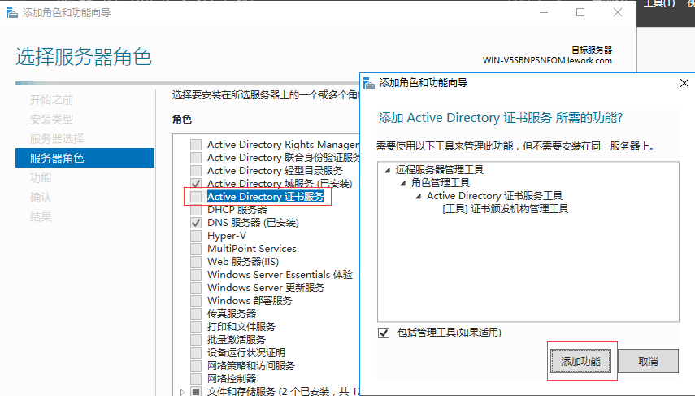

<font style="color:rgb(51, 51, 51);background-color:rgb(248, 248, 253);">选择</font>**<font style="color:rgb(51, 51, 51);background-color:rgb(248, 248, 253);">证书颁发机构</font>**

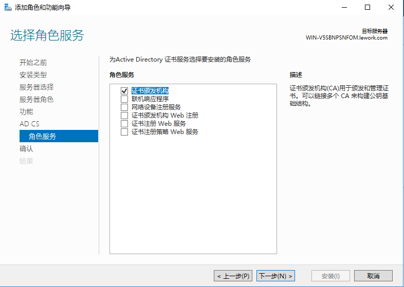

<font style="color:rgb(51, 51, 51);background-color:rgb(248, 248, 253);">点击</font>**<font style="color:rgb(51, 51, 51);background-color:rgb(248, 248, 253);">下一步</font>**<font style="color:rgb(51, 51, 51);background-color:rgb(248, 248, 253);">进行安装</font>

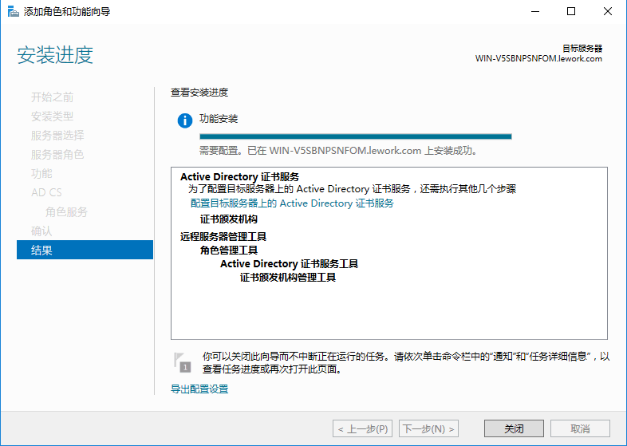

### <font style="color:rgb(51, 51, 51);background-color:rgb(248, 248, 253);">配置域证书</font>
<font style="color:rgb(51, 51, 51);background-color:rgb(248, 248, 253);">点击</font>**<font style="color:rgb(51, 51, 51);background-color:rgb(248, 248, 253);">通知</font>**<font style="color:rgb(51, 51, 51);background-color:rgb(248, 248, 253);">-</font>**<font style="color:rgb(51, 51, 51);background-color:rgb(248, 248, 253);">配置目标服务器上的Active Directory 证书服务</font>**

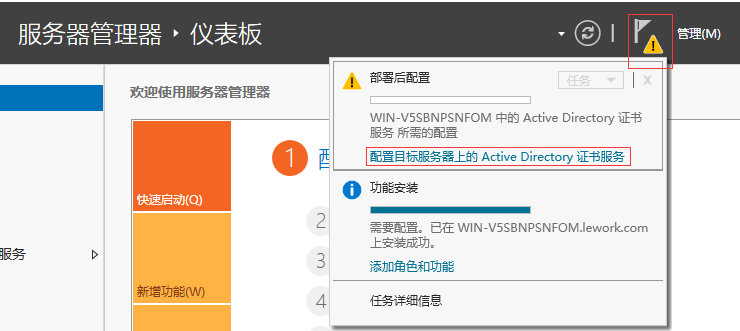

<font style="color:rgb(51, 51, 51);background-color:rgb(248, 248, 253);">点击</font>**<font style="color:rgb(51, 51, 51);background-color:rgb(248, 248, 253);">下一步</font>**

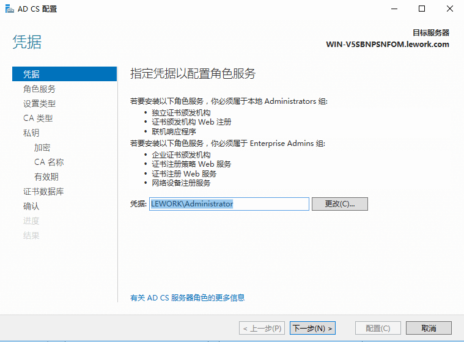

<font style="color:rgb(51, 51, 51);background-color:rgb(248, 248, 253);">勾选</font>**<font style="color:rgb(51, 51, 51);background-color:rgb(248, 248, 253);">证书颁发机构</font>**<font style="color:rgb(51, 51, 51);background-color:rgb(248, 248, 253);">,点击</font>**<font style="color:rgb(51, 51, 51);background-color:rgb(248, 248, 253);">下一步</font>**

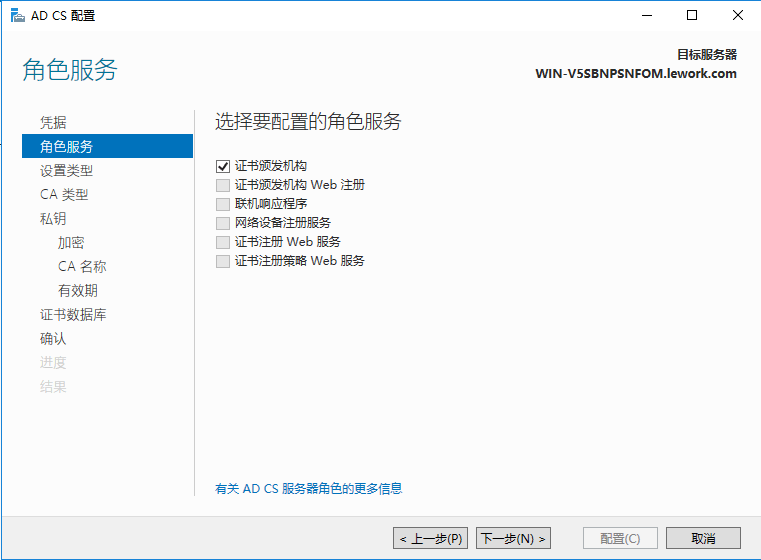

<font style="color:rgb(51, 51, 51);background-color:rgb(248, 248, 253);">选择</font>**<font style="color:rgb(51, 51, 51);background-color:rgb(248, 248, 253);">企业CA</font>**<font style="color:rgb(51, 51, 51);background-color:rgb(248, 248, 253);">,点击</font>**<font style="color:rgb(51, 51, 51);background-color:rgb(248, 248, 253);">下一步</font>**

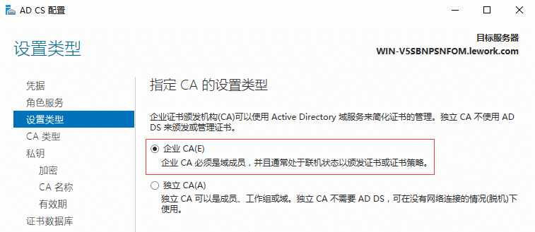

<font style="color:rgb(51, 51, 51);background-color:rgb(248, 248, 253);">选择</font>**<font style="color:rgb(51, 51, 51);background-color:rgb(248, 248, 253);">根CA</font>**<font style="color:rgb(51, 51, 51);background-color:rgb(248, 248, 253);">,点击</font>**<font style="color:rgb(51, 51, 51);background-color:rgb(248, 248, 253);">下一步</font>**

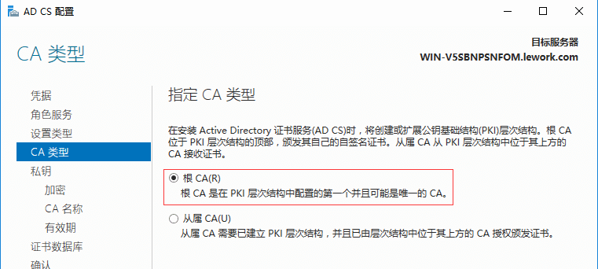

<font style="color:rgb(51, 51, 51);background-color:rgb(248, 248, 253);">选择</font>**<font style="color:rgb(51, 51, 51);background-color:rgb(248, 248, 253);">创建新的私钥</font>**<font style="color:rgb(51, 51, 51);background-color:rgb(248, 248, 253);">,点击</font>**<font style="color:rgb(51, 51, 51);background-color:rgb(248, 248, 253);">下一步</font>**

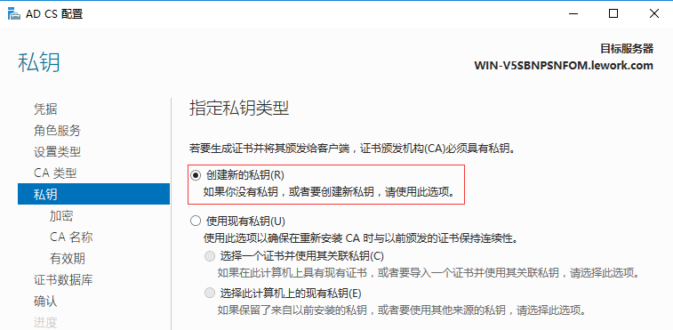

<font style="color:rgb(51, 51, 51);background-color:rgb(248, 248, 253);">指定CA的加密，默认即可.点击</font>**<font style="color:rgb(51, 51, 51);background-color:rgb(248, 248, 253);">下一步</font>**

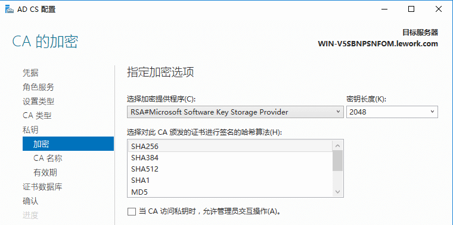

<font style="color:rgb(51, 51, 51);background-color:rgb(248, 248, 253);">指定CA名称,点击</font>**<font style="color:rgb(51, 51, 51);background-color:rgb(248, 248, 253);">下一步</font>**

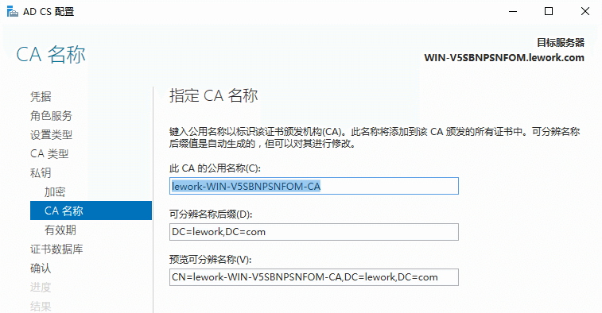

<font style="color:rgb(51, 51, 51);background-color:rgb(248, 248, 253);">指定有效期，这里设置为10年,点击</font>**<font style="color:rgb(51, 51, 51);background-color:rgb(248, 248, 253);">下一步</font>**

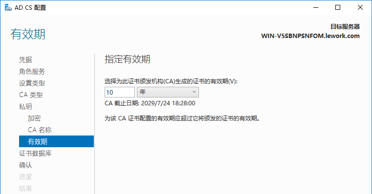

<font style="color:rgb(51, 51, 51);background-color:rgb(248, 248, 253);">指定CA数据库的位置，默认即可.点击</font>**<font style="color:rgb(51, 51, 51);background-color:rgb(248, 248, 253);">下一步</font>**

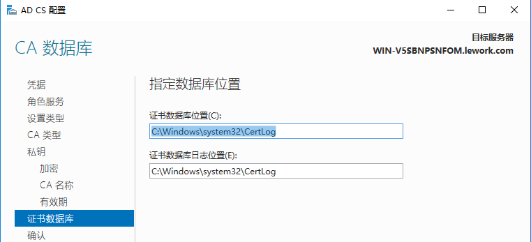

<font style="color:rgb(51, 51, 51);background-color:rgb(248, 248, 253);">确认证书的配置，点击</font>**<font style="color:rgb(51, 51, 51);background-color:rgb(248, 248, 253);">配置</font>**<font style="color:rgb(51, 51, 51);background-color:rgb(248, 248, 253);">.点击</font>**<font style="color:rgb(51, 51, 51);background-color:rgb(248, 248, 253);">下一步</font>**

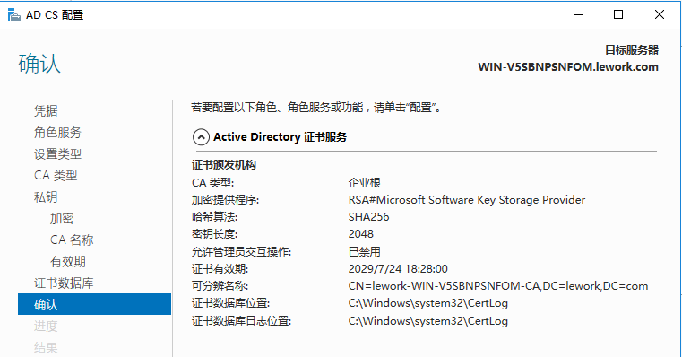

<font style="color:rgb(51, 51, 51);background-color:rgb(248, 248, 253);">配置完成后，点击</font>**<font style="color:rgb(51, 51, 51);background-color:rgb(248, 248, 253);">关闭</font>**<font style="color:rgb(51, 51, 51);background-color:rgb(248, 248, 253);">页面</font>

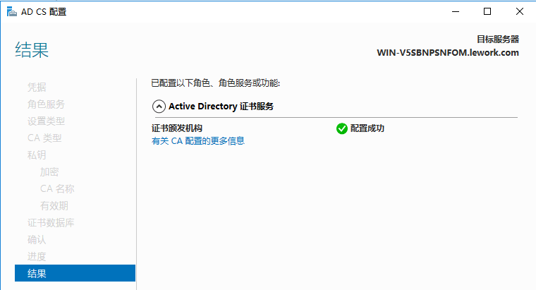

<font style="color:rgb(51, 51, 51);background-color:rgb(248, 248, 253);">配置完成后，重启下服务器</font>

<font style="color:rgb(51, 51, 51);background-color:rgb(248, 248, 253);">在证书颁发机构中可以看到给域控颁发的证书</font>

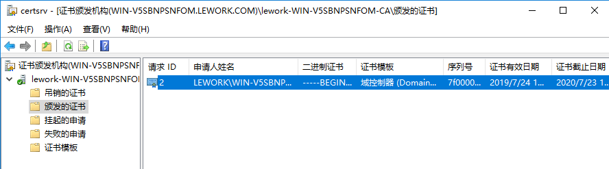

### <font style="color:rgb(51, 51, 51);background-color:rgb(248, 248, 253);">连接AD</font>
<font style="color:rgb(51, 51, 51);background-color:rgb(248, 248, 253);">运行–>ldp.exe</font>

```powershell
host: WIN-V5SBNPSNFOM.lework.com port: 389
conn：LDAP:\\WIN-V5SBNPSNFOM.lework.com:389

```

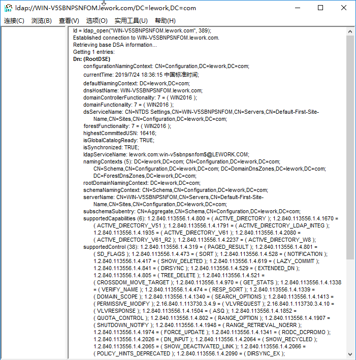

```powershell
host: WIN-V5SBNPSNFOM.lework.com port: 636
conn：LDAPS:\\WIN-V5SBNPSNFOM.lework.com:636
```

<font style="color:rgb(51, 51, 51);background-color:rgb(248, 248, 253);">SSL 勾选上</font>

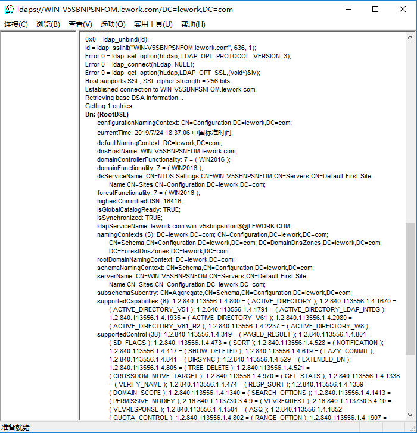

<font style="color:rgb(51, 51, 51);background-color:rgb(248, 248, 253);">在Active Directory服务器上执行以下命令来导出证书,供客户端连接使用</font>

```powershell
C:\Users\Administrator>certutil -ca.cert client.crt
CA 证书[0]: 3 -- 有效
CA 证书[0]:
-----BEGIN CERTIFICATE-----
MIIDfTCCAmWgAwIBAgIQKb58EV2zDLBAbvMySV/voDANBgkqhkiG9w0BAQsFADBR
MRMwEQYKCZImiZPyLGQBGRYDY29tMRYwFAYKCZImiZPyLGQBGRYGbGV3b3JrMSIw
IAYDVQQDExlsZXdvcmstV0lOLVY1U0JOUFNORk9NLUNBMB4XDTE5MDcyNDEwMjEw
NloXDTI5MDcyNDEwMzEwNlowUTETMBEGCgmSJomT8ixkARkWA2NvbTEWMBQGCgmS
JomT8ixkARkWBmxld29yazEiMCAGA1UEAxMZbGV3b3JrLVdJTi1WNVNCTlBTTkZP
TS1DQTCCASIwDQYJKoZIhvcNAQEBBQADggEPADCCAQoCggEBANbilH1FFCE8UH/Y
ye8E0jMeDqjIEtAowvmu2yKbU+adKUJHo+gMYaL/3dXjFFI5Tr++WC/QROIbVAub
RzCZudGFQ2OKbr/yJ3mt6adB/VmdmGljX+2c1hmRHZcnuMyjnx7J/xqwkBlWxMpp
uP58VoaSJxQtUr/aO9dR53NsAa3pDcKYKfgWtNpCCa43YtY2x2pznpe4OOmQ1ufs
JENjJwA1e73Uq+TxKRKRRsE92SVxefbgSsOzO8Pg4Hyk1B2pIx267eYQFMngHlq2
ojd003HsMBtGU68F3IZRpyX+njpb28PANOL1MgVIRCT5HpddtV6R0Uvj84mBp0q0
6CwPWA8CAwEAAaNRME8wCwYDVR0PBAQDAgGGMA8GA1UdEwEB/wQFMAMBAf8wHQYD
VR0OBBYEFNMUY0FWH8vE5hsr5ZD9hrGF46rQMBAGCSsGAQQBgjcVAQQDAgEAMA0G
CSqGSIb3DQEBCwUAA4IBAQCj3EgCh4O7AutmMZE0/3UjOpz2o+GVIpym9V9JJGQw
z3rmmKtFO7G//YjjEN+bBmiDTUrmXTzar7RK8Vu2mLs+XqZipEE/GmcmdraZjQQD
2u3QZjKWFnLom1IIArbeIw9Mq6ZEr2cxsKI+biIg5YTpGjggyRrAHdFIdOInFYol
Zj50okNMZ+D7NJ83GupFCfFT7p4Glh2zL89a9u5qae9WE95y1G8fU30linQbCed2
ddCWWwU1+Jn5eEm0cAX5ogrY+UwqiYYBegWYLcxpndl/xLTGBYx7o7Sk2VMpHFO4
mPfPzpZ22rgS+Cvd7+S3nAvb22ygg1L+jMF63z8SFIP/
-----END CERTIFICATE-----

CertUtil: -ca.cert 命令成功完成。

```

[在CentOS 7上使用SSL配置OpenLDAP](https://lework.github.io/2019/07/21/ldap-ssl/)


> 更新: 2024-03-04 14:51:07  
> 原文: <https://www.yuque.com/lixinsi/gpngnc/yx13nn5zc8v3e3s5>