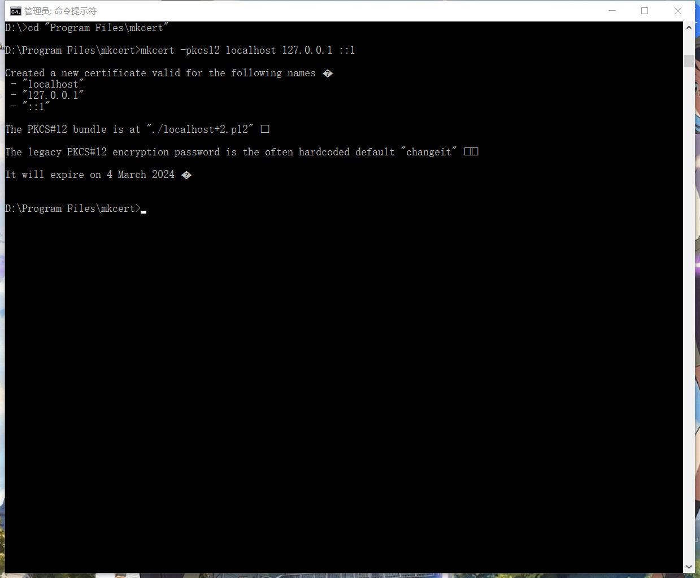
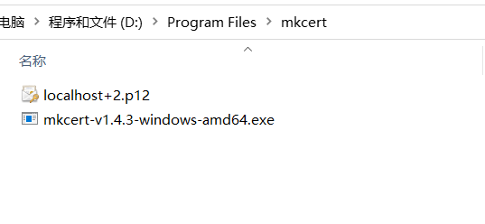
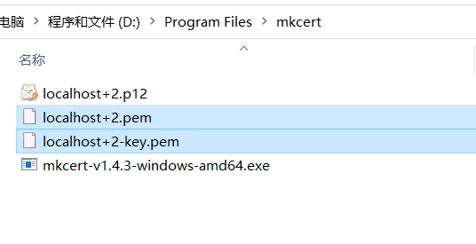
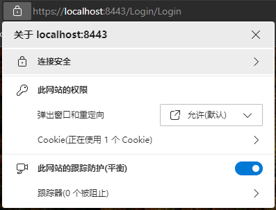
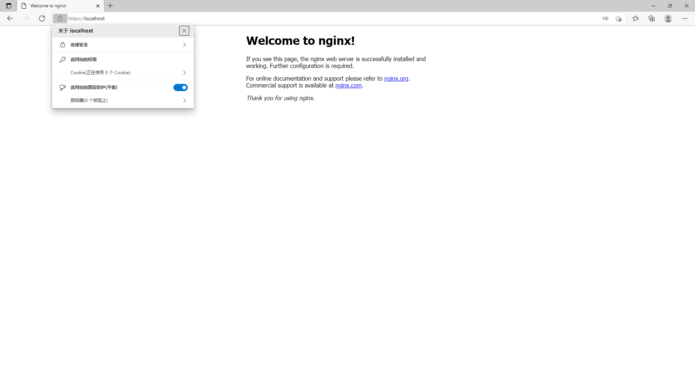

# Windows 开发环境使用 mkcert 为本机 localhost 自签 SSL 证

# <font style="color:rgb(0, 0, 0);">1、安装 </font>[mkcert](https://github.com/FiloSottile/mkcert)
<font style="color:rgb(0, 0, 0);">Windows 环境下使用 chocolatey 安装 mkcert，首先</font>[安装 chocolatey](https://community.chocolatey.org/courses/installation/installing?method=installing-chocolatey)<font style="color:rgb(0, 0, 0);"> ，管理员权限打开cmd，执行命令：</font>

<font style="color:rgb(0, 0, 0);">choco 安装 mkcert</font>

```powershell
choco install mkcert
```

# <font style="color:rgb(0, 0, 0);">2、创建本地 CA</font>
```powershell
mkcert -install
```

# <font style="color:rgb(0, 0, 0);">3、制作证书</font>
<font style="color:rgb(0, 0, 0);"> 针对于不同的 web server，有不同的参数。</font>

<font style="color:rgb(0, 0, 0);">3.1iis</font>

```powershell
mkcert -pkcs12 localhost 127.0.0.7 ::1
```



<font style="color:rgb(0, 0, 0);"> 这个命令会在目录创建一个文件：localhost+2.p12，证书默认密码是“changeit”，导入系统时需要用到。p12 证书可以通过直接改后缀得到 pfx 证书。</font>



### <font style="color:rgb(0, 0, 0);">3.2 nginx</font>
```powershell
mkcert localhost 127.0.0.1 ::1
```

<font style="color:rgb(0, 0, 0);"> 这个命令会创建两个文件：localhost+2.pem 和 localhost+2-key.pem 。</font>



# <font style="color:rgb(0, 0, 0);">4、使用证书</font>
### <font style="color:rgb(0, 0, 0);">4.1 iis</font>
<font style="color:rgb(0, 0, 0);">mkcert创建的 p12 证书，改后缀为 pfx 证书，导入到“受信任的跟证书颁发机构”，证书默认密码“changeit”，导入成功之后，就可以在 iis 为网站使用证书了。</font>



### <font style="color:rgb(0, 0, 0);">4.2 nginx</font>
<font style="color:rgb(0, 0, 0);">在nginx.conf中指定证书路径</font>

```powershell
# HTTPS server
    #
    server {
        listen       443 ssl;
        server_name  localhost;

        ssl_certificate      c:/certs/localhost+2.pem;
        ssl_certificate_key  c:/certs/localhost+2-key.pem;

        ssl_session_cache    shared:SSL:1m;
        ssl_session_timeout  5m;

        ssl_ciphers  HIGH:!aNULL:!MD5;
        ssl_prefer_server_ciphers  on;

        location / {
            root   html;
            index  index.html index.htm;
        }
```

<font style="color:rgb(0, 0, 0);">重启 nginx</font>

```powershell
nginx -s reload
```




> 更新: 2024-03-18 15:21:20  
> 原文: <https://www.yuque.com/lixinsi/gpngnc/dnzya7ywv1uebymk>