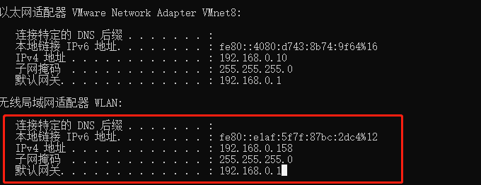
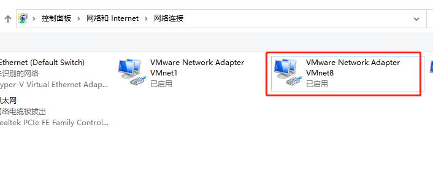
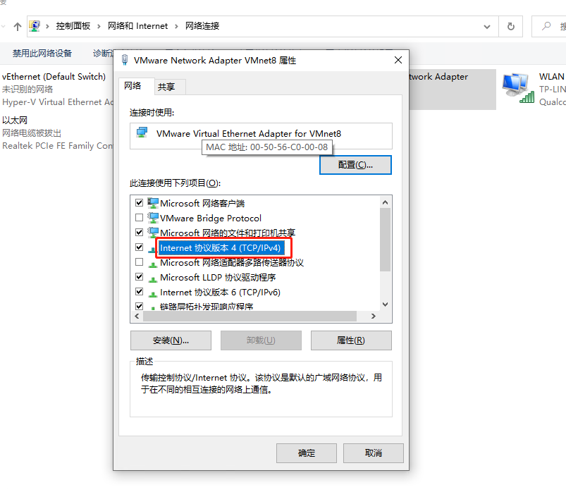
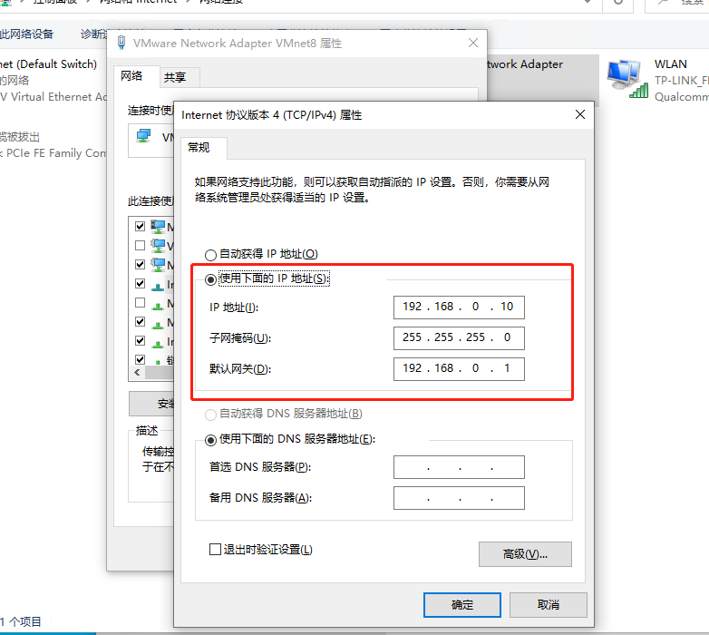
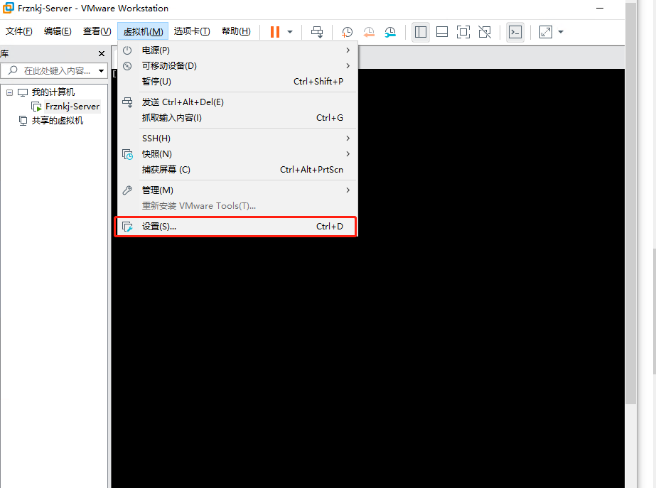
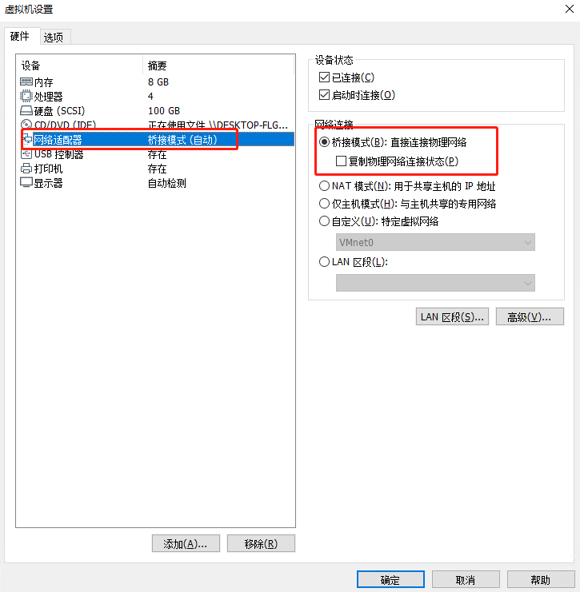
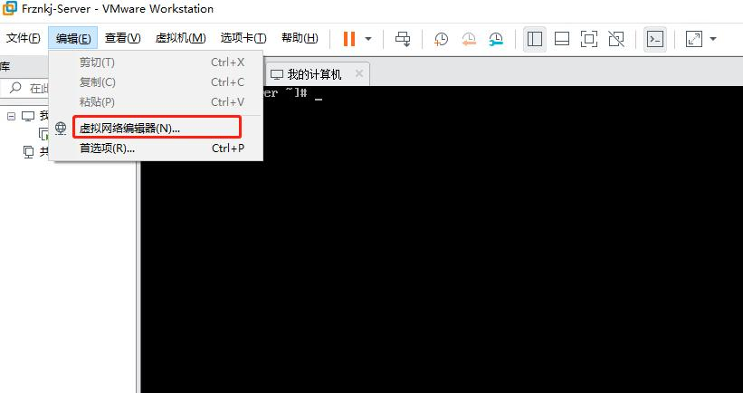
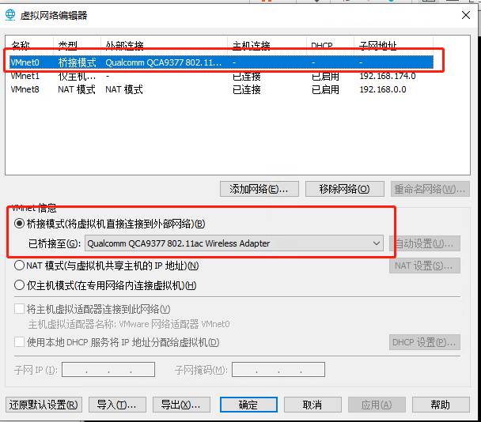
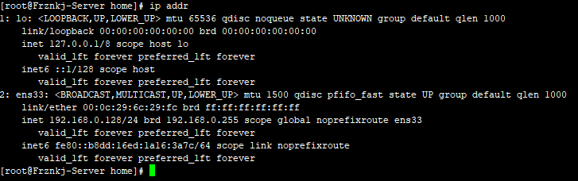

# Windows搭建局域网访问vmware的虚拟服务器

  
在虚拟机创建好之后开始配置

## 1. 查看宿主机的IP地址以及相关的网关和子网掩码信息
  
PS：因为我本地宿主机是通过WIFI的方式连接到局域网的，所以本地的局域网的

_IP为：192.168.0.158  
__子网掩码为：255.255.255.0  
__默认网关为：192.168.0.1  
__以上信息是后面配置需要的重要信息_

## 2、配置虚拟机的网络地址

选择VMnet8之后右键查看属性选择Tcp/IPv4双击

并将IP地址配置成局域网中任意未被使用的一个IP，然后子网掩码和默认网关和宿主机的一致即可：  
PS：我此处找了一个10的IP  

## 3、配置服务器
打开虚拟机，选择设置，配置虚拟机的网络配置  

修改虚拟机的网络适配器为桥接模式  

## 4、调出虚拟机的网络编辑器，修改虚拟机的网络信息

选择桥接模式之后选择桥接到的网卡  

PS：此处比较重要，在不同的宿主机上可能桥接至的选项有所不同，直接找到有没有带有Wireless的选项就好

## 5、 配置虚拟机的网卡信息
1、通过

ip addr 1

查询虚拟机的网卡信息  

此处我们的网卡是ens33，他的mac地址为： 00:0c:29:6c:29:fc

2、编辑虚拟机的网卡配置：

[root@Frznkj-Server home]# vim /etc/sysconfig/network-scripts/ifcfg-ens33 1

将ONBOOT设置为yes  
将BOOTPROTO设置为dhcp  
将HWADDR设置为刚才看见的mac地址，如果没有改属性就追加一个改属性

如果需要将虚拟机的IP固定下拉，只需要在ifcfg-ens33文件中，再追加下面的信息就可以了

IPADDR=192.168.0.128 GATEWAY=192.168.0.1 NETMASK=255.255.255.0 123

其中的GATEWAY和NETMASK要和宿主机保持一致，IPADDR要取一个在局域网中无人使用的IP即可  
3、重启虚拟机网络服务

[root@Frznkj-Server home]# systemctl restart network 1

至此虚拟机可以被局域网中任意电脑访问

> 更新: 2022-05-31 13:18:03  
> 原文: <https://www.yuque.com/lixinsi/gpngnc/akv832>