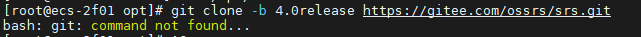
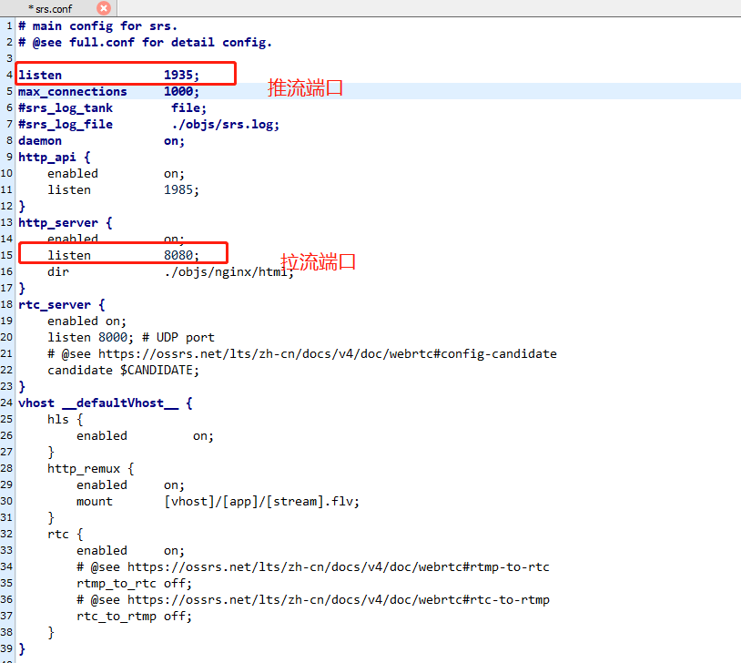
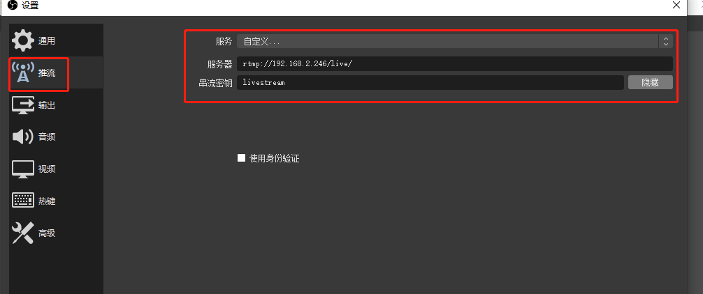
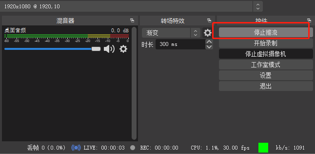
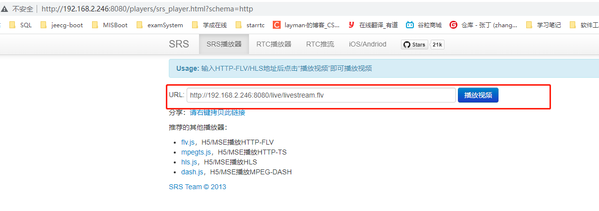
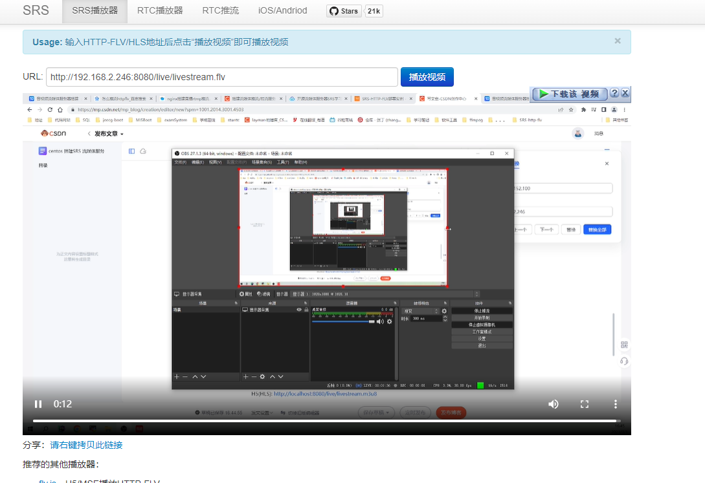
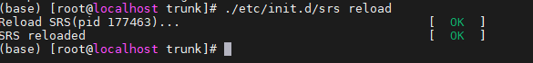

# centos 搭建SRS 流媒体服务


目的：

最近公司有一个流媒体项目交给我负责，其中包括一项直播功能，原本使用的是ffmpeg进行推流、拉流操作。但是在服务端频繁启动命令很麻烦。查阅资料发现目前主流技术包括red5,srs,nginx插件，其中srs的性能最好，并且开源的作者一直在维护这个项目，并且在4.0版本后支持webrtc协议，那么现在选型为srs作为直播的技术。


### 一、搭建srs服务器：以centos7服务器为例
1.下载srs服务器

```bash
git clone -b 4.0release https://gitee.com/ossrs/srs.git
```

若报错：


bash: git: command not found...



提示的错误就是我没有在Linux上安装git，执行以下操作安装git：

```bash
yum install -y git
```


安装完成后，再执行步骤1操作。


2.编译，srs几乎所有的操作都需要在srs/trunk下进行操作

```bash
cd srs/trunk
./configure
make
```

启动服务器

默认srs.conf文件内容如下，可根据实际情况修改。



```powershell
./objs/srs -c conf/srs.conf
```

4.判断srs是否正常运行

```powershell
./etc/init.d/srs status

./etc/init.d/srs restart

./etc/init.d/srs reload

./etc/init.d/srs start
```


5.查看日志

```powershell
tail -f ./objs/srs.log
```

6.测试是否成功，向srs服务器进行推流，可使用ffmpeg或者obs


6.1 使用ffmpeg，占用资源更少。

```powershell
ffmpeg -re -i ./doc/source.flv -c copy -f flv -y rtmp://localhost/live/livestream
```

6.2 使用obs推流


### 二、OBS下载地址：[https://obsproject.com/download](https://obsproject.com/download)


1：直播画面选择


在来源+中，选择要推送的画面，如果有摄像头或者摄像机，则添加“视频采集设备”，然后选择相应的摄像头名称即可。


我这里没摄像头，选择自己的电脑桌面直播推送，及“显示器采集”。


2：设置流媒体服务器

在右下方的 设置 >> 推流 >> 服务 >> 自定义。

填写流媒体服务器地址，我这里是： rtmp://192.168.2.246/live/

串流密钥随便填写即可，这里我填写的是：livestream。

所以最后播放地址为：rtmp://192.168.2.246/live/livestream



3：推送直播画面

配置完成后，点击 “开始推流” 即可推送画面。没有报错，说明推送成功，同时下方会有相关信息，如cpu之类的。




在浏览器 [http://192.168.2.246:8080/](http://192.168.2.246:8080/) 打开控制台，可以看到推送的流信息。



点击播放视频，可以看到，刚才的推送画面了。后面加flv，是因为推流拉流都是用的RTMP。

所以RTMP流的播放地址为：rtmp://192.168.2.246/live/test-livestream.flv




三、RTMP低延时配置


以上基本的直播推流拉流，配置完成。但是测试，延迟还是很大。


根据直播画面和本地时间对比，可以发现延迟差不多有6秒左右，不是很正常。RTMP流，正常延迟时间为1到3秒左右，所以还需要配置。


1：默认配置文件


由于我们以默认的配置文件启动，即srs.conf 这个配置文件。默认配置文件如下：

```bash
ubuntu@ubuntu:~/srs/trunk$ cat conf/srs.conf 
# main config for srs.
# @see full.conf for detail config.
listen              1935;
max_connections     1000;
#srs_log_tank        file;
#srs_log_file        ./objs/srs.log;
daemon              on;
http_api {
    enabled         on;
    listen          1985;
}
http_server {
    enabled         on;
    listen          8080;
    dir             ./objs/nginx/html;
}
rtc_server {
    enabled on;
    listen 8000; # UDP port
    # @see https://ossrs.net/lts/zh-cn/docs/v4/doc/webrtc#config-candidate
    candidate $CANDIDATE;
}
vhost __defaultVhost__ {
    hls {
        enabled         on;
    }
    http_remux {
        enabled     on;
        mount       [vhost]/[app]/[stream].flv;
    }
    rtc {
        enabled     on;
        # @see https://ossrs.net/lts/zh-cn/docs/v4/doc/webrtc#rtmp-to-rtc
        rtmp_to_rtc off;
        # @see https://ossrs.net/lts/zh-cn/docs/v4/doc/webrtc#rtc-to-rtmp
        rtc_to_rtmp off;
    }
}
2：更改配置文件
```


根据官方文档，可以更改配置文件，低延迟配置，在vhost __ defaultVhost __ 添加以下配置。具体原理可以参考官方文档。

```bash
tcp_nodelay     on;
    min_latency     on;
    play {
        gop_cache       off;
        queue_length    10;
        mw_latency      100;
    }
    publish {
        mr off;
    }
```

最终配置文件为：

```bash
listen              1935;
max_connections     1000;
#srs_log_tank        file;
#srs_log_file        ./objs/srs.log;
daemon              on;
http_api {
    enabled         on;
    listen          1985;
}
http_server {
    enabled         on;
    listen          8080;
    dir             ./objs/nginx/html;
}
rtc_server {
    enabled on;
    listen 8000; # UDP port
    # @see https://ossrs.net/lts/zh-cn/docs/v4/doc/webrtc#config-candidate
    candidate $CANDIDATE;
}
vhost __defaultVhost__ {
    hls {
        enabled         on;
    }
    http_remux {
        enabled     on;
        mount       [vhost]/[app]/[stream].flv;
    }
    rtc {
        enabled     on;
        # @see https://ossrs.net/lts/zh-cn/docs/v4/doc/webrtc#rtmp-to-rtc
        rtmp_to_rtc off;
        # @see https://ossrs.net/lts/zh-cn/docs/v4/doc/webrtc#rtc-to-rtmp
        rtc_to_rtmp off;
    }
    tcp_nodelay     on;
    min_latency     on;
    play {
        gop_cache       off;
        queue_length    10;
        mw_latency      100;
    }
    publish {
        mr off;
    }
}
```

3：重载配置文件测试


配置完成后，reload重载配置，完成。

```bash
./etc/init.d/srs reload
```




然后再次用obs推流拉流，查看效果，延迟为2秒左右，在正常延迟范围内。

```bash
# conf/https.flv.live.conf# conf/https.hls.confhttp_server {    enabled         on;    listen          8080;    dir             ./objs/nginx/html;    https {        enabled on;        listen 8088;        key ./conf/server.key;        cert ./conf/server.crt;    }}
```

```powershell
#user  nobody;
worker_processes  1;

#error_log  logs/error.log;
#error_log  logs/error.log  notice;
#error_log  logs/error.log  info;

#pid        logs/nginx.pid;


events {
    worker_connections  1024;
}


http {
    include       mime.types;
    default_type  application/octet-stream;

    #log_format  main  '$remote_addr - $remote_user [$time_local] "$request" '
    #                  '$status $body_bytes_sent "$http_referer" '
    #                  '"$http_user_agent" "$http_x_forwarded_for"';

    #access_log  logs/access.log  main;

    sendfile        on;
    #tcp_nopush     on;

    #keepalive_timeout  0;
    keepalive_timeout  65;

    #gzip  on;

       server {

    #listen       80;
        listen       443 ssl http2;
        server_name  srs.dianyuesoft.com;
        ssl_certificate      /usr/local/nginx/conf/ssl/srs.dianyuesoft.com.pem;
        ssl_certificate_key  /usr/local/nginx/conf/ssl/srs.dianyuesoft.com.key;

        # For SRS homepage, console and players
        #   http://r.ossrs.net/console/
        #   http://r.ossrs.net/players/
        location / {
           proxy_pass http://39.108.15.83:8080/;
        }
        # For SRS streaming, for example:
        #   http://r.ossrs.net/live/livestream.flv
        #   http://r.ossrs.net/live/livestream.m3u8
        location ~ /.+/.*\.(flv|m3u8|ts|aac|mp3)$ {
           proxy_pass http://127.0.0.1:8080$request_uri;
        }
        # For SRS backend API for console.
        location /api/ {
           proxy_pass http://39.108.15.83:1985/api/;
        }
        # For SRS WebRTC publish/play API.
        location /rtc/ {
           proxy_pass http://39.108.15.83:1985/rtc/;
    }
        #error_page  404              /404.html;

        # redirect server error pages to the static page /50x.html
        #
        error_page   500 502 503 504  /50x.html;
        location = /50x.html {
            root   html;
        }

        # proxy the PHP scripts to Apache listening on 127.0.0.1:80
        #
        #location ~ \.php$ {
        #    proxy_pass   http://127.0.0.1;
        #}

        # pass the PHP scripts to FastCGI server listening on 127.0.0.1:9000
        #
        #location ~ \.php$ {
        #    root           html;
        #    fastcgi_pass   127.0.0.1:9000;
        #    fastcgi_index  index.php;
        #    fastcgi_param  SCRIPT_FILENAME  /scripts$fastcgi_script_name;
        #    include        fastcgi_params;
        #}

        # deny access to .htaccess files, if Apache's document root
        # concurs with nginx's one
        #
        #location ~ /\.ht {
        #    deny  all;
        #}
    }


    # another virtual host using mix of IP-, name-, and port-based configuration
    #
    #server {
    #    listen       8000;
    #    listen       somename:8080;
    #    server_name  somename  alias  another.alias;

    #    location / {
    #        root   html;
    #        index  index.html index.htm;
    #    }
    #}


    # HTTPS server
    #
    #server {
    #    listen       443 ssl;
    #    server_name  localhost;

    #    ssl_certificate      cert.pem;
    #    ssl_certificate_key  cert.key;

    #    ssl_session_cache    shared:SSL:1m;
    #    ssl_session_timeout  5m;

    #    ssl_ciphers  HIGH:!aNULL:!MD5;
    #    ssl_prefer_server_ciphers  on;

    #    location / {
    #        root   html;
    #        index  index.html index.htm;
    #    }
    #}
```

### 三、设置自启动nginx和srs脚本
<font style="color:rgb(13, 13, 13);">  
</font><font style="color:rgb(13, 13, 13);">如果你使用手动编译安装的方式安装了 Nginx，并且想要配置系统自动启动，你可以按照以下步骤进行：</font>

1. **创建 Systemd 启动脚本**<font style="color:rgb(13, 13, 13);">：</font><font style="color:rgb(13, 13, 13);">创建一个名为 </font>**nginx.service**<font style="color:rgb(13, 13, 13);"> 的 Systemd 启动脚本，用于管理 Nginx 服务的启动和停止。</font>

```plain
sudo nano /etc/systemd/system/nginx.service
```

<font style="color:rgb(13, 13, 13);">在编辑器中，输入以下内容：</font>

```plain
[Unit]
Description=The NGINX HTTP and reverse proxy server  # 服务描述，描述了该服务的作用

[Service]
Type=forking  # 服务类型，这里指定为 forking，表示它是一个复杂的守护进程
PIDFile=/usr/local/nginx/logs/nginx.pid  # 指定 Nginx 进程的 PID 文件路径
ExecStartPre=/usr/local/nginx/sbin/nginx -t -c /usr/local/nginx/conf/nginx.conf  # 在启动服务之前执行的命令，用于检查 Nginx 配置文件是否正确
ExecStart=/usr/local/nginx/sbin/nginx -c /usr/local/nginx/conf/nginx.conf  # 启动 Nginx 服务的命令
ExecReload=/bin/kill -s HUP $MAINPID  # 重新加载配置文件的命令
ExecStop=/bin/kill -s QUIT $MAINPID  # 停止 Nginx 服务的命令
PrivateTmp=true  # 设置服务的临时文件系统的安全性

[Install]
WantedBy=multi-user.target  # 指定服务的启动级别，这里指定为 multi-user.target，表示服务会在多用户模式下启动

```

<font style="color:rgb(13, 13, 13);">注意：上述配置中的路径 </font>**/usr/local/nginx**<font style="color:rgb(13, 13, 13);"> 可能需要根据你的实际安装路径进行调整。</font>

2. **重新加载 Systemd 配置**<font style="color:rgb(13, 13, 13);">：</font><font style="color:rgb(13, 13, 13);">重新加载 Systemd 配置文件，以使新的 </font>**nginx.service**<font style="color:rgb(13, 13, 13);"> 生效。</font>

```plain
sudo systemctl daemon-reload
```

3. **启用 Nginx 服务**<font style="color:rgb(13, 13, 13);">：</font><font style="color:rgb(13, 13, 13);">启用 Nginx 服务，以便它在系统启动时自动启动。</font>

```plain
sudo systemctl enable nginx
```

4. **验证配置**<font style="color:rgb(13, 13, 13);">：</font><font style="color:rgb(13, 13, 13);">确保 Nginx 服务已经设置为自动启动。</font>

```plain
sudo systemctl is-enabled nginx
```

<font style="color:rgb(13, 13, 13);">如果输出为 </font>**enabled**<font style="color:rgb(13, 13, 13);">，则表示已经成功设置为开机自启动。</font>

<font style="color:rgb(13, 13, 13);">现在，Nginx 应该在系统启动时自动启动。你可以使用 </font>**sudo systemctl start nginx**<font style="color:rgb(13, 13, 13);"> 来手动启动 Nginx 服务，使用 </font>**sudo systemctl status nginx**<font style="color:rgb(13, 13, 13);"> 来检查服务的状态。</font>

srs自动启动服务器配置文件

```plain
[Unit]  
Description=My Custom Startup Script  
After=network.target  
  
[Service]  
Type=simple  
ExecStart=cd /usr/local/src/srs/srs/trunk && ./etc/init.d/srs start
Restart=always  
User=root  
Group=root  
  
[Install]  
WantedBy=multi-user.target
```


> 更新: 2024-11-19 08:49:06  
> 原文: <https://www.yuque.com/lixinsi/gpngnc/xdmbd2m1gyget4ly>