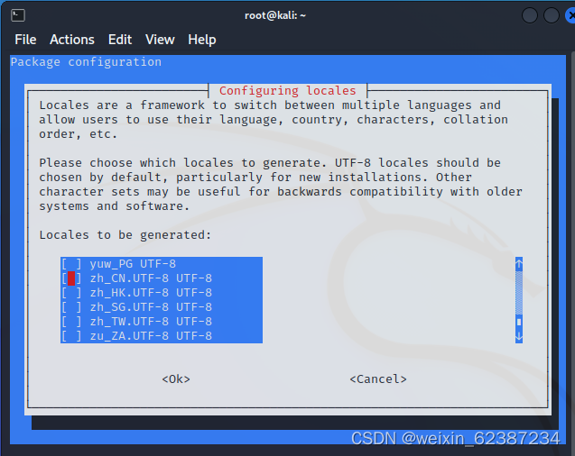
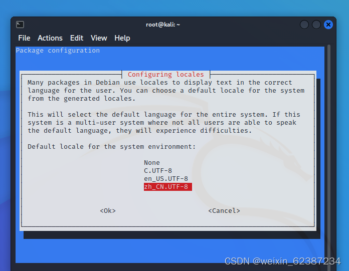

# kali日常操作

### 1.kali设置中文
一、进入root模式

```dockerfile
sudo -i
```


要求输入密码(输入密码时看不到，实际已经输入了)（kali初始密码一般为kali）


二、更新源

```dockerfile
apt-get update
```

三、安装中文字体

```dockerfile
apt install ttf-wqy-zenhei
```

四、设置系统语言区设

```dockerfile
sudo dpkg-reconfigure locales
```

五、选择中文字体

滚轮或↓往下拉  空格选中如图选项（zh_CN.UTF-8 UTF-8），回车



↓再次选择zh_CN.UTF-8 继续回车 





 安装成功


六、重启


命令行输入reboot或者手动选择重启


### 2.kaliweb信息收集
```powershell
skipfish -o abcd http://120.77.10.122:7329/
```


> 更新: 2024-01-26 13:16:37  
> 原文: <https://www.yuque.com/lixinsi/gpngnc/na9a7xu1pbiihmsr>